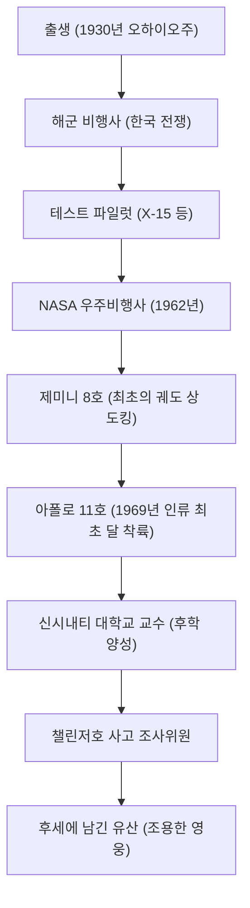

"이것은 한 인간에게는 작은 한 걸음이지만, 인류에게는 위대한 도약이다 (That's one small step for man, one giant leap for mankind)."
1969년 7월 20일, 인류가 지구 이외의 천체에 처음으로 발자국을 남긴 순간, 닐 암스트롱이 남긴 이 말은 20세기를 대표하는 명언으로 역사에 영원히 새겨져 있습니다. 그러나 암스트롱 본인은 자신을 '영웅'이라 부르는 것을 좋아하지 않았고, 어디까지나 '흰 양말을 신은 괴짜(엔지니어)'로 자처했습니다. 본 기사에서는 인류 최초로 달 표면을 걸었던 사나이의 생애와 그 바탕이 되는 철학, 그리고 후세에 남긴 영향에 대해 깊이 파헤쳐 봅니다.

## 하늘에 대한 동경과 테스트 파일럿 시절

1930년 미국 오하이오주 와파코네타에서 태어난 암스트롱은 어릴 적부터 비행기에 매료되어 있었습니다. 15세의 나이에 운전면허보다 비행면허를 먼저 취득한 그는 퍼듀 대학교에서 항공공학을 공부했지만, 해군 장학생이었기 때문에 한국 전쟁에 징집되었습니다. 전투기 조종사로서 78회의 전투 임무를 수행하며 여러 번 죽을 고비를 넘긴 경험은 훗날 극한 상황에서의 압도적인 침착함을 기르는 밑거름이 됩니다.

전후에는 테스트 파일럿으로서 극초음속 실험기 X-15 등 수많은 위험한 비행 임무에 종사했습니다. 테스트 파일럿으로서의 그의 평가는 "항상 침착하고 공학적인 관점에서 문제를 해결할 수 있는 사람"이었습니다. 이 '엔지니어로서의 지성'과 '조종사로서의 기량'의 융합이야말로 훗날 그를 달로 이끄는 가장 큰 무기가 됩니다.

## NASA에서의 활약: 제미니에서 아폴로까지

1962년 NASA의 제2기 우주비행사로 선발된 암스트롱은 1966년 제미니 8호의 선장을 맡았습니다. 이 임무에서 인류 최초의 궤도 상 도킹에 성공하지만, 직후 우주선이 맹렬한 스핀에 빠지는 절체절명의 위기를 맞이합니다. 이때 그는 놀라운 침착함으로 스러스터를 제어하여 무사히 지구로 귀환했습니다. 이러한 패닉에 빠지지 않는 정신력이 높이 평가되어 아폴로 11호의 선장, 즉 '인류 최초로 달을 걷는 사람'으로 발탁되는 결정적인 계기가 되었습니다.

## 아폴로 11호: 고요의 바다 착륙

1969년 7월 16일 새턴 V 로켓으로 발사된 아폴로 11호는 며칠간의 비행 끝에 달 궤도에 진입했습니다. 달 착륙선 '이글'로 하강을 시작한 암스트롱과 버즈 올드린이었지만, 자동 조종 장치가 목표로 했던 착륙 지점은 바위투성이의 위험한 크레이터였습니다.
연료가 얼마 남지 않은 상황에서 암스트롱은 수동 조종으로 전환하여 바위밭을 피해 평탄한 곳을 찾았습니다. 연료가 바닥나기까지 불과 수십 초밖에 남지 않은 극한의 압박감 속에서 멋지게 '고요의 바다'에 착륙을 성공시킵니다. "휴스턴, 여기는 고요의 기지. 이글은 착륙했다(Houston, Tranquility Base here. The Eagle has landed)." 이 순간 그의 심박수는 놀라울 정도로 정상치에 가까웠다고 합니다.

## 업적의 궤적과 도해

그의 생애에서 중요한 전환점과 업적의 연결 고리를 다음 그림과 같이 나타냅니다.

## 퇴역 후의 삶과 '조용한 영웅'의 철학

달에서 귀환한 암스트롱은 전 세계적으로 열광적인 환영을 받으며 역사적인 영웅이 되었습니다. 하지만 그는 그 명성을 이용하여 정치인이 되거나 상업적인 이익을 추구하지 않았습니다. 1971년 NASA를 퇴직한 후에는 신시내티 대학교에서 항공우주공학 교수로 교편을 잡는 길을 택했습니다.

그의 철학은 "나는 거대한 프로젝트의 일부를 담당했을 뿐이며, 달 착륙은 약 40만 명의 NASA 직원과 엔지니어들의 노력의 결정체이다"라는 철저한 겸손함에 있었습니다. 미디어 노출을 극력 피하고 '인류 최초의 달 표면 보행자'라는 꼬리표보다는 한 명의 엔지니어, 교육자로서의 조용한 삶을 원했던 것입니다. 그럼에도 불구하고 1986년 우주왕복선 챌린저호 폭발 사고 당시에는 조사위원회 부위원장을 맡는 등 국가의 우주 개발 위기에는 자신의 전문 지식으로 공헌했습니다.

## 후세에 미친 영향

2012년 82세의 나이로 세상을 떠난 닐 암스트롱. 그의 발자취는 달 표면에 남겨졌을 뿐만 아니라, 인류가 미지의 영역에 도전하기 위한 '용기'와 그것을 이루기 위한 '과학적 탐구심', 그리고 위업을 달성하고도 결코 자만하지 않는 '겸손함'의 상징으로서 지금도 여전히 회자되고 있습니다.

그가 달에 남긴 작은 한 걸음은 그야말로 인류에게 영원한 도약이며, 그의 삶의 방식 자체가 미래의 엔지니어와 탐구자들에게 무언의 이정표가 되고 있습니다.
