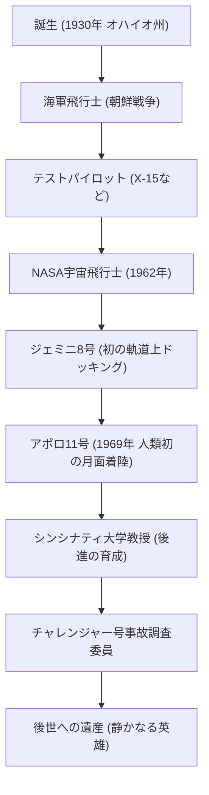

「これは一人の人間にとっては小さな一歩だが、人類にとっては偉大な飛躍である（That's one small step for man, one giant leap for mankind.）」。
1969年7月20日、人類が初めて地球以外の天体に足跡を刻んだ瞬間、ニール・アームストロングが発したこの言葉は、20世紀を代表する名言として永遠に歴史に刻まれています。しかし、アームストロング本人は、自らを「英雄」と呼ばれることを好まず、あくまで「白ソックスを履いたオタク（エンジニア）」であると自認していました。本記事では、人類初の月面歩行を果たした男の生涯、その根底にある哲学、そして後世に遺した影響について深く掘り下げます。

## 大空への憧れとテストパイロット時代

1930年、アメリカ合衆国オハイオ州ワパコネタに生まれたアームストロングは、幼い頃から飛行機に魅了されていました。15歳で運転免許より先に飛行免許を取得した彼は、パーデュ大学で航空工学を学びますが、海軍の奨学生であったため、朝鮮戦争に召集されます。戦闘機パイロットとして78回の戦闘任務をこなし、何度も死線を彷徨った経験は、後の極限状態における圧倒的な冷静さを培うことになります。

戦後はテストパイロットとして、極超音速実験機X-15などで数々の危険な飛行任務に従事しました。テストパイロットとしての彼の評価は「常に冷静沈着で、工学的な見地から問題を解決できる男」というものでした。この「エンジニアとしての知性」と「パイロットとしての腕」の融合こそが、後に彼を月へと導く最大の武器となります。

## NASAでの活躍：ジェミニからアポロへ

1962年、NASAの第2期宇宙飛行士として選抜されたアームストロングは、1966年のジェミニ8号で船長を務めました。このミッションで人類初の軌道上ドッキングに成功しますが、直後に宇宙船が猛烈なスピンに陥るという絶体絶命の危機に見舞われます。この時、彼は驚異的な冷静さでスラスターを制御し、無事に地球への帰還を果たしました。このパニックに陥らない精神力が高く評価され、アポロ11号の船長、すなわち「人類で初めて月を歩く男」として選ばれる決定打となったのです。

## アポロ11号：静寂の海への着陸

1969年7月16日、サターンVロケットで打ち上げられたアポロ11号は、数日の旅を経て月の軌道に乗りました。月着陸船「イーグル」で降下を開始したアームストロングとバズ・オルドリンですが、自動操縦が目標としていた着陸地点は岩だらけの危険なクレーターでした。
燃料が残りわずかとなる中、アームストロングは手動操縦に切り替え、岩場を避けて平坦な場所を探しました。燃料切れまで残り数十秒という極限のプレッシャーの中、見事「静かの海」への着陸を成功させます。「ヒューストン、こちら静かの基地。イーグルは舞い降りた」。この瞬間の彼の心拍数は異常なほど平常値に近かったと言われています。

## 功績の軌跡と図解

彼の生涯における重要な転機と功績のつながりを、以下の図で示します。

## 退役後の人生と「静かなる英雄」の哲学

月面から帰還したアームストロングは、世界中から熱狂的な歓迎を受け、歴史的英雄となりました。しかし、彼はその名声を利用して政治家になったり、商業的な利益を追求したりすることはありませんでした。1971年にNASAを退職した後は、シンシナティ大学で航空宇宙工学の教授として教鞭をとる道を選びました。

彼の哲学は「自分は巨大なプロジェクトの一部を担ったに過ぎず、約40万人のNASA職員や技術者たちの努力の結晶が月面着陸である」という徹底した謙虚さにありました。メディアへの露出を極力避け、「人類初の月面歩行者」というレッテルよりも、一人のエンジニア、教育者としての静かな生活を望んだのです。それでも、1986年のスペースシャトル・チャレンジャー号爆発事故の際には調査委員会の副委員長を務めるなど、国の宇宙開発の危機には自らの専門知識をもって貢献しました。

## 後世への影響

2012年に82歳でこの世を去ったニール・アームストロング。彼の足跡は月面に残されただけでなく、人類が未知の領域へ挑戦するための「勇気」と、それを成し遂げるための「科学的探求心」、そして偉業を成し遂げても決して奢らない「謙虚さ」の象徴として、今もなお語り継がれています。

彼が月に残した小さな一歩は、まさに人類にとっての永遠の飛躍であり、彼の生き方そのものが、未来の技術者や探求者たちへの無言の道標となっているのです。
