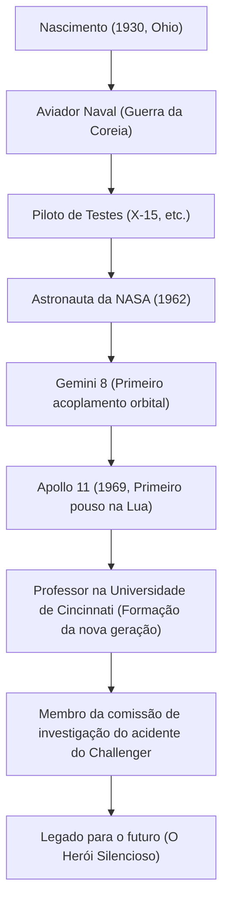

"Este é um pequeno passo para o homem, um salto gigante para a humanidade" (That's one small step for man, one giant leap for mankind).
Em 20 de julho de 1969, no momento em que a humanidade deixou suas primeiras pegadas em um corpo celeste fora da Terra, estas palavras proferidas por Neil Armstrong foram gravadas para sempre na história como uma das citações mais famosas do século XX. No entanto, o próprio Armstrong não gostava de ser chamado de "herói" e considerava a si mesmo apenas um "nerd (engenheiro) de meias brancas". Este artigo explora profundamente a vida do primeiro homem a caminhar na Lua, sua filosofia subjacente e o impacto que deixou para as gerações futuras.

## A Paixão pelos Céus e os Anos como Piloto de Testes

Nascido em 1930 em Wapakoneta, Ohio, EUA, Armstrong era fascinado por aviões desde a infância. Obtendo sua licença de piloto aos 15 anos, antes mesmo da carteira de motorista, ele estudou engenharia aeronáutica na Universidade de Purdue, mas foi convocado para a Guerra da Coreia, pois recebia uma bolsa da Marinha. Sua experiência como piloto de caça, voando 78 missões de combate e enfrentando a morte várias vezes, cultivou a impressionante calma que ele demonstraria mais tarde em situações extremas.

Após a guerra, ele participou de muitas missões de voo perigosas como piloto de testes, incluindo o avião experimental hipersônico X-15. Como piloto de testes, sua reputação era a de "um homem que sempre se mantém calmo e que pode resolver problemas de um ponto de vista da engenharia". Foi essa fusão de "inteligência de engenheiro" e "habilidades de piloto" que se tornaria sua maior arma, levando-o mais tarde à Lua.

## Os Anos de Sucesso na NASA: De Gemini a Apollo

Selecionado no segundo grupo de astronautas da NASA em 1962, Armstrong foi o comandante da Gemini 8 em 1966. Durante esta missão, ocorreu o primeiro acoplamento orbital da história, mas imediatamente após, a espaçonave entrou em uma crise desesperadora, girando violentamente. Naquele momento, com incrível calma, ele controlou os propulsores e conseguiu trazer a tripulação de volta à Terra em segurança. Sua força mental para não entrar em pânico foi muito elogiada e se tornou o fator decisivo em sua seleção como comandante da Apollo 11, ou seja, "o primeiro homem a caminhar na Lua".

## Apollo 11: Pouso no Mar da Tranquilidade

Lançada em 16 de julho de 1969 no foguete Saturn V, a Apollo 11 entrou na órbita lunar após uma jornada de vários dias. Armstrong e Buzz Aldrin iniciaram sua descida no módulo lunar "Eagle", mas o local de pouso visado pelo piloto automático era uma cratera perigosa e rochosa.
Com o combustível se esgotando, Armstrong mudou para o controle manual, evitando as rochas e procurando um lugar plano. Sob a extrema pressão de estar a algumas dezenas de segundos de ficar sem combustível, ele conseguiu um pouso perfeito no "Mar da Tranquilidade". "Houston, aqui Base da Tranquilidade. A Águia pousou." Diz-se que seus batimentos cardíacos naquele momento estavam anormalmente próximos do normal.

## Trajetória de Conquistas e Diagrama

Os principais pontos de virada e conquistas de sua vida são mostrados no diagrama abaixo.

## A Vida após a Aposentadoria e a Filosofia do "Herói Silencioso"

Ao retornar da superfície lunar, Armstrong recebeu uma recepção entusiasmada de todo o mundo e se tornou um herói histórico. No entanto, ele nunca usou sua fama para se tornar um político ou buscar ganhos comerciais. Depois de deixar a NASA em 1971, ele escolheu o caminho do ensino como professor de engenharia aeroespacial na Universidade de Cincinnati.

Sua filosofia baseava-se em profunda humildade: "Desempenhei apenas um pequeno papel em um projeto gigantesco, e o pouso na Lua é o culminar dos esforços de cerca de 400.000 funcionários e engenheiros da NASA". Evitando a exposição na mídia ao máximo, ele desejava uma vida tranquila como engenheiro e educador, em vez do rótulo de "o primeiro homem a caminhar na Lua". No entanto, durante o acidente do ônibus espacial Challenger em 1986, ele atuou como vice-presidente da comissão de investigação, contribuindo com sua especialidade durante a crise do programa espacial nacional.

## Impacto no Futuro

Neil Armstrong faleceu em 2012 aos 82 anos. Suas pegadas não ficaram apenas na Lua; ele continua sendo lembrado como um símbolo da "coragem" da humanidade para desafiar o desconhecido, do "espírito de exploração científica" para alcançá-lo e da "humildade" para nunca se vangloriar, mesmo após grandes feitos.

O pequeno passo que ele deu na Lua é verdadeiramente um salto eterno para a humanidade, e sua própria maneira de viver tornou-se um guia silencioso para futuros engenheiros e exploradores.
