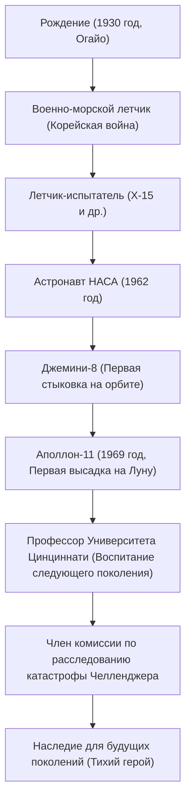

«Это один маленький шаг для человека, но гигантский скачок для всего человечества» (That's one small step for man, one giant leap for mankind).
20 июля 1969 года, в тот момент, когда человечество впервые оставило свои следы на другом небесном теле, кроме Земли, эти слова, произнесенные Нилом Армстронгом, навсегда вошли в историю как одна из самых известных цитат 20-го века. Однако сам Армстронг не любил, когда его называли «героем», и считал себя просто «ботаником (инженером) в белых носках». В этой статье мы подробно рассмотрим жизнь первого человека, ступившего на Луну, его философию и влияние, которое он оказал на будущие поколения.

## Страсть к небу и годы работы летчиком-испытателем

Родившийся в 1930 году в Уапаконете, штат Огайо, США, Армстронг с раннего детства был очарован самолетами. Получив лицензию пилота в 15 лет, еще до получения водительских прав, он изучал аэрокосмическую инженерию в Университете Пердью, но был призван на Корейскую войну, поскольку получал стипендию от ВМС. Опыт летчика-истребителя, совершившего 78 боевых вылетов и неоднократно находившегося на волосок от смерти, воспитал в нем поразительное хладнокровие в экстремальных ситуациях.

После войны он участвовал во множестве опасных летных миссий в качестве летчика-испытателя, в том числе на гиперзвуковом экспериментальном самолете X-15. Как летчика-испытателя его оценивали как «человека, который всегда сохраняет спокойствие и способен решать проблемы с инженерной точки зрения». Именно это сочетание «инженерного интеллекта» и «мастерства пилота» стало его главным оружием, которое позже привело его на Луну.

## Годы работы в НАСА: от «Джемини» до «Аполлона»

Выбранный во вторую группу астронавтов НАСА в 1962 году, Армстронг был командиром миссии «Джемини-8» в 1966 году. Во время этой миссии была осуществлена первая в истории стыковка на орбите, но сразу после этого космический корабль оказался в критической ситуации, начав сильное вращение. В этот момент, проявив невероятное хладнокровие, он смог взять управление двигателями под контроль и благополучно вернуть экипаж на Землю. Его психологическая устойчивость и способность не поддаваться панике получили высокую оценку и стали решающим фактором при его назначении командиром «Аполлона-11», то есть «первым человеком, который пойдет по Луне».

## «Аполлон-11»: Посадка в Море Спокойствия

Запущенный 16 июля 1969 года на ракете «Сатурн-5», «Аполлон-11» через несколько дней полета вышел на лунную орбиту. Армстронг и Базз Олдрин начали снижение в лунном модуле «Орел», но место посадки, на которое был нацелен автопилот, оказалось опасным кратером, усыпанным камнями.
Поскольку топливо было на исходе, Армстронг переключился на ручное управление, избегая скалистых участков в поисках плоского места. В условиях крайнего напряжения, когда до истощения топлива оставались считанные десятки секунд, он совершил идеальную посадку в «Море Спокойствия». «Хьюстон, говорит База Спокойствия. Орел сел». Говорят, что его пульс в этот момент был поразительно близок к норме.

## Хронология достижений и схема

Основные поворотные моменты в его жизни и достижения показаны на диаграмме ниже.

## Жизнь после ухода в отставку и философия «Тихого героя»

Вернувшись с поверхности Луны, Армстронг был встречен с восторгом во всем мире и стал историческим героем. Однако он никогда не использовал свою славу, чтобы стать политиком или извлекать коммерческую выгоду. Покинув НАСА в 1971 году, он выбрал путь преподавания, став профессором аэрокосмической инженерии в Университете Цинциннати.

Его философия заключалась в абсолютном смирении: «Я сыграл лишь небольшую роль в огромном проекте, а высадка на Луну стала результатом усилий около 400 000 сотрудников и инженеров НАСА». Максимально избегая внимания СМИ, он хотел вести спокойную жизнь инженера и педагога, а не носить ярлык «первого человека на Луне». Тем не менее, во время катастрофы космического шаттла «Челленджер» в 1986 году он работал заместителем председателя комиссии по расследованию, внося свой вклад и используя свой опыт во время кризиса в национальной космической программе.

## Влияние на будущие поколения

Нил Армстронг скончался в 2012 году в возрасте 82 лет. Его следы остались не только на Луне; он продолжает жить в памяти как символ «мужества» человечества, бросающего вызов неизведанному, «духа научных исследований» для достижения этой цели и «смирения», не позволяющего возгордиться даже после совершения великих подвигов.

Тот маленький шаг, который он сделал на Луне, поистине стал вечным скачком для человечества, а сама его жизнь стала безмолвным путеводителем для будущих инженеров и исследователей.
