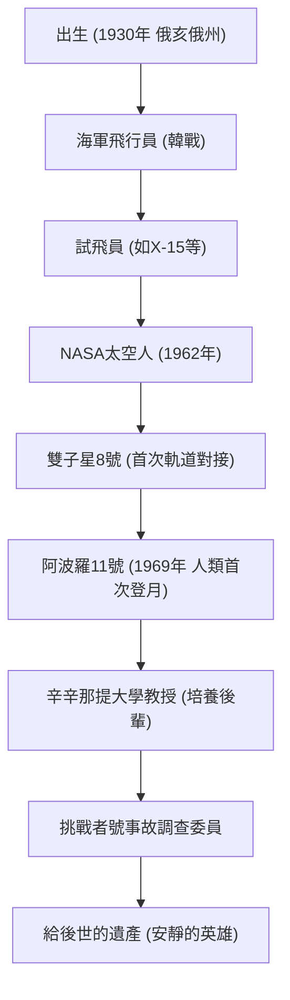

“這是一個人的一小步，卻是人類的一大步（That's one small step for man, one giant leap for mankind.）。”
1969年7月20日，當人類首次在地球以外的星體上留下足跡的那一刻，尼爾·阿姆斯壯說出的這句話，作為20世紀最具代表性的名言，已被永遠銘刻在歷史中。然而，阿姆斯壯本人並不喜歡被稱為“英雄”，他始終自認只是一個“穿白襪子的書呆子（工程師）”。本文將深入探討這位人類首位登月者的生平、其根深蒂固的哲學，以及他給後世留下的影響。

## 對天空的嚮往與試飛員時代

阿姆斯壯1930年出生於美國俄亥俄州沃帕科內塔，從小就對飛機充滿了著迷。他在15歲時就在拿到駕照之前取得了飛行執照，並在普渡大學學習航空工程，但由於是海軍獎學金生，他被徵召參加了韓戰。作為戰鬥機飛行員，他執行了78次戰鬥任務，多次在生死邊緣徘徊的經歷，培養了他後來在極限狀態下壓倒性的冷靜。

戰後，作為一名試飛員，他參與了X-15極音速實驗機等許多危險的飛行任務。作為試飛員，對他的評價是“始終沉著冷靜，能夠從工程學的角度解決問題的男人”。這種“工程師的智慧”與“飛行員的技術”的融合，正是後來引導他飛向月球的最大武器。

## 在NASA的活躍：從雙子星到阿波羅

1962年，阿姆斯壯入選NASA第二批太空人，並在1966年擔任雙子星8號的指令長。在這次任務中，他成功完成了人類首次軌道對接，但緊接著太空船陷入了劇烈的旋轉，遭遇了九死一生的危機。這時，他以驚人的冷靜控制了推進器，成功安全返回地球。這種在危機中不恐慌的精神力量得到了高度評價，成為了他被選為阿波羅11號指令長，即“人類首位登月者”的決定性因素。

## 阿波羅11號：降落靜海

1969年7月16日，搭乘農神5號火箭發射的阿波羅11號，經過幾天的旅程進入了月球軌道。阿姆斯壯和伯茲·艾德林乘坐“鷹”號登月艙開始下降，但自動駕駛儀瞄準的著陸點是一個佈滿岩石的危險隕石坑。
在燃料所剩無幾的情況下，阿姆斯壯切換為手動駕駛，避開岩石區尋找平坦的地方。在距離燃料耗盡只剩幾十秒的極限壓力下，他成功地在“靜海”著陸。“休士頓，這裡是靜海基地。鷹號已著陸。”據說在這一刻，他的心率異常地接近正常值。

## 功績的軌跡與圖解

他一生中重要的轉折點和功績的聯繫，如下面的圖解所示。

## 退役後的人生與“安靜的英雄”哲學

從月球返回後，阿姆斯壯受到了全世界狂熱的歡迎，成為了一位歷史英雄。然而，他並沒有利用自己的名聲去當政治家，也沒有追求商業利益。1971年離開NASA後，他選擇在辛辛那提大學擔任航空太空工程教授，走上了教書育人的道路。

他的哲學在於徹底的謙遜，他認為“我只是承擔了一個巨大項目的一部分，月面著陸是約40萬名NASA員工和工程師們努力的結晶”。他盡量避免在媒體上曝光，比起“人類首位登月者”的標籤，他更希望過作為一個工程師、教育者的安靜生活。儘管如此，在1986年太空梭挑戰者號爆炸事故時，他擔任了調查委員會副主席，在國家太空發展面臨危機時，貢獻了自己的專業知識。

## 對後世的影響

2012年，尼爾·阿姆斯壯以82歲高齡辭世。他的足跡不僅留在了月球上，作為人類挑戰未知領域的“勇氣”、實現這一目標的“科學探索精神”，以及成就偉業後絕不驕傲的“謙遜”的象徵，至今仍被人們傳頌。

他在月球上留下的一小步，確確實實是人類永遠的飛躍，而他的生活方式本身，也成為了未來工程師和探索者們無聲的路標。
