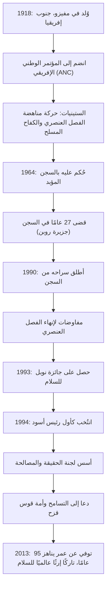

## مقدمة: الطريق الطويل نحو الحرية

يظل اسم نيلسون مانديلا محفورًا بعمق في ذاكرة الناس حول العالم كواحد من أعظم القادة في القرن العشرين. كرس حياته لإلغاء "الفصل العنصري" (الأبارتايد)، وهي سياسة التفرقة العنصرية في جنوب إفريقيا، وتحمل 27 عامًا من السجن القاسي. وبعد إطلاق سراحه، بدلاً من السعي للانتقام، قدم مسارًا لـ "المصالحة والتعايش"، ووحد أمة منقسمة. يستكشف هذا المقال حياته الحافلة بالأحداث، والفلسفة العميقة التي تكمن وراءها، وتأثيره الهائل الذي لا يزال مستمرًا حتى يومنا هذا.

## الكفاح المبكر: مواجهة نظام عدم المساواة

وُلد مانديلا عام 1918 في قرية صغيرة في الكاب الشرقية بجنوب إفريقيا، ونشأ في عائلة رئيس تقليدية. ومع تقدمه في السن، واجه عبثية هياكل التمييز العنصري التي شرعتها الطبقة الحاكمة البيضاء وانضم إلى المؤتمر الوطني الإفريقي (ANC). في البداية، انخرط في احتجاجات سلمية، لكنه بدأ يشعر بحدودها مع اشتداد قمع الحكومة. وعقب مذبحة شاربفيل عام 1960، اتخذ القرار بقيادة كفاح مسلح. أظهر هذا الاختيار مدى تعطشه لحرية بلاده واعتباره إصلاح النظام ضرورة ملحة.

## 27 عامًا من السجن: المعتقدات لا تستسلم أبدًا

اعتقل مانديلا كزعيم للحركة المسلحة، وحُكم عليه بالسجن المؤبد بتهمة الخيانة عام 1964. قضى معظم هذه الفترة في سجن جزيرة روبن، وهي جزيرة معزولة في المحيط. على الرغم من العمل القسري القاسي، والمعاملة اللاإنسانية، والعذاب النفسي المتمثل في الانقطاع عن العالم الخارجي، إلا أن كرامته ومعتقداته لم تتزعزع أبدًا. وحتى في السجن، كان يعامل الحراس كبشر، ويدرس سرًا مع سجناء سياسيين آخرين، وظل الركيزة الروحية للمنظمة. هذه الفترة التي لا يمكن تصورها والتي بلغت 27 عامًا رفعت من شأنه من مجرد ناشط سياسي إلى رمز للكفاح الدولي من أجل حقوق الإنسان. اجتاحت حركة "أطلقوا سراح مانديلا" العالم، وازداد الضغط الدولي على حكومة جنوب إفريقيا قوة يومًا بعد يوم.

## من الإفراج إلى الرئاسة: نقطة تحول تاريخية

في عام 1990، تم إطلاق سراح مانديلا أخيرًا. تم بث هذه اللحظة التاريخية على الهواء مباشرة على مستوى العالم، مسجلة فجر حقبة جديدة. ومن خلال المفاوضات الصعبة مع الرئيس آنذاك دي كليرك، تم إلغاء القوانين المتعلقة بالفصل العنصري الواحد تلو الآخر. ولهذا الإنجاز، حصلا معًا على جائزة نوبل للسلام في عام 1993.

ثم، في عام 1994، أُجريت أول انتخابات ديمقراطية في جنوب إفريقيا بمشاركة جميع الأعراق، وتم انتخاب مانديلا كأول رئيس أسود. وتحت شعار "أمة قوس قزح"، سعى لبناء مجتمع تتعايش فيه جميع الأعراق على قدم المساواة.

## فلسفة مانديلا: "المصالحة" و"التسامح"

ما يجعل مانديلا عظيمًا تاريخيًا حقيقيًا هو أنه بعد حصوله على السلطة، لم يسعَ إلى أي انتقام من مضطهديه السابقين. اعتمدت "لجنة الحقيقة والمصالحة (TRC)" التي أسسها نهجًا رائدًا يتمثل في منح العفو عندما يعترف الجناة بالحقيقة، وشفاء الجراح الوطنية، بدلاً من محاكمة ومعاقبة انتهاكات حقوق الإنسان السابقة في المحكمة.

في صميم فلسفته كان هناك حب عميق للإنسانية: "لا أحد يولد وهو يكره، إذا كان بإمكان الناس أن يتعلموا الكراهية، فيمكن تعليمهم الحب." إن مسامحة النظام الذي حبسه في قفص لمدة 27 عامًا لم تكن بأي حال من الأحوال أمرًا سهلاً. ومع ذلك، فقد أدرك أن الوقوع في فخ الأحقاد الماضية يعني حبس نفسه في سجن العقل مرة أخرى. كان يعتقد أن الحرية الحقيقية لا توجد إلا في احترام حرية الآخرين والسير معًا.

## الإرث: تناقل شعلة السلام

حتى بعد تنحيه عن الرئاسة في عام 1999، كرس مانديلا نفسه لمختلف الأنشطة السلمية والإنسانية، مثل رفع مستوى الوعي بقضية الإيدز، والقضاء على الفقر، ودعم تعليم الأطفال. عندما وافته المنية في عام 2013 عن عمر يناهز 95 عامًا، نعاه القادة والمواطنون في جميع أنحاء العالم.

إن الإرث الذي تركه وراءه ليس مجرد الحقيقة التاريخية لإرساء الديمقراطية في جنوب إفريقيا. في مجتمعنا الحديث، حيث لا تتوقف الصراعات والانقسامات، أثبت بحياته الخاصة مدى قوة "الحوار" و"التعاطف" و"التسامح". سيستمر انتقال اسم نيلسون مانديلا إلى الأجيال القادمة كرمز لأنبل الإمكانات التي تمتلكها البشرية.

## [مخطط] مسار حياة نيلسون مانديلا وإنجازاته

