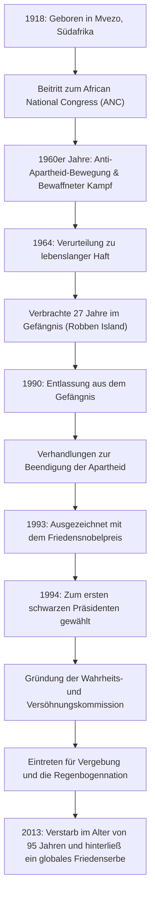

## Einleitung: Der lange Weg zur Freiheit

Nelson Mandela hat sich als einer der größten Führer des 20. Jahrhunderts tief in das Gedächtnis der Menschen weltweit eingeprägt. Er widmete sein Leben der Abschaffung der „Apartheid“, der südafrikanischen Politik der Rassentrennung, und erduldete 27 grausame Jahre im Gefängnis. Nach seiner Freilassung suchte er nicht nach Rache, sondern präsentierte einen Weg der „Versöhnung und Koexistenz“ und einte so eine gespaltene Nation. Dieser Artikel beleuchtet sein bewegtes Leben, die tiefgreifende Philosophie dahinter und seinen enormen Einfluss, der bis heute anhält.

## Früher Kampf: Konfrontation mit dem System der Ungleichheit

1918 in einem kleinen Dorf am Ostkap Südafrikas geboren, wuchs Mandela in einer traditionellen Häuptlingsfamilie auf. Als er älter wurde, sah er sich mit der Absurdität der von der weißen herrschenden Klasse legalisierten Rassendiskriminierungsstrukturen konfrontiert und trat dem African National Congress (ANC) bei. Anfangs beteiligte er sich an gewaltlosen Protesten, doch als die Repressionen der Regierung zunahmen, spürte er deren Grenzen. Nach dem Massaker von Sharpeville im Jahr 1960 traf er die Entscheidung, einen bewaffneten Kampf anzuführen. Diese Wahl zeigte, wie sehr er nach Freiheit für sein Land dürstete und eine Systemreform als dringende Notwendigkeit ansah.

## 27 Jahre Haft: Überzeugungen weichen nie

Als Führer der bewaffneten Bewegung verhaftet, wurde Mandela 1964 wegen Hochverrats zu lebenslanger Haft verurteilt. Die meiste Zeit davon verbrachte er im Gefängnis auf Robben Island, einer isolierten Insel im Ozean. Trotz harter Zwangsarbeit, unmenschlicher Behandlung und der seelischen Qual, von der Außenwelt abgeschnitten zu sein, gerieten seine Würde und seine Überzeugungen nie ins Wanken. Selbst im Gefängnis behandelte er die Wärter als Menschen, lernte heimlich mit anderen politischen Gefangenen und blieb die spirituelle Stütze der Organisation. Diese unvorstellbare Zeit von 27 Jahren erhob ihn von einem bloßen politischen Aktivisten zu einem Symbol des internationalen Menschenrechtskampfes. Die Bewegung „Free Mandela“ erfasste die Welt, und der internationale Druck auf die südafrikanische Regierung wurde von Tag zu Tag stärker.

## Von der Freilassung zur Präsidentschaft: Ein historischer Wendepunkt

1990 wurde Mandela endlich freigelassen. Dieser historische Moment wurde weltweit live übertragen und markierte den Beginn einer neuen Ära. Durch schwierige Verhandlungen mit dem damaligen Präsidenten de Klerk wurden die mit der Apartheid verbundenen Gesetze nach und nach abgeschafft. Für diese Leistung erhielten die beiden 1993 gemeinsam den Friedensnobelpreis.

Dann, im Jahr 1994, fanden die ersten demokratischen Wahlen Südafrikas unter Beteiligung aller Rassen statt, und Mandela wurde zum ersten schwarzen Präsidenten gewählt. Unter dem Motto der „Regenbogennation“ strebte er den Aufbau einer Gesellschaft an, in der alle Rassen gleichberechtigt zusammenleben.

## Mandelas Philosophie: „Versöhnung“ und „Vergebung“

Was Mandela zu einer wahren historischen Größe macht, ist, dass er, nachdem er an die Macht gekommen war, keinerlei Vergeltung an seinen ehemaligen Unterdrückern übte. Die von ihm ins Leben gerufene „Wahrheits- und Versöhnungskommission (TRC)“ verfolgte einen bahnbrechenden Ansatz, indem sie Amnestie gewährte, wenn Täter die Wahrheit gestanden, und so die nationalen Wunden heilte, anstatt vergangene Menschenrechtsverletzungen vor Gericht zu verurteilen und zu bestrafen.

An der Wurzel seiner Philosophie stand eine tiefe Liebe zur Menschheit: „Niemand wird mit Hass geboren, die Menschen müssen das Hassen lernen, und wenn sie das Hassen lernen können, kann man ihnen auch das Lieben beibringen.“ Das Regime zu vergeben, das ihn 27 Jahre lang in einen Käfig gesperrt hatte, war keineswegs einfach. Er verstand jedoch, dass es bedeutete, sich erneut in ein Gefängnis des Geistes einzusperren, wenn man in vergangenem Groll gefangen blieb. Er glaubte, dass wahre Freiheit nur darin besteht, die Freiheit der anderen zu respektieren und gemeinsam voranzuschreiten.

## Vermächtnis: Die Fackel des Friedens weitergereicht

Auch nach seinem Rücktritt als Präsident im Jahr 1999 widmete sich Mandela verschiedenen friedens- und humanitären Aktivitäten, wie der Aufklärung über die AIDS-Problematik, der Beseitigung der Armut und der Unterstützung der Bildung von Kindern. Als er 2013 im Alter von 95 Jahren verstarb, trauerten Führer und Bürger auf der ganzen Welt um ihn.

Das Erbe, das er hinterlassen hat, ist nicht bloß die historische Tatsache der Demokratisierung Südafrikas. In unserer modernen Gesellschaft, in der Konflikte und Spaltungen unaufhörlich sind, hat er mit seinem eigenen Leben bewiesen, wie stark die Kräfte von „Dialog“, „Empathie“ und „Vergebung“ sind. Der Name Nelson Mandela wird als Symbol für das edelste Potenzial der Menschheit an zukünftige Generationen weitergegeben werden.

## [Diagramm] Der Verlauf von Nelson Mandelas Leben und Leistungen

