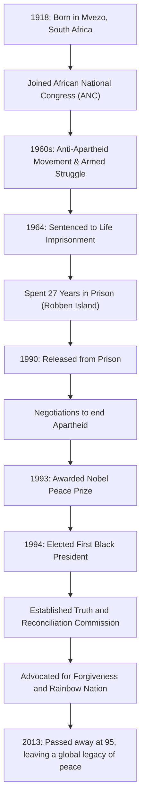

## Introduction: The Long Walk to Freedom

Nelson Mandela is deeply etched in the memory of people worldwide as one of the greatest leaders of the 20th century. He dedicated his life to the abolition of "Apartheid," South Africa's policy of racial segregation, and endured 27 grueling years in prison. Upon his release, instead of seeking revenge, he presented a path of "reconciliation and coexistence," uniting a divided nation. This article explores his tumultuous life, the profound philosophy underlying it, and his immense impact that continues to this day.

## Early Struggle: Confronting the System of Inequality

Born in 1918 in a small village in South Africa's Eastern Cape, Mandela grew up in a traditional chief's family. As he grew older, he faced the absurdity of the racial discrimination structures legalized by the white ruling class and joined the African National Congress (ANC). Initially engaging in nonviolent protests, he began to feel its limits as the government's crackdown intensified. Triggered by the Sharpeville massacre in 1960, he made the decision to lead an armed struggle. This choice demonstrated how much he thirsted for his country's freedom and considered systemic reform an urgent necessity.

## 27 Years of Imprisonment: Beliefs Never Yield

Arrested as the leader of the armed movement, Mandela was sentenced to life imprisonment for treason in 1964. He spent the majority of it at the prison on Robben Island, an isolated island in the ocean. Despite harsh forced labor, inhumane treatment, and the mental anguish of being cut off from the outside world, his dignity and beliefs never wavered. Even in prison, he treated the guards as human beings, secretly studied with other political prisoners, and remained the spiritual pillar of the organization. This unfathomable period of 27 years elevated him from a mere political activist to a symbol of the international human rights struggle. The "Free Mandela" movement swept across the world, and international pressure on the South African government grew stronger day by day.

## From Release to Presidency: A Historic Turning Point

In 1990, Mandela was finally released. This historic moment was broadcast live globally, marking the dawn of a new era. Through difficult negotiations with then-President de Klerk, apartheid-related laws were abolished one after another. For this achievement, the two jointly received the Nobel Peace Prize in 1993.

Then, in 1994, South Africa's first democratic election with the participation of all races was held, and Mandela was elected as the first Black president. Under the slogan of the "Rainbow Nation," he aimed to build a society where all races coexist equally.

## Mandela's Philosophy: "Reconciliation" and "Forgiveness"

What makes Mandela a true historical great is that after gaining power, he did not seek any retaliation against his former oppressors. The "Truth and Reconciliation Commission (TRC)" he established adopted a groundbreaking approach of granting amnesty when perpetrators confessed the truth, healing the national wounds, rather than judging and punishing past human rights violations in court.

At the root of his philosophy was a deep love for humanity: "People must learn to hate, and if they can learn to hate, they can be taught to love." Forgiving the regime that locked him in a cage for 27 years was by no means easy. However, he understood that being trapped by past grudges meant locking himself in a prison of the mind again. He believed that true freedom exists only in respecting the freedom of others and walking together.

## Legacy: The Torch of Peace Passed Down

Even after stepping down from the presidency in 1999, Mandela devoted himself to various peace and humanitarian activities, such as raising awareness of the AIDS issue, eradicating poverty, and supporting children's education. When he passed away in 2013 at the age of 95, leaders and citizens around the world mourned his death.

The legacy he left behind is not merely the historical fact of South Africa's democratization. In our modern society, where conflicts and divisions are incessant, he proved with his own life how powerful the forces of "dialogue," "empathy," and "forgiveness" are. The name Nelson Mandela will continue to be passed down to future generations as a symbol of the most noble potential that humanity possesses.

## [Diagram] The Trajectory of Nelson Mandela's Life and Achievements

