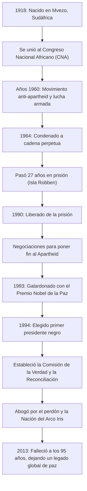

## Introducción: El largo camino hacia la libertad

Nelson Mandela está profundamente grabado en la memoria de las personas de todo el mundo como uno de los líderes más grandes del siglo XX. Dedicó su vida a la abolición del "Apartheid", la política de segregación racial de Sudáfrica, y soportó 27 crueles años en prisión. Tras su liberación, en lugar de buscar venganza, presentó un camino de "reconciliación y coexistencia", uniendo a una nación dividida. Este artículo explora su vida tumultuosa, la profunda filosofía que la sustentaba y su inmenso impacto que continúa hasta nuestros días.

## Lucha de juventud: Confrontando el sistema de desigualdad

Nacido en 1918 en un pequeño pueblo del Cabo Oriental de Sudáfrica, Mandela creció en una familia de jefes tradicionales. A medida que crecía, se enfrentó a la absurdidad de las estructuras de discriminación racial legalizadas por la clase dominante blanca y se unió al Congreso Nacional Africano (CNA). Inicialmente participaba en protestas no violentas, pero a medida que se intensificaba la represión del gobierno, comenzó a sentir los límites de esta vía. A raíz de la masacre de Sharpeville en 1960, tomó la decisión de liderar una lucha armada. Esta elección demostró cuánto anhelaba la libertad de su país y que consideraba la reforma del sistema una necesidad urgente.

## 27 años de encarcelamiento: Las convicciones nunca ceden

Arrestado como líder del movimiento armado, Mandela fue condenado a cadena perpetua por traición en 1964. Pasó la mayor parte de este tiempo en la prisión de la isla Robben, una isla aislada en el océano. A pesar de los duros trabajos forzados, el trato inhumano y la angustia mental de estar aislado del mundo exterior, su dignidad y sus convicciones nunca flaquearon. Incluso en prisión, trataba a los guardias como seres humanos, estudiaba en secreto con otros presos políticos y seguía siendo el pilar espiritual de la organización. Estos asombrosos 27 años lo elevaron de un simple activista político a un símbolo de la lucha internacional por los derechos humanos. El movimiento "Free Mandela" (Liberen a Mandela) se extendió por todo el mundo, y la presión internacional sobre el gobierno sudafricano se hizo más fuerte cada día.

## De la liberación a la presidencia: Un punto de inflexión histórico

En 1990, Mandela fue finalmente liberado. Este momento histórico fue transmitido en vivo a nivel mundial, marcando el amanecer de una nueva era. A través de difíciles negociaciones con el entonces presidente de Klerk, las leyes relacionadas con el apartheid fueron abolidas una tras otra. Por este logro, ambos recibieron conjuntamente el Premio Nobel de la Paz en 1993.

Luego, en 1994, se celebraron las primeras elecciones democráticas de Sudáfrica con la participación de todas las razas, y Mandela fue elegido como el primer presidente negro. Bajo el lema de la "Nación del Arco Iris", aspiraba a construir una sociedad donde todas las razas coexistieran por igual.

## La filosofía de Mandela: "Reconciliación" y "Perdón"

Lo que hace a Mandela un verdadero grande de la historia es que, después de obtener el poder, no buscó ninguna represalia contra sus antiguos opresores. La "Comisión de la Verdad y la Reconciliación (CVR)" que estableció adoptó un enfoque innovador de otorgar amnistía cuando los perpetradores confesaban la verdad, sanando así las heridas nacionales, en lugar de juzgar y castigar las pasadas violaciones de derechos humanos en los tribunales.

En la raíz de su filosofía había un profundo amor por la humanidad: "Nadie nace odiando; las personas deben aprender a odiar, y si pueden aprender a odiar, se les puede enseñar a amar". Perdonar al régimen que lo encerró en una jaula durante 27 años no fue nada fácil. Sin embargo, comprendió que dejarse atrapar por los rencores del pasado significaba encerrarse nuevamente en una prisión mental. Creía que la verdadera libertad existe solo al respetar la libertad de los demás y caminar juntos.

## Legado: La antorcha de la paz transmitida

Incluso después de dejar la presidencia en 1999, Mandela se dedicó a diversas actividades humanitarias y de paz, como concienciar sobre el problema del SIDA, erradicar la pobreza y apoyar la educación infantil. Cuando falleció en 2013 a la edad de 95 años, líderes y ciudadanos de todo el mundo lamentaron su muerte.

El legado que dejó no es simplemente el hecho histórico de la democratización de Sudáfrica. En nuestra sociedad moderna, donde los conflictos y las divisiones son incesantes, demostró con su propia vida cuán poderosas son las fuerzas del "diálogo", la "empatía" y el "perdón". El nombre de Nelson Mandela continuará transmitiéndose a las generaciones futuras como un símbolo del potencial más noble que posee la humanidad.

## [Diagrama] La trayectoria de la vida y los logros de Nelson Mandela

