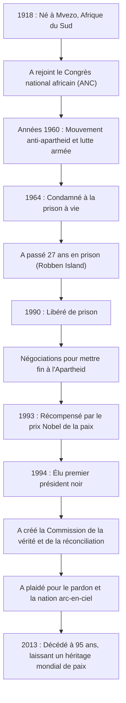

## Introduction : Le long chemin vers la liberté

Nelson Mandela est profondément gravé dans la mémoire des peuples du monde entier comme l'un des plus grands dirigeants du 20e siècle. Il a consacré sa vie à l'abolition de l'« Apartheid », la politique de ségrégation raciale de l'Afrique du Sud, et a enduré 27 années éprouvantes de prison. À sa libération, au lieu de chercher à se venger, il a présenté une voie de « réconciliation et de coexistence », unissant une nation divisée. Cet article explore sa vie tumultueuse, la philosophie profonde qui la sous-tendait, et son immense impact qui se perpétue jusqu'à nos jours.

## Les luttes de jeunesse : Affronter le système d'inégalité

Né en 1918 dans un petit village du Cap oriental en Afrique du Sud, Mandela a grandi dans une famille de chefs traditionnels. En grandissant, il a été confronté à l'absurdité des structures de discrimination raciale légalisées par la classe dirigeante blanche et a rejoint le Congrès national africain (ANC). S'engageant initialement dans des manifestations non violentes, il a commencé à en ressentir les limites à mesure que la répression gouvernementale s'intensifiait. Suite au massacre de Sharpeville en 1960, il a pris la décision de diriger une lutte armée. Ce choix démontrait à quel point il soifait de liberté pour son pays et considérait la réforme du système comme une nécessité urgente.

## 27 ans d'emprisonnement : Des convictions qui ne cèdent jamais

Arrêté en tant que chef du mouvement armé, Mandela a été condamné à la prison à vie pour trahison en 1964. Il a passé la majeure partie de cette peine à la prison de Robben Island, une île isolée dans l'océan. Malgré les travaux forcés difficiles, les traitements inhumains et l'angoisse mentale d'être coupé du monde extérieur, sa dignité et ses convictions n'ont jamais vacillé. Même en prison, il traitait les gardiens comme des êtres humains, étudiait secrètement avec d'autres prisonniers politiques et restait le pilier spirituel de l'organisation. Cette période insondable de 27 années l'a élevé d'un simple militant politique à un symbole de la lutte internationale pour les droits de l'homme. Le mouvement « Free Mandela » (Libérez Mandela) a balayé le monde, et la pression internationale sur le gouvernement sud-africain s'est renforcée de jour en jour.

## De la libération à la présidence : Un tournant historique

En 1990, Mandela a finalement été libéré. Ce moment historique a été retransmis en direct à l'échelle mondiale, marquant l'aube d'une nouvelle ère. Grâce à des négociations difficiles avec le président de l'époque, de Klerk, les lois liées à l'apartheid ont été abolies les unes après les autres. Pour cette réalisation, les deux hommes ont conjointement reçu le prix Nobel de la paix en 1993.

Puis, en 1994, les premières élections démocratiques d'Afrique du Sud avec la participation de toutes les races ont eu lieu, et Mandela a été élu premier président noir. Sous le slogan de la « Nation arc-en-ciel », il visait à construire une société où toutes les races coexistent à parts égales.

## La philosophie de Mandela : « Réconciliation » et « Pardon »

Ce qui fait de Mandela un véritable grand de l'histoire, c'est qu'après avoir accédé au pouvoir, il n'a cherché aucune vengeance contre ses anciens oppresseurs. La « Commission de la vérité et de la réconciliation (CVR) » qu'il a créée a adopté une approche novatrice consistant à accorder l'amnistie lorsque les auteurs avouaient la vérité, guérissant ainsi les blessures nationales, plutôt que de juger et de punir les violations passées des droits de l'homme devant les tribunaux.

À la base de sa philosophie se trouvait un amour profond pour l'humanité : « Personne ne naît en haïssant, les gens doivent apprendre à haïr, et s'ils peuvent apprendre à haïr, on peut leur enseigner à aimer. » Pardonner au régime qui l'a enfermé dans une cage pendant 27 ans n'a pas été facile. Cependant, il a compris que se laisser piéger par les rancunes du passé signifiait s'enfermer à nouveau dans une prison mentale. Il croyait que la véritable liberté n'existe que dans le respect de la liberté des autres et dans le fait de marcher ensemble.

## Héritage : Le flambeau de la paix transmis

Même après avoir quitté la présidence en 1999, Mandela s'est consacré à diverses activités pacifiques et humanitaires, telles que la sensibilisation au problème du SIDA, l'éradication de la pauvreté et le soutien à l'éducation des enfants. Lorsqu'il est décédé en 2013 à l'âge de 95 ans, des dirigeants et des citoyens du monde entier ont pleuré sa mort.

L'héritage qu'il a laissé n'est pas simplement le fait historique de la démocratisation de l'Afrique du Sud. Dans notre société moderne, où les conflits et les divisions sont incessants, il a prouvé par sa propre vie à quel point les forces du « dialogue », de l'« empathie » et du « pardon » sont puissantes. Le nom de Nelson Mandela continuera d'être transmis aux générations futures comme un symbole du potentiel le plus noble que possède l'humanité.

## [Diagramme] La trajectoire de la vie et des réalisations de Nelson Mandela

