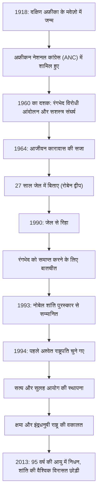

## प्रस्तावना: स्वतंत्रता की लंबी और कठिन यात्रा

नेल्सन मंडेला को 20वीं सदी के सबसे महान नेताओं में से एक के रूप में दुनिया भर के लोगों की यादों में गहराई से उकेरा गया है। उन्होंने दक्षिण अफ्रीका की नस्लीय अलगाव नीति "रंगभेद" (Apartheid) को खत्म करने के लिए अपना जीवन समर्पित कर दिया, और 27 साल का कठोर जेल जीवन सहा। अपनी रिहाई के बाद, बदला लेने के बजाय, उन्होंने "सुलह और सह-अस्तित्व" का मार्ग प्रस्तुत किया, और एक विभाजित राष्ट्र को एकजुट किया। यह लेख उनके उथल-पुथल भरे जीवन, उसके अंतर्निहित गहरे दर्शन, और आज तक जारी उनके विशाल प्रभाव की पड़ताल करता है।

## प्रारंभिक संघर्ष: असमानता की व्यवस्था का सामना

1918 में दक्षिण अफ्रीका के पूर्वी केप प्रांत के एक छोटे से गाँव में जन्मे मंडेला एक पारंपरिक मुखिया के परिवार में पले-बढ़े। जैसे-जैसे वे बड़े हुए, उन्होंने श्वेत शासक वर्ग द्वारा कानूनी रूप से स्थापित नस्लीय भेदभाव संरचना की बेरुखी का सामना किया और अफ्रीकन नेशनल कांग्रेस (ANC) में शामिल हो गए। शुरू में अहिंसक विरोध प्रदर्शन करते हुए, जब सरकार का दमन तेज हुआ, तो उन्हें इसकी सीमाएं महसूस होने लगीं। 1960 के शार्पविल नरसंहार के बाद, उन्होंने सशस्त्र संघर्ष का नेतृत्व करने का निर्णय लिया। यह चुनाव दर्शाता है कि वे अपने देश की स्वतंत्रता के लिए कितने प्यासे थे और व्यवस्था परिवर्तन को कितनी तत्काल आवश्यकता मानते थे।

## 27 साल की कैद: विश्वास कभी नहीं झुकता

सशस्त्र आंदोलन के नेता के रूप में गिरफ्तार, मंडेला को 1964 में देशद्रोह के लिए आजीवन कारावास की सजा सुनाई गई थी। उन्होंने इसका अधिकांश समय रोबेन द्वीप की जेल में बिताया, जो समुद्र में एक अलग-थलग द्वीप है। कठोर जबरन श्रम, अमानवीय व्यवहार, और बाहरी दुनिया से कटे रहने की मानसिक पीड़ा के बावजूद, उनकी गरिमा और विश्वास कभी नहीं डगमगाया। जेल में भी, उन्होंने गार्डों के साथ इंसानों की तरह व्यवहार किया, गुप्त रूप से अन्य राजनीतिक कैदियों के साथ अध्ययन किया, और संगठन के आध्यात्मिक स्तंभ बने रहे। 27 वर्षों के इस अकल्पनीय समय ने उन्हें एक साधारण राजनीतिक कार्यकर्ता से अंतरराष्ट्रीय मानवाधिकार संघर्ष के प्रतीक के रूप में ऊंचा कर दिया। "फ्री मंडेला" आंदोलन दुनिया भर में फैल गया, और दक्षिण अफ्रीकी सरकार पर अंतरराष्ट्रीय दबाव दिन-ब-दिन मजबूत होता गया।

## रिहाई से राष्ट्रपति पद तक: एक ऐतिहासिक मोड़

1990 में, मंडेला को अंततः रिहा कर दिया गया। इस ऐतिहासिक क्षण का दुनिया भर में सीधा प्रसारण किया गया, जिसने एक नए युग की शुरुआत को चिह्नित किया। तत्कालीन राष्ट्रपति डी क्लार्क के साथ कठिन बातचीत के माध्यम से, रंगभेद से संबंधित कानूनों को एक के बाद एक समाप्त कर दिया गया। इस उपलब्धि के लिए, दोनों ने संयुक्त रूप से 1993 में नोबेल शांति पुरस्कार प्राप्त किया।

फिर, 1994 में, सभी जातियों की भागीदारी के साथ दक्षिण अफ्रीका का पहला लोकतांत्रिक चुनाव हुआ, और मंडेला को पहले अश्वेत राष्ट्रपति के रूप में चुना गया। "इंद्रधनुषी राष्ट्र" के नारे के तहत, उन्होंने एक ऐसे समाज के निर्माण का लक्ष्य रखा जहाँ सभी जातियाँ समान रूप से सह-अस्तित्व में हों।

## मंडेला का दर्शन: "सुलह" और "क्षमा"

मंडेला को एक सच्चा ऐतिहासिक महान व्यक्ति जो बनाता है, वह यह है कि सत्ता हासिल करने के बाद, उन्होंने अपने पूर्व उत्पीड़कों के खिलाफ कोई प्रतिशोध नहीं लिया। उनके द्वारा स्थापित "सत्य और सुलह आयोग (TRC)" ने अदालत में पिछले मानवाधिकारों के उल्लंघन का न्याय करने और दंडित करने के बजाय, अपराधियों द्वारा सच्चाई कबूल करने पर माफी देने, राष्ट्रीय घावों को भरने का एक अभूतपूर्व दृष्टिकोण अपनाया।

उनके दर्शन के मूल में मानवता के लिए एक गहरा प्रेम था: "कोई भी जन्म से नफरत नहीं करता है, अगर लोग नफरत करना सीख सकते हैं, तो उन्हें प्यार करना भी सिखाया जा सकता है।" उस शासन को माफ करना जिसने उन्हें 27 साल तक पिंजरे में बंद रखा, किसी भी तरह से आसान नहीं था। हालाँकि, वे समझ गए थे कि अतीत की शिकायतों में फंसे रहने का मतलब है खुद को फिर से दिमाग की जेल में बंद कर लेना। उनका मानना था कि सच्ची स्वतंत्रता केवल दूसरों की स्वतंत्रता का सम्मान करने और एक साथ चलने में मौजूद है।

## विरासत: शांति की मशाल आगे बढ़ी

1999 में राष्ट्रपति पद से हटने के बाद भी, मंडेला ने एड्स के मुद्दे के बारे में जागरूकता बढ़ाने, गरीबी उन्मूलन, और बच्चों की शिक्षा का समर्थन करने जैसी विभिन्न शांति और मानवीय गतिविधियों के लिए खुद को समर्पित कर दिया। 2013 में जब 95 वर्ष की आयु में उनका निधन हुआ, तो दुनिया भर के नेताओं और नागरिकों ने उनकी मृत्यु पर शोक व्यक्त किया।

उनके द्वारा छोड़ी गई विरासत केवल दक्षिण अफ्रीका के लोकतंत्रीकरण का ऐतिहासिक तथ्य नहीं है। हमारे आधुनिक समाज में, जहां संघर्ष और विभाजन लगातार हो रहे हैं, उन्होंने अपने जीवन से यह साबित कर दिया कि "संवाद", "सहानुभूति", और "क्षमा" की ताकतें कितनी शक्तिशाली हैं। नेल्सन मंडेला का नाम मानवता की सबसे महान क्षमता के प्रतीक के रूप में भविष्य की पीढ़ियों को हस्तांतरित किया जाता रहेगा।

## [आरेख] नेल्सन मंडेला के जीवन और उपलब्धियों का प्रक्षेपवक्र

