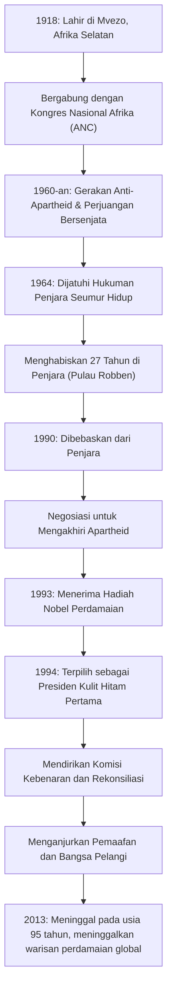

## Pendahuluan: Perjalanan Panjang Menuju Kebebasan

Nelson Mandela terukir dalam di ingatan orang-orang di seluruh dunia sebagai salah satu pemimpin terbesar abad ke-20. Ia mendedikasikan hidupnya untuk menghapus "Apartheid," kebijakan segregasi rasial Afrika Selatan, dan menanggung 27 tahun kehidupan penjara yang kejam. Setelah pembebasannya, alih-alih membalas dendam, ia menyajikan jalan "rekonsiliasi dan koeksistensi," menyatukan bangsa yang terbelah. Artikel ini mengeksplorasi kehidupannya yang penuh gejolak, filosofi mendalam yang mendasarinya, dan dampak besarnya yang berlanjut hingga hari ini.

## Perjuangan Masa Muda: Menghadapi Sistem Ketidaksetaraan

Lahir pada tahun 1918 di sebuah desa kecil di Cape Timur Afrika Selatan, Mandela tumbuh dalam keluarga kepala suku tradisional. Seiring bertambahnya usia, ia menghadapi absurditas struktur diskriminasi rasial yang dilegalkan oleh kelas penguasa kulit putih dan bergabung dengan Kongres Nasional Afrika (ANC). Awalnya terlibat dalam protes tanpa kekerasan, ia mulai merasakan batasannya ketika penindasan pemerintah meningkat. Dipicu oleh pembantaian Sharpeville pada tahun 1960, ia membuat keputusan untuk memimpin perjuangan bersenjata. Pilihan ini menunjukkan seberapa besar kerinduannya akan kebebasan negaranya dan menganggap reformasi sistemik sebagai kebutuhan yang mendesak.

## 27 Tahun Penjara: Keyakinan Tak Pernah Menyerah

Ditangkap sebagai pemimpin gerakan bersenjata, Mandela dijatuhi hukuman penjara seumur hidup karena pengkhianatan pada tahun 1964. Ia menghabiskan sebagian besar waktunya di penjara Pulau Robben, sebuah pulau terpencil di lautan. Terlepas dari kerja paksa yang keras, perlakuan tidak manusiawi, dan penderitaan mental karena terputus dari dunia luar, martabat dan keyakinannya tidak pernah goyah. Bahkan di penjara, ia memperlakukan para penjaga sebagai manusia, secara diam-diam belajar bersama tahanan politik lainnya, dan tetap menjadi pilar spiritual organisasi. Periode 27 tahun yang tak terbayangkan ini mengangkatnya dari sekadar aktivis politik menjadi simbol perjuangan hak asasi manusia internasional. Gerakan "Bebaskan Mandela" menyapu seluruh dunia, dan tekanan internasional terhadap pemerintah Afrika Selatan semakin kuat dari hari ke hari.

## Dari Pembebasan hingga Kepresidenan: Titik Balik Bersejarah

Pada tahun 1990, Mandela akhirnya dibebaskan. Momen bersejarah ini disiarkan langsung secara global, menandai fajar era baru. Melalui negosiasi sulit dengan Presiden de Klerk saat itu, undang-undang terkait apartheid dihapuskan satu per satu. Atas pencapaian ini, keduanya secara bersama-sama menerima Hadiah Nobel Perdamaian pada tahun 1993.

Kemudian, pada tahun 1994, pemilihan demokratis pertama di Afrika Selatan dengan partisipasi semua ras diadakan, dan Mandela terpilih sebagai presiden kulit hitam pertama. Di bawah slogan "Bangsa Pelangi," ia bertujuan untuk membangun masyarakat di mana semua ras hidup berdampingan secara setara.

## Filosofi Mandela: "Rekonsiliasi" dan "Pemaafan"

Apa yang menjadikan Mandela seorang tokoh besar sejarah yang sesungguhnya adalah bahwa setelah mendapatkan kekuasaan, ia tidak membalas dendam terhadap mantan penindasnya. "Komisi Kebenaran dan Rekonsiliasi (TRC)" yang ia dirikan mengadopsi pendekatan terobosan dengan memberikan amnesti ketika pelaku mengakui kebenaran, dengan demikian menyembuhkan luka nasional, alih-alih mengadili dan menghukum pelanggaran hak asasi manusia masa lalu di pengadilan.

Akar filosofinya adalah cinta yang mendalam terhadap kemanusiaan: "Tidak ada orang yang terlahir membenci, orang harus belajar membenci, dan jika mereka dapat belajar membenci, mereka dapat diajarkan untuk mencintai." Memaafkan rezim yang mengurungnya di dalam sangkar selama 27 tahun sama sekali tidak mudah. Namun, ia memahami bahwa terjebak oleh dendam masa lalu berarti mengurung dirinya dalam penjara pikiran lagi. Ia percaya bahwa kebebasan sejati hanya ada dalam menghormati kebebasan orang lain dan berjalan bersama.

## Warisan: Obor Perdamaian Diwariskan

Bahkan setelah mengundurkan diri dari kepresidenan pada tahun 1999, Mandela mendedikasikan dirinya pada berbagai kegiatan perdamaian dan kemanusiaan, seperti meningkatkan kesadaran tentang masalah AIDS, memberantas kemiskinan, dan mendukung pendidikan anak-anak. Ketika ia meninggal pada tahun 2013 pada usia 95 tahun, para pemimpin dan warga di seluruh dunia berduka atas kematiannya.

Warisan yang ditinggalkannya tidak semata-mata fakta sejarah demokratisasi Afrika Selatan. Dalam masyarakat modern kita, di mana konflik dan perpecahan terus-menerus terjadi, ia membuktikan dengan hidupnya sendiri betapa kuatnya kekuatan "dialog," "empati," dan "pemaafan." Nama Nelson Mandela akan terus diwariskan ke generasi mendatang sebagai simbol potensi paling mulia yang dimiliki umat manusia.

## [Diagram] Lintasan Kehidupan dan Pencapaian Nelson Mandela

