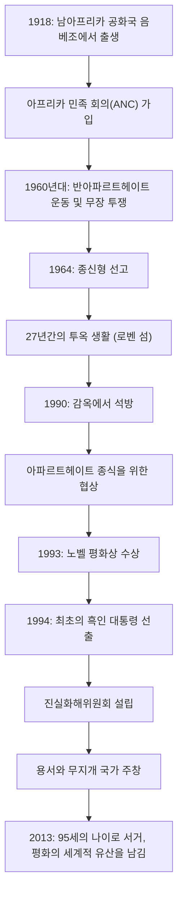

## 시작하며: 자유를 향한 길고도 험난한 여정

넬슨 만델라는 20세기 가장 위대한 지도자 중 한 명으로 전 세계인의 기억 속에 깊이 각인되어 있습니다. 그는 남아프리카 공화국의 인종 차별 정책인 '아파르트헤이트' 철폐를 위해 평생을 바쳤고, 27년에 달하는 가혹한 투옥 생활을 견뎌냈습니다. 그리고 석방 후에는 복수가 아닌 '화해와 공존'의 길을 제시하며 분열된 국가를 하나로 결속시켰습니다. 본 기사에서는 그의 파란만장한 생애와 그 바탕에 자리한 깊은 철학, 그리고 현대에까지 이어지는 막대한 영향력에 대해 살펴봅니다.

## 젊은 시절의 투쟁: 불평등한 시스템과의 대결

1918년 남아프리카 공화국 이스턴케이프주의 작은 마을에서 태어난 만델라는 전통적인 추장 가문에서 자랐습니다. 성장하면서 그는 백인 지배층이 법제화한 인종 차별 구조의 부조리함에 직면했고 아프리카 민족 회의(ANC)에 가입하게 됩니다. 초기에는 비폭력 시위를 전개했지만, 정부의 탄압이 거세지면서 그 한계를 느끼게 됩니다. 1960년 샤프빌 학살 사건을 계기로 그는 무장 투쟁을 이끌기로 결심합니다. 이러한 선택은 그가 조국의 자유를 얼마나 열망했으며 체제 변혁을 얼마나 시급한 과제로 여겼는지를 보여줍니다.

## 27년간의 투옥: 신념은 결코 굴복하지 않는다

무장 투쟁의 지도자로 체포된 만델라는 1964년 국가 반역죄로 종신형을 선고받았습니다. 그 기간의 대부분을 보낸 곳은 외딴섬인 로벤 섬의 감옥이었습니다. 가혹한 강제 노동과 비인간적인 대우, 외부와의 연락이 단절되는 정신적 고통 속에서도 그의 존엄성과 신념은 흔들리지 않았습니다. 감옥 안에서조차 그는 교도관들을 인간적으로 대했고, 몰래 다른 정치범들과 함께 공부하며 조직의 정신적 지주로 남았습니다. 이 27년이라는 헤아릴 수 없는 시간은 그를 단순한 정치 활동가에서 국제적인 인권 투쟁의 상징으로 승화시켰습니다. 전 세계적으로 '프리 만델라(만델라를 석방하라)' 운동이 일어났고, 남아프리카 공화국 정부에 대한 국제사회의 압력은 나날이 거세졌습니다.

## 석방부터 대통령 취임까지: 역사적 전환점

1990년, 마침내 만델라는 석방됩니다. 이 역사적인 순간은 전 세계에 생중계되며 새로운 시대의 서막을 알렸습니다. 당시 데 클레르크 대통령과의 험난한 협상을 거쳐 아파르트헤이트 관련 법안들이 차례로 폐지됩니다. 이러한 공로로 두 사람은 1993년 노벨 평화상을 공동 수상했습니다.

그리고 1994년, 남아프리카 공화국 역사상 최초로 모든 인종이 참여하는 민주적 선거가 실시되었고 만델라는 최초의 흑인 대통령으로 선출됩니다. '무지개 국가(Rainbow Nation)'라는 슬로건 아래, 모든 인종이 평등하게 공존하는 사회 건설을 목표로 삼았습니다.

## 만델라의 철학: '화해'와 '용서'

만델라를 역사상 진정한 위인으로 만든 것은 그가 권력을 잡은 후 과거의 억압자들에게 어떠한 보복도 하지 않았다는 점에 있습니다. 그가 설립한 '진실화해위원회(TRC)'는 과거의 인권 침해를 법정에서 심판하고 처벌하는 대신, 가해자가 진실을 고백하면 사면을 베풀어 국가적 상처를 치유하는 획기적인 접근 방식을 채택했습니다.

그의 철학의 근저에는 "태어날 때부터 증오하는 사람은 없다. 증오를 배울 수 있다면 사랑도 가르칠 수 있다"는 깊은 인류애가 있었습니다. 자신을 27년이나 우리에 가둔 체제를 용서하는 것은 결코 쉬운 일이 아닙니다. 그러나 그는 과거의 원한에 얽매이는 것은 스스로를 다시 마음의 감옥에 가두는 것임을 이해했습니다. 진정한 자유란 타인의 자유를 존중하고 함께 나아가는 것 속에만 존재한다고 믿었던 것입니다.

## 후세에 남긴 영향: 이어지는 평화의 등불

1999년 대통령직에서 물러난 후에도 만델라는 에이즈 문제에 대한 인식 제고, 빈곤 퇴치, 어린이 교육 지원 등 다양한 평화 및 인도주의 활동에 헌신했습니다. 2013년 95세를 일기로 세상을 떠났을 때, 전 세계의 지도자들과 시민들이 그의 죽음을 애도했습니다.

그가 남긴 유산은 단순히 남아프리카 공화국의 민주화라는 역사적 사실에 그치지 않습니다. 갈등과 분열이 끊이지 않는 현대 사회에서 '대화'와 '공감', 그리고 '용서'의 힘이 얼마나 강력한지를 그 자신의 생애를 통해 증명했습니다. 넬슨 만델라라는 이름은 인류가 가진 가장 숭고한 잠재력의 상징으로서 앞으로도 미래 세대에게 전해질 것입니다.

## [도해] 넬슨 만델라의 생애와 업적의 궤적

