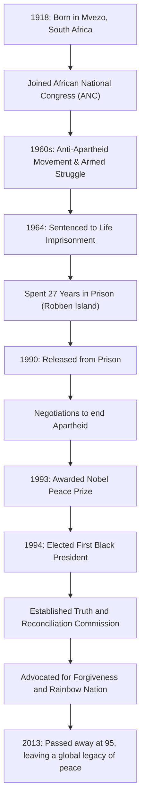

## はじめに：自由への長く険しい道

ネルソン・マンデラは、20世紀における最も偉大な指導者の一人として、世界中の人々の記憶に深く刻まれています。南アフリカ共和国の人種隔離政策「アパルトヘイト」の撤廃に向けて生涯を捧げ、27年にも及ぶ過酷な獄中生活を耐え抜きました。そして、釈放後には復讐ではなく「和解と共生」の道を提示し、分断された国家を一つにまとめ上げたのです。本記事では、彼の波乱に満ちた生涯と、その根底にあった深い哲学、そして現代にまで続く多大な影響について紐解いていきます。

## 若き日の闘争：不平等のシステムとの対峙

1918年、南アフリカの東ケープ州にある小さな村で生まれたマンデラは、伝統的な首長の家系に育ちました。成長するにつれて、白人支配層によって法制化された人種差別構造の不条理さに直面し、アフリカ民族会議（ANC）に入党します。当初は非暴力による抗議活動を行っていましたが、政府側の弾圧が激化するにつれ、限界を感じるようになります。1960年のシャープビル虐殺事件を機に、彼は武装闘争を指揮する決断を下しました。この選択は、彼がどれほど祖国の自由を渇望し、体制の変革を急務と考えていたかを示しています。

## 27年間の投獄：信念は決して屈しない

武装活動の指導者として逮捕されたマンデラは、1964年に国家反逆罪で終身刑の判決を受けました。その大半を過ごしたのが、絶海の孤島であるロベン島の刑務所です。過酷な強制労働と非人道的な待遇、外部との連絡を絶たれるという精神的苦痛の中でも、彼の尊厳と信念が揺らぐことはありませんでした。獄中においてすら、彼は看守たちに人間として接し、密かに他の政治犯たちと学び合い、組織の精神的支柱であり続けました。この27年間という途方もない時間は、彼を単なる政治活動家から、国際的な人権闘争の象徴へと昇華させたのです。世界中で「フリー・マンデラ（マンデラを解放せよ）」の運動が巻き起こり、南アフリカ政府への国際的な圧力は日増しに強まっていきました。

## 釈放から大統領就任へ：歴史的転換点

1990年、ついにマンデラは釈放されます。この歴史的瞬間は世界中に生中継され、新たな時代の幕開けを印象付けました。当時のデクラーク大統領との困難な交渉を経て、アパルトヘイト関連法は次々と廃止されていきます。この功績により、両者は1993年にノーベル平和賞を共同受賞しました。

そして1994年、南アフリカ史上初となる全人種参加の民主的選挙が実施され、マンデラは初の黒人大統領に選出されます。「虹の国（レインボー・ネイション）」というスローガンのもと、全ての人種が平等に共存する社会の建設を目指しました。

## マンデラの哲学：「和解」と「赦し」

マンデラを歴史上の真の偉人たらしめているのは、彼が権力を握った後、かつての抑圧者たちに対する報復を一切行わなかったという点にあります。彼が設立した「真実和解委員会（TRC）」は、過去の人権侵害を法廷で裁き罰するのではなく、加害者が真実を告白することで恩赦を与え、国民的な傷を癒やすという画期的なアプローチを採用しました。

彼の哲学の根底には「憎しみは生まれつきのものではなく、後から学ぶものである。ならば、愛することも学べるはずだ」という深い人間愛がありました。自分を27年間も檻に閉じ込めた体制を許すことは、決して容易なことではありません。しかし彼は、過去の恨みに囚われることは、自らを再び心の牢獄に閉じ込めることだと理解していました。真の自由とは、他者の自由を尊重し、共に歩むことの中にしかないと考えたのです。

## 後世への影響：受け継がれる平和の灯火

1999年に大統領職を退いた後も、マンデラはエイズ問題の啓発や貧困撲滅、子供たちの教育支援など、様々な平和・人道活動に尽力しました。2013年に95歳でこの世を去った際、世界中の指導者や市民がその死を悼みました。

彼が残した遺産は、単に南アフリカの民主化という歴史的事実にとどまりません。対立や分断が絶えない現代社会において、「対話」と「共感」、そして「赦し」の力がいかに強大であるかを、彼自身の生涯をもって証明しました。ネルソン・マンデラの名前は、人間が持つ最も崇高な可能性の象徴として、これからも未来の世代に語り継がれていくことでしょう。

## 【図解】ネルソン・マンデラの生涯と功績の軌跡

