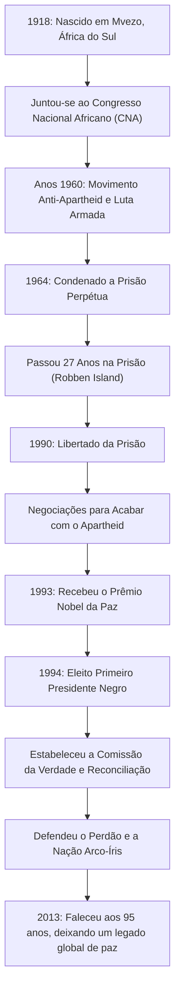

## Introdução: O Longo Caminho para a Liberdade

Nelson Mandela está profundamente gravado na memória das pessoas ao redor do mundo como um dos maiores líderes do século XX. Ele dedicou sua vida à abolição do "Apartheid", a política de segregação racial da África do Sul, e suportou 27 anos cruéis na prisão. Após a sua libertação, em vez de buscar vingança, ele apresentou um caminho de "reconciliação e coexistência", unindo uma nação dividida. Este artigo explora sua vida tumultuada, a profunda filosofia por trás dela e seu imenso impacto que continua até os dias de hoje.

## A Luta da Juventude: Enfrentando o Sistema de Desigualdade

Nascido em 1918 em uma pequena aldeia na província do Cabo Oriental, na África do Sul, Mandela cresceu em uma família tradicional de chefes. À medida que crescia, deparou-se com o absurdo das estruturas de discriminação racial legalizadas pela classe dominante branca e juntou-se ao Congresso Nacional Africano (CNA). Inicialmente engajado em protestos não violentos, ele começou a sentir seus limites à medida que a repressão do governo se intensificava. Após o massacre de Sharpeville em 1960, tomou a decisão de liderar uma luta armada. Esta escolha demonstrou o quanto ele ansiava pela liberdade de seu país e considerava a reforma do sistema uma necessidade urgente.

## 27 Anos de Prisão: Convicções Nunca Cedem

Preso como líder do movimento armado, Mandela foi condenado à prisão perpétua por traição em 1964. Ele passou a maior parte desse tempo na prisão de Robben Island, uma ilha isolada no oceano. Apesar dos duros trabalhos forçados, tratamento desumano e a angústia mental de ser cortado do mundo exterior, sua dignidade e convicções nunca vacilaram. Mesmo na prisão, tratava os guardas como seres humanos, estudava secretamente com outros presos políticos e continuou a ser o pilar espiritual da organização. Este período insondável de 27 anos o elevou de um mero ativista político a um símbolo da luta internacional pelos direitos humanos. O movimento "Free Mandela" (Libertem Mandela) varreu o mundo, e a pressão internacional sobre o governo sul-africano fortaleceu-se dia a dia.

## Da Libertação à Presidência: Um Ponto de Virada Histórico

Em 1990, Mandela foi finalmente libertado. Este momento histórico foi transmitido ao vivo globalmente, marcando o amanhecer de uma nova era. Através de negociações difíceis com o então presidente de Klerk, as leis relacionadas ao apartheid foram abolidas uma após a outra. Por esta conquista, os dois receberam conjuntamente o Prêmio Nobel da Paz em 1993.

Então, em 1994, a primeira eleição democrática da África do Sul com a participação de todas as raças foi realizada, e Mandela foi eleito o primeiro presidente negro. Sob o slogan de "Nação Arco-Íris", ele pretendia construir uma sociedade onde todas as raças coexistissem igualmente.

## A Filosofia de Mandela: "Reconciliação" e "Perdão"

O que faz de Mandela um verdadeiro grande da história é que, depois de ganhar o poder, não buscou nenhuma retaliação contra seus antigos opressores. A "Comissão da Verdade e Reconciliação (CVR)" que ele estabeleceu adotou uma abordagem inovadora de conceder anistia quando os perpetradores confessavam a verdade, curando assim as feridas nacionais, em vez de julgar e punir violações passadas dos direitos humanos em tribunal.

Na raiz de sua filosofia havia um profundo amor pela humanidade: "Ninguém nasce odiando, as pessoas precisam aprender a odiar, e se podem aprender a odiar, podem ser ensinadas a amar." Perdoar o regime que o trancou em uma gaiola por 27 anos não foi de forma alguma fácil. No entanto, ele compreendeu que ficar preso por rancores do passado significava trancar-se em uma prisão da mente novamente. Ele acreditava que a verdadeira liberdade só existe ao respeitar a liberdade dos outros e caminharem juntos.

## Legado: A Tocha da Paz Transmitida

Mesmo depois de deixar a presidência em 1999, Mandela dedicou-se a várias atividades humanitárias e de paz, tais como aumentar a conscientização sobre a questão da AIDS, erradicar a pobreza e apoiar a educação das crianças. Quando faleceu em 2013, aos 95 anos, líderes e cidadãos de todo o mundo lamentaram a sua morte.

O legado que deixou não é meramente o fato histórico da democratização da África do Sul. Em nossa sociedade moderna, onde conflitos e divisões são incessantes, ele provou com a sua própria vida o quão poderosas são as forças do "diálogo", da "empatia" e do "perdão". O nome Nelson Mandela continuará a ser transmitido às gerações futuras como um símbolo do potencial mais nobre que a humanidade possui.

## [Diagrama] A Trajetória da Vida e Conquistas de Nelson Mandela

