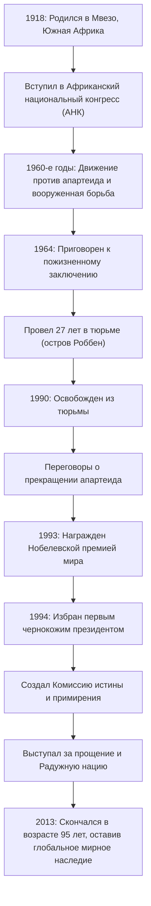

## Введение: Долгий путь к свободе

Нельсон Мандела глубоко запечатлен в памяти людей во всем мире как один из величайших лидеров 20-го века. Он посвятил свою жизнь отмене «апартеида», политики расовой сегрегации в Южной Африке, и перенес 27 тяжелейших лет в тюрьме. После своего освобождения вместо того, чтобы мстить, он предложил путь «примирения и сосуществования», объединив разделенную нацию. В этой статье исследуется его бурная жизнь, глубокая философия, лежащая в ее основе, и его огромное влияние, которое продолжается по сей день.

## Ранняя борьба: Противостояние системе неравенства

Родившийся в 1918 году в небольшой деревне в Восточно-Капской провинции Южной Африки, Мандела вырос в семье традиционного вождя. По мере взросления он столкнулся с абсурдностью структур расовой дискриминации, узаконенных белым правящим классом, и вступил в Африканский национальный конгресс (АНК). Первоначально участвуя в ненасильственных протестах, он начал чувствовать их ограничения по мере усиления репрессий со стороны правительства. После резни в Шарпевиле в 1960 году он принял решение возглавить вооруженную борьбу. Этот выбор продемонстрировал, насколько он жаждал свободы для своей страны и считал системные реформы насущной необходимостью.

## 27 лет тюремного заключения: Убеждения никогда не сдаются

Арестованный как лидер вооруженного движения, Мандела был приговорен к пожизненному заключению за государственную измену в 1964 году. Большую часть этого времени он провел в тюрьме на острове Роббен, изолированном острове в океане. Несмотря на суровые принудительные работы, бесчеловечное обращение и душевные муки отрыва от внешнего мира, его достоинство и убеждения никогда не колебались. Даже в тюрьме он относился к охранникам как к людям, тайно учился вместе с другими политическими заключенными и оставался духовной опорой организации. Этот непостижимый 27-летний период возвысил его от простого политического активиста до символа международной борьбы за права человека. Движение «Свободу Манделе» охватило весь мир, и международное давление на правительство Южной Африки усиливалось день ото дня.

## От освобождения до президентства: Исторический поворотный момент

В 1990 году Мандела наконец был освобожден. Этот исторический момент транслировался в прямом эфире по всему миру, знаменуя рассвет новой эры. В ходе трудных переговоров с тогдашним президентом де Клерком законы, связанные с апартеидом, отменялись один за другим. За это достижение они оба совместно получили Нобелевскую премию мира в 1993 году.

Затем, в 1994 году, состоялись первые демократические выборы в Южной Африке с участием всех рас, и Мандела был избран первым чернокожим президентом. Под лозунгом «Радужной нации» он стремился построить общество, в котором все расы сосуществуют на равных.

## Философия Манделы: «Примирение» и «Прощение»

Что делает Манделу по-настоящему исторически великим, так это то, что, получив власть, он не стал мстить своим бывшим угнетателям. Созданная им «Комиссия истины и примирения (КИП)» применила новаторский подход, предоставляя амнистию, когда преступники признавались в правде, исцеляя тем самым национальные раны, вместо того, чтобы судить и наказывать прошлые нарушения прав человека в суде.

В основе его философии лежала глубокая любовь к человечеству: «Никто не рождается с ненавистью, люди должны научиться ненавидеть, и если они могут научиться ненавидеть, их можно научить любить». Простить режим, который держал его в клетке 27 лет, было отнюдь не легко. Однако он понимал, что оказаться в ловушке прошлых обид означает снова запереть себя в тюрьме разума. Он верил, что истинная свобода существует только в уважении свободы других и совместном движении вперед.

## Наследие: Эстафета мира передана

Даже после ухода с поста президента в 1999 году Мандела посвятил себя различным миротворческим и гуманитарным мероприятиям, таким как повышение осведомленности о проблеме СПИДа, искоренение нищеты и поддержка образования детей. Когда он скончался в 2013 году в возрасте 95 лет, лидеры и граждане всего мира оплакивали его смерть.

Оставленное им наследие — это не просто исторический факт демократизации Южной Африки. В нашем современном обществе, где конфликты и разногласия не прекращаются, он своей собственной жизнью доказал, насколько сильны силы «диалога», «сочувствия» и «прощения». Имя Нельсона Манделы будет передаваться будущим поколениям как символ самого благородного потенциала, которым обладает человечество.

## [Схема] Траектория жизни и достижений Нельсона Манделы

