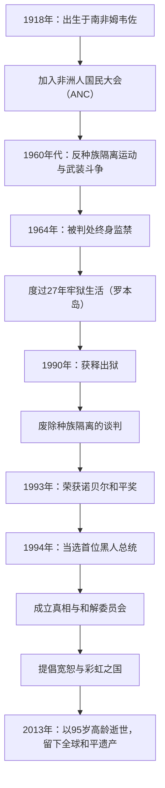

## 引言：通向自由的漫漫长路

作为20世纪最伟大的领导人之一，纳尔逊·曼德拉的名字深深印刻在全世界人民的记忆中。他将一生奉献于废除南非的种族隔离政策（Apartheid），并熬过了长达27年的残酷牢狱生活。而在获释后，他没有选择复仇，而是指明了一条“和解与共存”的道路，将四分五裂的国家重新团结在一起。本文将为您解读他波澜壮阔的一生、其背后深邃的哲学，以及对当今世界产生的深远影响。

## 早年斗争：对抗不平等的系统

1918年，曼德拉出生在南非东开普省的一个小村庄，成长于一个传统的酋长家族。随着年龄的增长，他直面了白人统治阶层通过法律确立的种族歧视结构的荒谬性，并加入了非洲人国民大会（ANC）。最初，他采取非暴力的抗议活动，但随着政府镇压的加剧，他逐渐感到了这种方式的局限性。以1960年的沙佩维尔大屠杀为契机，他做出了领导武装斗争的决定。这一选择表明了他对祖国自由的极度渴望，以及将体制变革视为当务之急的决心。

## 27年的监禁：信念绝不屈服

作为武装活动的领导人，曼德拉被捕并于1964年因叛国罪被判处终身监禁。他大部分的刑期都是在孤悬海外的罗本岛监狱中度过的。尽管经历了严酷的强迫劳动、非人道的待遇以及与外界隔绝的精神折磨，他的尊严与信念却从未动摇。即使在狱中，他也将狱警视为平等的人来对待，秘密地与其他政治犯一起学习，并始终是组织的组织精神支柱。这27年无比漫长的岁月，将他从一个单纯的政治活动家，升华为了国际人权斗争的象征。世界各地掀起了“释放曼德拉”的运动，国际社会对南非政府的压力与日俱增。

## 从获释到就任总统：历史的转折点

1990年，曼德拉终于获释。这一历史性的时刻向全球进行了现场直播，标志着一个新时代的开启。通过与时任总统德克勒克艰难的谈判，种族隔离相关的法律被接连废除。因为这一成就，两人在1993年共同荣获诺贝尔和平奖。

接着在1994年，南非举行了历史上首次所有种族参与的民主选举，曼德拉当选为首位黑人总统。在“彩虹之国”的口号下，他致力于建设一个所有种族平等共存的社会。

## 曼德拉的哲学：“和解”与“宽恕”

曼德拉之所以成为历史上真正的伟人，在于他在掌握权力之后，没有对曾经的压迫者进行任何报复。他成立的“真相与和解委员会（TRC）”没有选择在法庭上审判和惩罚过去侵犯人权的行为，而是采取了一种开创性的方式：只要加害者坦白真相便给予特赦，以此来治愈国家创伤。

他哲学的根基在于深厚的人类之爱：“没有人生来就会恨，如果人们可以学习恨，那么他们也可以被教导去爱。”要原谅那个将自己关在笼子里27年的体制绝非易事。但他明白，沉溺于过去的仇恨，就等于再次将自己关进内心的牢笼。他认为，真正的自由存在于尊重他人的自由并与之一同前行之中。

## 对后世的影响：传承不息的和平之火

即使在1999年卸任总统之后，曼德拉依然致力于艾滋病问题启蒙、消除贫困、支持儿童教育等各种和平与人道主义活动。2013年，当他以95岁高龄辞世时，世界各地的领导人和民众纷纷悼念。

他留下的遗产，不仅仅是南非民主化这一历史事实。在冲突和分裂不断的现代社会中，他用自己的一生证明了“对话”、“共情”和“宽恕”的力量是多么强大。纳尔逊·曼德拉这个名字，将作为人类所拥有的最高尚潜能的象征，继续在未来的世代中传颂。

## 【图解】纳尔逊·曼德拉的生平与功绩轨迹

