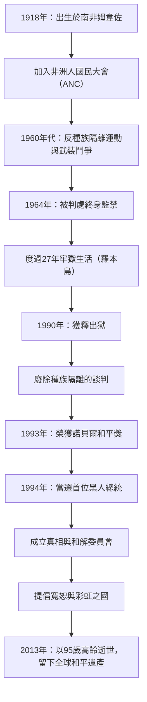

## 引言：通向自由的漫漫長路

作為20世紀最偉大的領導人之一，納爾遜·曼德拉的名字深深印刻在全世界人民的記憶中。他將一生奉獻於廢除南非的種族隔離政策（Apartheid），並熬過了長達27年的殘酷牢獄生活。而在獲釋後，他沒有選擇復仇，而是指明了一條「和解與共存」的道路，將四分五裂的國家重新團結在一起。本文將為您解讀他波瀾壯闊的一生、其背後深邃的哲學，以及對當今世界產生的深遠影響。

## 早年鬥爭：對抗不平等的系統

1918年，曼德拉出生在南非東開普省的一個小村莊，成長於一個傳統的酋長家族。隨著年齡的增長，他直面了白人統治階層透過法律確立的種族歧視結構的荒謬性，並加入了非洲人國民大會（ANC）。最初，他採取非暴力的抗議活動，但隨著政府鎮壓的加劇，他逐漸感到了這種方式的侷限性。以1960年的沙佩維爾大屠殺為契機，他做出了領導武裝鬥爭的決定。這一選擇表明了他對祖國自由的極度渴望，以及將體制變革視為當務之急的決心。

## 27年的監禁：信念絕不屈服

作為武裝活動的領導人，曼德拉被捕並於1964年因叛國罪被判處終身監禁。他大部分的刑期都是在孤懸海外的羅本島監獄中度過的。儘管經歷了嚴酷的強迫勞動、非人道的待遇以及與外界隔絕的精神折磨，他的尊嚴與信念卻從未動搖。即使在獄中，他也將獄警視為平等的人來對待，秘密地與其他政治犯一起學習，並始終是組織的精神支柱。這27年無比漫長的歲月，將他從一個單純的政治活動家，昇華為了國際人權鬥爭的象徵。世界各地掀起了「釋放曼德拉」的運動，國際社會對南非政府的壓力與日俱增。

## 從獲釋到就任總統：歷史的轉折點

1990年，曼德拉終於獲釋。這一歷史性的時刻向全球進行了現場直播，標誌著一個新時代的開啟。透過與時任總統戴克拉克艱難的談判，種族隔離相關的法律被接連廢除。因為這一成就，兩人在1993年共同榮獲諾貝爾和平獎。

接著在1994年，南非舉行了歷史上首次所有種族參與的民主選舉，曼德拉當選為首位黑人總統。在「彩虹之國」的口號下，他致力於建設一個所有種族平等共存的社會。

## 曼德拉的哲學：「和解」與「寬恕」

曼德拉之所以成為歷史上真正的偉人，在於他在掌握權力之後，沒有對曾經的壓迫者進行任何報復。他成立的「真相與和解委員會（TRC）」沒有選擇在法庭上審判和懲罰過去侵犯人權的行為，而是採取了一種開創性的方式：只要加害者坦白真相便給予特赦，以此來治癒國家創傷。

他哲學的根基在於深厚的人類之愛：「沒有人生來就會恨，如果人們可以學習恨，那麼他們也可以被教導去愛。」要原諒那個將自己關在籠子裡27年的體制絕非易事。但他明白，沉溺於過去的仇恨，就等於再次將自己關進內心的牢籠。他認為，真正的自由存在於尊重他人的自由並與之一同前行之中。

## 對後世的影響：傳承不息的和平之火

即使在1999年卸任總統之後，曼德拉依然致力於愛滋病問題啟蒙、消除貧困、支持兒童教育等各種和平與人道主義活動。2013年，當他以95歲高齡辭世時，世界各地的領導人和民眾紛紛悼念。

他留下的遺產，不僅僅是南非民主化這一歷史事實。在衝突和分裂不斷的現代社會中，他用自己的一生證明了「對話」、「共情」和「寬恕」的力量是多麼強大。納爾遜·曼德拉這個名字，將作為人類所擁有的最高尚潛能的象徵，繼續在未來的世代中傳頌。

## 【圖解】納爾遜·曼德拉的生平與功績軌跡

