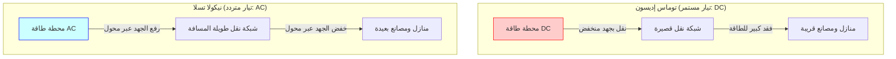
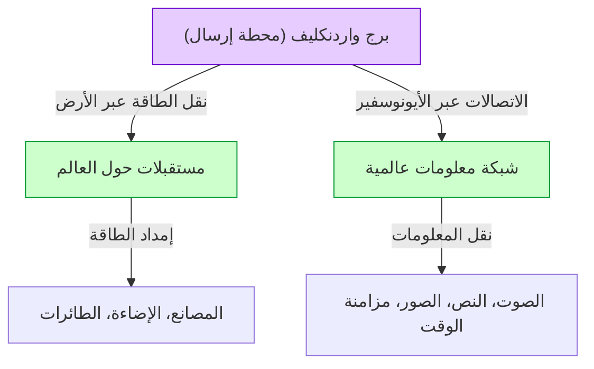

# نيكولا تسلا: المستقبل الذي رسمه التيار المتردد والنظام العالمي

نيكولا تسلا (1856 - 1943) هو أحد أعظم المخترعين وأكثرهم غموضاً وسحراً في تاريخ البشرية. أصبح نظام التيار المتردد (AC) الذي طوره الأساس لشبكات الطاقة الحديثة، وأرسى الأساس للحياة الغنية التي نتمتع بها كل يوم. لكن إنجازاته لا تتوقف عند هذا الحد. فقد كانت لديه رؤية سابقة لعصرها بكثير، شملت تقنيات رائدة في الاتصالات اللاسلكية، والتحكم عن بعد، وعلم الروبوتات، وحتى "النظام اللاسلكي العالمي" (World Wireless System) الذي كان يهدف إلى ربط الأرض بأكملها في شبكة ضخمة واحدة للطاقة والمعلومات.

في هذا المقال، سنتتبع حياة هذا المخترع العبقري ونقدم شرحاً وتحليلاً مفصلاً من آلاف الكلمات حول "حرب التيارات" الشرسة مع توماس إديسون، بالإضافة إلى حلمه الأكبر وأكبر انتكاسة له، "برج واردنكليف" و"النظام العالمي".

## 1. الطفولة والموهبة الفطرية

ولد نيكولا تسلا في 10 يوليو 1856 في قرية سميليان في الإمبراطورية النمساوية (كرواتيا حالياً)، لأب يُدعى ميلوتين، وهو كاهن في الكنيسة الصربية الأرثوذكسية، وأم تُدعى دوكا كانت تمتلك موهبة في صنع أدوات منزلية مفيدة. صرح تسلا لاحقاً أنه ورث موهبة الاختراع من والدته.

منذ صغره، امتلك تسلا ذاكرة استثنائية (ذاكرة فوتوغرافية) ومخيلة غير عادية مكنته من بناء الآلات بالكامل في ذهنه وتشغيلها. يُقال إنه كان قادراً على تجميع المحركات في دماغه ومحاكاة تآكل الأجزاء دون الحاجة إلى رسم المخططات على الورق. هذه القدرة الفريدة كانت القوة الدافعة وراء العديد من اختراعاته الثورية اللاحقة.

أثناء دراسته في جامعة التكنولوجيا في غراتس، واجه تسلا دينامو غرام (مولد تيار مستمر). عندما رأى الشرر المتولد من المُبَدِّل (Commutator)، أدرك أن هذا يمثل إهداراً للطاقة ويقلل من عمر الآلة. وهنا، جاءه الإلهام: "أليس من الممكن بناء محرك لا يحتاج إلى مبدل ويمكنه استخدام التيار المتردد كما هو؟". على الرغم من أن أستاذه رفض الفكرة قائلاً "إن هذا يشبه بناء آلة ذات حركة دائمة وهو أمر مستحيل"، إلا أن تسلا لم يستسلم.

بعد بضع سنوات، بينما كان يتنزه في حديقة في بودابست مع صديق ويتلو قصيدة "فاوست" لغوته، ومض إلهام "المجال المغناطيسي الدوار" فجأة في ذهنه. مستخدماً عصاه لرسم رسم تخطيطي على الأرض، أظهر لصديقه المبدأ الكامل لمحرك التيار المتردد وشرحه له. كانت هذه البداية الحقيقية لنظام التيار المتردد الذي سيغير العالم.

## 2. السفر إلى أمريكا ولقاء إديسون

في عام 1884، سافر تسلا إلى نيويورك في أمريكا بقلب مليء بالأحلام والآمال، وفي جيبه القليل من المال، ورسالة توصية، وقصائد من تأليفه، وحسابات تتعلق بآلات طيران. كانت رسالة التوصية من تشارلز باتشيلور، مدير الفرع الأوروبي لشركة إديسون، وكُتب فيها: "أعرف رجلين عظيمين. أحدهما أنت (إديسون)، والآخر هو هذا الشاب".

بدأ تسلا العمل فوراً في شركة توماس إديسون (Edison Machine Works). في ذلك الوقت، كان إديسون يسعى جاهداً لتسويق المصباح المتوهج وبناء نظام إمداد طاقة يعمل بالتيار المستمر (DC) في نيويورك. ومع ذلك، كان نظام التيار المستمر يعاني من عيب قاتل؛ نظراً لصعوبة تحويل الجهد، لم يكن من الممكن نقل الكهرباء لمسافات طويلة من محطة توليد الطاقة، مما تطلب بناء محطة توليد طاقة كل بضعة كيلومترات.

قام تسلا بتحسين تصميم مولد التيار المستمر الخاص بإديسون بشكل كبير، مما زاد من كفاءته بشكل هائل. وفقاً لمذكرات تسلا، وعده إديسون قائلاً: "إذا نجحت في هذا التحسين، فسأدفع لك 50,000 دولار". عمل تسلا ليلاً ونهاراً لعدة أشهر ونجح في حل هذه المشكلة الصعبة. ولكن عندما طلب المكافأة الموعودة، ضحك إديسون قائلاً: "تسلا، يبدو أنك لا تفهم المزاح الأمريكي"، وعرض عليه زيادة طفيفة في راتبه فقط.

شعر تسلا بخيبة أمل عميقة من هذه المعاملة واستقال فوراً من شركة إديسون. ولفترة من الوقت بعد ذلك، عاش حياة قاسية، حيث كان يعمل كعامل حفر خنادق باليومية لتأمين لقمة عيشه. ومع ذلك، حتى أثناء عمله في حفر الخنادق، استمر في تطوير أفكاره لنظام جديد للتيار المتردد.

## 3. حرب التيارات: التيار المتردد (AC) مقابل التيار المستمر (DC)

بدعم من المستثمرين الذين أدركوا موهبة تسلا، أسس أخيراً شركته الخاصة وبدأ في تطوير نظام التيار المتردد بشكل جدي. وهنا كان له لقاء مصيري مع رجل الأعمال جورج ويستينغهاوس. أدرك ويستينغهاوس إمكانات نظام التيار المتردد الخاص بتسلا، واشترى براءات اختراعه، وبدأا العمل معاً لتوسيع الأعمال.

وبهذا اندلعت "حرب التيارات" (War of the Currents) التاريخية.

- **معسكر إديسون (التيار المستمر DC)**: كان قد استثمر بالفعل مبالغ كبيرة وبدأ في بناء البنية التحتية. كان آمناً بجهد منخفض، لكن من المستحيل نقله لمسافات طويلة.
- **معسكر تسلا وويستينغهاوس (التيار المتردد AC)**: باستخدام المحولات، يمكن نقله لمسافات طويلة بجهد عالٍ، وتحويله إلى جهد منخفض في موقع الاستخدام. كان أكثر كفاءة واقتصادية بكثير.

لحماية أعماله، أطلق إديسون حملة سلبية للترويج لمخاطر التيار المتردد. لم يتورع عن القيام بأي شيء، فقام بإجراء تجارب عامة لصعق الكلاب والخيول الضالة بالتيار المتردد، وعمل في الخفاء لاستخدام التيار المتردد في أول إعدام بالكرسي الكهربائي في العالم.

ومع ذلك، كان التفوق التقني والاقتصادي واضحاً. يوضح الرسم البياني التالي بشكل مفاهيمي الاختلافات بين نظام التيار المستمر ونظام التيار المتردد.

كان هناك حدثان حاسمان حسما المعركة.
الأول كان المعرض الكولومبي العالمي في شيكاغو عام 1893. فازت شركة ويستينغهاوس بعقد الإضاءة بعرض سعر أقل من معسكر إديسون (شركة جنرال إلكتريك). إن إضاءة عشرات الآلاف من المصابيح الكهربائية بأمان وبشكل مذهل باستخدام نظام تسلا جعلت العالم بأسره يشهد روعة نظام التيار المتردد.

والثاني كان مشروع بناء أول محطة ضخمة لتوليد الطاقة الكهرومائية في العالم في شلالات نياجرا. اختارت اللجنة الدولية (برئاسة اللورد كلفن) في النهاية نظام التيار المتردد الخاص بتسلا. في عام 1896، تم نقل الكهرباء المولدة في شلالات نياجرا إلى مدينة بافلو التي تبعد حوالي 35 كيلومتراً، لتضيء المدينة. في تلك اللحظة، تأكد أن نظام التيار المتردد سيصبح المعيار القياسي للبنية التحتية للطاقة في العالم.

## 4. التجارب في كولورادو سبرينغز

بعد النجاح الكبير الذي حققه نظام التيار المتردد، خطى تسلا إلى منطقة مجهولة أخرى: "نقل الطاقة اللاسلكي". لقد كانت فكرة جريئة لاستخدام الأرض بأكملها كموصل، لإرسال الطاقة والمعلومات إلى أي مكان في العالم دون استخدام الأسلاك.

في عام 1899، قام ببناء مختبر في كولورادو سبرينغز بولاية كولورادو لدراسة الخصائص الكهربائية للغلاف الجوي. هنا، كرر التجارب لتوليد برق اصطناعي باستخدام "ملف تسلا" الضخم الذي يولد جهداً عالياً للغاية يصل إلى ملايين الفولتات.

ادعى تسلا أنه اكتشف "الموجات الأرضية الثابتة" (Earth Stationary Waves) هنا. وهذه ظاهرة يتردد فيها صدى الأرض بأكملها مع تذبذبات كهربائية بتردد معين، واعتقد أنه باستخدام هذا المبدأ، يمكن إرسال الطاقة إلى مستقبل على الجانب الآخر من الأرض دون فقدان أي طاقة. أصبحت البيانات التجريبية في كولورادو سبرينغز الأساس لمشروعه الكبير التالي.

## 5. تبلور الحلم والانتكاسة: برج واردنكليف و"النظام العالمي"

في عام 1901، بدأ تسلا بناء "برج واردنكليف" (Wardenclyffe Tower) في لونغ آيلاند، نيويورك. كان الممول هو جي بي مورغان، وهو أحد عمالقة القطاع المالي في ذلك الوقت.

لم يقتصر "النظام العالمي" (World Wireless System) الخاص بتسلا على الاتصالات اللاسلكية فقط. وفقاً لرؤيته، كان من المفترض تحقيق الوظائف التالية.

- **شبكة اتصالات عالمية**: يمكنك إرسال واستقبال أسعار الأسهم والأخبار والرسائل الصوتية الشخصية على الفور بغض النظر عن مكان وجودك في العالم.
- **طاقة لاسلكية لا تنضب**: إذا كان لديك هوائي صغير، يمكنك استقبال الطاقة وتشغيل المحركات والإضاءة بغض النظر عن الموقع.
- **مزامنة الوقت والملاحة**: مزامنة الساعات حول العالم بدقة عالية للغاية، مما يسمح للسفن بمعرفة مواقعها بدقة.

لقد كانت رؤية مذهلة تنبأت بالـ "إنترنت" و"الهواتف الذكية" و"نظام تحديد المواقع العالمي (GPS)" و"الشحن اللاسلكي" الحديث قبل 100 عام من ظهورها.

ومع ذلك، سرعان ما واجه المشروع صعوبات. استخدم غولييلمو ماركوني براءات اختراع تسلا (مثل براءات اختراع الدوائر المضبوطة المتعددة) دون إذن، ونجح في الاتصال اللاسلكي عبر المحيط الأطلسي، مما جذب انتباه العالم. بينما كان نظام ماركوني بسيطاً ومنخفض التكلفة، كان برج تسلا معقداً ويتطلب تمويلاً هائلاً.

طلب تسلا من جي بي مورغان المزيد من الدعم المالي، وهنا كشف لأول مرة أن "الهدف الحقيقي للبرج ليس الاتصالات فحسب، بل أيضاً النقل المجاني للطاقة". ومع ذلك، عندما سمع مورغان هذا، أوقف دعمه المالي. لقد فكر قائلاً: "من سيقرأ عداد الطاقة؟ (لا يمكن جني أي أرباح من الطاقة المجانية)".

بعد نفاد الأموال، لم يتمكن تسلا من إكمال البرج، وفي عام 1917 أثناء الحرب العالمية الأولى، فجرت الحكومة الأمريكية البرج وفككته. كان هذا الفشل أكبر مأساة في حياة تسلا، وجعله يعاني من يأس عميق.

## 6. السنوات اللاحقة والإرث

حتى بعد فشل برج واردنكليف، استمر تسلا في اختراعاته. من بينها التوربين الخالي من الشفرات (توربين تسلا)، ومفهوم طائرة الإقلاع والهبوط العمودي (VTOL)، وفكرة "شعاع الموت" (Teleforce) المثيرة للجدل. ومع ذلك، لم تتحقق العديد من أفكاره بسبب نقص التمويل.

في سنواته الأخيرة، عاش تسلا حياة منعزلة في الغرفة رقم 3327 في فندق نيو يوركر في نيويورك. كان يحب الحمام بشدة، وجعل من إطعام الحمام في الحديقة روتيناً يومياً له. في 7 يناير 1943، وافته المنية عن عمر يناهز 86 عاماً. بعد وفاته، صادر مكتب التحقيقات الفيدرالي (FBI) مذكراته وأوراقه (وتم إعادة بعضها لاحقاً إلى أقاربه).

## 7. خاتمة

كان نيكولا تسلا شخصاً يعطي الأولوية لـ "تقدم البشرية" على مصالحه الخاصة. لقد أنقذ شركة ويستينغهاوس من الإفلاس حتى لو تطلب الأمر إلغاء العقد، وتخلى عن الثروة الهائلة التي كان ينبغي أن يحصل عليها من براءات اختراعه.

على الرغم من أن "نظامه العالمي" ظل غير مكتمل، إلا أن الرؤية الكامنة وراءه ── فكرة "ربط العالم من خلال التكنولوجيا وإثراء حياة الناس" ── قد تحققت بشكل مختلف كمجتمع الإنترنت الحديث.

من أقوال تسلا:
*"قد يكون الحاضر ملكاً لهم، لكن المستقبل، الذي عملت بجد من أجله، هو ملكي."*

اليوم، عندما نقوم بتشغيل المفتاح لتضيء الكهرباء، أو نصل إلى المعلومات من جميع أنحاء العالم عبر هواتفنا الذكية، فذلك لأننا نعيش جزءاً من المستقبل الذي تصوره. سيبقى اسم نيكولا تسلا محفوراً في التاريخ إلى الأبد كـ "الرجل الذي اخترع المستقبل".
