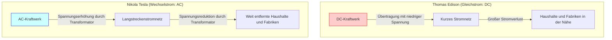
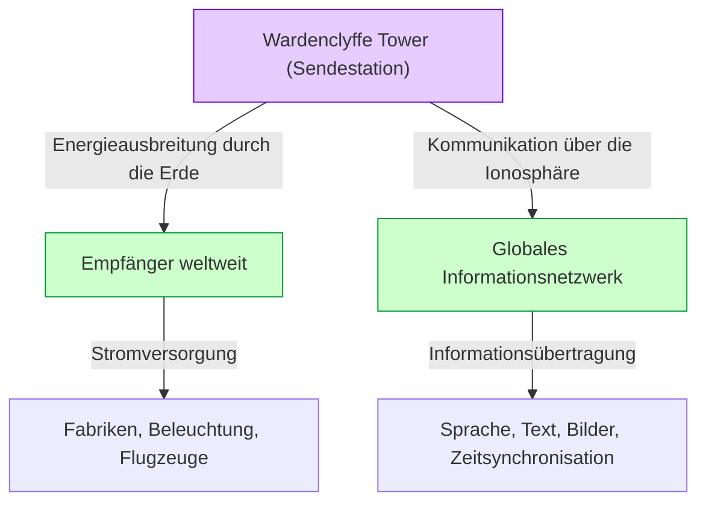

# Nikola Tesla: Die Zukunft, gezeichnet von Wechselstrom und dem Weltsystem

Nikola Tesla (1856 - 1943) ist einer der größten und geheimnisvollsten Erfinder der Menschheitsgeschichte. Das von ihm entwickelte Wechselstromsystem (AC) bildete die Grundlage des modernen Stromnetzes und schuf die Basis für das reiche Leben, das wir heute genießen. Doch seine Verdienste beschränken sich nicht darauf. Er hatte noch visionärere Ideen für seine Zeit, wie Technologien für drahtlose Kommunikation, Fernsteuerung, die Anfänge der Robotik und sogar das "Weltsystem" (World Wireless System), das die gesamte Erde in einem gigantischen Energie- und Informationsnetzwerk verbinden sollte.

In diesem Artikel werden wir das Leben dieses genialen Erfinders nachverfolgen und den erbitterten "Stromkrieg", der mit Thomas Edison geführt wurde, sowie seinen größten Traum und größten Rückschlag, den "Wardenclyffe Tower" und das "Weltsystem", mit ausführlichen Erklärungen und Überlegungen detailliert untersuchen.

## 1. Kindheit und naturgegebenes Talent

Nikola Tesla wurde am 10. Juli 1856 in dem Dorf Smiljan im Kaisertum Österreich (heute Kroatien) geboren. Sein Vater Milutin war ein Priester der serbisch-orthodoxen Kirche, und seine Mutter Đuka besaß das Talent, praktische Haushaltsgeräte selbst herzustellen. Tesla selbst sagte später, dass er sein Erfindertalent von seiner Mutter geerbt habe.

Schon in jungen Jahren besaß Tesla ein bemerkenswertes Gedächtnis (fotografisches Gedächtnis) und eine außergewöhnliche Vorstellungskraft, die es ihm ermöglichte, Maschinen im Kopf vollständig zusammenzubauen und in Betrieb zu nehmen. Es wird gesagt, dass er Motoren in seinem Kopf zusammenbauen und sogar den Verschleiß der Teile simulieren konnte, ohne jemals einen Bauplan auf Papier zu zeichnen. Diese besondere Fähigkeit war die treibende Kraft für seine späteren bahnbrechenden Erfindungen.

Während seines Studiums an der Technischen Universität in Graz stieß Tesla auf den Gramme-Dynamo (einen Gleichstromgenerator). Er beobachtete die Funken, die vom Kommutator erzeugt wurden, und erkannte, dass dies eine Energieverschwendung war und die Lebensdauer der Maschine verkürzte. Hier hatte er die Intuition: "Könnte man nicht einen Motor bauen, der keinen Kommutator benötigt und Wechselstrom direkt nutzt?" Sein Professor verwarf dies als unmöglich, als wolle er ein Perpetuum mobile bauen, aber Tesla gab nicht auf.

Einige Jahre später, als er mit einem Freund in einem Park in Budapest spazieren ging und Goethes *Faust* rezitierte, kam ihm plötzlich die Inspiration für das "Drehmagnetfeld". Er zeichnete mit seinem Stock ein Diagramm in den Boden und erklärte seinem Freund das vollständige Prinzip des Wechselstrommotors. Dies war der wahre Beginn des Wechselstromsystems, das die Welt verändern sollte.

## 2. Reise nach Amerika und Begegnung mit Edison

Im Jahr 1884 reiste Tesla mit wenig Geld, einem Empfehlungsschreiben und einigen seiner eigenen Gedichte sowie Berechnungen über Flugmaschinen in der Tasche nach New York, USA, voller Träume und Hoffnungen. Das Empfehlungsschreiben stammte von Charles Batchelor, dem Leiter der europäischen Niederlassung von Edison, und darin stand: "Ich kenne zwei große Männer. Einer sind Sie (Edison), und der andere ist dieser junge Mann."

Tesla begann bald, für Thomas Edisons Firma (Edison Machine Works) zu arbeiten. Edison kämpfte damals darum, die Glühbirne zu kommerzialisieren und ein auf Gleichstrom (DC) basierendes Stromnetz in New York aufzubauen. Das Gleichstromsystem hatte jedoch einen fatalen Fehler. Da die Spannung nur schwer umgewandelt werden konnte, konnte der Strom nicht über weite Strecken vom Kraftwerk übertragen werden, und es mussten alle paar Kilometer Kraftwerke gebaut werden.

Tesla verbesserte das Design von Edisons Gleichstromgeneratoren erheblich und steigerte deren Effizienz drastisch. Laut Teslas Erinnerungen versprach Edison ihm: "Wenn du mit dieser Verbesserung erfolgreich bist, werde ich dir 50.000 Dollar zahlen." Tesla arbeitete monatelang ohne Schlaf und Pause und löste diese schwierige Aufgabe meisterhaft. Als Tesla jedoch die versprochene Belohnung forderte, lachte Edison dies ab und sagte: "Tesla, Sie scheinen den amerikanischen Humor nicht zu verstehen", und bot ihm lediglich eine kleine Gehaltserhöhung an.

Zutiefst enttäuscht von dieser Behandlung kündigte Tesla sofort bei Edisons Firma. Für eine Weile danach erlebte er ein Leben in tiefster Armut und hielt sich als Tagelöhner beim Graben von Gräben über Wasser. Aber auch während dieser Arbeit dachte er weiter über sein neues Wechselstromsystem nach.

## 3. Der Stromkrieg: Wechselstrom (AC) vs Gleichstrom (DC)

Mit der Unterstützung von Investoren, die Teslas Talent schätzten, gründete Tesla schließlich sein eigenes Unternehmen und begann ernsthaft mit der Entwicklung seines Wechselstromsystems. Hier kam es zu einer schicksalhaften Begegnung mit dem Geschäftsmann George Westinghouse. Westinghouse erkannte das Potenzial von Teslas Wechselstromsystem, kaufte seine Patente auf und begann, das Geschäft gemeinsam mit ihm auszubauen.

Hier entbrannte der historische "Stromkrieg" (War of the Currents).

- **Edison-Lager (Gleichstrom, DC)**: Hatte bereits große Investitionen getätigt und mit dem Aufbau einer Infrastruktur begonnen. Niedrige Spannung und sicher, aber Übertragung über weite Strecken unmöglich.
- **Tesla & Westinghouse-Lager (Wechselstrom, AC)**: Konnte mit Transformatoren bei hoher Spannung über große Entfernungen übertragen und am Einsatzort auf niedrige Spannung transformiert werden. Weit effizienter und wirtschaftlicher.

Um sein Geschäft zu schützen, startete Edison eine negative Kampagne, um die Gefahren des Wechselstroms zu betonen. Er schreckte vor keinen Mitteln zurück und führte öffentliche Experimente durch, bei denen er streunende Hunde und Pferde mit Wechselstrom durch Stromschlag tötete, und arbeitete sogar hinter den Kulissen daran, sicherzustellen, dass die weltweit erste Hinrichtung auf dem elektrischen Stuhl mit Wechselstrom durchgeführt wurde.

Dennoch waren die technischen und wirtschaftlichen Vorteile offensichtlich. Das folgende Diagramm veranschaulicht konzeptionell die Unterschiede zwischen dem Gleichstromsystem und dem Wechselstromsystem.

Zwei entscheidende Ereignisse entschieden den Ausgang.
Erstens die Weltausstellung 1893 in Chicago. Das Unternehmen Westinghouse erhielt den Zuschlag für die Beleuchtung zu einem günstigeren Angebot als das Edison-Lager (General Electric). Als Teslas System Zehntausende von Glühbirnen sicher und spektakulär beleuchtete, konnten die Menschen auf der ganzen Welt die Großartigkeit des Wechselstromsystems mit eigenen Augen sehen.

Zweitens das Projekt zum Bau des weltweit ersten riesigen Wasserkraftwerks an den Niagarafällen. Ein internationales Komitee (unter dem Vorsitz von Lord Kelvin) entschied sich letztendlich für Teslas Wechselstromsystem. Im Jahr 1896 wurde der an den Niagarafällen erzeugte Strom in die etwa 35 Kilometer entfernte Stadt Buffalo übertragen und erleuchtete die Stadt. In diesem Moment stand fest, dass das Wechselstromsystem der Standard für die weltweite Energieinfrastruktur werden würde.

## 4. Experimente in Colorado Springs

Nach dem großen Erfolg mit dem Wechselstromsystem betrat Tesla ein weiteres unbekanntes Gebiet: die "drahtlose Energieübertragung". Es war die ungeheuerliche Idee, die gesamte Erde als Leiter zu nutzen und Energie und Informationen ohne Kabel an jeden Ort der Welt zu senden.

1899 baute er in Colorado Springs im Bundesstaat Colorado ein Labor, um die elektrischen Eigenschaften der Atmosphäre zu untersuchen. Hier nutzte er riesige "Tesla-Spulen", die extrem hohe Spannungen von mehreren Millionen Volt erzeugten, und wiederholte Experimente zur Erzeugung künstlicher Blitze.

Tesla behauptete, hier erdstationäre Wellen (Earth Stationary Waves) entdeckt zu haben. Dies ist ein Phänomen, bei dem die gesamte Erde mit einer bestimmten Frequenz elektrischer Schwingungen in Resonanz tritt. Er glaubte, dass durch die Nutzung dieses Prinzips Energie ohne Abschwächung an einen Empfänger auf der anderen Seite der Erde gesendet werden könne. Die experimentellen Daten in Colorado Springs bildeten die Grundlage für sein nächstes großes Projekt.

## 5. Kristallisation eines Traums und Rückschlag: Wardenclyffe Tower und das "Weltsystem"

1901 begann Tesla mit dem Bau des "Wardenclyffe Tower" auf Long Island in New York. Die Finanzierung wurde von J.P. Morgan, einem Magnaten der damaligen Finanzwelt, bereitgestellt.

Teslas "Weltsystem" (World Wireless System) beschränkte sich nicht nur auf die drahtlose Kommunikation. Nach seinen Vorstellungen sollten folgende Funktionen realisiert werden:

- **Globales Kommunikationsnetzwerk**: Aktienkurse, Nachrichten und persönliche Sprachnachrichten können von überall auf der Welt sofort gesendet und empfangen werden.
- **Unerschöpfliche drahtlose Energie**: Jeder mit einer kleinen Antenne kann unabhängig vom Standort Strom empfangen, um Motoren und Lichter zu betreiben.
- **Zeitsynchronisation und Navigation**: Uhren auf der ganzen Welt könnten mit extrem hoher Präzision synchronisiert werden, sodass Schiffe ihren aktuellen Standort genau bestimmen könnten.

Dies war eine erstaunliche Vision, die das moderne "Internet", "Smartphones", "GPS" und "drahtlose Energieübertragung" schon vor 100 Jahren vorwegnahm.

Das Projekt stieß jedoch bald auf Schwierigkeiten. Guglielmo Marconi nutzte Teslas Patente (einschließlich Patente für mehrere Abstimmkreise) ohne Erlaubnis, um erfolgreich drahtlos über den Atlantik zu kommunizieren, und erlangte weltweite Aufmerksamkeit. Marconis System war einfach und billig, während Teslas Turm komplex war und enorme Geldmittel erforderte.

Tesla bat J.P. Morgan um weitere finanzielle Unterstützung und enthüllte hier zum ersten Mal: "Der wahre Zweck des Turms ist nicht nur die Kommunikation, sondern die kostenlose Übertragung von Energie." Als Morgan dies hörte, stellte er jedoch die Finanzierung ein. Er dachte: "Wer wird die Energiezähler ablesen? (Aus kostenloser Energie lässt sich kein Gewinn erzielen.)"

Da die Mittel erschöpft waren, konnte Tesla den Turm nicht fertigstellen, und während des Ersten Weltkriegs im Jahr 1917 wurde der Turm von der US-Regierung gesprengt und abgebaut. Dieses Scheitern war die größte Tragödie in Teslas Leben, und er erlebte tiefe Verzweiflung.

## 6. Spätere Jahre und Vermächtnis

Auch nach dem Scheitern des Wardenclyffe Towers erfand Tesla weiter. Dazu gehörten die schaufellose Turbine (Tesla-Turbine), das Konzept von VTOL-Flugzeugen (Vertical Take-Off and Landing) und die kontroverse Idee des "Todesstrahls" (Teleforce). Viele seiner Ideen wurden jedoch aufgrund von Geldmangel nie verwirklicht.

In seinen späteren Jahren führte Tesla ein einsames Leben in Zimmer 3327 des New Yorker Hotels in New York City. Er liebte Tauben zutiefst und machte es sich zur täglichen Gewohnheit, Tauben im Park zu füttern. Und am 7. Januar 1943 starb er im Alter von 86 Jahren. Nach seinem Tod beschlagnahmte das FBI seine Notizbücher und Papiere (einige wurden später an seine Verwandten zurückgegeben).

## 7. Fazit

Nikola Tesla war ein Mann, der den "Fortschritt der Menschheit" über seinen eigenen Profit stellte. Er brach sogar einen Vertrag, um Westinghouse vor dem Bankrott zu retten, und gab den enormen Reichtum auf, den er aus seinen Patenten hätte erzielen können.

Sein "Weltsystem" blieb unvollendet, aber die ihm zugrunde liegende Vision – die Idee, "die Welt durch Technologie zu verbinden und das Leben der Menschen zu bereichern" – hat sich in Form der modernen Internetgesellschaft verwirklicht.

Eines von Teslas Zitaten lautet:
*"Die Gegenwart mag ihnen gehören. Aber die Zukunft, für die ich wirklich gearbeitet habe, gehört mir."*

Dass wir heute beim Umlegen eines Schalters Licht haben und mit Smartphones auf Informationen aus der ganzen Welt zugreifen können, liegt ganz einfach daran, dass wir einen Teil der von ihm erdachten Zukunft leben. Nikola Tesla wird als "der Mann, der die Zukunft erfunden hat", für immer in der Geschichte stehen.
