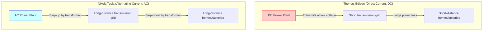
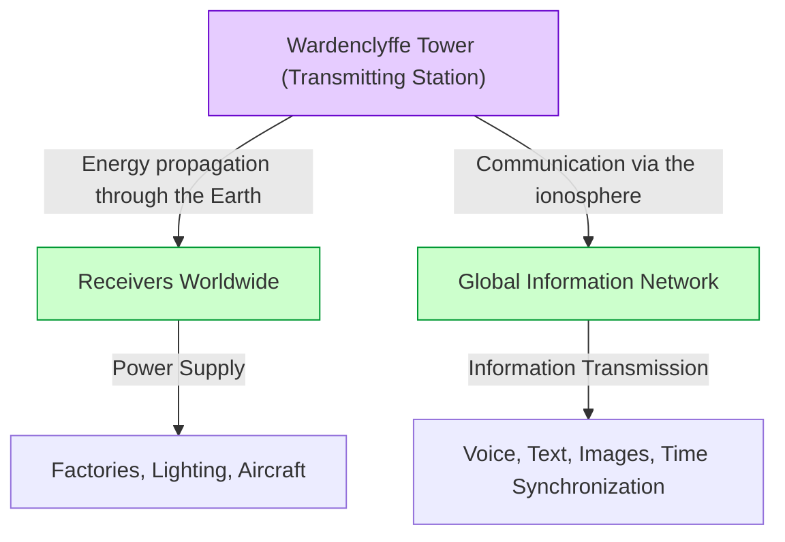

# Nikola Tesla: The Future Envisioned by Alternating Current and the World System

Nikola Tesla (1856 - 1943) is one of the greatest and most mysteriously fascinating inventors in human history. The alternating current (AC) system he developed became the foundation of the modern power grid, building the basis for the rich lives we enjoy daily. However, his achievements did not stop there. He harbored concepts that were far too visionary for his time, such as technologies pioneering wireless communication, remote control, robotics, and even the "World Wireless System," which aimed to connect the entire Earth into a single massive network of energy and information.

In this article, we trace the life of this genius inventor, providing a detailed explanation and analysis over thousands of words of the fierce "War of the Currents" fought with Thomas Edison, and the full picture of the "Wardenclyffe Tower" and the "World System," which were his greatest dreams and his greatest setbacks.

## 1. Childhood and Innate Talent

Nikola Tesla was born on July 10, 1856, in the village of Smiljan in the Austrian Empire (now Croatia), to Milutin, a Serbian Orthodox priest, and Đuka, a mother who had a talent for making handy household tools. Tesla himself later stated that he inherited his talent for invention from his mother.

From a young age, Tesla possessed an astonishing photographic memory and an extraordinary imagination that allowed him to completely build and operate machines in his head. It is said that without drawing a single blueprint on paper, he could assemble a motor in his mind and simulate the wear and tear of its parts. This unique ability became the driving force behind the creation of his numerous groundbreaking inventions later on.

While studying at the Graz University of Technology, Tesla encountered the Gramme dynamo (a direct current generator). Upon seeing the sparks generated from the commutator, he realized this was a waste of energy and was shortening the machine's lifespan. Here, he had the intuition: "Could I not make a motor that does not require a commutator and can use alternating current directly?" A professor dismissed this, saying, "That is like making a perpetual motion machine and is impossible," but Tesla did not give up.

Years later, while reciting Goethe's *Faust* during a walk in a Budapest park with a friend, the inspiration for the "rotating magnetic field" suddenly flashed in his mind. Drawing a diagram on the ground with a stick, he showed and explained the complete principle of the AC motor to his friend. This was the true dawn of the AC system that would change the world.

## 2. Journey to America and Encounter with Edison

In 1884, Tesla sailed to New York, America, full of dreams and hopes, with only a little money, a letter of recommendation, and his own poems and calculations regarding aircraft in his pocket. The letter of recommendation was from Charles Batchelor, the manager of Edison's European subsidiary, and it read: "I know two great men and you are one of them; the other is this young man."

Tesla soon began working at Thomas Edison's company (Edison Machine Works). At the time, Edison was struggling to commercialize the incandescent light bulb and build a direct current (DC) power supply system in New York. However, the DC system had a fatal flaw. Because it was difficult to change voltages, power could not be transmitted to places far from the power plant, requiring power plants to be built every few kilometers.

Tesla significantly improved the design of Edison's DC generators, drastically increasing their efficiency. According to Tesla's recollection, Edison promised him, "There's fifty thousand dollars in it for you—if you can do it." Tesla worked without sleep or rest for months and successfully solved this difficult problem. However, when Tesla asked for the promised reward, Edison laughed it off, saying, "Tesla, you don't understand our American humor," and offered him only a small salary raise.

Deeply disappointed by this treatment, Tesla immediately resigned from Edison's company. For a time afterward, he experienced a rock-bottom life, surviving by doing day labor digging ditches. However, even while digging ditches, he continued to refine his ideas for a new AC system.

## 3. War of the Currents: Alternating Current (AC) vs Direct Current (DC)

Supported by investors who recognized his talent, Tesla finally founded his own company and began developing his AC system in earnest. Here, he had a fateful encounter with industrialist George Westinghouse. Westinghouse saw the potential of Tesla's AC system, bought his patents, and began developing a business together.

This sparked the historically famous "War of the Currents."

- **Edison Faction (Direct Current, DC)**: Had already invested heavily and begun building infrastructure. Low voltage and safe, but long-distance transmission was impossible.
- **Tesla & Westinghouse Faction (Alternating Current, AC)**: Could transmit power over long distances at high voltages using transformers, and convert it to low voltages at the point of use. Much more efficient and economical.

To protect his business, Edison launched a negative campaign emphasizing the dangers of alternating current. He resorted to any means necessary, conducting public experiments to electrocute stray dogs and horses with AC, and even working behind the scenes to ensure AC was used in the world's first execution by electric chair.

However, the technical and economic superiority was clear. The diagram below conceptually shows the difference between the DC and AC systems.

There were two decisive events that decided the outcome.
The first was the Chicago World's Fair in 1893. The Westinghouse Company won the contract for lighting with a lower bid than the Edison faction (General Electric). By safely and spectacularly lighting up tens of thousands of light bulbs, Tesla's system allowed people around the world to witness the magnificence of the AC system.

The second was the project to build the world's first massive hydroelectric power plant at Niagara Falls. An international commission (chaired by Lord Kelvin) ultimately adopted Tesla's AC system. In 1896, power generated at Niagara Falls was transmitted to the city of Buffalo, about 35 kilometers away, brightly illuminating the city. At this moment, it was confirmed that the AC system would become the standard for global energy infrastructure.

## 4. Experiments in Colorado Springs

After his great success with the AC system, Tesla stepped into further uncharted territory: "wireless power transmission." This was an absurd concept to use the entire Earth as a conductor to transmit energy and information anywhere in the world without wires.

In 1899, he built a laboratory in Colorado Springs, Colorado, to study the electrical properties of the atmosphere. Here, he used a massive "Tesla Coil" that generated millions of volts of ultra-high voltage to repeatedly conduct experiments creating artificial lightning.

Tesla claimed to have discovered Earth Stationary Waves here. This is a phenomenon where the entire Earth resonates with electrical vibrations of specific frequencies, and he believed that by utilizing this principle, he could send energy to a receiver on the opposite side of the Earth without attenuation. The experimental data from Colorado Springs became the foundation for his next grand project.

## 5. The Crystalization and Failure of a Dream: Wardenclyffe Tower and the "World System"

In 1901, Tesla began construction of the "Wardenclyffe Tower" on Long Island, New York. The funding was provided by J.P. Morgan, a titan of the financial world at the time.

Tesla's "World Wireless System" was not limited to mere wireless communication. According to his vision, it was supposed to realize the following functions:

- **Global Communication Network**: Instantly send and receive stock quotes, news, and personal voice messages anywhere in the world.
- **Inexhaustible Wireless Power**: With a small antenna, one could receive power and operate motors and lights regardless of location.
- **Time Synchronization and Navigation**: Synchronize clocks worldwide with extreme precision, allowing ships to accurately determine their current location.

This was an astonishing vision that foresaw modern "internet," "smartphones," "GPS," and "wireless charging" a century in advance.

However, the project quickly ran into difficulties. Guglielmo Marconi succeeded in transatlantic wireless communication using Tesla's patents (such as those for multiple tuning circuits) without permission, gaining global attention. While Marconi's system was simple and cheap, Tesla's tower was complex and required massive funds.

Tesla asked J.P. Morgan for further financial assistance, revealing here for the first time that "the true purpose of the tower is not only communication but the free transmission of energy." Hearing this, however, Morgan cut off the funding. He thought, "Who will read the energy meter? (No profit can be made from free energy)."

With his funds depleted, Tesla was unable to complete the tower, and in 1917, during World War I, the tower was blown up and dismantled by the US government. This failure was the greatest tragedy of Tesla's life, and he experienced deep despair.

## 6. Later Years and Legacy

Even after the failure of the Wardenclyffe Tower, Tesla continued to invent. These included the bladeless turbine (Tesla turbine), the concept of vertical take-off and landing aircraft (VTOL), and the controversial idea of a "death ray" (Teleforce). However, many of his ideas were never realized due to a lack of funds.

In his later years, Tesla lived a solitary life in Room 3327 of the New Yorker Hotel in New York. He deeply loved pigeons and made it his daily routine to feed them in the park. Then, on January 7, 1943, he passed away at the age of 86. After his death, the FBI confiscated his notebooks and papers (some were later returned to his relatives).

## 7. Conclusion

Nikola Tesla was a man who prioritized "the progress of humanity" over his own profit. He even tore up his contract to save the Westinghouse Company from bankruptcy, giving up the immense wealth he would have gained from his patents.

His "World System" remained unfinished, but the underlying vision—the philosophy of "connecting the world through technology and enriching people's lives"—has been realized in a different form as today's internet society.

Among Tesla's words is the following quote:
*"The present is theirs; the future, for which I really worked, is mine."*

Today, the fact that we can flip a switch and lights turn on, or access information worldwide with a smartphone, is nothing other than us living a part of the future he envisioned. Nikola Tesla will forever keep his name engraved in history as the "man who invented the future."
