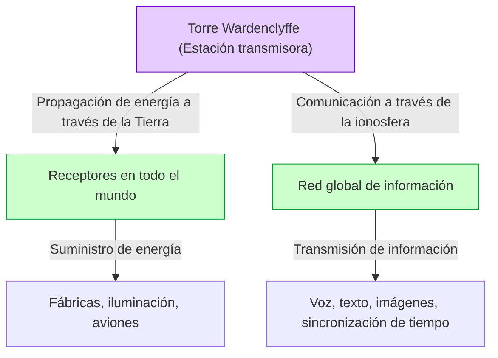

# Nikola Tesla: El futuro imaginado por la corriente alterna y el Sistema Mundial

Nikola Tesla (1856 - 1943) es uno de los inventores más grandes y envueltos en un encanto misterioso de la historia humana. El sistema de corriente alterna (CA) que desarrolló se convirtió en la base de las redes eléctricas modernas, estableciendo el fundamento de la vida rica que disfrutamos todos los días. Sin embargo, sus logros no terminan ahí. También fue pionero en tecnologías de comunicación inalámbrica, control remoto y robótica, e incluso albergó una visión demasiado adelantada a su tiempo: el "Sistema Inalámbrico Mundial" (World Wireless System), que pretendía conectar todo el planeta en una sola red gigantesca de energía e información.

En este artículo, seguiremos la vida de este genio inventor, profundizando a través de miles de palabras en una explicación y análisis detallado de la feroz "Guerra de las corrientes" librada contra Thomas Edison, así como la totalidad de su mayor sueño y mayor fracaso: la "Torre Wardenclyffe" y el "Sistema Mundial".

## 1. Infancia y talento innato

Nikola Tesla nació el 10 de julio de 1856 en el pueblo de Smiljan en el Imperio austríaco (actual Croacia), hijo de Milutin, un sacerdote ortodoxo serbio, y Đuka, una madre que tenía talento para fabricar convenientes herramientas caseras. El propio Tesla diría más tarde que heredó de su madre su talento para la invención.

Desde temprana edad, Tesla poseía una asombrosa memoria (memoria fotográfica) y una extraordinaria imaginación que le permitía construir mentalmente máquinas completas y hacerlas funcionar. Se dice que podía ensamblar motores en su cabeza y simular hasta el desgaste de los componentes sin necesidad de dibujar planos en papel. Esta habilidad peculiar fue la fuerza impulsora que más tarde produciría muchos de sus innovadores inventos.

Mientras estudiaba en la Universidad Tecnológica de Graz, Tesla conoció la dinamo de Gramme (un generador de corriente continua). Al ver las chispas generadas por el conmutador, se dio cuenta de que esto era un desperdicio de energía y acortaba la vida útil de la máquina. Aquí tuvo la intuición de que "sería posible construir un motor que utilice la corriente alterna directamente, sin necesidad de un conmutador". Aunque su profesor lo descartó diciendo que "eso sería como construir una máquina de movimiento perpetuo, es imposible", Tesla no se rindió.

Años más tarde, mientras caminaba por un parque en Budapest con un amigo recitando "Fausto" de Goethe, la inspiración de un "campo magnético rotativo" brilló repentinamente en su mente. Dibujando un diagrama en la tierra con su bastón, mostró y explicó a su amigo el principio completo del motor de corriente alterna. Este fue el verdadero comienzo del sistema de corriente alterna que cambiaría el mundo.

## 2. Viaje a América y el encuentro con Edison

En 1884, Tesla viajó a Nueva York, Estados Unidos, con el corazón lleno de sueños y esperanzas, llevando en el bolsillo solo un poco de dinero, una carta de recomendación y sus propios cálculos sobre aviones y poemas. La carta de recomendación era de Charles Batchelor, el gerente de la filial europea de Edison, y decía: "Conozco a dos grandes hombres. Uno eres tú (Edison), y el otro es este joven".

Tesla pronto comenzó a trabajar en la empresa de Thomas Edison (Edison Machine Works). En ese momento, Edison estaba luchando por comercializar la bombilla incandescente y construir un sistema de suministro de energía de corriente continua (CC) en Nueva York. Sin embargo, el sistema de corriente continua tenía un defecto fatal. Debido a la dificultad de transformar el voltaje, no se podía transmitir energía a lugares alejados de la central eléctrica, lo que requería construir una central cada pocos kilómetros.

Tesla mejoró significativamente el diseño de los generadores de corriente continua de Edison, aumentando drásticamente su eficiencia. Según recuerda Tesla, Edison prometió: "Si logras hacer estas mejoras, te pagaré 50.000 dólares". Tesla trabajó día y noche durante meses y resolvió maravillosamente esta difícil tarea. Sin embargo, cuando Tesla reclamó la recompensa prometida, Edison se rió diciendo: "Tesla, parece que no entiendes el humor estadounidense", y solo le ofreció un pequeño aumento de sueldo.

Profundamente decepcionado por este trato, Tesla renunció de inmediato a la empresa de Edison. Durante un tiempo después, experimentó el fondo de la miseria, trabajando como cavador de zanjas a jornal para ganarse la vida. Sin embargo, incluso durante este trabajo de cavar zanjas, continuó perfeccionando su visión para un nuevo sistema de corriente alterna.

## 3. Guerra de las Corrientes: Corriente Alterna (CA) vs Corriente Continua (CC)

Con el apoyo de inversores que valoraban su talento, Tesla finalmente fundó su propia empresa y comenzó en serio el desarrollo de su sistema de corriente alterna. Aquí tuvo un encuentro predestinado con el empresario George Westinghouse. Westinghouse vio el potencial del sistema de CA de Tesla, compró sus patentes y comenzaron a desarrollar el negocio juntos.

Aquí estalló la histórica "Guerra de las Corrientes" (War of the Currents).

- **Facción de Edison (Corriente Continua / CC)**: Ya había invertido grandes sumas de dinero y comenzado a construir infraestructura. Bajo voltaje y seguro, pero transmisión a larga distancia imposible.
- **Facción de Tesla y Westinghouse (Corriente Alterna / CA)**: Usando transformadores, puede transmitir electricidad a largas distancias a alto voltaje y convertirla a bajo voltaje en el punto de uso. Mucho más eficiente y económico.

Para proteger su negocio, Edison lanzó una campaña negativa para publicitar los peligros de la corriente alterna. No escatimó en medios, realizando experimentos públicos en los que electrocutaba a perros callejeros y caballos con corriente alterna, e incluso maniobrando detrás de escena para que se utilizara CA en la primera ejecución en la silla eléctrica del mundo.

Sin embargo, la superioridad técnica y económica era obvia. El siguiente diagrama conceptual ilustra la diferencia entre el sistema de CC y el sistema de CA.

```mermaid
graph TD
    subgraph "Thomas Edison (Corriente Continua: CC)"
        A["Planta de energía CC"] -- "Transmisión a bajo voltaje" --> B["Red de transmisión corta"]
        B -- "Alta pérdida de energía" --> C["Hogares y fábricas cercanos"]
        style A fill:#ffcccc,stroke:#ff0000
    end

    subgraph "Nikola Tesla (Corriente Alterna: CA)"
        D["Planta de energía CA"] -- "Alto voltaje con transformador" --> E["Red de transmisión de larga distancia"]
        E -- "Bajo voltaje con transformador" --> F["Hogares y fábricas distantes"]
        style D fill:#ccffff,stroke:#0000ff
    end
```

Hubo dos eventos decisivos que determinaron la victoria y la derrota.
El primero fue la Exposición Universal de Chicago de 1893. Westinghouse Corporation ganó el contrato de iluminación con una oferta de precio más baja que la facción de Edison (General Electric). El sistema de Tesla encendió decenas de miles de bombillas de manera segura y espectacular, permitiendo a la gente de todo el mundo presenciar la maravilla del sistema de corriente alterna.

El segundo fue el proyecto para construir la primera planta hidroeléctrica gigante del mundo en las Cataratas del Niágara. Un comité internacional (presidido por Lord Kelvin) finalmente adoptó el sistema de CA de Tesla. En 1896, la energía generada en las Cataratas del Niágara se transmitió a la ciudad de Buffalo, a unos 35 kilómetros de distancia, iluminando brillantemente la ciudad. En este momento, se confirmó que el sistema de corriente alterna se convertiría en el estándar de la infraestructura energética mundial.

## 4. Experimentos en Colorado Springs

Después de lograr un gran éxito con el sistema de corriente alterna, Tesla se adentró aún más en territorios desconocidos. La "transmisión inalámbrica de energía". Era una visión extraordinaria utilizar toda la Tierra como conductor y enviar energía e información a cualquier parte del mundo sin usar cables.

En 1899, construyó un laboratorio en Colorado Springs, Colorado, para estudiar las propiedades eléctricas de la atmósfera. Aquí, utilizó una "bobina de Tesla" gigante que generaba voltajes ultra altos de millones de voltios y repitió experimentos generando relámpagos artificiales.

Tesla afirmó haber descubierto las ondas estacionarias terrestres (Earth Stationary Waves) aquí. Este es un fenómeno en el que toda la Tierra resuena a vibraciones eléctricas de frecuencias específicas; pensaba que si utilizaba este principio, la energía podría enviarse a receptores en el otro lado del mundo sin atenuación. Los datos experimentales de Colorado Springs se convirtieron en la base de su próximo y gran proyecto.

## 5. La cristalización de un sueño y el fracaso: La Torre Wardenclyffe y el "Sistema Mundial"

En 1901, Tesla comenzó a construir la "Torre Wardenclyffe" (Wardenclyffe Tower) en Long Island, Nueva York. Los fondos fueron proporcionados por J.P. Morgan, un magnate del mundo financiero en ese momento.

El "Sistema Mundial" de Tesla (World Wireless System) iba mucho más allá de las simples comunicaciones inalámbricas. Según su visión, se realizarían funciones como las siguientes.

- **Red de comunicación global**: En cualquier parte del mundo, las cotizaciones bursátiles, las noticias y los mensajes de voz personales pueden enviarse y recibirse instantáneamente.
- **Energía inalámbrica inagotable**: Si tienes una antena pequeña, puedes recibir energía sin importar la ubicación y hacer funcionar motores o iluminación.
- **Sincronización horaria y navegación**: Sincroniza relojes en todo el mundo con extremada precisión, permitiendo a los barcos determinar su ubicación exacta.

Esta era una visión asombrosa que previó el "Internet", el "teléfono inteligente", el "GPS" y la "carga inalámbrica" modernos con 100 años de anticipación.

Sin embargo, el proyecto pronto se enfrentó a dificultades. Guglielmo Marconi utilizó patentes de Tesla sin permiso (como las patentes de circuitos de sintonización múltiple) para tener éxito en la comunicación inalámbrica transatlántica, atrayendo la atención mundial. Mientras que el sistema de Marconi era simple y económico, la torre de Tesla era compleja y requería enormes cantidades de dinero.

Tesla le pidió a J.P. Morgan más ayuda financiera, revelando por primera vez que "el verdadero propósito de la torre no es solo la comunicación, sino la transmisión gratuita de energía". Sin embargo, al escuchar esto, Morgan cortó su ayuda financiera. Pensó: "¿Quién leerá el medidor de energía? (No se pueden obtener ganancias de la energía gratuita)".

Con los fondos agotados, Tesla no pudo completar la torre, y durante la Primera Guerra Mundial en 1917, el gobierno de los Estados Unidos dinamitó y demolió la torre. Este fracaso fue la mayor tragedia en la vida de Tesla, y él experimentó una profunda desesperación.

## 6. Últimos años y legado

Incluso después del fracaso de la Torre Wardenclyffe, Tesla continuó inventando. Sus ideas incluían la turbina sin álabes (Turbina Tesla), el concepto de un avión de despegue y aterrizaje vertical (VTOL) y la controvertida idea del "rayo de la muerte" (Teleforce). Sin embargo, muchas de sus ideas nunca se hicieron realidad debido a la falta de fondos.

En sus últimos años, Tesla vivió una vida solitaria en la habitación 3327 del Hotel New Yorker en Nueva York. Amaba profundamente a las palomas y su rutina diaria era alimentarlas en el parque. Luego, el 7 de enero de 1943, falleció a la edad de 86 años. Tras su muerte, el FBI confiscó sus cuadernos y documentos (algunos fueron devueltos más tarde a sus familiares).

## 7. Conclusión

Nikola Tesla fue una persona que priorizó el "progreso de la humanidad" sobre su propio beneficio. Rompió contratos para salvar a Westinghouse Corporation de la bancarrota, renunciando a la inmensa riqueza que debería haber obtenido de sus propias patentes.

Su "Sistema Mundial" quedó inconcluso, pero la visión subyacente—la idea de "unir al mundo a través de la tecnología y enriquecer la vida de las personas"—se ha materializado en otra forma como la moderna sociedad de Internet.

Hay una cita de Tesla que dice:
*"El presente puede ser de ellos, pero el futuro, por el que realmente he trabajado, es mío."*

Hoy, el hecho de que podamos encender la luz con un interruptor y acceder a información de todo el mundo con un teléfono inteligente se debe simplemente a que estamos viviendo en una parte del futuro que él imaginó. Nikola Tesla, verdaderamente el "hombre que inventó el futuro", dejará eternamente su nombre grabado en la historia.
