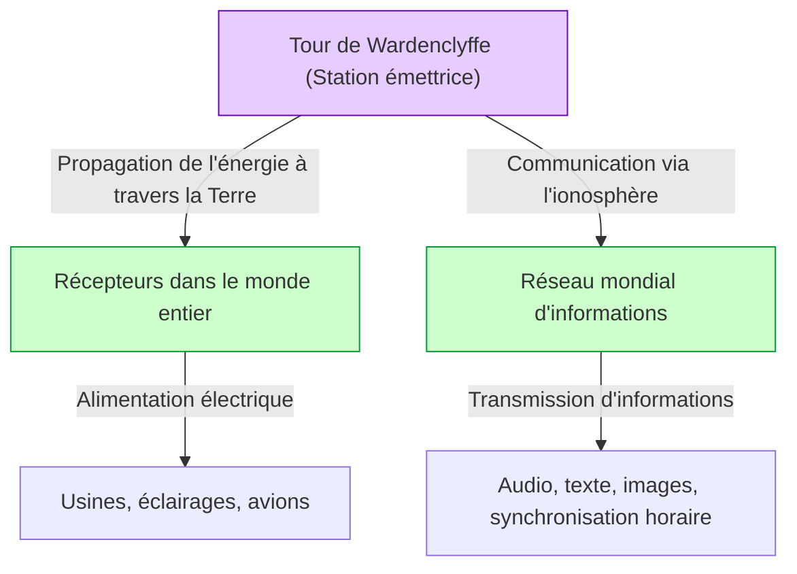

# Nikola Tesla : L'avenir dessiné par le courant alternatif et le système mondial

Nikola Tesla (1856 - 1943) est l'un des inventeurs les plus grands et les plus mystérieusement fascinants de l'histoire de l'humanité. Le système à courant alternatif (CA) qu'il a développé est devenu la base de notre réseau électrique moderne, construisant les fondations de la vie prospère dont nous jouissons quotidiennement. Cependant, ses réalisations ne s'arrêtent pas là. Il nourrissait des concepts bien trop visionnaires pour son époque, tels que des technologies pionnières en matière de communication sans fil, de contrôle à distance et de robotique, ainsi que le « système mondial » (World Wireless System), un réseau gigantesque d'énergie et d'informations visant à relier la Terre entière.

Dans cet article, tout en retraçant la vie de ce génial inventeur, nous fournirons une explication détaillée et une analyse de plusieurs milliers de mots sur la féroce « guerre des courants » qui l'a opposé à Thomas Edison, ainsi que sur l'ensemble de la « tour de Wardenclyffe » et du « système mondial », qui furent son plus grand rêve et son plus grand échec.

## 1. Enfance et talent naturel

Nikola Tesla est né le 10 juillet 1856 dans le village de Smiljan, dans l'Empire d'Autriche (aujourd'hui en Croatie), de l'union de Milutin, un prêtre de l'Église orthodoxe serbe, et de Đuka, une mère dotée d'un talent pour fabriquer des outils ménagers pratiques. Tesla a plus tard déclaré qu'il avait hérité son talent d'inventeur de sa mère.

Dès son plus jeune âge, Tesla possédait une mémoire prodigieuse (mémoire photographique) et une imagination hors du commun lui permettant d'assembler complètement des machines dans sa tête et de les faire fonctionner. On dit qu'il pouvait assembler un moteur dans son esprit et même simuler l'usure de ses pièces sans jamais dessiner de plan sur papier. Cette capacité singulière a été la force motrice derrière ses nombreuses inventions révolutionnaires ultérieures.

Lorsqu'il étudiait à l'Université de technologie de Graz, Tesla a découvert la dynamo de Gramme (un générateur à courant continu). En observant les étincelles produites par le commutateur, il s'est rendu compte qu'il s'agissait d'un gaspillage d'énergie et que cela réduisait la durée de vie de la machine. C'est là qu'il a eu l'intuition qu'« il serait peut-être possible de créer un moteur pouvant utiliser directement le courant alternatif sans avoir besoin d'un commutateur ». Bien que son professeur l'ait réfuté en affirmant que « c'est comme essayer de créer une machine à mouvement perpétuel, c'est impossible », Tesla n'a pas abandonné.

Quelques années plus tard, alors qu'il se promenait dans un parc de Budapest avec un ami en récitant « Faust » de Goethe, l'inspiration du « champ magnétique rotatif » a soudainement traversé son esprit. En dessinant un schéma sur le sol avec sa canne, il a montré et expliqué à son ami le principe complet du moteur à courant alternatif. Ce fut le véritable point de départ du système à courant alternatif qui allait changer le monde.

## 2. Voyage en Amérique et rencontre avec Edison

En 1884, Tesla a voyagé vers New York, en Amérique, avec peu d'argent, des lettres de recommandation et ses propres poèmes ainsi que des calculs concernant l'aviation dans ses poches, le cœur plein de rêves et d'espoirs. La lettre de recommandation provenait de Charles Batchelor, directeur de la filiale européenne d'Edison, et y était écrit : « Je connais deux grands hommes. L'un est vous (Edison), et l'autre est ce jeune homme. »

Tesla a rapidement commencé à travailler pour la société de Thomas Edison (Edison Machine Works). À l'époque, Edison s'efforçait de commercialiser l'ampoule à incandescence et de construire un système d'alimentation électrique basé sur le courant continu (CC) à New York. Cependant, le système à courant continu présentait un défaut fatal. Comme il était difficile de convertir la tension, l'électricité ne pouvait pas être transmise sur de longues distances depuis la centrale, et il fallait construire une centrale électrique tous les quelques kilomètres.

Tesla a considérablement amélioré la conception des générateurs à courant continu d'Edison, augmentant considérablement leur efficacité. Selon les souvenirs de Tesla, Edison lui aurait promis : « Si tu réussis cette amélioration, je te paierai 50 000 dollars. » Tesla a travaillé jour et nuit pendant des mois et a brillamment résolu ce problème difficile. Cependant, lorsque Tesla a demandé la récompense promise, Edison a ri en disant : « Tesla, tu ne sembles pas comprendre notre humour américain », et ne lui a proposé qu'une maigre augmentation de salaire.

Profondément déçu par ce traitement, Tesla a immédiatement démissionné de la société d'Edison. Pendant un certain temps, il a connu une vie de misère, devant travailler comme terrassier à la journée pour survivre. Cependant, même pendant ce travail de terrassement, il a continué à affiner sa conception d'un nouveau système à courant alternatif.

## 3. La guerre des courants : Courant alternatif (CA) vs Courant continu (CC)

Soutenu par des investisseurs qui regrettaient de voir le talent de Tesla inexploité, celui-ci a finalement fondé sa propre entreprise et a commencé à développer sérieusement son système à courant alternatif. C'est là qu'il a fait une rencontre fatidique avec l'homme d'affaires George Westinghouse. Westinghouse a vu le potentiel du système à courant alternatif de Tesla, a acheté ses brevets et a commencé à développer l'entreprise conjointement.

C'est ainsi qu'a éclaté la « guerre des courants » (War of the Currents), restée dans l'histoire.

- **Le camp d'Edison (Courant continu, CC)** : Avait déjà investi massivement et commencé à construire des infrastructures. Basse tension et sûr, mais la transmission sur de longues distances était impossible.
- **Le camp de Tesla & Westinghouse (Courant alternatif, CA)** : Permettait de transmettre sur de longues distances à haute tension à l'aide de transformateurs, puis de convertir à basse tension au point d'utilisation. Beaucoup plus efficace et économique.

Pour protéger son entreprise, Edison a lancé une campagne de dénigrement soulignant les dangers du courant alternatif. Il n'a reculé devant rien, menant des expériences publiques où des chiens errants et des chevaux étaient électrocutés avec du courant alternatif, et complotant en coulisses pour s'assurer que la première chaise électrique du monde utilise du courant alternatif pour les exécutions.

Cependant, la supériorité technique et économique était évidente. Le diagramme ci-dessous illustre de manière conceptuelle la différence entre le système à courant continu et le système à courant alternatif.

```mermaid
graph TD
    subgraph "Thomas Edison (Courant continu : CC)"
        A["Centrale électrique CC"] -- "Transmission à basse tension" --> B["Réseau de transmission court"]
        B -- "Forte perte de puissance" --> C["Maisons et usines à proximité"]
        style A fill:#ffcccc,stroke:#ff0000
    end

    subgraph "Nikola Tesla (Courant alternatif : CA)"
        D["Centrale électrique CA"] -- "Augmentation de la tension par transformateur" --> E["Réseau de transmission longue distance"]
        E -- "Réduction de la tension par transformateur" --> F["Maisons et usines éloignées"]
        style D fill:#ccffff,stroke:#0000ff
    end
```

Deux événements décisifs ont déterminé le vainqueur.
Le premier fut l'Exposition universelle de Chicago en 1893. La société Westinghouse a remporté le contrat d'éclairage avec une offre inférieure à celle du camp Edison (General Electric). Le système de Tesla a allumé des dizaines de milliers d'ampoules de manière sûre et spectaculaire, permettant aux gens du monde entier de voir par eux-mêmes la grandeur du système à courant alternatif.

Le deuxième fut le projet de construction de la première grande centrale hydroélectrique du monde aux chutes du Niagara. La commission internationale (présidée par Lord Kelvin) a finalement opté pour le système à courant alternatif de Tesla. En 1896, l'électricité produite aux chutes du Niagara a été transmise à la ville de Buffalo, située à environ 35 kilomètres de là, l'illuminant de mille feux. À ce moment précis, il est devenu certain que le système à courant alternatif deviendrait la norme pour les infrastructures énergétiques mondiales.

## 4. Les expériences à Colorado Springs

Après son immense succès avec le système à courant alternatif, Tesla s'est aventuré dans un territoire encore plus inconnu : la « transmission d'énergie sans fil ». C'était un concept extravagant visant à utiliser la Terre entière comme conducteur pour envoyer de l'énergie et des informations n'importe où dans le monde, sans utiliser de fils.

En 1899, il a construit un laboratoire à Colorado Springs, dans le Colorado, pour étudier les propriétés électriques de l'atmosphère. Là, il a utilisé une énorme « bobine Tesla » générant des millions de volts de tension ultra-haute pour mener des expériences répétées de création d'éclairs artificiels.

Tesla a affirmé y avoir découvert les « ondes stationnaires terrestres » (Earth Stationary Waves). Il s'agit d'un phénomène par lequel la Terre entière résonne à des vibrations électriques d'une fréquence spécifique. En utilisant ce principe, il pensait pouvoir envoyer de l'énergie sans atténuation à un récepteur situé de l'autre côté du globe. Les données expérimentales de Colorado Springs sont devenues la base de son prochain projet grandiose.

## 5. Le summum du rêve et l'échec : La tour de Wardenclyffe et le « système mondial »

En 1901, Tesla a commencé la construction de la « tour de Wardenclyffe » (Wardenclyffe Tower) à Long Island, dans l'État de New York. Les fonds ont été fournis par J.P. Morgan, un magnat de la finance de l'époque.

Le « système mondial » (World Wireless System) de Tesla n'était pas seulement une simple communication sans fil. Selon sa vision, les fonctionnalités suivantes devaient être réalisées :

- **Réseau de communication mondial** : N'importe où dans le monde, il serait possible d'envoyer et de recevoir instantanément des cours de bourse, des nouvelles et des messages vocaux personnels.
- **Énergie sans fil inépuisable** : Avec une petite antenne, il serait possible de recevoir de l'électricité n'importe où et de faire fonctionner des moteurs ou des éclairages.
- **Synchronisation horaire et navigation** : Synchroniser les horloges du monde entier avec une précision extrême, permettant aux navires de connaître leur position exacte.

C'était une vision étonnante qui préfigurait, avec 100 ans d'avance, l'Internet, les smartphones, le GPS et la transmission d'énergie sans fil d'aujourd'hui.

Cependant, le projet a rapidement rencontré des difficultés. Guglielmo Marconi a utilisé les brevets de Tesla (tels que ceux sur les circuits d'accord multiples) sans autorisation et a réussi à transmettre une communication radio transatlantique, attirant l'attention du monde entier. Alors que le système de Marconi était simple et peu coûteux, la tour de Tesla était complexe et nécessitait des fonds colossaux.

Tesla a demandé une aide financière supplémentaire à J.P. Morgan, révélant pour la première fois que « le véritable but de la tour n'est pas seulement la communication, mais aussi la transmission gratuite d'énergie ». Cependant, en entendant cela, Morgan a coupé les financements. Il a pensé : « Qui lira les compteurs d'énergie ? (On ne peut pas tirer profit de l'énergie gratuite) ».

À court d'argent, Tesla n'a pas pu terminer la tour, et en 1917, pendant la Première Guerre mondiale, le gouvernement américain l'a fait exploser et démanteler. Cet échec fut la plus grande tragédie de la vie de Tesla, le plongeant dans un profond désespoir.

## 6. Ses dernières années et son héritage

Même après l'échec de la tour de Wardenclyffe, Tesla a continué à inventer. Cela inclut la turbine sans pales (turbine Tesla), le concept d'aéronef à décollage et atterrissage verticaux (VTOL), ainsi que l'idée controversée du « rayon de la mort » (Teleforce). Cependant, faute de financement, nombre de ses idées ne se sont jamais concrétisées.

Dans ses dernières années, Tesla a vécu une vie solitaire dans la chambre 3327 de l'hôtel New Yorker à New York. Il aimait profondément les pigeons et se faisait un devoir de les nourrir dans le parc tous les jours. Il est décédé le 7 janvier 1943 à l'âge de 86 ans. Après sa mort, le FBI a confisqué ses carnets et ses papiers (dont une partie a été restituée plus tard à sa famille).

## 7. Conclusion

Nikola Tesla était un homme qui plaçait le « progrès de l'humanité » au-dessus de son propre profit. Il a même déchiré son contrat pour sauver la société Westinghouse de la faillite, renonçant ainsi à l'immense richesse qu'il aurait pu tirer de ses brevets.

Son « système mondial » est resté inachevé, mais la vision sous-jacente — l'idée d'« unifier le monde par la technologie et d'enrichir la vie des gens » — s'est concrétisée sous la forme de la société Internet moderne.

Tesla a prononcé ces mots :
*« Le présent est à eux ; l'avenir, pour lequel j'ai réellement travaillé, est à moi. »*

Si aujourd'hui nous pouvons allumer la lumière en appuyant sur un interrupteur et accéder aux informations du monde entier avec nos smartphones, c'est précisément parce que nous vivons une partie de l'avenir qu'il avait imaginé. Nikola Tesla gravera à jamais son nom dans l'histoire en tant qu'« homme qui a inventé l'avenir ».
