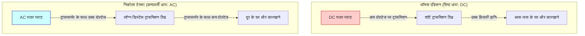
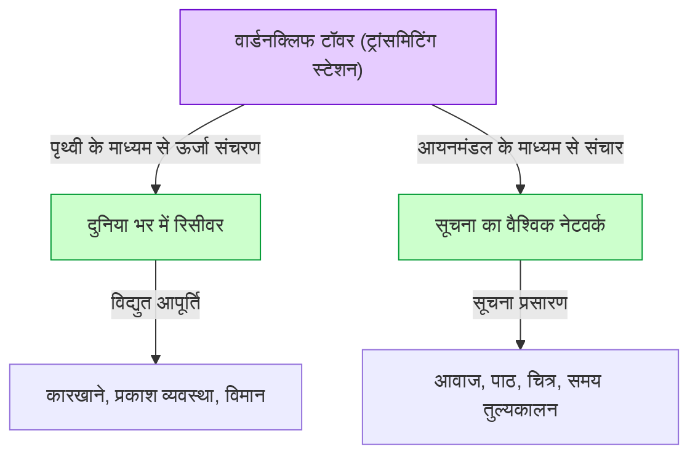

# निकोला टेस्ला: प्रत्यावर्ती धारा (AC) और विश्व प्रणाली द्वारा चित्रित भविष्य

निकोला टेस्ला (1856 - 1943) मानव इतिहास के सबसे महान और रहस्यमयी आकर्षण से घिरे आविष्कारों में से एक हैं। उनके द्वारा विकसित प्रत्यावर्ती धारा (AC) प्रणाली आधुनिक पावर ग्रिड का आधार बनी, जिसने उस समृद्ध जीवन की नींव रखी जिसका हम आज आनंद ले रहे हैं। लेकिन उनकी उपलब्धियां यहीं नहीं रुकतीं। उनके पास वायरलेस संचार, रिमोट कंट्रोल, रोबोटिक्स के अग्रदूत, और यहां तक कि पूरी पृथ्वी को एक विशाल ऊर्जा और सूचना नेटवर्क से जोड़ने वाली "विश्व प्रणाली (World Wireless System)" जैसी दूरदर्शी योजनाएं भी थीं, जो उस समय के हिसाब से बहुत आगे की सोच थी।

इस लेख में, हम इस प्रतिभाशाली आविष्कारक के जीवन का अनुसरण करेंगे, थॉमस एडिसन के साथ हुए उनके भयंकर "करंट के युद्ध" (War of the Currents), और उनके सबसे बड़े सपने और सबसे बड़ी विफलता "वार्डनक्लिफ टॉवर" और "विश्व प्रणाली" के पूरे चित्र को तकनीकी स्पष्टीकरण और हजारों शब्दों के गहन विश्लेषण के साथ प्रस्तुत करेंगे।

## 1. बचपन और प्राकृतिक प्रतिभा

निकोला टेस्ला का जन्म 10 जुलाई 1856 को ऑस्ट्रियाई साम्राज्य (वर्तमान क्रोएशिया) के स्मिल्जन नामक गांव में हुआ था। उनके पिता मिल्टिन एक सर्बियाई रूढ़िवादी पुजारी थे, और उनकी माँ डूका के पास घरेलू उपकरण बनाने की प्रतिभा थी। टेस्ला ने बाद में कहा कि उन्हें आविष्कार करने की प्रतिभा अपनी माँ से विरासत में मिली है।

बचपन से ही, टेस्ला के पास एक अभूतपूर्व याददाश्त (फोटोग्राफिक मेमोरी) और एक असाधारण कल्पना थी जो उन्हें अपने दिमाग में मशीनों को पूरी तरह से इकट्ठा करने और संचालित करने की अनुमति देती थी। कहा जाता है कि वे कागज पर कोई ब्लूप्रिंट बनाए बिना ही अपने दिमाग में मोटर बना सकते थे और यहां तक कि यह भी अनुकरण कर सकते थे कि पुर्जे कैसे घिसेंगे। यह अनूठी क्षमता बाद में उनके कई अभूतपूर्व आविष्कारों का प्रेरक बल बनी।

ग्राज़ यूनिवर्सिटी ऑफ़ टेक्नोलॉजी में पढ़ते समय, टेस्ला का सामना एक ग्राम डायनेमो (डीसी जनरेटर) से हुआ। उन्होंने कम्यूटेटर से निकलने वाली चिंगारियों को देखा और महसूस किया कि यह ऊर्जा की बर्बादी है और मशीन के जीवन को छोटा कर रहा है। यहीं उन्हें यह अंतर्ज्ञान हुआ कि "क्या कोई ऐसी मोटर बनाना संभव है जो कम्यूटेटर की आवश्यकता के बिना सीधे प्रत्यावर्ती धारा (AC) का उपयोग कर सके?" उनके प्रोफेसर ने यह कहकर इसे खारिज कर दिया कि "यह एक परपेचुअल मोशन मशीन (निरंतर गति वाली मशीन) बनाने जैसा है और असंभव है," लेकिन टेस्ला ने हार नहीं मानी।

कुछ साल बाद, बुडापेस्ट के एक पार्क में एक दोस्त के साथ टहलते हुए और गोएथे की 'फॉस्ट' का पाठ करते हुए, उन्हें अचानक "घूर्णन चुंबकीय क्षेत्र" (Rotating Magnetic Field) की प्रेरणा मिली। अपनी छड़ी का उपयोग करके जमीन पर एक चित्र बनाते हुए, उन्होंने अपने दोस्त को एक एसी मोटर का पूरा सिद्धांत समझाया। यह एसी प्रणाली के उस वास्तविक युग की शुरुआत थी जिसने दुनिया को बदल दिया।

## 2. अमेरिका की यात्रा और एडिसन से मुलाकात

1884 में, टेस्ला बहुत कम पैसे, एक सिफारिशी पत्र, और अपनी ही कविताओं और उड़ान मशीनों के लिए गणनाओं के साथ, सपनों और आशाओं से भरे हुए अमेरिका के न्यूयॉर्क पहुंचे। सिफारिशी पत्र एडिसन के यूरोपीय संचालन के प्रमुख चार्ल्स बैचेलर की ओर से था, और इसमें लिखा था: "मैं दो महान पुरुषों को जानता हूं। एक आप (एडिसन) हैं, और दूसरा यह युवक है।"

टेस्ला ने तुरंत थॉमस एडिसन की कंपनी (एडिसन मशीन वर्क्स) के लिए काम करना शुरू कर दिया। उस समय, एडिसन तापदीप्त प्रकाश बल्बों का व्यवसायीकरण करने और न्यूयॉर्क में एक दिष्ट धारा (DC) बिजली आपूर्ति प्रणाली बनाने के लिए संघर्ष कर रहे थे। हालाँकि, डीसी सिस्टम में एक घातक खामी थी। वोल्टेज को परिवर्तित करना मुश्किल होने के कारण, बिजली को पावर प्लांट से बहुत दूर नहीं भेजा जा सकता था, और हर कुछ किलोमीटर पर एक पावर प्लांट बनाना पड़ता था।

टेस्ला ने एडिसन के डीसी जनरेटर के डिजाइन में काफी सुधार किया और इसकी दक्षता में भारी वृद्धि की। टेस्ला के संस्मरणों के अनुसार, एडिसन ने वादा किया था कि "अगर तुम इस सुधार में सफल हो जाते हो, तो मैं तुम्हें 50,000 डॉलर का भुगतान करूंगा।" टेस्ला ने कई महीनों तक बिना सोए काम किया और इस कठिन कार्य को सफलतापूर्वक पूरा किया। हालाँकि, जब टेस्ला ने वादे के अनुसार इनाम मांगा, तो एडिसन ने यह कहकर बात टाल दी, "टेस्ला, ऐसा लगता है कि तुम अमेरिकी चुटकुलों को नहीं समझते हो," और उन्हें वेतन में केवल एक छोटी सी वृद्धि की पेशकश की।

इस व्यवहार से गहराई से निराश होकर, टेस्ला ने तुरंत एडिसन की कंपनी से इस्तीफा दे दिया। कुछ समय के लिए, उन्होंने दिहाड़ी मजदूर के रूप में खाइयां खोदकर अपना जीवन यापन करने के लिए संघर्ष करते हुए, बहुत बुरे दिन देखे। लेकिन इस खाई खोदने के काम के दौरान भी, वह एक नई एसी प्रणाली की योजना बनाना जारी रखे हुए थे।

## 3. करंट का युद्ध: प्रत्यावर्ती धारा (AC) बनाम दिष्ट धारा (DC)

टेस्ला की प्रतिभा का सम्मान करने वाले निवेशकों के समर्थन से, टेस्ला ने अंततः अपनी खुद की कंपनी स्थापित की और गंभीरता से एसी प्रणाली विकसित करना शुरू कर दिया। यहीं पर उनकी मुलाकात एक व्यवसायी जॉर्ज वेस्टिंगहाउस से हुई, जो एक भाग्यशाली मोड़ साबित हुआ। वेस्टिंगहाउस ने टेस्ला की एसी प्रणाली की क्षमता को पहचाना, उनके पेटेंट खरीदे, और संयुक्त रूप से व्यवसाय का विस्तार करना शुरू किया।

इसके साथ ही, इतिहास का प्रसिद्ध "करंट का युद्ध" (War of the Currents) शुरू हो गया।

- **एडिसन का पक्ष (दिष्ट धारा: DC)**: उन्होंने पहले ही भारी निवेश कर दिया था और बुनियादी ढांचे का निर्माण शुरू कर दिया था। यह कम वोल्टेज पर सुरक्षित था, लेकिन लंबी दूरी का ट्रांसमिशन असंभव था।
- **टेस्ला और वेस्टिंगहाउस का पक्ष (प्रत्यावर्ती धारा: AC)**: ट्रांसफॉर्मर का उपयोग करके उच्च वोल्टेज पर लंबी दूरी तक बिजली संचारित की जा सकती थी और उपयोग के बिंदु पर इसे कम वोल्टेज में बदला जा सकता था। यह बहुत अधिक कुशल और किफायती था।

अपने व्यवसाय की रक्षा के लिए, एडिसन ने एसी के खतरों को बढ़ावा देने वाला एक नकारात्मक अभियान शुरू किया। उन्होंने आवारा कुत्तों और घोड़ों को एसी करंट से मारने के सार्वजनिक प्रदर्शन किए, और यहां तक कि दुनिया के पहले इलेक्ट्रिक चेयर निष्पादन में एसी करंट के उपयोग को सुनिश्चित करने के लिए पर्दे के पीछे से काम किया। वे किसी भी हद तक जाने को तैयार थे।

हालांकि, तकनीकी और आर्थिक श्रेष्ठता स्पष्ट थी। नीचे दिया गया आरेख डीसी सिस्टम और एसी सिस्टम के बीच के अंतर को वैचारिक रूप से दर्शाता है।

दो निर्णायक घटनाओं ने जीत और हार तय कर दी।
पहली घटना 1893 का शिकागो विश्व मेला था। वेस्टिंगहाउस कंपनी ने एडिसन के शिविर (जनरल इलेक्ट्रिक) की तुलना में कम बोली लगाकर प्रकाश व्यवस्था का अनुबंध जीता। टेस्ला के सिस्टम ने हजारों लाइट बल्बों को सुरक्षित और भव्य रूप से रोशन किया, जिससे दुनिया भर के लोगों ने एसी सिस्टम की महानता देखी।

दूसरी घटना नियाग्रा फॉल्स में दुनिया के पहले विशाल जलविद्युत संयंत्र का निर्माण प्रोजेक्ट था। लॉर्ड केल्विन की अध्यक्षता वाले एक अंतर्राष्ट्रीय आयोग ने अंततः टेस्ला की एसी प्रणाली को अपनाया। 1896 में, नियाग्रा फॉल्स में उत्पन्न बिजली को लगभग 35 किलोमीटर दूर बफ़ेलो शहर में प्रेषित किया गया, जिससे शहर जगमगा उठा। इसी क्षण यह निश्चित हो गया कि एसी प्रणाली वैश्विक ऊर्जा अवसंरचना का मानक बन जाएगी।

## 4. कोलोराडो स्प्रिंग्स में प्रयोग

एसी प्रणाली के साथ बड़ी सफलता प्राप्त करने के बाद, टेस्ला ने एक और अज्ञात क्षेत्र में कदम रखा: "वायरलेस पावर ट्रांसमिशन"। यह पूरी पृथ्वी को एक सुचालक के रूप में उपयोग करके, बिना तारों के दुनिया में कहीं भी ऊर्जा और सूचना प्रसारित करने का एक अविश्वसनीय विचार था।

1899 में, उन्होंने वायुमंडल के विद्युत गुणों का अध्ययन करने के लिए कोलोराडो स्प्रिंग्स, कोलोराडो में एक प्रयोगशाला बनाई। यहां, उन्होंने कृत्रिम बिजली उत्पन्न करने वाले प्रयोगों को दोहराने के लिए लाखों वोल्ट का सुपर-हाई वोल्टेज पैदा करने वाले एक विशाल "टेस्ला कॉइल" का उपयोग किया।

टेस्ला ने दावा किया कि उन्होंने यहाँ अर्थ स्टेशनरी वेव्स (Earth Stationary Waves) की खोज की। यह एक ऐसी घटना है जहाँ पूरी पृथ्वी एक विशिष्ट आवृत्ति के विद्युत कंपन के साथ प्रतिध्वनित होती है, और उनका मानना था कि इस सिद्धांत का उपयोग करके, ऊर्जा को बिना क्षय के पृथ्वी के दूसरी ओर रिसीवर तक भेजा जा सकता है। कोलोराडो स्प्रिंग्स के प्रायोगिक आंकड़े उनके अगले भव्य प्रोजेक्ट की नींव बने।

## 5. सपनों का क्रिस्टलीकरण और विफलता: वार्डनक्लिफ टॉवर और "विश्व प्रणाली"

1901 में, टेस्ला ने लॉन्ग आइलैंड, न्यूयॉर्क में "वार्डनक्लिफ टॉवर" का निर्माण शुरू किया। उस समय की वित्तीय दुनिया के दिग्गज, जे.पी. मॉर्गन ने इसके लिए धन उपलब्ध कराया था।

टेस्ला की "विश्व प्रणाली" (World Wireless System) केवल वायरलेस संचार से कहीं अधिक थी। उनके दृष्टिकोण के अनुसार, निम्नलिखित कार्य साकार होने वाले थे:

- **वैश्विक संचार नेटवर्क**: आप दुनिया में कहीं भी हों, आप तुरंत स्टॉक कोट्स, समाचार और व्यक्तिगत ध्वनि संदेश भेज और प्राप्त कर सकते हैं।
- **असीमित वायरलेस शक्ति**: यदि आपके पास एक छोटा एंटीना है, तो आप स्थान की परवाह किए बिना बिजली प्राप्त कर सकते हैं और मोटर और लाइट चला सकते हैं।
- **समय तुल्यकालन और नेविगेशन**: यह दुनिया भर की घड़ियों को अत्यधिक सटीकता के साथ सिंक्रनाइज़ करेगा, जिससे जहाजों को अपने वर्तमान स्थान को सटीक रूप से जानने में मदद मिलेगी।

यह एक आश्चर्यजनक दृष्टिकोण था जिसने 100 साल पहले आधुनिक "इंटरनेट," "स्मार्टफोन," "जीपीएस," और "वायरलेस चार्जिंग" की भविष्यवाणी कर दी थी।

हालाँकि, इस प्रोजेक्ट को जल्द ही मुश्किलों का सामना करना पड़ा। गुग्लिल्मो मार्कोनी ने टेस्ला के पेटेंट (जैसे कई ट्यूनिंग सर्किट पेटेंट) का बिना अनुमति उपयोग करके ट्रान्साटलांटिक वायरलेस संचार में सफलता प्राप्त की और विश्वव्यापी ध्यान आकर्षित किया। जहाँ मार्कोनी का सिस्टम सरल और सस्ता था, वहीं टेस्ला के टॉवर को जटिल और भारी वित्त पोषण की आवश्यकता थी।

टेस्ला ने जे.पी. मॉर्गन से अतिरिक्त धन मांगा, और यहीं उन्होंने पहली बार खुलासा किया कि "टॉवर का वास्तविक उद्देश्य केवल संचार नहीं है, बल्कि ऊर्जा का मुफ्त संचरण है।" लेकिन, यह सुनकर मॉर्गन ने फंडिंग रोक दी। उन्होंने सोचा, "ऊर्जा के मीटर की रीडिंग कौन लेगा? (मुफ्त ऊर्जा से कोई मुनाफा नहीं कमाया जा सकता)।"

धन की कमी के कारण, टेस्ला टॉवर को पूरा करने में असमर्थ रहे, और प्रथम विश्व युद्ध के दौरान 1917 में अमेरिकी सरकार द्वारा टॉवर को उड़ा दिया गया और नष्ट कर दिया गया। यह विफलता टेस्ला के जीवन की सबसे बड़ी त्रासदी थी, और उन्होंने गहरी निराशा का अनुभव किया।

## 6. बाद के वर्ष और विरासत

वार्डनक्लिफ टॉवर की विफलता के बाद भी टेस्ला ने आविष्कार करना जारी रखा। इनमें ब्लेडलेस टर्बाइन (टेस्ला टर्बाइन), वर्टिकल टेक-ऑफ और लैंडिंग एयरक्राफ्ट (वीटीओएल) की अवधारणा और विवादास्पद "डेथ रे" (टेलीफोर्स) का विचार शामिल है। हालाँकि, धन की कमी के कारण उनके कई विचार कभी हकीकत नहीं बन पाए।

अपने बाद के वर्षों में, टेस्ला न्यूयॉर्क के न्यू यॉर्कर होटल के कमरा 3327 में एक एकांत जीवन जी रहे थे। उन्हें कबूतरों से बहुत लगाव था और वे हर दिन पार्क में उन्हें दाना खिलाने जाते थे। 7 जनवरी 1943 को 86 वर्ष की आयु में उनका निधन हो गया। उनकी मृत्यु के बाद, एफबीआई ने उनके नोट्स और कागजात जब्त कर लिए (हालांकि बाद में कुछ उनके रिश्तेदारों को वापस कर दिए गए)।

## 7. निष्कर्ष

निकोला टेस्ला एक ऐसे व्यक्ति थे जिन्होंने अपने फायदे से ज्यादा "मानवता की प्रगति" को प्राथमिकता दी। उन्होंने वेस्टिंगहाउस को दिवालिया होने से बचाने के लिए अपने अनुबंध रद्द कर दिए, और अपनी खुद की असीम संपत्ति को छोड़ दिया जो उन्हें अपने पेटेंट से मिल सकती थी।

उनकी "विश्व प्रणाली" अधूरी रह गई, लेकिन इसके अंतर्निहित दृष्टिकोण—"प्रौद्योगिकी के माध्यम से दुनिया को एक साथ जोड़ना और लोगों के जीवन को समृद्ध करना"—ने आधुनिक इंटरनेट समाज के रूप में आकार लिया है।

टेस्ला के शब्द इस प्रकार हैं:
*"वर्तमान उनका हो सकता है। लेकिन जिस भविष्य के लिए मैंने वास्तव में काम किया है, वह मेरा है।"*

आज, जब हम एक स्विच चालू करते हैं तो लाइटें जल जाती हैं और हम स्मार्टफोन पर दुनिया भर की जानकारी प्राप्त कर सकते हैं, तो यह इसलिए है क्योंकि हम उस भविष्य के एक हिस्से को जी रहे हैं जिसकी उन्होंने कल्पना की थी। निकोला टेस्ला का नाम हमेशा "भविष्य का आविष्कार करने वाले व्यक्ति" के रूप में इतिहास में दर्ज रहेगा।
