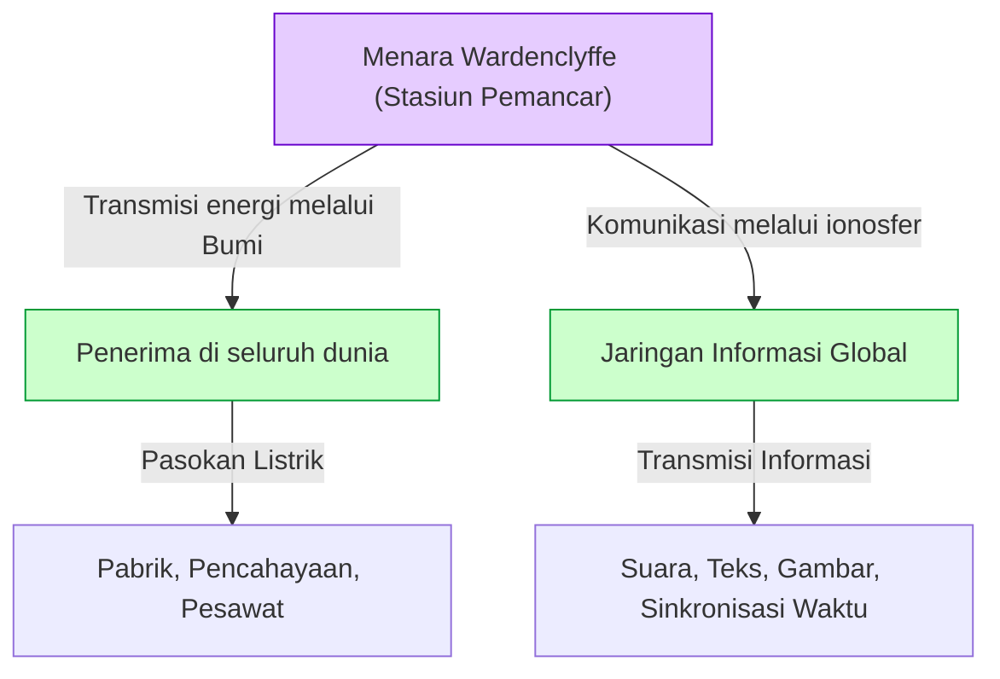

# Nikola Tesla: Masa Depan yang Digambarkan oleh Arus Bolak-balik dan Sistem Dunia

Nikola Tesla (1856 - 1943) adalah salah satu penemu paling hebat dan paling diselimuti pesona misterius dalam sejarah umat manusia. Sistem arus bolak-balik (AC) yang ia kembangkan menjadi fondasi jaringan listrik modern dan membangun dasar kehidupan makmur yang kita nikmati setiap hari. Namun, pencapaiannya tidak berhenti di situ. Ia juga memiliki visi yang terlalu maju untuk masanya, seperti teknologi perintis komunikasi nirkabel, kendali jarak jauh, dan robotika, serta "Sistem Dunia (World Wireless System)" yang menghubungkan seluruh Bumi dalam satu jaringan energi dan informasi raksasa.

Dalam artikel ini, kita akan menelusuri kehidupan penemu jenius ini, dan memberikan penjelasan serta analisis mendetail sepanjang ribuan kata mengenai "Perang Arus" yang sengit melawan Thomas Edison, serta keseluruhan dari "Menara Wardenclyffe" dan "Sistem Dunia", yang merupakan impian terbesar sekaligus kegagalan terbesarnya.

## 1. Masa Kecil dan Bakat Alami

Nikola Tesla lahir pada tanggal 10 Juli 1856 di sebuah desa bernama Smiljan, di Kekaisaran Austria (sekarang Kroasia), dari ayah bernama Milutin, seorang pendeta Ortodoks Serbia, dan ibu bernama Đuka, yang memiliki bakat membuat peralatan rumah tangga yang praktis. Tesla sendiri kemudian mengatakan bahwa bakatnya dalam menemukan sesuatu diwariskan dari ibunya.

Sejak kecil, Tesla memiliki ingatan yang luar biasa (memori eidetik) dan imajinasi luar biasa yang memungkinkannya merakit dan mengoperasikan mesin secara mental. Dikatakan bahwa ia dapat merakit motor di dalam otaknya dan menyimulasikan keausan suku cadang tanpa menggambar cetak biru di atas kertas. Kemampuan unik ini menjadi kekuatan pendorong di balik banyak penemuan inovatifnya di kemudian hari.

Saat belajar di Universitas Teknik Graz, Tesla menemukan dinamo Gramme (generator arus searah). Melihat percikan api dari komutator, ia menyadari bahwa itu adalah pemborosan energi dan memperpendek umur mesin. Di sinilah ia mendapat intuisi, "Mungkinkah membuat motor yang dapat langsung menggunakan arus bolak-balik tanpa memerlukan komutator?". Profesornya menepis ide itu, mengatakan bahwa "itu sama mustahilnya dengan membuat mesin gerak abadi", tetapi Tesla tidak menyerah.

Beberapa tahun kemudian, saat berjalan-jalan di taman di Budapest bersama seorang teman sambil membacakan *Faust* karya Goethe dari ingatannya, inspirasi "medan magnet putar" tiba-tiba muncul di benaknya. Menggunakan tongkatnya untuk menggambar diagram di tanah, ia menunjukkan dan menjelaskan prinsip lengkap motor AC kepada temannya. Inilah awal mula sesungguhnya dari sistem AC yang mengubah dunia.

## 2. Pelayaran ke Amerika dan Pertemuan dengan Edison

Pada tahun 1884, Tesla berlayar ke New York, Amerika Serikat, dengan impian dan harapan di dadanya, hanya membawa sedikit uang, surat rekomendasi, dan beberapa puisi buatannya serta perhitungan pesawat terbang di sakunya. Surat rekomendasi itu berasal dari Charles Batchelor, manajer divisi Eropa Edison, yang berbunyi: "Saya tahu dua pria hebat. Satu adalah Anda (Edison), dan yang lainnya adalah pemuda ini."

Tesla segera mulai bekerja di perusahaan Thomas Edison (Edison Machine Works). Pada saat itu, Edison sedang berjuang untuk mengkomersilkan bola lampu pijar dan membangun sistem pasokan daya arus searah (DC) di New York. Namun, sistem DC memiliki cacat fatal. Karena tegangan sulit diubah, daya tidak dapat dikirim ke tempat yang jauh dari pembangkit listrik, dan pembangkit listrik harus dibangun setiap beberapa kilometer.

Tesla secara signifikan menyempurnakan desain generator DC Edison, meningkatkan efisiensinya secara drastis. Menurut ingatan Tesla, Edison berjanji, "Jika kamu berhasil memperbaikinya, saya akan membayarmu 50.000 dolar." Tesla bekerja tanpa tidur dan istirahat selama beberapa bulan dan berhasil memecahkan tantangan sulit ini dengan gemilang. Namun, ketika Tesla menagih hadiah yang dijanjikan, Edison menertawakannya, berkata, "Tesla, sepertinya kamu tidak mengerti lelucon orang Amerika," dan hanya menawarkan sedikit kenaikan gaji.

Sangat kecewa dengan perlakuan ini, Tesla segera mengundurkan diri dari perusahaan Edison. Setelah itu, untuk beberapa waktu, ia mengalami titik terendah dalam hidupnya, bekerja sebagai buruh penggali parit harian demi menyambung hidup. Namun, bahkan saat bekerja menggali parit, ia terus memikirkan sistem arus bolak-balik yang baru.

## 3. Perang Arus: Arus Bolak-balik (AC) vs Arus Searah (DC)

Dengan dukungan investor yang menyayangkan bakatnya, Tesla akhirnya mendirikan perusahaannya sendiri dan mulai mengembangkan sistem AC secara serius. Di sinilah ia mengalami pertemuan yang menentukan dengan pengusaha George Westinghouse. Westinghouse melihat potensi sistem AC Tesla, membeli patennya, dan mulai mengembangkan bisnis bersama-sama.

Di sinilah meletus "Perang Arus (War of the Currents)" yang bersejarah.

- **Kubu Edison (Arus Searah / DC)**: Telah menginvestasikan banyak uang dan mulai membangun infrastruktur. Aman dengan tegangan rendah, tetapi transmisi jarak jauh tidak mungkin dilakukan.
- **Kubu Tesla & Westinghouse (Arus Bolak-balik / AC)**: Menggunakan transformator untuk mentransmisikan jarak jauh pada tegangan tinggi, dan dapat diturunkan ke tegangan rendah di titik penggunaan. Jauh lebih efisien dan ekonomis.

Untuk melindungi bisnisnya, Edison meluncurkan kampanye negatif yang menyebarkan bahaya arus bolak-balik. Ia melakukan eksperimen publik dengan menyetrum anjing liar dan kuda menggunakan arus bolak-balik, dan bahkan bermanuver di balik layar agar eksekusi kursi listrik pertama di dunia menggunakan arus bolak-balik, menggunakan segala cara yang bisa dilakukan.

Namun, keunggulan teknis dan ekonominya jelas. Diagram di bawah ini mengkonseptualisasikan perbedaan antara sistem DC dan sistem AC.

```mermaid
graph TD
    subgraph "Thomas Edison (Arus Searah: DC)"
        A["Pembangkit Listrik DC"] -- "Transmisi dalam tegangan rendah" --> B["Jaringan Transmisi Pendek"]
        B -- "Kehilangan daya besar" --> C["Rumah dan Pabrik Jarak Dekat"]
        style A fill:#ffcccc,stroke:#ff0000
    end

    subgraph "Nikola Tesla (Arus Bolak-balik: AC)"
        D["Pembangkit Listrik AC"] -- "Dinaikkan oleh Transformator" --> E["Jaringan Transmisi Jarak Jauh"]
        E -- "Diturunkan oleh Transformator" --> F["Rumah dan Pabrik Jarak Jauh"]
        style D fill:#ccffff,stroke:#0000ff
    end
```

Ada dua peristiwa menentukan yang menetapkan pemenang.
Pertama, Pameran Dunia Chicago pada tahun 1893. Perusahaan Westinghouse memenangkan kontrak pencahayaan dengan tawaran harga yang lebih murah daripada kubu Edison (General Electric). Sistem Tesla menyalakan puluhan ribu bola lampu dengan aman dan megah, memungkinkan orang-orang di seluruh dunia menyaksikan kehebatan sistem AC.

Kedua, proyek pembangunan pembangkit listrik tenaga air raksasa pertama di dunia di Air Terjun Niagara. Komite internasional (dipimpin oleh Lord Kelvin) akhirnya mengadopsi sistem AC Tesla. Pada tahun 1896, listrik yang dihasilkan di Air Terjun Niagara ditransmisikan ke kota Buffalo yang berjarak sekitar 35 kilometer, menerangi kota tersebut dengan cemerlang. Pada saat ini, sistem AC dipastikan menjadi standar infrastruktur energi dunia.

## 4. Eksperimen di Colorado Springs

Setelah sukses besar dengan sistem AC, Tesla melangkah lebih jauh ke wilayah yang belum dipetakan: "Transmisi daya nirkabel". Itu adalah visi yang luar biasa untuk menggunakan seluruh Bumi sebagai konduktor dan mengirimkan energi serta informasi ke mana saja di dunia tanpa menggunakan kabel.

Pada tahun 1899, ia membangun laboratorium di Colorado Springs, Colorado, untuk mempelajari sifat kelistrikan atmosfer. Di sini, ia menggunakan "Kumparan Tesla (Tesla Coil)" raksasa yang menghasilkan tegangan ultra-tinggi hingga jutaan volt, dan berulang kali melakukan eksperimen untuk menciptakan kilat buatan.

Tesla mengklaim telah menemukan Gelombang Stasioner Bumi (Earth Stationary Waves) di sini. Ini adalah fenomena di mana seluruh bumi beresonansi dengan getaran listrik dari frekuensi tertentu. Ia percaya bahwa dengan menggunakan prinsip ini, energi dapat dikirim ke penerima di sisi lain bumi tanpa pelemahan. Data eksperimen di Colorado Springs menjadi fondasi untuk proyek besar berikutnya.

## 5. Kristalisasi Impian dan Kegagalan: Menara Wardenclyffe dan "Sistem Dunia"

Pada tahun 1901, Tesla mulai membangun "Menara Wardenclyffe (Wardenclyffe Tower)" di Long Island, New York. Pendanaannya disediakan oleh J.P. Morgan, seorang tokoh raksasa di dunia keuangan saat itu.

"Sistem Dunia (World Wireless System)" milik Tesla tidak hanya terbatas pada komunikasi nirkabel. Menurut visinya, fungsi-fungsi berikut seharusnya terwujud:

- **Jaringan Komunikasi Global**: Di mana pun Anda berada di dunia, Anda dapat langsung mengirim dan menerima penawaran saham, berita, dan pesan suara pribadi.
- **Daya Nirkabel Tak Terbatas**: Jika Anda memiliki antena kecil, Anda dapat menerima daya di mana saja dan mengoperasikan motor atau penerangan.
- **Sinkronisasi Waktu dan Navigasi**: Jam di seluruh dunia dapat disinkronkan dengan presisi yang sangat tinggi, memungkinkan kapal mengetahui posisi mereka saat ini secara akurat.

Ini adalah visi luar biasa yang memprediksi "Internet", "Ponsel Pintar", "GPS", dan "Pasokan Daya Nirkabel" modern yang ada saat ini 100 tahun sebelumnya.

Namun, proyek tersebut segera menghadapi kesulitan. Guglielmo Marconi menarik perhatian dunia dengan sukses mengirimkan komunikasi nirkabel trans-Atlantik, menggunakan paten Tesla (seperti paten untuk beberapa sirkuit tuning) tanpa izin. Sistem Marconi sederhana dan murah, sementara menara Tesla rumit dan membutuhkan dana besar.

Tesla meminta bantuan dana lebih lanjut dari J.P. Morgan, dan di sinilah ia pertama kali mengungkapkan bahwa "tujuan sebenarnya dari menara ini tidak hanya komunikasi, tetapi juga transmisi energi secara gratis". Namun, setelah mendengar ini, Morgan menghentikan pendanaan. Ia berpikir, "Siapa yang akan membaca meteran energi? (Tidak ada keuntungan yang bisa didapat dari energi gratis)".

Kehabisan dana, Tesla tidak dapat menyelesaikan menara tersebut, dan pada tahun 1917, selama Perang Dunia I, menara itu diledakkan dan dibongkar oleh pemerintah Amerika Serikat. Kegagalan ini adalah tragedi terbesar dalam hidup Tesla, dan ia mengalami keputusasaan yang mendalam.

## 6. Tahun-tahun Terakhir dan Warisan

Bahkan setelah kegagalan Menara Wardenclyffe, Tesla terus melakukan penemuan. Itu termasuk turbin tanpa bilah (Turbin Tesla), konsep pesawat lepas landas dan mendarat vertikal (VTOL), dan ide "Sinar Kematian (Teleforce)" yang kontroversial. Namun, banyak dari idenya tidak pernah terwujud karena kurangnya dana.

Di tahun-tahun terakhirnya, Tesla hidup dalam kesendirian di Kamar 3327 di Hotel New Yorker di New York. Ia sangat mencintai merpati dan menjadikannya rutinitas harian untuk memberi makan mereka di taman. Kemudian, pada 7 Januari 1943, ia meninggal pada usia 86 tahun. Setelah kematiannya, FBI menyita catatan dan makalahnya (beberapa di antaranya kemudian dikembalikan ke kerabatnya).

## 7. Penutup

Nikola Tesla adalah seseorang yang memprioritaskan "kemajuan umat manusia" di atas keuntungannya sendiri. Ia bahkan membatalkan kontrak untuk menyelamatkan perusahaan Westinghouse dari kebangkrutan, melepaskan kekayaan luar biasa yang seharusnya bisa ia peroleh dari paten-patennya.

"Sistem Dunia" miliknya berakhir tidak selesai, tetapi visi yang mendasarinya—gagasan untuk "menghubungkan dunia bersama melalui teknologi dan memperkaya kehidupan orang-orang"—telah diwujudkan dalam bentuk yang berbeda sebagai masyarakat internet modern.

Tesla pernah mengatakan kata-kata berikut:
*"Masa kini mungkin milik mereka. Namun masa depan, di mana aku benar-benar bekerja untuk itu, adalah milikku."*

Saat ini, fakta bahwa kita dapat menyalakan lampu dengan membalik sakelar dan mengakses informasi dari seluruh dunia menggunakan ponsel pintar adalah karena kita hidup di sebagian masa depan yang ia bayangkan. Nikola Tesla akan selalu dikenang dalam sejarah sebagai "pria yang menemukan masa depan".
