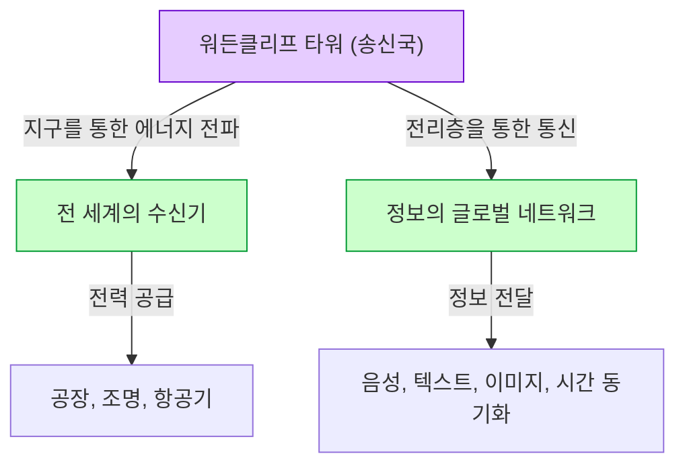

# 니콜라 테슬라: 교류 전류와 세계 시스템이 그린 미래

니콜라 테슬라(1856년 - 1943년)는 인류 역사상 가장 위대하고, 또한 가장 신비로운 매력에 싸인 발명가 중 한 명입니다. 그가 개발한 교류(AC) 시스템은 현대 전력망의 기초가 되어, 우리가 매일 누리고 있는 풍요로운 생활의 기반을 구축했습니다. 하지만 그의 업적은 그것에 그치지 않습니다. 무선 통신, 원격 제어, 로봇 공학의 선구가 되는 기술, 나아가 지구 전체를 하나의 거대한 에너지와 정보의 네트워크로 연결하는 "세계 시스템(World Wireless System)"이라는, 당시로서는 너무나도 선견지명적인 구상까지 품고 있었습니다.

본 기사에서는 이 천재 발명가의 생애를 되짚어보며, 토머스 에디슨과 벌인 치열한 '전류 전쟁', 그리고 그의 가장 큰 꿈이자 가장 큰 좌절이기도 했던 '워든클리프 타워'와 '세계 시스템'의 전모에 대해 수천 자에 걸친 상세한 해설과 고찰을 진행합니다.

## 1. 유년기와 천부적인 재능

니콜라 테슬라는 1856년 7월 10일, 오스트리아 제국(현재의 크로아티아)의 스밀랸이라는 마을에서 세르비아 정교회 사제인 아버지 밀루틴과 가정용 편리한 도구를 직접 만드는 재능을 가진 어머니 주카 사이에서 태어났습니다. 테슬라 자신은 훗날 자신의 발명 재능은 어머니로부터 물려받은 것이라고 말했습니다.

어릴 적부터 테슬라는 경이로운 기억력(영상 기억)과 머릿속에서 기계를 완전히 조립하여 작동시킬 수 있는 비범한 상상력을 가지고 있었습니다. 그는 설계도를 종이에 그리지 않고도 뇌내에서 모터를 조립하고, 부품의 마모 정도까지 시뮬레이션할 수 있었다고 합니다. 이러한 특이한 능력은 훗날 그의 획기적인 발명품들을 탄생시키는 원동력이 되었습니다.

그라츠 공과대학에서 공부하던 시절, 테슬라는 그램 다이나모(직류 발전기)를 만났습니다. 그는 정류자(커뮤테이터)에서 발생하는 불꽃을 보고, 이것이 에너지 낭비이며 기계의 수명을 단축시키고 있다는 것을 깨달았습니다. 여기서 그는 '정류자가 필요 없고, 교류를 그대로 이용할 수 있는 모터를 만들 수 있지 않을까'라는 직감을 얻습니다. 교수로부터는 "그것은 영구기관을 만드는 것과 같아 불가능하다"며 부정당했지만, 테슬라는 포기하지 않았습니다.

몇 년 후, 부다페스트의 공원을 친구와 산책하며 괴테의 『파우스트』를 암송하던 중, 갑자기 그의 뇌리에 '회전 자기장'의 영감이 번뜩였습니다. 지팡이를 사용해 땅에 그림을 그려가며, 그는 교류 모터의 완전한 원리를 친구에게 보여주고 설명했습니다. 이것이 세상을 바꿀 교류 시스템의 진정한 서막이었습니다.

## 2. 미국으로의 도항과 에디슨과의 만남

1884년, 테슬라는 약간의 자금과 추천장, 그리고 자작시와 항공기에 관한 계산서만을 주머니에 넣은 채, 꿈과 희망을 품고 미국 뉴욕으로 건너갔습니다. 추천장은 에디슨의 유럽 법인 책임자였던 찰스 배철러로부터 온 것으로, 거기에는 이렇게 적혀 있었습니다. "나는 위대한 인물 두 명을 알고 있습니다. 한 명은 당신(에디슨)이고, 다른 한 명은 이 젊은이입니다."

테슬라는 곧바로 토머스 에디슨의 회사(에디슨 머신 워크스)에서 일하기 시작했습니다. 당시 에디슨은 백열전구를 실용화하고, 직류(DC)에 의한 전력 공급 시스템을 뉴욕에 구축하기 위해 고군분투하고 있었습니다. 그러나 직류 시스템에는 치명적인 결함이 있었습니다. 전압 변환이 어려워 발전소에서 멀리 떨어진 곳으로 전력을 보낼 수 없었고, 몇 킬로미터마다 발전소를 건설해야만 했던 것입니다.

테슬라는 에디슨의 직류 발전기 설계를 대폭 개량하여 효율을 비약적으로 향상시켰습니다. 테슬라의 회고에 따르면, 에디슨은 "만약 이 개량에 성공한다면 5만 달러를 자네에게 주겠네"라고 약속했다고 합니다. 테슬라는 몇 달 동안 밤낮없이 일하여 이 어려운 과제를 훌륭하게 해결했습니다. 그러나 약속한 보상을 요구한 테슬라에게 에디슨은 "테슬라 군, 자네는 미국식 농담을 이해하지 못하는 것 같군"이라며 웃어넘기고, 급여의 약간의 인상만을 제시했을 뿐이었습니다.

이 처사에 깊이 실망한 테슬라는 즉시 에디슨의 회사를 사직했습니다. 그 후 한동안 그는 일용직 도랑 파기 노동을 하며 겨우 입에 풀칠을 하는 밑바닥 생활을 경험하게 됩니다. 하지만 이 도랑 파기 작업을 하는 동안에도 그는 새로운 교류 시스템의 구상을 계속 가다듬고 있었습니다.

## 3. 전류 전쟁: 교류(AC) vs 직류(DC)

테슬라의 재능을 아끼는 투자자들의 지원을 받아, 마침내 테슬라는 자신의 회사를 설립하고 교류 시스템 개발을 본격화했습니다. 여기서 운명적인 만남을 갖게 된 사람이 바로 실업가인 조지 웨스팅하우스입니다. 웨스팅하우스는 테슬라의 교류 시스템이 가진 잠재력을 간파하고, 그의 특허를 사들여 공동으로 사업을 전개하기 시작했습니다.

이로써 역사에 남을 '전류 전쟁(War of the Currents)'이 발발합니다.

- **에디슨 진영(직류·DC)**: 이미 막대한 투자를 하여 인프라를 구축하기 시작한 상태. 저전압이라 안전하지만, 장거리 송전이 불가능.
- **테슬라 & 웨스팅하우스 진영(교류·AC)**: 변압기를 사용하여 고전압으로 장거리를 송전하고, 사용 지점에서 저전압으로 변환할 수 있음. 훨씬 더 효율적이고 경제적.

에디슨은 자신의 비즈니스를 지키기 위해 교류의 위험성을 선전하는 네거티브 캠페인을 전개했습니다. 떠돌이 개나 말을 교류 전류로 감전사시키는 공개 실험을 하고, 나아가 세계 최초의 전기의자 사형에 교류 전류를 사용하도록 뒤에서 공작을 벌이는 등 수단을 가리지 않았습니다.

그러나 기술적·경제적 우위성은 명백했습니다. 다음 그림은 직류 시스템과 교류 시스템의 차이를 개념적으로 보여줍니다.

승패를 가른 결정적인 사건이 두 가지 있었습니다.
첫 번째는 1893년 시카고 만국 박람회입니다. 웨스팅하우스사는 에디슨 진영(제너럴 일렉트릭사)보다 더 저렴한 입찰가로 조명 계약을 따냈습니다. 테슬라의 시스템이 수만 개의 전구를 안전하고도 장대하게 점등시킴으로써, 전 세계 사람들은 교류 시스템의 훌륭함을 직접 목격했습니다.

두 번째는 나이아가라 폭포에 세워진 세계 최초의 거대한 수력 발전소 건설 프로젝트입니다. 국제적인 위원회(켈빈 경이 위원장을 맡음)는 최종적으로 테슬라의 교류 시스템을 채택했습니다. 1896년, 나이아가라 폭포에서 생산된 전력이 약 35km 떨어진 버펄로시로 송전되어 도시를 환하게 밝혔습니다. 이 순간, 교류 시스템이 세계 에너지 인프라의 표준이 되는 것이 확정되었습니다.

## 4. 콜로라도스프링스에서의 실험

교류 시스템으로 큰 성공을 거둔 후, 테슬라는 다시 새로운 미지의 영역으로 발을 들여놓았습니다. 바로 '무선 송전'입니다. 지구 전체를 도체로 이용하여 전선 없이 에너지와 정보를 전 세계 어디로든 보낸다는 엄청난 구상이었습니다.

1899년, 그는 대기의 전기적 성질을 연구하기 위해 콜로라도주 콜로라도스프링스에 실험실을 건설했습니다. 이곳에서는 수백만 볼트의 초고전압을 발생시키는 거대한 '테슬라 코일'을 사용하여 인공적인 번개를 발생시키는 실험을 반복했습니다.

테슬라는 이곳에서 지구 정상파(Earth Stationary Waves)를 발견했다고 주장했습니다. 이는 지구 전체가 특정 주파수의 전기적 진동에 공명하는 현상으로, 이 원리를 이용하면 지구 반대편에 있는 수신기를 향해 에너지를 감소시키지 않고 보낼 수 있다고 생각했습니다. 콜로라도스프링스에서의 실험 데이터는 그의 다음 번 장대한 프로젝트의 기반이 되었습니다.

## 5. 꿈의 결정체와 좌절: 워든클리프 타워와 '세계 시스템'

1901년, 테슬라는 뉴욕주 롱아일랜드에 '워든클리프 타워(Wardenclyffe Tower)' 건설을 시작했습니다. 자금을 제공한 것은 당시 금융계의 거두였던 J.P. 모건이었습니다.

테슬라의 '세계 시스템(World Wireless System)'은 단순한 무선 통신에 그치지 않습니다. 그의 구상에 따르면 다음과 같은 기능들이 실현될 것이었습니다.

- **전 지구적 통신망**: 전 세계 어디에 있든 주식 시세, 뉴스, 개인의 음성 메시지를 순식간에 송수신할 수 있다.
- **무궁무진한 무선 전력**: 소형 안테나만 있으면 장소에 구애받지 않고 전력을 받아 모터나 조명을 작동시킬 수 있다.
- **시간 동기화와 내비게이션**: 전 세계의 시계를 극히 높은 정밀도로 동기화시켜, 선박이 현재 위치를 정확하게 파악할 수 있다.

이것은 바로 현대의 '인터넷', '스마트폰', 'GPS', '무선 충전'을 100년도 전에 예견한 경이로운 비전이었습니다.

그러나 프로젝트는 곧바로 어려움에 직면합니다. 굴리엘모 마르코니가 테슬라의 특허(복수의 튜닝 회로 특허 등)를 무단으로 사용하여 대서양 횡단 무선 통신에 성공하면서 세계적인 주목을 받았습니다. 마르코니의 시스템은 단순하고 비용이 저렴했던 반면, 테슬라의 타워는 복잡하고 막대한 자금을 필요로 했습니다.

테슬라는 J.P. 모건에게 추가 자금 지원을 요청하며, 여기서 처음으로 "타워의 진짜 목적은 통신뿐만 아니라 에너지의 무료 전송이다"라고 밝혔습니다. 그러나 이 말을 들은 모건은 자금 지원을 중단했습니다. "누가 에너지 미터기를 읽을 것인가?(무료 에너지에서는 이익을 얻을 수 없다)"라고 생각했기 때문입니다.

자금이 고갈된 테슬라는 타워를 완성하지 못했고, 제1차 세계 대전 중인 1917년 미국 정부에 의해 타워는 폭파되어 해체되고 말았습니다. 이 실패는 테슬라의 인생에서 가장 큰 비극이었으며, 그는 깊은 절망을 맛보았습니다.

## 6. 말년과 유산

워든클리프 타워의 실패 이후에도 테슬라는 발명을 계속했습니다. 날 없는 터빈(테슬라 터빈), 수직 이착륙기(VTOL)의 개념, 그리고 논란을 불러일으킨 '살인 광선(Teleforce)'의 아이디어 등입니다. 그러나 그의 아이디어 대부분은 자금 부족으로 인해 실현되지 못했습니다.

말년의 테슬라는 뉴욕의 뉴요커 호텔 3327호실에서 고독한 생활을 보내고 있었습니다. 그는 비둘기를 깊이 사랑했고, 공원에서 비둘기에게 먹이를 주는 것을 일과로 삼았습니다. 그리고 1943년 1월 7일, 86세의 나이로 세상을 떠났습니다. 그의 사후, FBI는 그의 노트와 논문을 몰수했습니다(훗날 일부는 친족에게 반환되었습니다).

## 7. 맺음말

니콜라 테슬라는 자신의 이익보다 '인류의 진보'를 우선시했던 인물이었습니다. 그는 계약을 파기하면서까지 웨스팅하우스사를 파산으로부터 구했고, 자신의 특허에서 얻을 수 있었던 막대한 부를 포기했습니다.

그의 '세계 시스템'은 미완으로 끝났지만, 그 근저에 있는 비전——'기술로 세상을 하나로 연결하고, 사람들의 삶을 풍요롭게 한다'는 사상——은 현대의 인터넷 사회로 형태를 바꾸어 실현되고 있습니다.

테슬라의 말 중에 다음과 같은 것이 있습니다.
*"현재는 그들의 것일지도 모른다. 하지만, 내가 진정으로 그것을 위해 일했던 미래는 나의 것이다."*

오늘날 우리가 스위치를 켜면 전기에 불이 들어오고, 스마트폰으로 전 세계의 정보에 접근할 수 있는 것은 그가 꿈꾸었던 미래의 일부를 우리가 살고 있기 때문일 것입니다. 니콜라 테슬라는 바로 '미래를 발명한 남자'로서 영원히 역사에 그 이름을 새기게 될 것입니다.
