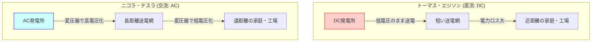
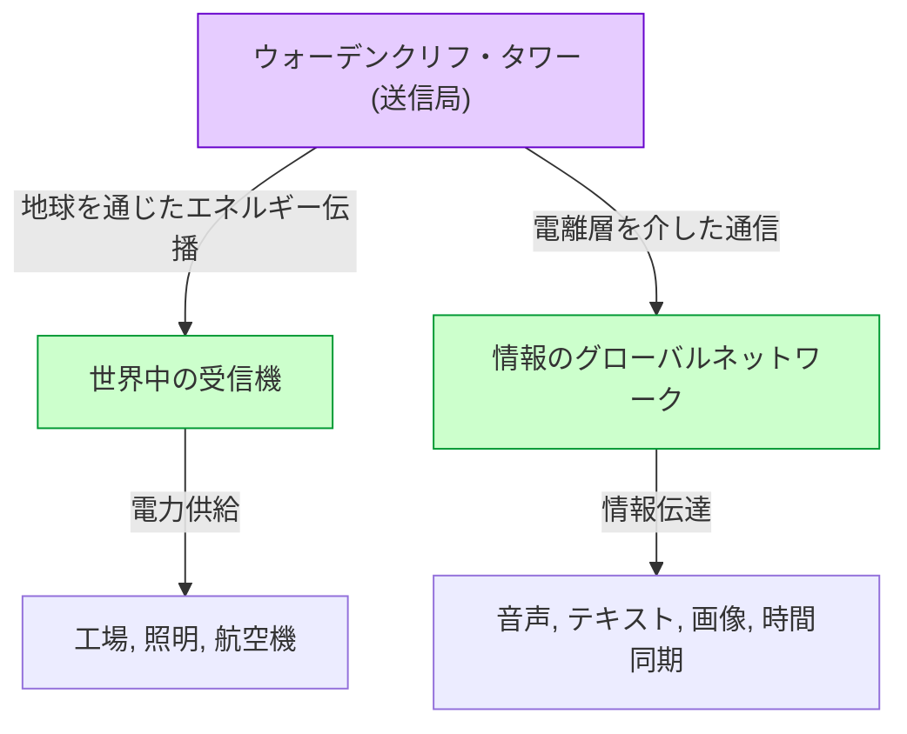

# ニコラ・テスラ：交流電流と世界システムが描いた未来

ニコラ・テスラ（1856年 - 1943年）は、人類の歴史において最も偉大で、かつ最も神秘的な魅力に包まれた発明家の一人です。彼が開発した交流（AC）システムは、現代の電力網の基礎となり、私たちが日々享受している豊かな生活の基盤を築き上げました。しかし、彼の功績はそれだけにとどまりません。無線通信、リモートコントロール、ロボット工学の先駆けとなる技術、さらには地球全体を一つの巨大なエネルギーと情報のネットワークで結ぶ「世界システム（World Wireless System）」という、当時としてはあまりにも先見的すぎる構想まで抱いていました。

本記事では、この天才発明家の生涯を辿りながら、トーマス・エジソンとの間で繰り広げられた熾烈な「電流戦争」、そして彼の最大の夢であり最大の挫折でもあった「ウォーデンクリフ・タワー」と「世界システム」の全貌について、数千文字にわたる詳細な解説と考察を行います。

## 1. 幼少期と天賦の才

ニコラ・テスラは1856年7月10日、オーストリア帝国（現在のクロアチア）のスミリャンという村で、セルビア正教会の司祭である父ミルティンと、家庭用の便利な道具を自作する才能を持っていた母ジュカの間に生まれました。テスラ自身は後に、自分の発明の才能は母親から受け継いだものだと語っています。

幼い頃から、テスラは驚異的な記憶力（映像記憶）と、頭の中で機械を完全に組み立てて作動させることができる並外れた想像力を持っていました。彼は、設計図を紙に描くことなく、脳内でモーターを組み立て、部品の摩耗具合までシミュレーションすることができたと言われています。この特異な能力は、後の彼の画期的な発明の数々を生み出す原動力となりました。

グラーツの工科大学で学んでいた時、テスラはグラム・ダイナモ（直流発電機）に出会いました。彼は整流子（コミュテーター）から発生する火花を見て、これがエネルギーの無駄であり、機械の寿命を縮めていることに気づきました。ここで彼は、「整流子を必要としない、交流をそのまま利用できるモーターが作れるのではないか」という直感を得ます。教授からは「それは永久機関を作るようなもので不可能だ」と否定されましたが、テスラは諦めませんでした。

数年後、ブダペストの公園を友人と散歩しながらゲーテの『ファウスト』を暗唱していた時、突如として彼の脳裏に「回転磁界」のインスピレーションが閃きました。杖を使って地面に図を描きながら、彼は交流モーターの完全な原理を友人に見せて説明しました。これが、世界を変える交流システムの真の幕開けでした。

## 2. アメリカへの渡航とエジソンとの出会い

1884年、テスラはわずかな資金と、推薦状、そして自作の詩や航空機に関する計算書だけをポケットに入れ、夢と希望を胸にアメリカ・ニューヨークへと渡りました。推薦状は、エジソンのヨーロッパ法人の責任者であったチャールズ・バチェラーからのもので、そこにはこう書かれていました。「私は偉大な人物を2人知っている。1人はあなた（エジソン）で、もう1人はこの若者だ。」

テスラはすぐにトーマス・エジソンの会社（エジソン・マシン・ワークス）で働き始めました。当時のエジソンは、白熱電球を実用化し、直流（DC）による電力供給システムをニューヨークに構築しようと奮闘していました。しかし、直流システムには致命的な欠陥がありました。電圧の変換が難しいため、発電所から遠く離れた場所に電力を送ることができず、数キロメートルごとに発電所を建設しなければならなかったのです。

テスラはエジソンの直流発電機の設計を大幅に改良し、効率を飛躍的に向上させました。テスラの回想によれば、エジソンは「もしこの改良に成功したら、5万ドルを君に払おう」と約束したと言います。テスラは数ヶ月間不眠不休で働き、この困難な課題を見事に解決しました。しかし、約束の報酬を求めたテスラに対し、エジソンは「テスラ君、君はアメリカ人のジョークを理解していないようだ」と笑い飛ばし、給与のわずかな昇給を提示しただけでした。

この仕打ちに深く失望したテスラは、即座にエジソンの会社を辞職しました。その後の一時期、彼は日雇いの溝掘り労働をして糊口をしのぐという、どん底の生活を経験することになります。しかし、この溝掘りの仕事中にも、彼は新しい交流システムの構想を練り続けていました。

## 3. 電流戦争：交流（AC） vs 直流（DC）

テスラの才能を惜しむ投資家たちの支援を受け、ついにテスラは自身の会社を設立し、交流システムの開発を本格化させました。ここで運命的な出会いを果たしたのが、実業家のジョージ・ウェスティングハウスです。ウェスティングハウスはテスラの交流システムのポテンシャルを見抜き、彼の特許を買い取って共同で事業を展開し始めました。

ここに、歴史に残る「電流戦争（War of the Currents）」が勃発します。

- **エジソン陣営（直流・DC）**：すでに多額の投資を行い、インフラを構築し始めていた。低電圧で安全だが、長距離送電が不可能。
- **テスラ＆ウェスティングハウス陣営（交流・AC）**：変圧器を用いて高電圧で長距離を送電し、使用地点で低電圧に変換できる。はるかに効率的で経済的。

エジソンは自身のビジネスを守るため、交流の危険性を喧伝するネガティブ・キャンペーンを展開しました。野良犬や馬を交流電流で感電死させる公開実験を行い、さらには世界初の電気椅子の処刑に交流電流を使わせるよう裏で工作するなど、手段を選びませんでした。

しかし、技術的・経済的優位性は明らかでした。以下の図は、直流システムと交流システムの違いを概念的に表しています。

勝敗を決した決定的な出来事が2つありました。
1つ目は、1893年のシカゴ万国博覧会です。ウェスティングハウス社はエジソン陣営（ゼネラル・エレクトリック社）よりも安価な入札価格で照明の契約を勝ち取りました。テスラのシステムが、数万個の電球を安全に、そして壮大に点灯させたことで、世界中の人々が交流システムの素晴らしさを目の当たりにしました。

2つ目は、ナイヤガラの滝における世界初の巨大水力発電所の建設プロジェクトです。国際的な委員会（ケルヴィン卿が委員長を務めた）は、最終的にテスラの交流システムを採用しました。1896年、ナイヤガラの滝で発電された電力が約35キロメートル離れたバッファローの街へ送電され、街を明るく照らしました。この瞬間、交流システムが世界のエネルギーインフラの標準となることが確定したのです。

## 4. コロラドスプリングスでの実験

交流システムで大成功を収めた後、テスラはさらなる未知の領域へと足を踏み入れました。「無線送電」です。地球全体を導体として利用し、電線を使わずにエネルギーと情報を世界中のどこへでも送るという、途方もない構想でした。

1899年、彼は大気の電気的性質を研究するため、コロラド州コロラドスプリングスに実験室を建設しました。ここでは、数百万ボルトもの超高電圧を発生させる巨大な「テスラコイル」を使用し、人工的な稲妻を発生させる実験を繰り返しました。

テスラはここで、地球定常波（Earth Stationary Waves）を発見したと主張しています。これは、地球全体が特定の周波数の電気的振動に共鳴するという現象であり、この原理を利用すれば、地球の反対側にいる受信機に対して、エネルギーを減衰させることなく送ることができると考えました。コロラドスプリングスでの実験データは、彼の次の壮大なプロジェクトの基盤となりました。

## 5. 夢の結晶と挫折：ウォーデンクリフ・タワーと「世界システム」

1901年、テスラはニューヨーク州ロングアイランドに「ウォーデンクリフ・タワー（Wardenclyffe Tower）」の建設を開始しました。資金を提供したのは、当時の金融界の巨頭であるJ.P.モルガンでした。

テスラの「世界システム（World Wireless System）」は、単なる無線通信にとどまりません。彼の構想によれば、以下のような機能が実現されるはずでした。

- **全地球的通信網**：世界中のどこにいても、株式相場、ニュース、個人の音声メッセージを瞬時に送受信できる。
- **無尽蔵のワイヤレス電力**：小型のアンテナを持っていれば、場所を問わず電力を受け取り、モーターや照明を動かすことができる。
- **時刻の同期とナビゲーション**：世界中の時計を極めて高い精度で同期させ、船舶が現在位置を正確に把握できる。

これは、まさに現代の「インターネット」「スマートフォン」「GPS」「ワイヤレス給電」を100年も前に予見した、驚異的なビジョンでした。

しかし、プロジェクトはすぐに困難に直面します。グリエルモ・マルコーニがテスラの特許（複数のチューニング回路の特許など）を無断で使用して大西洋横断無線通信に成功し、世界的な注目を集めました。マルコーニのシステムは単純でコストが安かったのに対し、テスラのタワーは複雑で莫大な資金を必要としました。

テスラはJ.P.モルガンにさらなる資金援助を求め、ここで初めて「タワーの本当の目的は通信だけでなく、エネルギーの無料伝送である」と明かしました。しかし、これを聞いたモルガンは資金援助を打ち切りました。「誰がエネルギーのメーターを読むのか？（無料のエネルギーからは利益が得られない）」と考えたからです。

資金が枯渇したテスラはタワーを完成させることができず、第一次世界大戦中の1917年、アメリカ政府によってタワーは爆破・解体されてしまいました。この失敗は、テスラの人生における最大の悲劇であり、彼は深い絶望を味わいました。

## 6. 後年と遺産

ウォーデンクリフ・タワーの失敗後も、テスラは発明を続けました。ブレードのないタービン（テスラ・タービン）、垂直離着陸機（VTOL）の概念、そして物議を醸した「殺人光線（Teleforce）」のアイデアなどです。しかし、彼のアイデアの多くは資金不足によって実現することはありませんでした。

晩年のテスラは、ニューヨークのニューヨーカー・ホテルの3327号室で孤独な生活を送っていました。彼は鳩を深く愛し、公園で鳩に餌をやることを日課としていました。そして1943年1月7日、86歳でこの世を去りました。彼の死後、FBIは彼のノートや論文を没収しました（後に一部は親族に返還されました）。

## 7. おわりに

ニコラ・テスラは、自分の利益よりも「人類の進歩」を優先した人物でした。彼は契約を破棄してまでウェスティングハウス社を倒産から救い、自身の特許から得られるはずだった莫大な富を手放しました。

彼の「世界システム」は未完に終わりましたが、その根底にあるビジョン——「技術によって世界を一つに結び、人々の生活を豊かにする」という思想——は、現代のインターネット社会として形を変えて実現しています。

テスラの言葉に次のようなものがあります。
*「現在は彼らのものかもしれない。しかし、私が真にそのために働いた未来は、私のものだ。」*

今日、私たちがスイッチを入れれば電気が点灯し、スマートフォンで世界中の情報にアクセスできるのは、彼が思い描いた未来の一部を私たちが生きているからに他なりません。ニコラ・テスラは、まさに「未来を発明した男」として、永遠に歴史にその名を刻み続けるでしょう。
