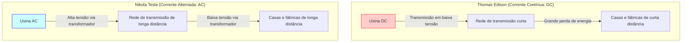
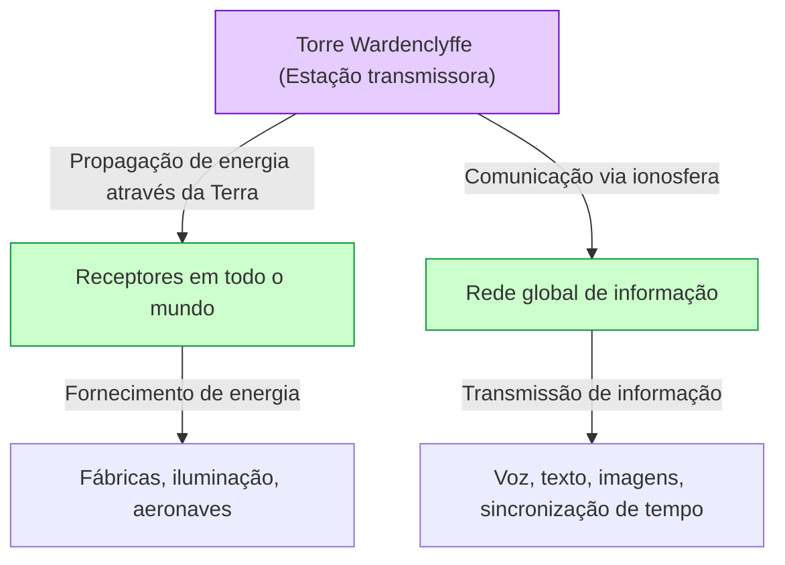

# Nikola Tesla: O Futuro Desenhado pela Corrente Alternada e o Sistema Mundial

Nikola Tesla (1856 - 1943) é um dos maiores e mais misteriosos inventores da história da humanidade. O sistema de Corrente Alternada (AC) que ele desenvolveu tornou-se a base da rede elétrica moderna, estabelecendo os alicerces da vida próspera que desfrutamos todos os dias. No entanto, as suas conquistas não pararam por aí. Ele possuía visões incrivelmente avançadas para a sua época, incluindo tecnologias pioneiras para comunicação sem fio, controle remoto e robótica, além do "Sistema Mundial" (World Wireless System), um conceito para conectar o planeta inteiro em uma gigantesca rede de energia e informação.

Neste artigo, traçaremos a vida deste gênio inventor e ofereceremos uma explicação e análise detalhadas da feroz "Guerra das Correntes" travada contra Thomas Edison, bem como a história completa de seu maior sonho e maior fracasso, a "Torre Wardenclyffe" e o "Sistema Mundial".

## 1. Infância e Talento Nato

Nikola Tesla nasceu em 10 de julho de 1856 na vila de Smiljan, no Império Austríaco (atual Croácia), filho de Milutin, um padre da Igreja Ortodoxa Sérvia, e de Đuka, uma mãe que tinha um talento especial para criar ferramentas domésticas práticas. O próprio Tesla disse mais tarde que herdou de sua mãe o talento para a invenção.

Desde tenra idade, Tesla possuía uma memória impressionante (memória fotográfica) e uma imaginação extraordinária que lhe permitia montar e operar máquinas completamente em sua mente. Diz-se que ele podia construir motores mentalmente e até simular o desgaste das peças, sem nunca desenhar um projeto no papel. Essa habilidade única foi a força motriz por trás de muitas de suas invenções revolucionárias posteriores.

Enquanto estudava na Universidade de Tecnologia de Graz, Tesla conheceu o dínamo de Gramme (um gerador de corrente contínua). Ao observar as faíscas geradas pelo comutador, ele percebeu que isso era um desperdício de energia que reduzia a vida útil da máquina. Foi lá que ele teve a intuição: "Seria possível construir um motor que não precise de um comutador e possa usar a corrente alternada diretamente?" Embora seu professor tenha rejeitado a ideia como "impossível, como construir uma máquina de movimento perpétuo", Tesla não desistiu.

Anos depois, enquanto caminhava por um parque em Budapeste com um amigo, recitando o "Fausto" de Goethe, a inspiração do "campo magnético rotativo" surgiu repentinamente em sua mente. Usando a sua bengala para desenhar um diagrama na terra, ele demonstrou e explicou ao seu amigo o princípio completo do motor de corrente alternada. Este foi o verdadeiro início do sistema de corrente alternada que mudaria o mundo.

## 2. Viagem à América e o Encontro com Edison

Em 1884, Tesla partiu para Nova York, EUA, com o coração cheio de sonhos e esperanças, levando no bolso apenas alguns fundos, uma carta de recomendação e seus próprios poemas e cálculos para máquinas voadoras. A carta de recomendação foi escrita por Charles Batchelor, gerente da subsidiária europeia de Edison, e dizia: "Conheço dois grandes homens. Um é você (Edison) e o outro é este jovem."

Tesla logo começou a trabalhar na empresa de Thomas Edison (Edison Machine Works). Na época, Edison estava se esforçando para comercializar a lâmpada incandescente e construir um sistema de fornecimento de energia de Corrente Contínua (DC) em Nova York. No entanto, o sistema DC tinha uma falha fatal. Devido à dificuldade de alterar a tensão, a energia não podia ser transmitida para longe da usina, exigindo a construção de usinas elétricas a cada poucos quilômetros.

Tesla reprojetou extensivamente os geradores DC de Edison, melhorando drasticamente sua eficiência. Segundo as lembranças de Tesla, Edison prometeu: "Se você conseguir fazer essas melhorias, eu lhe pagarei 50.000 dólares." Tesla trabalhou incansavelmente por meses e resolveu magistralmente essa tarefa difícil. No entanto, quando Tesla pediu a recompensa prometida, Edison riu e disse: "Tesla, você não entende o humor americano", oferecendo apenas um pequeno aumento de salário.

Profundamente decepcionado com esse tratamento, Tesla demitiu-se imediatamente da empresa de Edison. Durante algum tempo depois, ele experimentou o fundo do poço, trabalhando como cavador de valas braçal para sobreviver. Mas mesmo enquanto cavava valas, ele continuou a desenvolver o conceito de seu novo sistema de corrente alternada.

## 3. Guerra das Correntes: Corrente Alternada (AC) vs Corrente Contínua (DC)

Com o apoio de investidores que reconheceram o seu talento, Tesla finalmente estabeleceu a sua própria empresa e começou a desenvolver o seu sistema de corrente alternada a sério. Foi aqui que ele teve um encontro fatídico com o empresário George Westinghouse. Westinghouse percebeu o potencial do sistema de corrente alternada de Tesla, comprou as suas patentes e começou a desenvolver o negócio em conjunto.

Isto desencadeou a histórica "Guerra das Correntes" (War of the Currents).

- **O lado de Edison (Corrente Contínua - DC)**: Já havia feito grandes investimentos e começado a construir infraestrutura. É de baixa tensão e seguro, mas a transmissão a longas distâncias é impossível.
- **O lado de Tesla e Westinghouse (Corrente Alternada - AC)**: Pode transmitir eletricidade a longas distâncias em alta tensão usando transformadores e convertê-la em baixa tensão no ponto de uso. Muito mais eficiente e econômico.

Para proteger os seus negócios, Edison lançou uma campanha difamatória para divulgar os perigos da corrente alternada. Ele recorreu a todos os meios possíveis, desde conduzir demonstrações públicas eletrocutando cães vadios e cavalos com corrente alternada, até conspirar nos bastidores para garantir que a corrente alternada fosse usada na primeira execução em cadeira elétrica do mundo.

No entanto, a superioridade tecnológica e econômica era clara. O diagrama abaixo ilustra conceitualmente a diferença entre sistemas de corrente contínua e corrente alternada.

Houve dois eventos decisivos que determinaram a vitória.
O primeiro foi a Exposição Universal de Chicago em 1893. A Westinghouse venceu o contrato de iluminação oferecendo um preço mais baixo do que o grupo de Edison (General Electric). O sistema de Tesla iluminou de forma segura e espetacular dezenas de milhares de lâmpadas, permitindo que pessoas de todo o mundo testemunhassem a maravilha do sistema de corrente alternada.

O segundo foi o projeto para construir a primeira grande usina hidrelétrica do mundo nas Cataratas do Niágara. Um comitê internacional (presidido por Lord Kelvin) finalmente adotou o sistema AC de Tesla. Em 1896, a energia gerada nas Cataratas do Niágara foi transmitida para a cidade de Buffalo, a cerca de 35 quilômetros de distância, iluminando a cidade. Nesse momento, ficou estabelecido que o sistema de corrente alternada se tornaria o padrão para a infraestrutura de energia do mundo.

## 4. Experimentos em Colorado Springs

Após seu enorme sucesso com o sistema de corrente alternada, Tesla aventurou-se ainda mais no desconhecido: "transmissão de energia sem fio". Era um conceito extraordinário que usava toda a Terra como um condutor para enviar energia e informações para qualquer lugar do mundo sem fios.

Em 1899, ele construiu um laboratório em Colorado Springs, Colorado, para estudar as propriedades elétricas da atmosfera. Lá, ele usou uma gigantesca "Bobina de Tesla" para gerar milhões de volts e conduziu repetidos experimentos gerando raios artificiais.

Tesla afirmou ter descoberto as Ondas Estacionárias da Terra (Earth Stationary Waves) lá. Esse é o fenômeno em que toda a Terra ressoa com vibrações elétricas de uma frequência específica; ele acreditava que, usando esse princípio, a energia poderia ser enviada a um receptor no lado oposto da Terra sem atenuação. Os dados experimentais de Colorado Springs tornaram-se a base do seu próximo grande projeto.

## 5. A Cristalização do Sonho e o Fracasso: Torre Wardenclyffe e o "Sistema Mundial"

Em 1901, Tesla começou a construção da "Torre Wardenclyffe" (Wardenclyffe Tower) em Long Island, Nova York. Foi financiada por J.P. Morgan, um dos homens mais poderosos de Wall Street na época.

O "Sistema Mundial" (World Wireless System) de Tesla ia além da simples comunicação sem fio. De acordo com a sua visão, as seguintes funções seriam concretizadas:

- **Rede de Comunicação Global**: Cotações de ações, notícias e mensagens de voz pessoais poderiam ser enviadas e recebidas instantaneamente em qualquer lugar do mundo.
- **Energia sem Fio Inesgotável**: Qualquer pessoa com uma pequena antena poderia receber eletricidade e operar motores ou luzes, independentemente da localização.
- **Sincronização de Tempo e Navegação**: Sincronização de relógios mundiais com precisão extremamente alta, permitindo que os navios determinassem as suas posições exatas.

Foi uma visão surpreendente que previu a "Internet", os "smartphones", o "GPS" e o "carregamento sem fio" modernos, com um século de antecedência.

No entanto, o projeto logo enfrentou dificuldades. Guglielmo Marconi obteve sucesso na comunicação de rádio transatlântica usando sem permissão as patentes de Tesla (como patentes de múltiplos circuitos de sintonia), atraindo atenção global. Enquanto o sistema de Marconi era simples e barato, a torre de Tesla era complexa e exigia enormes somas de dinheiro.

Tesla pediu a J.P. Morgan mais apoio financeiro, revelando pela primeira vez que "o verdadeiro propósito da torre não é apenas a comunicação, mas a transmissão gratuita de energia". Ouvindo isso, Morgan cortou o financiamento. Ele raciocinou: "Quem vai ler o medidor de energia? (Não se pode lucrar com energia gratuita)."

Sem fundos, Tesla não pôde completar a torre, e durante a Primeira Guerra Mundial em 1917, ela foi dinamitada e demolida pelo governo dos Estados Unidos. Esse fracasso foi a maior tragédia da vida de Tesla, e ele vivenciou um profundo desespero.

## 6. Últimos Anos e Legado

Mesmo após o fracasso da Torre Wardenclyffe, Tesla continuou a inventar. Isso incluiu a turbina sem pás (Turbina de Tesla), o conceito de uma aeronave de decolagem e aterrissagem vertical (VTOL) e a controversa ideia do "Raio da Morte" (Teleforce). No entanto, a falta de fundos impediu que a maioria de suas ideias se concretizasse.

Em seus últimos anos, Tesla viveu uma vida solitária no Quarto 3327 do New Yorker Hotel, em Nova York. Ele amava profundamente os pombos e tornava sua rotina diária alimentá-los no parque. Em 7 de janeiro de 1943, faleceu aos 86 anos de idade. Após sua morte, o FBI confisões os seus cadernos e documentos (alguns foram posteriormente devolvidos aos seus parentes).

## 7. Conclusão

Nikola Tesla foi um homem que priorizou o "progresso da humanidade" acima de seus próprios lucros. Ele quebrou contratos para salvar a Westinghouse da falência, abrindo mão das vastas riquezas que teria ganhado com suas patentes.

O seu "Sistema Mundial" permaneceu inacabado, mas a visão subjacente — "unir o mundo através da tecnologia e enriquecer a vida das pessoas" — foi concretizada na forma da nossa moderna sociedade da internet.

Tesla disse uma vez o seguinte:
*"O presente é deles; o futuro, pelo qual eu realmente trabalhei, é meu."*

Hoje, quando acendemos o interruptor, as luzes se acendem, e quando acessamos informações de todo o mundo nos nossos smartphones, é porque estamos a viver parte do futuro que ele imaginou. Nikola Tesla será eternamente gravado na história como "o homem que inventou o futuro".
