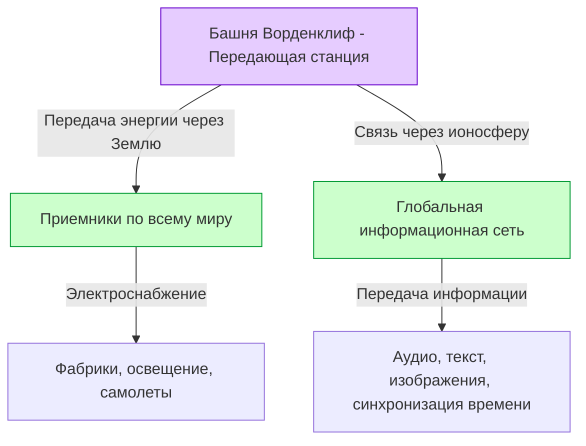

# Никола Тесла: Будущее, нарисованное переменным током и Мировой системой

Никола Тесла (1856 - 1943) — один из величайших и наиболее таинственных изобретателей в истории человечества. Разработанная им система переменного тока (AC) стала основой современных электросетей и заложила фундамент богатой жизни, которой мы наслаждаемся каждый день. Но на этом его достижения не заканчиваются. Он был пионером в области радиосвязи, дистанционного управления, робототехники, а также вынашивал слишком уж дальновидную для того времени идею — «Мировую беспроводную систему» (World Wireless System), которая должна была соединить всю планету в единую глобальную сеть энергии и информации.

В этой статье мы подробно рассмотрим жизнь этого гениального изобретателя, расскажем ожесточенную «Войну токов» с Томасом Эдисоном, а также обсудим его самую большую мечту и самую большую неудачу — башню Ворденклиф и «Мировую систему», с подробными пояснениями и размышлениями на несколько тысяч слов.

## 1. Детство и природный дар

Никола Тесла родился 10 июля 1856 года в деревне Смилян Австрийской империи (современная Хорватия). Его отец Милутин был сербским православным священником, а мать Георгина (Джука) обладала талантом создавать удобные в быту инструменты. Сам Тесла позже говорил, что унаследовал свой изобретательский талант от матери.

С самого раннего возраста Тесла обладал феноменальной (эйдетической) памятью и необычайным воображением, позволявшим ему полностью собирать и запускать машины у себя в голове. Говорят, что он мог собирать двигатель в уме, вплоть до симуляции износа деталей, не рисуя чертежей на бумаге. Эта уникальная способность стала движущей силой для многих его будущих революционных изобретений.

Во время учебы в Техническом университете Граца Тесла познакомился с динамо-машиной Грамма (генератором постоянного тока). Увидев искры, исходящие от коммутатора, он понял, что это пустая трата энергии, сокращающая срок службы машины. Именно тогда у него возникла интуитивная мысль: «Возможно ли создать двигатель, который будет использовать переменный ток напрямую, без коммутатора?». Профессор отверг эту идею, заявив, что это сродни созданию вечного двигателя и невозможно, но Тесла не сдался.

Несколько лет спустя, прогуливаясь с другом по парку в Будапеште и декламируя «Фауста» Гёте, он внезапно озарился идеей «вращающегося магнитного поля». Рисуя схему на земле тростью, он продемонстрировал и объяснил другу полный принцип работы двигателя переменного тока. Это стало истинным началом эры переменного тока, изменившего мир.

## 2. Поездка в Америку и встреча с Эдисоном

В 1884 году Тесла отправился в Нью-Йорк, Америку, с небольшими сбережениями, рекомендательным письмом и расчетами для своих стихов и летательного аппарата в кармане, полный надежд и мечтаний. Рекомендательное письмо было от Чарльза Бэтчелора, главы европейского отделения Эдисона, в котором говорилось: «Я знаю двух великих людей. Один из них — вы (Эдисон), а другой — этот молодой человек».

Тесла сразу же начал работать в компании Томаса Эдисона (Edison Machine Works). В то время Эдисон коммерциализировал лампу накаливания и пытался построить в Нью-Йорке систему электроснабжения постоянного тока (DC). Однако у системы постоянного тока был фатальный недостаток. Из-за сложности преобразования напряжения передавать электроэнергию на большие расстояния от электростанции было невозможно, и электростанции приходилось строить каждые несколько километров.

Тесла значительно улучшил конструкцию генератора постоянного тока Эдисона, кардинально повысив его эффективность. По воспоминаниям Теслы, Эдисон пообещал: «Если тебе удастся это улучшить, я заплачу тебе 50 000 долларов». Тесла работал день и ночь несколько месяцев и блестяще решил эту сложную задачу. Однако, когда Тесла попросил обещанное вознаграждение, Эдисон рассмеялся и сказал: «Тесла, кажется, вы не понимаете американский юмор», предложив лишь небольшое повышение зарплаты.

Глубоко разочарованный таким отношением, Тесла немедленно уволился из компании Эдисона. После этого он пережил период глубокой нищеты, зарабатывая на жизнь поденной работой по рытью канав. Однако даже во время этой работы он продолжал обдумывать концепцию своей новой системы переменного тока.

## 3. Война токов: Переменный (AC) против Постоянного (DC)

При поддержке инвесторов, оценивших талант Теслы, он наконец основал собственную компанию и всерьез занялся разработкой системы переменного тока. Здесь произошла судьбоносная встреча с бизнесменом Джорджем Вестингаузом. Вестингауз увидел потенциал системы переменного тока Теслы, выкупил его патенты и начал совместное развитие бизнеса.

Так разразилась историческая «Война токов» (War of the Currents).

- **Лагерь Эдисона (Постоянный ток, DC)**: Уже вложили огромные средства и начали строить инфраструктуру. Низкое напряжение и безопасность, но невозможна передача на большие расстояния.
- **Лагерь Теслы и Вестингауза (Переменный ток, AC)**: Можно передавать электричество на большие расстояния при высоком напряжении с использованием трансформаторов и преобразовывать его в низкое напряжение в месте использования. Гораздо более эффективно и экономично.

Чтобы защитить свой бизнес, Эдисон развернул негативную кампанию, распространяя информацию об опасности переменного тока. Он не гнушался никакими методами: проводил публичные эксперименты, убивая переменным током бродячих собак и лошадей, и даже тайно организовал использование переменного тока в первой в мире казни на электрическом стуле.

Тем не менее, техническое и экономическое превосходство было очевидным. На следующем рисунке концептуально показаны различия между системами постоянного и переменного тока.

```mermaid
graph TD
    subgraph "Томас Эдисон - Постоянный ток: DC"
        A["Электростанция DC"] -- "Передача при низком напряжении" --> B["Короткая электросеть"]
        B -- "Большие потери мощности" --> C["Близлежащие дома и фабрики"]
        style A fill:#ffcccc,stroke:#ff0000
    end

    subgraph "Никола Тесла - Переменный ток: AC"
        D["Электростанция AC"] -- "Повышение напряжения трансформатором" --> E["Линия электропередач большой дальности"]
        E -- "Понижение напряжения трансформатором" --> F["Удаленные дома и фабрики"]
        style D fill:#ccffff,stroke:#0000ff
    end
```

Исход войны решили два ключевых события.
Во-первых, Всемирная выставка в Чикаго 1893 года. Компания Вестингауза выиграла контракт на освещение, предложив более низкую цену, чем лагерь Эдисона (General Electric). Система Теслы безопасно и грандиозно зажгла десятки тысяч лампочек, продемонстрировав всему миру великолепие системы переменного тока.

Во-вторых, проект строительства первой в мире гигантской гидроэлектростанции на Ниагарском водопаде. Международная комиссия (под председательством лорда Кельвина) в итоге выбрала систему переменного тока Теслы. В 1896 году электроэнергия, выработанная на Ниагарском водопаде, была передана в город Буффало, находящийся примерно в 35 километрах от него, и ярко осветила город. В этот момент стало окончательно ясно, что система переменного тока станет стандартом для мировой энергетической инфраструктуры.

## 4. Эксперименты в Колорадо-Спрингс

Добившись огромного успеха с системой переменного тока, Тесла вступил на еще более неизведанную территорию: «Беспроводная передача энергии». Это была грандиозная идея использовать всю Землю в качестве проводника и передавать энергию и информацию в любую точку мира без использования проводов.

В 1899 году он построил лабораторию в Колорадо-Спрингс (штат Колорадо) для изучения электрических свойств атмосферы. Здесь он использовал гигантскую «Катушку Теслы», способную генерировать сверхвысокое напряжение в несколько миллионов вольт, и неоднократно проводил эксперименты по созданию искусственных молний.

Тесла утверждал, что именно здесь он открыл стоячие волны Земли (Earth Stationary Waves). Это явление, при котором вся Земля резонирует с электрическими колебаниями определенной частоты. Он считал, что, используя этот принцип, можно передавать энергию приемнику на другой стороне Земли без затухания. Данные экспериментов в Колорадо-Спрингс легли в основу его следующего грандиозного проекта.

## 5. Воплощение мечты и крах: Башня Ворденклиф и "Мировая система"

В 1901 году Тесла начал строительство «Башни Ворденклиф» (Wardenclyffe Tower) на Лонг-Айленде, Нью-Йорк. Финансирование предоставил тогдашний финансовый магнат Дж. П. Морган.

«Мировая беспроводная система» Теслы выходила далеко за рамки простой радиосвязи. По его замыслу, должны были быть реализованы следующие функции:

- **Глобальная сеть связи**: Независимо от того, где вы находитесь в мире, вы сможете мгновенно отправлять и получать биржевые котировки, новости и личные голосовые сообщения.
- **Неисчерпаемая беспроводная энергия**: С небольшой антенной можно получать электроэнергию в любом месте для работы двигателей и освещения.
- **Синхронизация времени и навигация**: Часы по всему миру будут синхронизированы с высочайшей точностью, что позволит судам точно определять свое текущее положение.

Это было поразительное видение, которое предвидело появление современных «интернета», «смартфонов», «GPS» и «беспроводной зарядки» за целых 100 лет до их появления.

Однако проект вскоре столкнулся с трудностями. Гульельмо Маркони без разрешения использовал патенты Теслы (например, патенты на многоконтурную настройку), добился успеха в трансатлантической радиосвязи и привлек мировое внимание. Система Маркони была простой и дешевой, в то время как башня Теслы была сложной и требовала огромных средств.

Тесла обратился к Дж. П. Моргану за дополнительным финансированием и впервые признался: «Истинная цель башни — не только связь, но и бесплатная передача энергии». Услышав это, Морган прекратил финансирование. Он рассудил: «Кто будет снимать показания счетчиков энергии? (Невозможно получить прибыль от бесплатной энергии)».

Из-за нехватки средств Тесла не смог завершить строительство башни, и во время Первой мировой войны в 1917 году правительство США взорвало и демонтировало её. Эта неудача стала самой большой трагедией в жизни Теслы, и он впал в глубокое отчаяние.

## 6. Поздние годы и наследие

Даже после провала с башней Ворденклиф Тесла продолжал изобретать. Это и безлопастная турбина (турбина Теслы), и концепция аппарата вертикального взлета и посадки (VTOL), и неоднозначная идея «лучей смерти» (Teleforce). Однако большинство его идей не было реализовано из-за отсутствия финансирования.

В последние годы жизни Тесла вел уединенный образ жизни в номере 3327 отеля New Yorker в Нью-Йорке. Он очень любил голубей, и кормление голубей в парке стало его ежедневной рутиной. Он скончался 7 января 1943 года в возрасте 86 лет. После его смерти ФБР конфисковало его записи и статьи (позже часть из них была возвращена родственникам).

## 7. Заключение

Никола Тесла был человеком, который ставил «прогресс человечества» выше собственной выгоды. Он даже расторг контракт, чтобы спасти компанию Вестингауза от банкротства, и отказался от огромного богатства, которое мог бы получить благодаря своим патентам.

Его «Мировая система» осталась незавершенной, но лежащее в ее основе видение — «объединить мир с помощью технологий и обогатить жизнь людей» — воплотилось в форме современного интернет-общества.

Одно из высказываний Теслы звучит так:
*«Настоящее может принадлежать им. Но будущее, ради которого я действительно работал, — мое».*

Тот факт, что сегодня мы можем включить свет одним нажатием выключателя и получить доступ к информации со всего мира с помощью смартфона, является ничем иным, как доказательством того, что мы живем в части того будущего, которое он себе представлял. Никола Тесла навсегда останется в истории как человек, который буквально «изобрел будущее».
