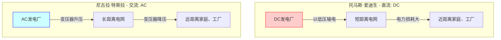
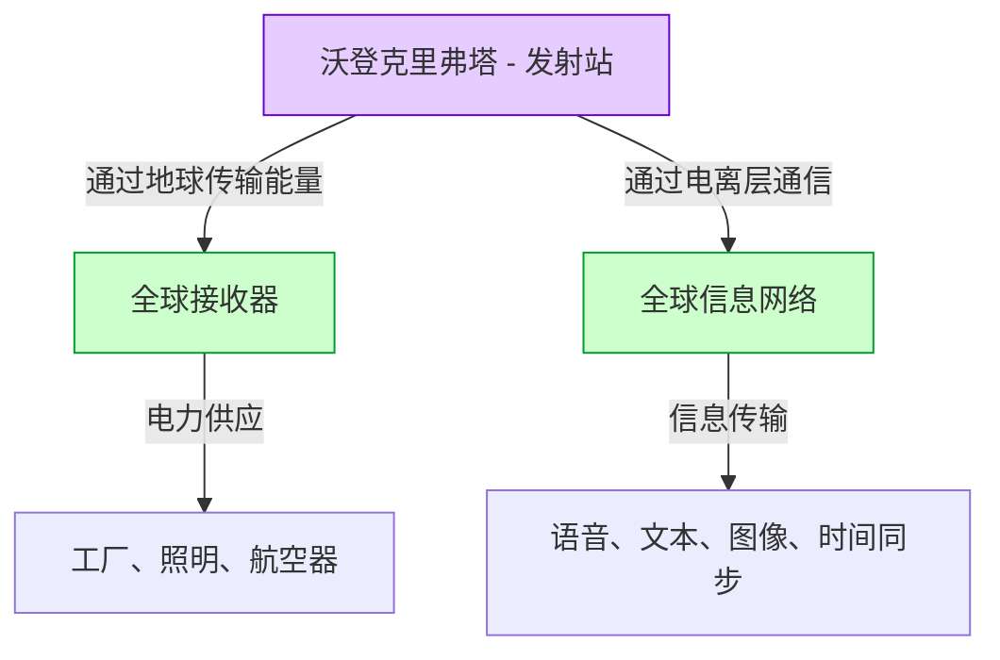

# 尼古拉·特斯拉：交流电与世界系统描绘的未来

尼古拉·特斯拉（1856年 - 1943年）是人类历史上最伟大、也最充满神秘魅力的发明家之一。他开发的交流电（AC）系统成为了现代电网的基础，为我们日常享受的丰富生活奠定了根基。然而，他的成就远不止于此。他还孕育了无线通信、遥控、机器人技术的先驱技术，甚至是将整个地球用一个巨大的能量和信息网络连接起来的“世界系统（World Wireless System）”——这是一个在当时看来过于超前的构想。

本文将回顾这位天才发明家的一生，详细解说和考察他与托马斯·爱迪生之间展开的激烈“电流之战”，以及他最大的梦想与最大的挫折——“沃登克里弗塔”与“世界系统”的全貌，为您带来长达数千字的深度解析。

## 1. 童年与天赋异禀

1856年7月10日，尼古拉·特斯拉出生于奥地利帝国（现克罗地亚）的斯米连村。他的父亲米卢廷是塞尔维亚东正教的牧师，母亲久卡则拥有制作家庭便利工具的天赋。特斯拉后来曾说，他的发明才华是继承自母亲的。

从小，特斯拉就展现出惊人的记忆力（图像记忆）以及能在脑海中完全组装并运转机械的超凡想象力。据说他无需在纸上画图纸，就能在脑内组装电机，甚至模拟零件的磨损情况。这种独特的能力成为了他后来创造出众多突破性发明的原动力。

在格拉茨科技大学学习期间，特斯拉接触到了格拉姆发电机（直流发电机）。他看到换向器产生火花，意识到这是能量的浪费，并缩短了机器的寿命。在此，他萌生了一个直觉：“能不能制造出一种不需要换向器，直接利用交流电的电动机？”尽管教授否定了这一想法，认为“这就像制造永动机一样是不可能的”，但特斯拉并没有放弃。

几年后，当他与朋友在布达佩斯的公园里散步并背诵歌德的《浮士德》时，“旋转磁场”的灵感突然闪现在他的脑海中。他用手杖在地上画图，向朋友展示并解释了交流电动机的完整原理。这正是改变世界的交流系统的真正开端。

## 2. 前往美国与结识爱迪生

1884年，特斯拉口袋里只有少许资金、一封推荐信，以及自己写的诗和关于航空器的计算书，怀揣梦想和希望前往美国纽约。这封推荐信来自爱迪生欧洲公司的负责人查尔斯·巴奇勒，上面写着：“我认识两位伟人。一位是你（爱迪生），另一位就是这个年轻人。”

特斯拉很快开始在托马斯·爱迪生的公司（爱迪生机器厂）工作。当时的爱迪生正致力于使白炽灯实用化，并努力在纽约建立直流（DC）供电系统。但是，直流系统存在致命缺陷。由于难以转换电压，它无法将电力输送到远离发电厂的地方，必须每隔几公里建一座发电厂。

特斯拉大幅改进了爱迪生的直流发电机设计，使其效率飞跃性提升。根据特斯拉的回忆，爱迪生曾承诺：“如果你能成功完成这项改进，我就付给你5万美元。”特斯拉不眠不休地工作了几个月，完美解决了这个难题。然而，当特斯拉要求兑现承诺时，爱迪生却笑着说：“特斯拉，你好像不懂美国人的幽默”，最后只提供了一点微薄的加薪。

对这种待遇深感失望的特斯拉立刻辞去了爱迪生公司的工作。此后的一段时间里，他经历了靠做挖沟日结工糊口的最底层生活。但是，即使在挖沟的工作中，他依然在不断构思新的交流系统。

## 3. 电流之战：交流（AC） vs 直流（DC）

在对特斯拉才华感到惋惜的投资者们的支持下，特斯拉终于成立了自己的公司，并正式开始开发交流系统。在这里，他命运般地遇到了实业家乔治·威斯汀豪斯。威斯汀豪斯看出了特斯拉交流系统的潜力，买下了他的专利，并开始共同拓展业务。

至此，名留青史的“电流之战（War of the Currents）”爆发了。

- **爱迪生阵营（直流·DC）**：已经进行了大量投资，并开始构建基础设施。低压下虽然安全，但无法进行长距离输电。
- **特斯拉＆威斯汀豪斯阵营（交流·AC）**：使用变压器进行高压长距离输电，在终端降压使用。效率更高，也更经济。

为了保护自己的商业利益，爱迪生展开了宣扬交流电危险性的负面宣传。他甚至不择手段，进行了用交流电电死流浪狗和马的公开实验，并在暗中操作，使世界上首次电椅死刑使用了交流电。

然而，技术和经济上的优势是显而易见的。下图概念性地展示了直流系统和交流系统之间的区别。

决定胜负的关键事件有两个。
第一个是1893年的芝加哥世博会。威斯汀豪斯公司以低于爱迪生阵营（通用电气公司）的投标价格赢得了照明合同。特斯拉的系统安全且壮观地照亮了数万盏灯泡，让全世界的人们亲眼目睹了交流系统的卓越。

第二个是尼亚加拉瀑布世界首座巨型水力发电厂的建设项目。国际委员会（由开尔文勋爵担任主席）最终采用了特斯拉的交流系统。1896年，尼亚加拉瀑布发出的电力被输送到约35公里外的布法罗市，照亮了这座城市。这一刻，交流系统确立了其作为全球能源基础设施标准的地位。

## 4. 科罗拉多斯普林斯的实验

在交流系统取得巨大成功后，特斯拉踏入了进一步的未知领域：“无线输电”。这是一个将整个地球作为导体，不用电线就将能量和信息输送到世界任何角落的惊人构想。

1899年，为了研究大气的电学性质，他在科罗拉多州科罗拉多斯普林斯建立了一个实验室。在这里，他使用了能产生数百万伏超高压的巨大“特斯拉线圈”，反复进行产生人造闪电的实验。

特斯拉声称在这里发现了地球驻波（Earth Stationary Waves）。这是一种整个地球会对特定频率的电学振动产生共鸣的现象，他认为利用这个原理，就可以向地球另一端的接收器无损耗地输送能量。在科罗拉多斯普林斯的实验数据成为了他下一个宏伟项目的基础。

## 5. 梦想的结晶与挫折：沃登克里弗塔与“世界系统”

1901年，特斯拉在纽约长岛开始建造“沃登克里弗塔（Wardenclyffe Tower）”。提供资金的是当时的金融巨头J.P.摩根。

特斯拉的“世界系统（World Wireless System）”不仅仅是无线通信。根据他的构想，将实现以下功能：

- **全球通信网**：无论在世界何处，都能瞬间收发股市行情、新闻和个人语音信息。
- **无尽的无线电力**：只要拥有小型天线，就能在任何地方接收电力，驱动电机和照明。
- **时间同步与导航**：以极高精度同步全球的钟表，使船只能够准确掌握当前位置。

这正是提前100年预见了现代“互联网”、“智能手机”、“GPS”和“无线充电”的惊人愿景。

然而，项目很快面临困难。伽利尔摩·马可尼擅自使用了特斯拉的专利（如多个调谐电路专利等），成功进行了跨大西洋无线电通信，引起了世界的瞩目。马可尼的系统简单且成本低廉，而特斯拉的塔却复杂且需要巨额资金。

特斯拉向J.P.摩根请求进一步的资金援助，并在此首次透露“这座塔的真正目的不仅是通信，还有能量的免费传输”。然而，摩根听后切断了资金援助。因为他认为“那谁来读取能量表呢？（无法从免费能量中获利）”。

资金枯竭的特斯拉未能完成塔的建设，在第一次世界大战期间的1917年，美国政府炸毁并拆除了这座塔。这次失败是特斯拉人生中最大的悲剧，他陷入了深深的绝望。

## 6. 晚年与遗产

沃登克里弗塔失败后，特斯拉依然在继续发明。无叶片涡轮机（特斯拉涡轮机）、垂直起降飞行器（VTOL）的概念，以及备受争议的“死光（Teleforce）”想法等。然而，由于缺乏资金，他的许多想法未能实现。

晚年的特斯拉在纽约的纽约客酒店3327号房间过着孤独的生活。他深爱着鸽子，每天去公园喂鸽子成了他的日常。1943年1月7日，他与世长辞，享年86岁。他死后，联邦调查局没收了他的笔记和论文（后来部分归还给了他的亲属）。

## 7. 结语

尼古拉·特斯拉是一个将“人类进步”置于自身利益之上的人。他甚至为了拯救威斯汀豪斯公司免于破产而毁弃了合同，放弃了本可以从自己的专利中获得的巨额财富。

他的“世界系统”最终未完成，但其底层的愿景——“通过技术将世界连为一体，丰富人们的生活”——已经以现代互联网社会的形式得以实现。

特斯拉曾说过这样一句话：
*“现在可能是他们的。但我真正为之工作的未来，是属于我的。”*

今天，当我们按下开关灯就亮起，用智能手机就能获取世界各地的信息，正是因为我们生活在他所描绘的未来的一部分中。尼古拉·特斯拉作为“发明未来的男人”，其名字将永远镌刻在历史中。
