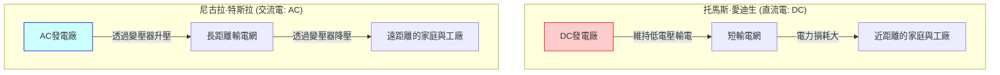
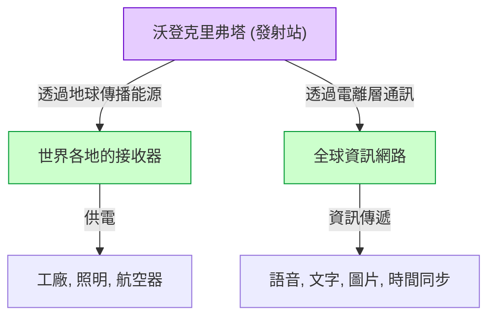

# 尼古拉·特斯拉：交流電與世界系統描繪的未來

尼古拉·特斯拉（1856年 - 1943年）是人類歷史上最偉大、也最充滿神祕魅力的發明家之一。他開發的交流電（AC）系統成為現代電網的基礎，奠定了我們每天享受的豐富生活的基石。然而，他的貢獻不僅於此。他還構思了無線通訊、遠端控制、機器人技術的先驅技術，甚至抱持著將整個地球連結成一個巨大的能源與資訊網路的「世界系統（World Wireless System）」——這在當時是一個過於有遠見的構想。

本文將帶您回顧這位天才發明家的一生，並對他與托馬斯·愛迪生之間展開的激烈「電流大戰」，以及他最大的夢想也是最大的挫折「沃登克里弗塔」與「世界系統」的全貌，進行數千字的詳細解說與考察。

## 1. 幼年時期與天賦異稟

尼古拉·特斯拉於1856年7月10日出生在奧地利帝國（現今的克羅埃西亞）的斯米良村。他的父親米盧廷是一位塞爾維亞東正教神父，母親杜卡則擁有自製家用便利工具的才能。特斯拉後來曾表示，自己的發明天賦是遺傳自母親。

從小，特斯拉就擁有驚人的記憶力（圖像記憶）以及非凡的想像力，能夠在腦海中完整組裝並運轉機械。據說他不需要在紙上畫設計圖，就能在腦內組裝馬達，甚至模擬零件的磨損情況。這種特異的能力成為他日後創造出無數劃時代發明的原動力。

在格拉茲科技大學學習時，特斯拉接觸到了格拉姆直流發電機。他看到換向器產生火花，意識到這是能源的浪費，並會縮短機器的壽命。在此他產生了直覺：「是不是可以製造出不需要換向器、直接利用交流電的馬達？」雖然教授否定了他，認為「那就像製造永動機一樣不可能」，但特斯拉並沒有放棄。

幾年後，當他與朋友在布達佩斯的公園散步並背誦歌德的《浮士德》時，腦海中突然閃現了「旋轉磁場」的靈感。他用手杖在地上畫圖，向朋友展示並解釋了交流馬達的完整原理。這正是改變世界的交流系統真正的開端。

## 2. 赴美與愛迪生的相遇

1884年，特斯拉口袋裡只帶著少許資金、一封推薦信，以及自己寫的詩和關於航空器的計算書，滿懷夢想與希望來到了美國紐約。推薦信是愛迪生歐洲分公司負責人查爾斯·巴奇勒寫的，上面寫道：「我認識兩位偉大的人。一位是你（愛迪生），另一位就是這個年輕人。」

特斯拉很快就開始在托馬斯·愛迪生的公司（愛迪生機器廠）工作。當時的愛迪生正致力於白熾燈泡的實用化，並努力在紐約建立直流電（DC）供電系統。然而，直流系統存在致命的缺陷。由於電壓難以轉換，無法將電力輸送到離發電廠很遠的地方，必須每隔幾公里就建造一座發電廠。

特斯拉大幅改進了愛迪生直流發電機的設計，使效率飛躍性地提升。根據特斯拉的回憶，愛迪生曾承諾：「如果你能成功完成這項改進，我就付你5萬美元。」特斯拉幾個月來不眠不休地工作，出色地解決了這個難題。然而，當特斯拉要求兌現報酬時，愛迪生卻笑著說：「特斯拉，你似乎不懂美國人的幽默」，僅僅提出給他微幅加薪。

對此深感失望的特斯拉立刻辭去了愛迪生公司的職務。在此之後的一段時間裡，他經歷了做日薪挖溝工人的底層生活。然而，即使在挖溝的工作中，他依然持續構思著新的交流系統。

## 3. 電流大戰：交流電（AC） vs 直流電（DC）

在那些惋惜特斯拉才華的投資者支持下，特斯拉終於成立了自己的公司，正式展開交流系統的開發。在這裡，他完成了命運般的相遇，結識了實業家喬治·威斯汀豪斯（George Westinghouse）。威斯汀豪斯看出了特斯拉交流系統的潛力，買下了他的專利，並開始共同拓展事業。

至此，名留青史的「電流大戰（War of the Currents）」爆發了。

- **愛迪生陣營（直流電・DC）**：已經投入大量資金，開始建設基礎設施。低電壓較為安全，但無法長距離輸電。
- **特斯拉與威斯汀豪斯陣營（交流電・AC）**：使用變壓器以高電壓進行長距離輸電，並在用戶端轉換為低電壓。效率更高，也更經濟。

愛迪生為了保護自己的生意，展開了宣傳交流電危險性的負面活動。他舉行了用交流電電死流浪狗和馬的公開實驗，甚至在暗中操作，讓世界上第一張電椅處刑使用交流電，真是不擇手段。

然而，技術與經濟上的優勢是顯而易見的。下圖概念性地展示了直流系統與交流系統的差異。

有兩件決定性的事件分出了勝負。
第一件是1893年的芝加哥世界博覽會。威斯汀豪斯公司以低於愛迪生陣營（通用電氣公司）的投標價格贏得了照明合約。特斯拉的系統安全且壯觀地同時點亮了數萬顆燈泡，讓全世界的人們親眼目睹了交流系統的卓越之處。

第二件是在尼加拉瀑布建設世界第一座巨大水力發電廠的計畫。國際委員會（由開爾文勳爵擔任主席）最終採用了特斯拉的交流系統。1896年，尼加拉瀑布產生的電力被輸送到約35公里外的水牛城，照亮了整座城市。這一刻，確定了交流系統將成為全球能源基礎設施的標準。

## 4. 在科羅拉多泉的實驗

在交流系統取得巨大成功後，特斯拉踏入了更進一步的未知領域：「無線輸電」。這是一個將整個地球作為導體，不使用電線就能將能源和資訊傳送到世界任何角落的驚人構想。

1899年，為了研究大氣的電氣特性，他在科羅拉多州科羅拉多泉建立了實驗室。在這裡，他使用能產生數百萬伏特超高電壓的巨大「特斯拉線圈」，反覆進行產生人造閃電的實驗。

特斯拉聲稱他在這裡發現了「地球駐波」（Earth Stationary Waves）。這是一種整個地球會對特定頻率的電氣震盪產生共鳴的現象，他認為利用這個原理，就能將能量不衰減地傳送給位於地球另一端的接收器。科羅拉多泉的實驗數據，成為了他下一個宏偉計畫的基礎。

## 5. 夢想的結晶與挫折：沃登克里弗塔與「世界系統」

1901年，特斯拉在紐約州長島開始建造「沃登克里弗塔（Wardenclyffe Tower）」。提供資金的是當時的金融界巨頭 J.P. 摩根。

特斯拉的「世界系統（World Wireless System）」不僅限於無線通訊。根據他的構想，應該能實現以下功能：

- **全球通訊網**：無論在世界何處，都能瞬間收發股市行情、新聞和個人語音訊息。
- **取之不盡的無線電力**：只要擁有小型天線，不論在哪裡都能接收電力，驅動馬達或照明設備。
- **時間同步與導航**：以極高的精度同步全世界的時鐘，並讓船隻能準確掌握目前位置。

這簡直是在100年前就預見了現代「網際網路」、「智慧型手機」、「GPS」和「無線充電」的驚人願景。

然而，計畫很快就面臨了困難。古列爾莫·馬可尼未經許可使用了特斯拉的專利（如多個調諧電路專利等），成功實現了跨大西洋無線通訊，引起了全球關注。馬可尼的系統簡單且成本低廉，而特斯拉的高塔則複雜且需要龐大資金。

特斯拉向 J.P. 摩根尋求進一步的資金援助，並在此時首次透露「這座塔的真正目的不僅是通訊，還有能源的免費傳輸」。然而，摩根聽到這番話後便中斷了資金援助。因為他認為：「這樣誰來讀電表？（無法從免費能源中獲得利潤）」。

資金枯竭的特斯拉無法完成高塔，在第一次世界大戰期間的1917年，美國政府將高塔炸毀並拆除。這次失敗是特斯拉人生中最大的悲劇，讓他嚐到了深深的絕望。

## 6. 晚年與遺產

沃登克里弗塔失敗後，特斯拉依然繼續發明。包括無葉片渦輪機（特斯拉渦輪機）、垂直起降飛機（VTOL）的概念，以及引發爭議的「死光（Teleforce）」構想等。然而，他的許多想法都因為缺乏資金而未能實現。

晚年的特斯拉在紐約紐約客飯店的3327號房裡過著孤獨的生活。他非常熱愛鴿子，每天都會去公園餵鴿子。1943年1月7日，他以86歲高齡離開了人世。他死後，FBI沒收了他的筆記和論文（後來部分歸還給了他的親屬）。

## 7. 結語

尼古拉·特斯拉是一位將「人類的進步」置於個人利益之上的人。他甚至不惜撕毀合約來拯救威斯汀豪斯公司免於破產，放棄了本應從自己專利中獲得的龐大財富。

他的「世界系統」雖然未能完成，但其根本的願景——「透過技術將世界連結在一起，豐富人們的生活」——已經以現代網際網路社會的形式實現了。

特斯拉曾留下這樣一句話：
*「現在也許是他們的，但我真正為之努力的未來，是我的。」*

今天，我們只要打開開關就能點亮電燈，使用智慧型手機就能獲取世界各地的資訊，這正是因為我們生活在他所描繪的未來的一部分之中。尼古拉·特斯拉作為「發明未來的人」，他的名字將永遠鐫刻在歷史上。
