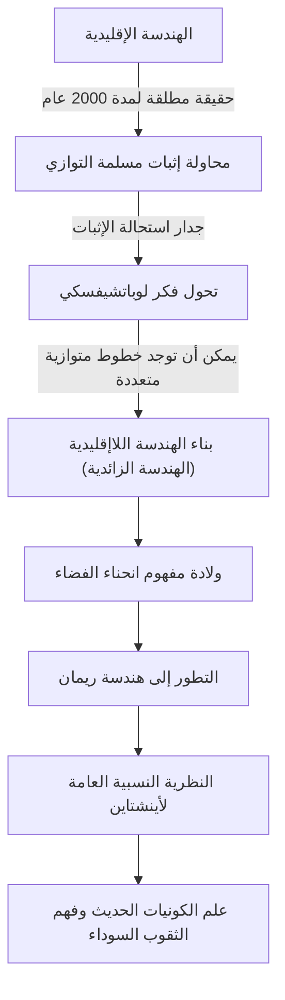
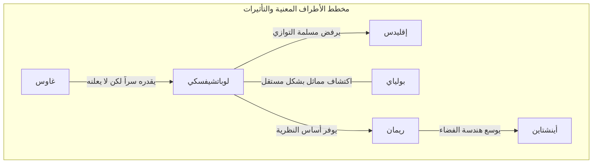

# نيكولاي لوباتشيفسكي: 'كوبرنيكوس الهندسة' الذي فتح أبواب الهندسة اللاإقليدية

في تاريخ الرياضيات، قلائل هم الأشخاص الذين قلبوا الفطرة السليمة القائمة رأساً على عقب وقدموا رؤية جديدة للعالم. من بين هؤلاء، يبرز نيكولاي إيفانوفيتش لوباتشيفسكي (Nikolai Ivanovich Lobachevsky, 1792–1856) كعالم رياضيات عظيم كسر قيود "الهندسة الإقليدية"، التي اعتبرت حقيقة مطلقة لأكثر من 2000 عام، ومهد الطريق للرياضيات والفيزياء الحديثة.

وكما وصفه عالم الرياضيات البريطاني ويليام كليفورد بأنه "كوبرنيكوس الهندسة"، فإن اكتشافه لم يقتصر على فرع من فروع الرياضيات، بل غير جذرياً فهم البشرية للكون. في هذا المقال، سنتعمق في حياة لوباتشيفسكي المضطربة، وأفكاره وفلسفته، وتأثيره الذي لا يُقاس على الأجيال القادمة.

## الفقر والشغف: الصحوة في جامعة قازان

ولد نيكولاي لوباتشيفسكي عام 1792 في نيجني نوفغورود بالإمبراطورية الروسية. توفي والده عندما كان لا يزال صغيراً، وسقطت الأسرة في فقر مدقع. وفي ظل هذه الحياة القاسية، انتقلت والدته إلى قازان لتعليم أطفالها. كان هذا القرار هو الشرارة الأولى التي أنجبت عبقري الرياضيات لاحقاً.

في عام 1807، التحق بجامعة قازان المنشأة حديثاً كطالب حاصل على منحة دراسية. كان يطمح في البداية لدراسة الطب، لكنه التقى بعالم الرياضيات البارز مارتن بارتيلس (الذي كان أيضاً معلم كارل فريدريش غاوس)، وأصبح مفتوناً بالسحر العميق للرياضيات. تحت إشراف بارتيلس، أظهر لوباتشيفسكي موهبة ملحوظة وحصل على درجة الماجستير في سن 21 فقط. بعد ذلك، ارتقى السلم الأكاديمي بسرعة غير مسبوقة، ليصبح أستاذاً استثنائياً في سن 24.

ارتبطت حياته بجامعة قازان. ليس كأستاذ فحسب، بل كمدير للمكتبة، ومدير للمرصد، ورئيس للجامعة في سن مبكرة تبلغ 35 عاماً، حيث كرس نفسه لتحديث الجامعة والتطوير التعليمي. وعندما تفشى وباء الكوليرا، قاد بنفسه جهود عزل الحرم الجامعي وإدارة النظافة، مما أنقذ حياة العديد من الطلاب. هذه القصة تثبت أنه لم يكن مجرد ساكن في برج عاجي، بل شخصية تتمتع بإحساس عميق بالمسؤولية والقدرة على العمل.

## تحدي "مسلمة التوازي": ولادة الهندسة اللاإقليدية

ما جعل اسم لوباتشيفسكي خالداً في التاريخ هو تحديه لـ "مسلمة التوازي (المسلمة الخامسة)" في كتاب "الأصول" لإقليدس.

منذ القرن الثالث قبل الميلاد، اُعتبرت هذه المسلمة التي تنص على أنه "من نقطة خارج خط مستقيم، لا يمكن رسم سوى خط موازٍ واحد" حقيقة بديهية. لقرون، حاول عدد لا يحصى من علماء الرياضيات إثبات هذه المسلمة من المسلمات الأربع الأخرى، لكن جميع محاولاتهم باءت بالفشل.

تكمن ابتكارية لوباتشيفسكي في التخلي عن نهج "محاولة الإثبات" والوصول إلى فكرة معاكسة مفادها "أنه قد تكون هناك هندسة لا تنطبق فيها مسلمة التوازي". في عام 1826، افترض بديهية جديدة تفيد بأنه "يوجد عدد لا نهائي من الخطوط الموازية التي تمر بنقطة خارج خط مستقيم"، ومن هناك بنى نظاماً هندسياً جديداً ومتسقاً تماماً. هذا ما عُرف لاحقاً بـ "الهندسة الزائدية (هندسة لوباتشيفسكي)".

يوضح المخطط أدناه كيف كسر اكتشاف لوباتشيفسكي الإطار التقليدي وارتبط بعلوم المستقبل.

## الكفاح الوحيد والفلسفة التي لا تقهر

في عام 1829، نشر اكتشافاته في بحث بعنوان "حول أسس الهندسة" في نشرة جامعة قازان. ومع ذلك، لم تفهم الأوساط الأكاديمية في ذلك الوقت نظريته الرائدة على الإطلاق.

انتقده علماء الرياضيات البارزون في روسيا بشدة، ووصفوه بأنه "خارج عن المألوف" و"وهم لا معنى له"، وتم رفض نشر أعماله في المجلات الأكاديمية. غاوس، عملاق عالم الرياضيات الذي قام باكتشاف مماثل في نفس الوقت، أشاد بلوباتشيفسكي تقديراً كبيراً في رسالة خاصة، لكنه لم يدعمه علناً خوفاً من الإضرار بسمعته. (اكتشف يانوش بولياي المجري أيضاً الهندسة اللاإقليدية بشكل مستقل في نفس الوقت تقريباً).

وسط انعدام الفهم والسخرية من حوله، لم يتنازل لوباتشيفسكي عن معتقداته. كانت فلسفته، "الحقيقة الرياضية لا يمكن التحقق منها نهائياً إلا من خلال الواقع المادي"، تعتبر الرياضيات ليس مجرد لعبة منطقية مجردة، بل لغة لوصف الطبيعة الحقيقية للكون. لقد حاول بالفعل قياس ما إذا كان الفضاء إقليدياً أم لاإقليدياً باستخدام تزيح النجوم. على الرغم من أن هذا كان مستحيلاً بدقة الملاحظة في ذلك الوقت، إلا أنه كان بصيرة مذهلة تتوقع اندماج الرياضيات والفيزياء.

## مأساة السنوات الأخيرة والإرث الأبدي

لم تكن السنوات الأخيرة من حياة لوباتشيفسكي سعيدة على الإطلاق. تم فصله ظلماً من رئاسة الجامعة، وفقد ابنه الحبيب، بل وفقد بصره. بعد أن أصيب بالعمى، أملى كتابه "الهندسة الشاملة" على طلابه قبل وفاته مباشرة، تاركاً وراءه تتويجاً لنظرياته. في عام 1856، توفي عن عمر يناهز 63 عاماً، دون أن يشهد يوماً يتم فيه تقييم إنجازاته العظيمة بشكل عادل.

لم يحصل على تقييمه الحقيقي كـ "كوبرنيكوس الهندسة" إلا بعد عقود من وفاته. تم تعميم نظريته من قبل برنهارد ريمان، وتطورت إلى "هندسة ريمان" التي تصف المساحات المنحنية متعددة الأبعاد. وفي أوائل القرن العشرين، عندما صاغ ألبرت أينشتاين "النظرية النسبية العامة"، كان إطار هذه الهندسة اللاإقليدية هو بالضبط ما لا غنى عنه لوصف حقيقة الكون بأن الزمكان مشوه بالجاذبية.

لو لم يكسر لوباتشيفسكي الجدار غير المرئي المسمى "الفطرة السليمة"، لكانت الفيزياء الحديثة وعلم الكونيات مختلفين تماماً.

## الخاتمة: انتصار الروح الحرة

تعلمنا حياة نيكولاي لوباتشيفسكي مدى مرونة الروح البشرية في السعي وراء الحقيقة. على الرغم من مواجهة العديد من الصعوبات مثل الفقر واضطهاد السلطة والتدهور الجسدي، فقد استمر في الإيمان بنور فكره الداخلي.

أعظم إرث تركه ليس مجرد النظرية الرياضية للهندسة اللاإقليدية نفسها. إنها الشجاعة المطلقة في الاستكشاف العلمي "للتشكيك في الفطرة السليمة وبناء عالم غير معروف بأفكار حرة". اليوم، عندما نستخدم نظام تحديد المواقع العالمي (GPS) على هواتفنا الذكية ونتأمل في أقاصي الكون، فهذا بفضل هدية "الروح الحرة" لعبقري رسم بمفرده شكل الكون في ريف روسيا في القرن التاسع عشر.
