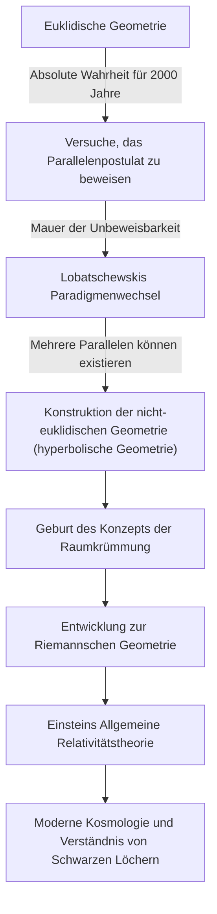
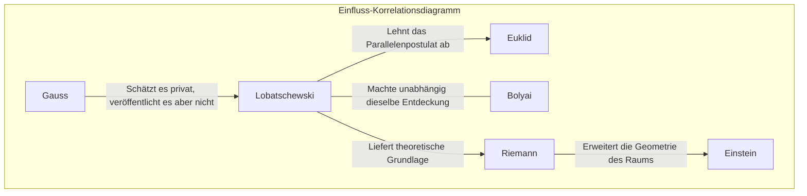

# Nikolai Lobatschewski: Der 'Kopernikus der Geometrie', der die Tür zur nicht-euklidischen Geometrie öffnete

In der Geschichte der Mathematik haben nur wenige den bestehenden gesunden Menschenverstand von Grund auf umgestoßen und ein neues Weltbild präsentiert. Unter ihnen war Nikolai Iwanowitsch Lobatschewski (1792–1856) ein großartiger Mathematiker, der die Grenzen der "euklidischen Geometrie", die über 2.000 Jahre lang als absolute Wahrheit galt, durchbrach und den Weg für die moderne Mathematik und Physik ebnete.

Wie der britische Mathematiker William Clifford ihn den "Kopernikus der Geometrie" nannte, beschränkten sich seine Entdeckungen nicht auf einen einzigen Zweig der Mathematik, sondern revolutionierten das menschliche Verständnis des Universums grundlegend. In diesem Artikel werden wir tiefer in das turbulente Leben von Lobatschewski, sein Denken und seine Philosophie sowie seinen unermesslichen Einfluss auf künftige Generationen eintauchen.

## Armut und Leidenschaft: Erwachen an der Universität Kasan

Nikolai Lobatschewski wurde 1792 in Nischni Nowgorod im Russischen Kaiserreich geboren. Als er noch jung war, starb sein Vater, und die Familie fiel in extreme Armut. Inmitten eines schwierigen Lebens zog seine Mutter für die Ausbildung der Kinder nach Kasan. Diese Entscheidung sollte die erste Gelegenheit werden, ein zukünftiges Mathematikgenie hervorzubringen.

1807 trat er als Stipendiat in die neu gegründete Universität Kasan ein. Zunächst strebte er ein Medizinstudium an, lernte jedoch Martin Bartels (auch der Lehrer von Carl Friedrich Gauss), einen herausragenden Mathematiker, kennen und war vom tiefgreifenden Charme der Mathematik fasziniert. Unter der Anleitung von Bartels entwickelte Lobatschewski sein bemerkenswertes Talent und erwarb mit nur 21 Jahren einen Master-Abschluss. Danach kletterte er mit ungewöhnlicher Geschwindigkeit auf der akademischen Karriereleiter nach oben und wurde im Alter von 24 Jahren außerordentlicher Professor.

Sein Leben war mit der Universität Kasan verflochten. Er diente nicht nur als Professor, sondern auch als Bibliotheksdirektor, Sternwartendirektor und im jungen Alter von 35 Jahren als Rektor, wobei er sich der Modernisierung der Universität und der Entwicklung der Bildung widmete. Die Anekdote, dass er während einer Choleraepidemie selbst die Quarantäne und das Sanitätsmanagement des Campus leitete und so vielen Studenten das Leben rettete, erzählt die Geschichte, dass er nicht nur ein Bewohner des Elfenbeinturms war, sondern eine Person mit tiefem Verantwortungsbewusstsein und Tatkraft.

## Herausforderung an das "Parallelenpostulat": Die Geburt der nicht-euklidischen Geometrie

Was Lobatschewskis Namen in der Geschichte unsterblich machte, war seine Herausforderung an das "Parallelenpostulat (das fünfte Postulat)" in Euklids "Elementen".

Seit dem 3. Jahrhundert v. Chr. galt das Postulat, dass "durch einen Punkt außerhalb einer Geraden nur eine parallele Gerade existiert", als selbstverständlich. Jahrhundertelang versuchten unzählige Mathematiker, dieses Postulat aus den anderen vier Axiomen zu beweisen, scheiterten jedoch alle.

Lobatschewskis Innovation bestand darin, den Ansatz des "Beweisenwollens" aufzugeben und zur umgekehrten Idee zu gelangen: "Könnte es nicht auch eine Geometrie geben, in der das Parallelenpostulat nicht gilt?". 1826 stellte er ein neues Axiom auf, dass "durch einen Punkt außerhalb einer Geraden unendlich viele parallele Geraden existieren", und baute daraus ein völlig neues und konsistentes Geometriesystem auf. Dies wurde später "Hyperbolische Geometrie (Lobatschewskische Geometrie)" genannt.

Das folgende Diagramm zeigt, wie Lobatschewskis Entdeckung alte Rahmen sprengte und sich mit der späteren Wissenschaft verband.

## Einsamer Kampf und unbeugsame Philosophie

1829 veröffentlichte er seine Entdeckungen in der Abhandlung "Über die Grundlagen der Geometrie" im Bulletin der Universität Kasan. Seine revolutionäre Theorie wurde jedoch von der akademischen Gemeinschaft seiner Zeit überhaupt nicht verstanden.

Er wurde von den führenden Mathematikern in Russland als "absurd" und "bedeutungslose Illusion" scharf kritisiert, und seine Veröffentlichung in akademischen Zeitschriften wurde sogar abgelehnt. Der Mathematik-Riese Gauss, der zur gleichen Zeit ähnliche Entdeckungen machte, lobte Lobatschewski in persönlichen Briefen hoch, aber aus Angst, sein eigener Ruf könnte beschädigt werden, unterstützte er ihn nicht öffentlich. (Darüber hinaus entdeckte der Ungar János Bolyai zur gleichen Zeit unabhängig die nicht-euklidische Geometrie.)

Trotz des Unverständnisses und Spotts um ihn herum ging Lobatschewski bei seinen Überzeugungen keine Kompromisse ein. Seine Philosophie, dass "die mathematische Wahrheit nur durch die physikalische Realität endgültig geprüft wird", betrachtete die Mathematik nicht nur als abstraktes logisches Spiel, sondern als eine Sprache, um die wahre Natur des Universums zu beschreiben. Er versuchte tatsächlich, die Parallaxe von Sternen zu nutzen, um zu messen, ob der Raum euklidisch oder nicht-euklidisch ist. Obwohl dies mit der damaligen Beobachtungsgenauigkeit unmöglich war, war es eine erstaunliche Voraussicht, die auf die Integration von Mathematik und Physik abzielte.

## Tragödie in den späten Jahren und ewiges Vermächtnis

Lobatschewskis letzte Jahre waren keineswegs glücklich. Er wurde zu Unrecht als Rektor der Universität entlassen, verlor seinen geliebten Sohn und verlor sogar sein Augenlicht. Blind diktierte er seinen Schülern bis kurz vor seinem Tod die "Pangeometrie", die den Höhepunkt seiner Theorie darstellte. Im Jahr 1856, ohne den Tag zu erleben, an dem seine großen Leistungen gebührend gewürdigt wurden, starb er im Alter von 63 Jahren.

Es dauerte Jahrzehnte nach seinem Tod, bis er wirklich als "Kopernikus der Geometrie" anerkannt wurde. Seine Theorie wurde von Bernhard Riemann verallgemeinert und entwickelte sich zur "Riemannschen Geometrie", um mehrdimensionale gekrümmte Räume zu beschreiben. Und im frühen 20. Jahrhundert, als Albert Einstein die "Allgemeine Relativitätstheorie" aufbaute, war es genau dieser Rahmen der nicht-euklidischen Geometrie, der unverzichtbar war, um die universelle Wahrheit zu beschreiben, dass die Raumzeit durch die Schwerkraft verzerrt wird.

Hätte Lobatschewski die unsichtbare Mauer namens "gesunder Menschenverstand" nicht durchbrochen, wären die moderne Physik und Kosmologie völlig anders gewesen.

## Fazit: Triumph des freien Geistes

Das Leben von Nikolai Lobatschewski lehrt uns, wie stark der menschliche Geist auf der Suche nach der Wahrheit sein kann. Er sah sich zahlreichen Schwierigkeiten wie Armut, Verfolgung durch Autoritäten und körperlichem Verfall gegenüber, glaubte aber weiterhin an das Licht seines inneren Intellekts.

Sein größtes Vermächtnis ist nicht nur die mathematische Theorie der nicht-euklidischen Geometrie selbst. Es ist der höchste Mut bei der wissenschaftlichen Erforschung, "den gesunden Menschenverstand in Frage zu stellen und mit freiem Denken eine unbekannte Welt aufzubauen". Die Tatsache, dass wir heute GPS auf unseren Smartphones nutzen und über die Ränder des Universums nachdenken können, ist ein Geschenk des "freien Geistes" eines Genies, das sich die Form des Universums in Einsamkeit im ländlichen Russland des 19. Jahrhunderts vorstellte.
