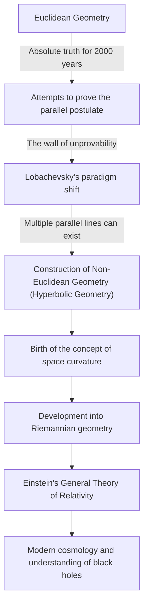
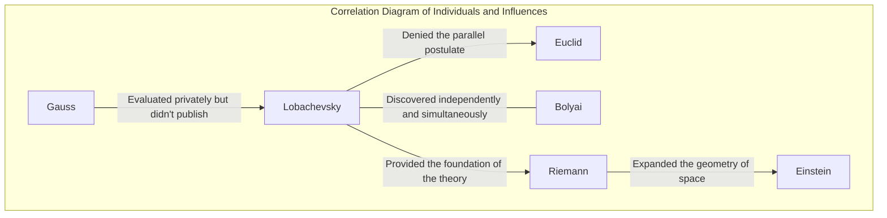

# Nikolai Lobachevsky: The "Copernicus of Geometry" Who Opened the Door to Non-Euclidean Geometry

In the history of mathematics, few individuals have fundamentally overturned existing common sense and presented a new worldview. Among them, Nikolai Ivanovich Lobachevsky (1792–1856) is a great mathematician who shattered the limits of "Euclidean geometry," which had been considered the absolute truth for over 2,000 years, and paved the way for modern mathematics and physics.

As the British mathematician William Clifford called him the "Copernicus of Geometry," his discovery was not limited to just one branch of mathematics but fundamentally transformed humanity's understanding of the universe. This article delves deeply into Lobachevsky's turbulent life, his thoughts and philosophy, and the immeasurable impact he left on future generations.

## Poverty and Passion: Awakening at Kazan University

Nikolai Lobachevsky was born in 1792 in Nizhny Novgorod, Russian Empire. When he was still young, his father passed away, plunging the family into extreme poverty. Amidst a difficult life, his mother moved to Kazan for her children's education. This decision became the first turning point that would give rise to the future genius mathematician.

In 1807, he entered the newly founded Kazan University on a scholarship. Initially aspiring to study medicine, he met Martin Bartels (also the teacher of [Carl Friedrich Gauss](/en/p/gauss/)), an outstanding mathematician, and became captivated by the profound charm of mathematics. Under Bartels' guidance, Lobachevsky blossomed his remarkable talent, obtaining his master's degree at the young age of 21. Subsequently, he climbed the academic ladder at an exceptionally fast pace, becoming a distinguished professor at 24.

His life was intertwined with Kazan University. Not only as a professor but also as the head librarian, director of the observatory, and becoming the rector at the young age of 35, he dedicated himself to the modernization of the university and the development of education. The anecdote of him personally directing the quarantine and sanitation management of the campus during a cholera outbreak, saving the lives of many students, tells us that he was not just an inhabitant of the ivory tower but a person endowed with a deep sense of responsibility and action.

## Challenging the "Parallel Postulate": The Birth of Non-Euclidean Geometry

What immortalized Lobachevsky's name in history was his challenge to the "Parallel Postulate (the Fifth Postulate)" in [Euclid](/en/p/euclid/)'s "Elements."

Since the 3rd century BC, this postulate, which states that "there is only one parallel line to a given line that passes through a point not on that line," had been considered self-evident. Over the centuries, countless mathematicians attempted to prove this postulate from the other four axioms, but all failed.

Lobachevsky's innovativeness lies in abandoning the "attempt to prove" approach and arriving at the paradigm-shifting idea that "perhaps there is a geometry where the parallel postulate does not hold." In 1826, he posited a new axiom that "there are infinitely many parallel lines passing through a point outside a line," and from there, built an entirely new, consistent geometric system. This is what was later called "Hyperbolic Geometry (Lobachevskian Geometry)."

The following diagram shows how Lobachevsky's discovery broke through the traditional framework and connected to later science.

## A Lonely Struggle and Indomitable Philosophy

In 1829, he published his discoveries in the Kazan University bulletin as the paper "On the Principles of Geometry." However, his groundbreaking theory was entirely unappreciated by the academic world of his time.

He was severely criticized by authoritative mathematicians in Russia as being "absurd" and "meaningless delusion," and his work was sometimes rejected for publication in academic journals. The giant of the mathematical world, Gauss, who had made similar discoveries around the same time, highly praised Lobachevsky in private letters, but fearing his own reputation would be damaged, he did not support him publicly. (Note that the Hungarian János Bolyai also independently discovered non-Euclidean geometry around the same time.)

Even amidst the incomprehension and sneers of those around him, Lobachevsky did not bend his beliefs. His philosophy that "mathematical truth is ultimately verified only by physical reality" viewed mathematics not merely as an abstract logical game but as a language for describing the true nature of the universe. He actually attempted to measure whether outer space was Euclidean or non-Euclidean using stellar parallax. Although this was impossible with the observational accuracy of the time, it was an astonishing foresight anticipating the fusion of mathematics and physics.

## Tragedy in Later Years and Eternal Legacy

Lobachevsky's later years were by no means happy. He was unjustly dismissed from his position as rector of the university, lost his beloved son, and furthermore, lost his eyesight. Blind, he completed "Pangeometry" by dictation to his disciples just before his death, leaving behind the culmination of his theories. In 1856, he passed away at the age of 63 without ever seeing the day his great achievements were rightfully evaluated.

It was not until decades after his death that he gained true recognition as the "Copernicus of Geometry." His theory was generalized by [Bernhard Riemann](/en/p/riemann/) and developed into "Riemannian Geometry," which describes multidimensional curved spaces. And in the early 20th century, when Albert Einstein constructed the "General Theory of Relativity," this very framework of non-Euclidean geometry was essential to describe the universal truth that spacetime is distorted by gravity.

If Lobachevsky had not broken down the invisible wall called "common sense," modern physics and cosmology would have been completely different.

## Conclusion: Triumph of the Free Spirit

The life of Nikolai Lobachevsky teaches us how resilient the human spirit is in its quest for truth. Facing numerous hardships such as poverty, persecution from authorities, and physical decline, he continued to believe in the light of his inner intellect.

His greatest legacy left behind is not only the mathematical theory of non-Euclidean geometry itself. It is the ultimate courage in scientific inquiry to "doubt common sense and construct an unknown world with free thinking." Today, the fact that we can use GPS on our smartphones and ponder the ends of the universe is a gift of the "free spirit" of a single genius who solitarily envisioned the shape of the universe in a remote corner of 19th-century Russia.
