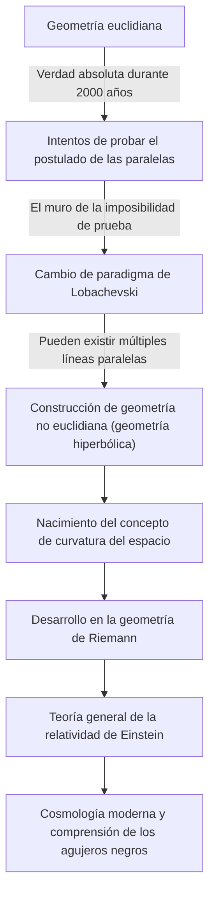
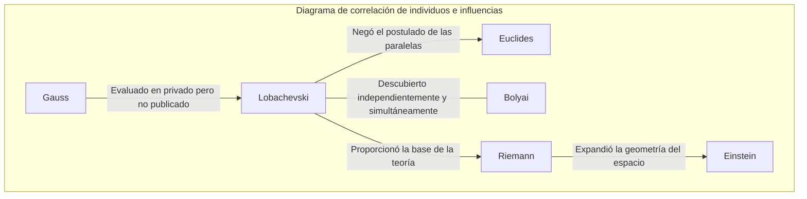

# Nikolái Lobachevski: El "Copérnico de la Geometría" que abrió la puerta a la geometría no euclidiana

En la historia de las matemáticas, pocos individuos han anulado fundamentalmente el sentido común existente y presentado una nueva visión del mundo. Entre ellos, Nikolái Ivánovich Lobachevski (1792-1856) es un gran matemático que rompió los límites de la "geometría euclidiana", que había sido considerada la verdad absoluta durante más de 2000 años, y allanó el camino para las matemáticas y la física modernas.

Como el matemático británico William Clifford lo llamó el "Copérnico de la Geometría", su descubrimiento no se limitó a una sola rama de las matemáticas, sino que transformó fundamentalmente la comprensión humana del universo. Este artículo profundiza en la turbulenta vida de Lobachevski, sus pensamientos y filosofía, y el impacto inconmensurable que dejó en las generaciones futuras.

## Pobreza y Pasión: Despertar en la Universidad de Kazán

Nikolái Lobachevski nació en 1792 en Nizhni Nóvgorod, Imperio Ruso. Cuando aún era joven, su padre falleció, sumiendo a la familia en la pobreza extrema. En medio de una vida difícil, su madre se mudó a Kazán para la educación de sus hijos. Esta decisión se convirtió en el primer punto de inflexión que daría lugar al futuro genio matemático.

En 1807, ingresó en la recién fundada Universidad de Kazán con una beca. Inicialmente aspirando a estudiar medicina, conoció a Martin Bartels (también maestro de [Carl Friedrich Gauss](/es/p/gauss/)), un destacado matemático, y quedó cautivado por el profundo encanto de las matemáticas. Bajo la guía de Bartels, Lobachevski floreció su notable talento, obteniendo su maestría a la temprana edad de 21 años. Posteriormente, ascendió en la escala académica a un ritmo excepcionalmente rápido, convirtiéndose en profesor distinguido a los 24 años.

Su vida estuvo entrelazada con la Universidad de Kazán. No solo como profesor sino también como bibliotecario jefe, director del observatorio y convirtiéndose en rector a la temprana edad de 35 años, se dedicó a la modernización de la universidad y al desarrollo de la educación. La anécdota de él dirigiendo personalmente la cuarentena y el manejo sanitario del campus durante un brote de cólera, salvando la vida de muchos estudiantes, nos dice que no era solo un habitante de la torre de marfil, sino una persona dotada de un profundo sentido de responsabilidad y acción.

## Desafiando el "Postulado de las Paralelas": El nacimiento de la geometría no euclidiana

Lo que inmortalizó el nombre de Lobachevski en la historia fue su desafío al "Postulado de las Paralelas (el Quinto Postulado)" en los "Elementos" de [Euclides](/es/p/euclid/).

Desde el siglo III a. C., este postulado, que establece que "solo hay una línea paralela a una línea dada que pasa a través de un punto que no está en esa línea", había sido considerado evidente. A lo largo de los siglos, innumerables matemáticos intentaron probar este postulado a partir de los otros cuatro axiomas, pero todos fracasaron.

La innovación de Lobachevski radica en abandonar el enfoque del "intento de prueba" y llegar a la idea que cambia el paradigma de que "tal vez haya una geometría donde el postulado paralelo no se cumple". En 1826, planteó un nuevo axioma de que "hay un número infinito de líneas paralelas que pasan por un punto fuera de una línea", y a partir de ahí, construyó un sistema geométrico completamente nuevo y consistente. Esto es lo que más tarde se llamó "Geometría hiperbólica (Geometría de Lobachevski)".

El siguiente diagrama muestra cómo el descubrimiento de Lobachevski rompió el marco tradicional y se conectó con la ciencia posterior.

## Una lucha solitaria y una filosofía indomable

En 1829, publicó sus descubrimientos en el boletín de la Universidad de Kazán como el artículo "Sobre los principios de la geometría". Sin embargo, su innovadora teoría no fue apreciada en absoluto por el mundo académico de su tiempo.

Fue severamente criticado por los matemáticos autorizados en Rusia como "absurdo" y un "delirio sin sentido", y su trabajo a veces fue rechazado para su publicación en revistas académicas. El gigante del mundo matemático, Gauss, que había hecho descubrimientos similares casi al mismo tiempo, elogió mucho a Lobachevski en cartas privadas, pero temiendo que su propia reputación se dañara, no lo apoyó públicamente. (Tenga en cuenta que el húngaro János Bolyai también descubrió independientemente la geometría no euclidiana casi al mismo tiempo).

Incluso en medio de la incomprensión y las burlas de quienes lo rodeaban, Lobachevski no torció sus creencias. Su filosofía de que "la verdad matemática se verifica en última instancia solo por la realidad física" veía a las matemáticas no solo como un juego lógico abstracto, sino como un lenguaje para describir la verdadera naturaleza del universo. De hecho, intentó medir si el espacio exterior era euclidiano o no euclidiano utilizando el paralaje estelar. Aunque esto era imposible con la precisión de observación de la época, fue una previsión asombrosa anticipando la fusión de las matemáticas y la física.

## Tragedia en los últimos años y legado eterno

Los últimos años de Lobachevski no fueron en absoluto felices. Fue despedido injustamente de su cargo como rector de la universidad, perdió a su amado hijo y, además, perdió la vista. Ciego, completó "Pangeometría" por dictado a sus discípulos justo antes de su muerte, dejando atrás la culminación de sus teorías. En 1856, falleció a la edad de 63 años sin haber visto el día en que sus grandes logros fueron evaluados con justicia.

No fue hasta décadas después de su muerte que obtuvo verdadero reconocimiento como el "Copérnico de la geometría". Su teoría fue generalizada por [Bernhard Riemann](/es/p/riemann/) y desarrollada en la "Geometría de Riemann", que describe espacios curvos multidimensionales. Y a principios del siglo XX, cuando Albert Einstein construyó la "Teoría general de la relatividad", este mismo marco de la geometría no euclidiana fue esencial para describir la verdad universal de que el espacio-tiempo es distorsionado por la gravedad.

Si Lobachevski no hubiera derribado el muro invisible llamado "sentido común", la física y la cosmología modernas habrían sido completamente diferentes.

## Conclusión: Triunfo del espíritu libre

La vida de Nikolái Lobachevski nos enseña lo resistente que es el espíritu humano en su búsqueda de la verdad. Frente a numerosas dificultades como la pobreza, la persecución de las autoridades y el declive físico, continuó creyendo en la luz de su intelecto interior.

Su mayor legado no es solo la teoría matemática de la geometría no euclidiana en sí. Es la valentía suprema en la investigación científica de "dudar del sentido común y construir un mundo desconocido con el libre pensamiento". Hoy en día, el hecho de que podamos usar el GPS en nuestros teléfonos inteligentes y reflexionar sobre los confines del universo es un regalo del "espíritu libre" de un solo genio que imaginó solitariamente la forma del universo en un rincón remoto de la Rusia del siglo XIX.
