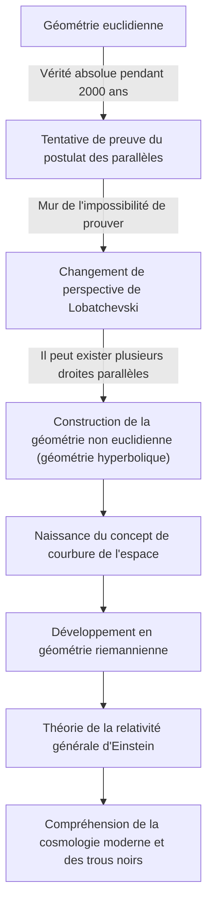
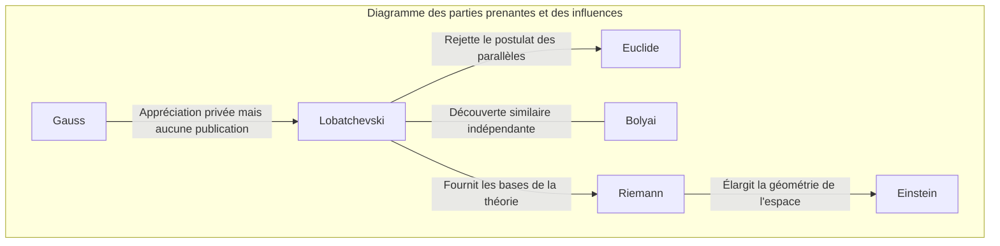

# Nikolaï Lobatchevski : Le « Copernic de la géométrie » qui a ouvert les portes de la géométrie non euclidienne

Dans l'histoire des mathématiques, rares sont ceux qui ont fondamentalement bouleversé le sens commun existant et présenté une nouvelle vision du monde. Parmi eux, Nikolaï Ivanovitch Lobatchevski (1792-1856) est un grand mathématicien qui a brisé les limites de la « géométrie euclidienne », considérée comme une vérité absolue pendant plus de 2000 ans, et a ouvert la voie aux mathématiques et à la physique modernes.

Comme le mathématicien britannique William Clifford l'a surnommé le « Copernic de la géométrie », sa découverte ne s'est pas limitée à un domaine des mathématiques, mais a fondamentalement transformé la compréhension de l'univers par l'humanité. Dans cet article, nous plongerons au cœur de la vie tumultueuse de Lobatchevski, de ses pensées et de sa philosophie, ainsi que de son influence incommensurable sur les générations futures.

## Pauvreté et passion : L'éveil à l'Université de Kazan

Nikolaï Lobatchevski est né en 1792 à Nijni Novgorod, dans l'Empire russe. Son père est mort alors qu'il était encore jeune, plongeant la famille dans une extrême pauvreté. Face à ces conditions de vie difficiles, sa mère a décidé de déménager à Kazan pour l'éducation de ses enfants. Cette décision fut la première étincelle qui donna naissance, plus tard, à un mathématicien de génie.

En 1807, il entra à la toute nouvelle Université de Kazan en tant qu'étudiant boursier. Bien qu'il se destinât initialement à la médecine, sa rencontre avec l'éminent mathématicien Martin Bartels (qui fut également le professeur de Carl Friedrich Gauss) le rendit fasciné par l'attrait profond des mathématiques. Sous la direction de Bartels, Lobatchevski révéla un talent remarquable et obtint son master à seulement 21 ans. Par la suite, il gravit les échelons académiques à une vitesse sans précédent, devenant professeur extraordinaire à 24 ans.

Sa vie fut intimement liée à l'Université de Kazan. Non seulement en tant que professeur, mais aussi comme directeur de la bibliothèque, directeur de l'observatoire, et recteur de l'université à l'âge précoce de 35 ans, il s'est consacré à la modernisation de l'université et au développement de l'éducation. Lors d'une épidémie de choléra, il a personnellement dirigé l'isolement du campus et la gestion de l'hygiène, sauvant ainsi la vie de nombreux étudiants. Cette anecdote témoigne qu'il n'était pas seulement un habitant de la tour d'ivoire, mais un homme doté d'un profond sens des responsabilités et d'une grande capacité d'action.

## Le défi du « Postulat des parallèles » : La naissance de la géométrie non euclidienne

Ce qui a immortalisé le nom de Lobatchevski dans l'histoire, c'est son défi lancé au « Postulat des parallèles (le 5e postulat) » dans les *Éléments* d'Euclide.

Depuis le IIIe siècle av. J.-C., ce postulat énonçant que « par un point extérieur à une droite, il ne passe qu'une seule droite parallèle » était considéré comme une vérité évidente. Pendant des siècles, d'innombrables mathématiciens ont tenté de prouver ce postulat à partir des quatre autres axiomes, mais tous ont échoué.

L'innovation de Lobatchevski réside dans le fait qu'il a abandonné l'approche visant à « essayer de prouver » et est arrivé à l'idée inverse selon laquelle « il pourrait exister une géométrie où le postulat des parallèles ne s'applique pas ». En 1826, il posa un nouvel axiome stipulant que « par un point extérieur à une droite, il passe une infinité de droites parallèles », et à partir de là, construisit un système géométrique entièrement nouveau et cohérent. C'est ce qu'on appellera plus tard la « géométrie hyperbolique (géométrie de Lobatchevski) ».

Le diagramme ci-dessous illustre comment la découverte de Lobatchevski a brisé le cadre traditionnel et s'est connectée à la science des générations futures.

## Un combat solitaire et une philosophie indomptable

En 1829, il publia ses découvertes dans un article intitulé *Sur les principes de la géométrie* dans le bulletin de l'Université de Kazan. Cependant, sa théorie révolutionnaire ne fut pas du tout comprise par le monde académique de l'époque.

Sévèrement critiqué par les mathématiciens de renom en Russie comme étant « absurde » et une « illusion dénuée de sens », la publication de ses travaux fut rejetée par les revues académiques. Le géant des mathématiques de son époque, Gauss, qui avait fait une découverte similaire au même moment, a fait l'éloge de Lobatchevski dans une lettre privée, mais ne l'a pas soutenu publiquement de peur de nuire à sa propre réputation. (Le Hongrois János Bolyai a également découvert indépendamment la géométrie non euclidienne à la même époque).

Malgré l'incompréhension et les moqueries de son entourage, Lobatchevski n'a pas renié ses convictions. Sa philosophie, selon laquelle « la vérité mathématique n'est finalement vérifiée que par la réalité physique », considérait les mathématiques non pas comme un simple jeu logique abstrait, mais comme un langage pour décrire la véritable nature de l'univers. Il a d'ailleurs tenté de mesurer si l'espace était euclidien ou non euclidien en utilisant la parallaxe des étoiles. Bien que cela fût impossible avec la précision des observations de l'époque, c'était une prescience étonnante anticipant la fusion des mathématiques et de la physique.

## La tragédie de ses dernières années et son héritage éternel

Les dernières années de Lobatchevski ne furent nullement heureuses. Il fut injustement démis de ses fonctions de recteur de l'université, perdit son fils bien-aimé et finit par perdre la vue. Devenu aveugle, il dicta la *Pangéométrie* à ses élèves juste avant sa mort, laissant ainsi l'aboutissement de ses théories. En 1856, il mourut à l'âge de 63 ans, sans avoir vu le jour où ses grandes réalisations seraient justement appréciées.

Ce n'est que des décennies après sa mort qu'il reçut sa véritable reconnaissance en tant que « Copernic de la géométrie ». Sa théorie fut généralisée par Bernhard Riemann, évoluant vers la « géométrie riemannienne » qui décrit des espaces courbes multidimensionnels. Et au début du 20e siècle, lorsque Albert Einstein élabora la « Théorie de la relativité générale », c'est précisément ce cadre de géométrie non euclidienne qui fut indispensable pour décrire la vérité de l'univers, à savoir que l'espace-temps est déformé par la gravité.

Si Lobatchevski n'avait pas brisé le mur invisible du « sens commun », la physique et la cosmologie modernes auraient été complètement différentes.

## Conclusion : Le triomphe de l'esprit libre

La vie de Nikolaï Lobatchevski nous enseigne la résilience de l'esprit humain dans sa quête de la vérité. Confronté à de nombreuses épreuves, de la pauvreté aux persécutions par les autorités, en passant par le déclin physique, il a continué à croire en la lumière de son intelligence intérieure.

Son plus grand héritage n'est pas seulement la théorie mathématique de la géométrie non euclidienne elle-même. C'est le courage ultime dans l'exploration scientifique de « remettre en question le sens commun et de construire un monde inconnu avec des idées libres ». Aujourd'hui, si nous pouvons utiliser le GPS sur nos smartphones et contempler les confins de l'univers, c'est grâce au don de « l'esprit libre » d'un génie qui, seul dans la campagne russe du 19e siècle, a imaginé la forme de l'univers.
