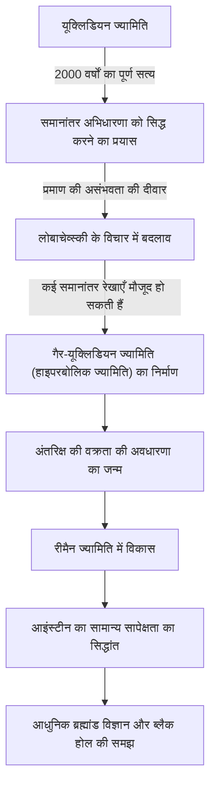
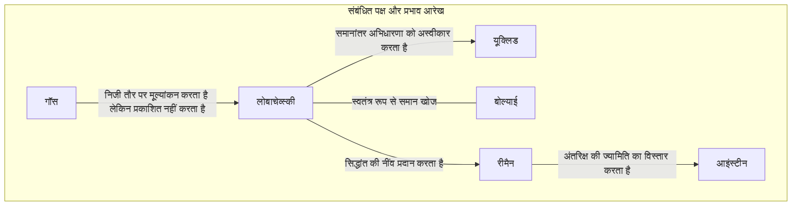

# निकोलाई लोबाचेव्स्की: 'ज्यामिति के कोपरनिकस' जिन्होंने गैर-यूक्लिडियन ज्यामिति के द्वार खोले

गणित के इतिहास में ऐसे बहुत कम लोग हुए हैं जिन्होंने मौजूदा सामान्य ज्ञान को पूरी तरह से पलट दिया हो और एक नया विश्व दृष्टिकोण प्रस्तुत किया हो। उनमें से, निकोलाई इवानोविच लोबाचेव्स्की (Nikolai Ivanovich Lobachevsky, 1792–1856) एक महान गणितज्ञ हैं, जिन्होंने 2000 से अधिक वर्षों तक पूर्ण सत्य मानी जाने वाली "यूक्लिडियन ज्यामिति" की सीमाओं को तोड़ा और आधुनिक गणित और भौतिकी का मार्ग प्रशस्त किया।

जैसा कि ब्रिटिश गणितज्ञ विलियम क्लिफोर्ड ने उन्हें "ज्यामिति का कोपरनिकस" कहा था, उनकी खोज केवल गणित के एक क्षेत्र तक सीमित नहीं थी, बल्कि ब्रह्मांड के बारे में मानवता की समझ को मौलिक रूप से बदलने वाली थी। इस लेख में, हम लोबाचेव्स्की के अशांत जीवन, उनके विचारों और दर्शन, और आने वाली पीढ़ियों पर उनके अथाह प्रभाव पर गहराई से विचार करेंगे।

## गरीबी और जुनून: कज़ान विश्वविद्यालय में जागृति

निकोलाई लोबाचेव्स्की का जन्म 1792 में रूसी साम्राज्य के निज़नी नोवगोरोड में हुआ था। जब वे छोटे थे तब उनके पिता का निधन हो गया, और परिवार अत्यधिक गरीबी में डूब गया। कठिन जीवन के बीच, उनकी माँ ने अपने बच्चों की शिक्षा के लिए कज़ान जाने का फैसला किया। यह निर्णय बाद में एक प्रतिभाशाली गणितज्ञ को जन्म देने वाला पहला अवसर बना।

1807 में, उन्होंने नव स्थापित कज़ान विश्वविद्यालय में एक छात्रवृत्ति छात्र के रूप में प्रवेश लिया। शुरुआत में उनका लक्ष्य चिकित्सा पढ़ना था, लेकिन एक उत्कृष्ट गणितज्ञ मार्टिन बार्टेल्स (जो [कार्ल फ्रेडरिक गॉस](/hi/p/gauss/) के शिक्षक भी थे) से मिलने के बाद, वह गणित के गहरे आकर्षण में बंध गए। बार्टेल्स के मार्गदर्शन में, लोबाचेव्स्की ने उल्लेखनीय प्रतिभा दिखाई और केवल 21 वर्ष की आयु में मास्टर डिग्री प्राप्त की। इसके बाद, उन्होंने अभूतपूर्व गति से अकादमिक सीढ़ियां चढ़ीं और 24 वर्ष की आयु में एक विशेष प्रोफेसर बन गए।

उनका जीवन कज़ान विश्वविद्यालय के साथ जुड़ा रहा। न केवल एक प्रोफेसर के रूप में, बल्कि एक पुस्तकालयाध्यक्ष, वेधशाला के निदेशक, और 35 वर्ष की कम उम्र में विश्वविद्यालय के अध्यक्ष के रूप में, उन्होंने विश्वविद्यालय के आधुनिकीकरण और शैक्षिक विकास के लिए काम किया। जब हैजा फैला, तो उन्होंने खुद परिसर के अलगाव और स्वच्छता प्रबंधन का नेतृत्व किया, जिससे कई छात्रों की जान बच गई। यह किस्सा दर्शाता है कि वे केवल एक हाथीदांत की मीनार के निवासी नहीं थे, बल्कि गहरी जिम्मेदारी और कार्य करने की क्षमता वाले व्यक्ति थे।

## "समानांतर अभिधारणा" को चुनौती: गैर-यूक्लिडियन ज्यामिति का जन्म

लोबाचेव्स्की के नाम को इतिहास में अमर बनाने वाली बात [यूक्लिड](/hi/p/euclid/) के 'एलिमेंट्स' में "समानांतर अभिधारणा (पांचवीं अभिधारणा)" को उनकी चुनौती थी।

तीसरी शताब्दी ईसा पूर्व से, इस अभिधारणा को एक स्वयंसिद्ध सत्य माना जाता था कि "एक रेखा के बाहर एक बिंदु से गुजरने वाली केवल एक समानांतर रेखा होती है"। सदियों से, अनगिनत गणितज्ञों ने इस अभिधारणा को अन्य चार स्वयंसिद्धों से सिद्ध करने का प्रयास किया, लेकिन सभी असफल रहे।

लोबाचेव्स्की का नवाचार "सिद्ध करने का प्रयास" करने वाले दृष्टिकोण को छोड़ने और इस विपरीत विचार पर पहुंचने में निहित है कि "ऐसी ज्यामिति भी मौजूद हो सकती है जहां समानांतर अभिधारणा लागू नहीं होती है"। 1826 में, उन्होंने एक नया स्वयंसिद्ध रखा कि "एक रेखा के बाहर एक बिंदु से गुजरने वाली अनगिनत समानांतर रेखाएँ हैं", और वहां से एक पूरी तरह से नई और सुसंगत ज्यामितीय प्रणाली का निर्माण किया। इसे बाद में "हाइपरबोलिक ज्यामिति (लोबाचेव्स्की ज्यामिति)" के रूप में जाना गया।

नीचे दिया गया आरेख दर्शाता है कि कैसे लोबाचेव्स्की की खोज ने पारंपरिक ढांचे को तोड़ा और भविष्य के विज्ञान से जुड़ गई।

## अकेला संघर्ष और अदम्य दर्शन

1829 में, उन्होंने अपनी खोजों को 'ज्यामिति के मूल सिद्धांतों पर' नामक एक शोध पत्र के रूप में कज़ान विश्वविद्यालय के बुलेटिन में प्रकाशित किया। हालांकि, उनके যুগান্তकारी सिद्धांत को तत्कालीन अकादमिक जगत ने बिल्कुल नहीं समझा।

रूस में आधिकारिक गणितज्ञों द्वारा इसकी कड़ी आलोचना की गई, इसे "सामान्य ज्ञान से परे" और "निरर्थक भ्रम" कहा गया, और अकादमिक पत्रिकाओं में इसके प्रकाशन को अस्वीकार कर दिया गया। समकालीन गणितीय दिग्गज गॉस, जिन्होंने उसी समय इसी तरह की खोज की थी, ने एक निजी पत्र में लोबाचेव्स्की की अत्यधिक प्रशंसा की, लेकिन अपनी प्रतिष्ठा को नुकसान पहुंचने के डर से सार्वजनिक रूप से उनका समर्थन नहीं किया। (हंगरी के जानोस बोल्याई ने भी उसी समय स्वतंत्र रूप से गैर-यूक्लिडियन ज्यामिति की खोज की थी।)

अपने आस-पास की समझ की कमी और उपहास के बावजूद, लोबाचेव्स्की ने अपने विश्वासों से समझौता नहीं किया। उनका दर्शन, "गणितीय सत्य अंततः केवल भौतिक वास्तविकता द्वारा सत्यापित होता है", गणित को केवल एक अमूर्त तार्किक खेल के रूप में नहीं, बल्कि ब्रह्मांड के वास्तविक स्वरूप का वर्णन करने वाली भाषा के रूप में देखता था। उन्होंने वास्तव में तारों के लंबन का उपयोग करके यह मापने का प्रयास किया कि क्या अंतरिक्ष यूक्लिडियन है या गैर-यूक्लिडियन। हालांकि उस समय की अवलोकन सटीकता के साथ यह असंभव था, यह गणित और भौतिकी के संलयन को देखने वाली आश्चर्यजनक दूरदर्शिता थी।

## अंतिम वर्षों की त्रासदी और शाश्वत विरासत

लोबाचेव्स्की के अंतिम वर्ष कभी भी सुखद नहीं रहे। उन्हें अनुचित रूप से विश्वविद्यालय के अध्यक्ष पद से हटा दिया गया, उन्होंने अपने प्रिय पुत्र को खो दिया, और यहां तक कि अपनी दृष्टि भी खो दी। अंधे होने के बाद, उन्होंने अपनी मृत्यु से ठीक पहले अपने छात्रों को श्रुतलेख देकर 'पैन्ज्योमेट्री' लिखी, और अपने सिद्धांतों का एक संकलन छोड़ गए। 1856 में, अपनी महान उपलब्धियों का उचित मूल्यांकन देखे बिना ही 63 वर्ष की आयु में उनका निधन हो गया।

उन्हें "ज्यामिति के कोपरनिकस" के रूप में सच्चा मूल्यांकन उनकी मृत्यु के कई दशकों बाद ही मिला। उनके सिद्धांत को [बर्नहार्ड रीमैन](/hi/p/riemann/) द्वारा सामान्यीकृत किया गया था, और यह बहुआयामी घुमावदार स्थानों का वर्णन करने वाली "रीमैन ज्यामिति" में विकसित हुआ। और 20वीं सदी की शुरुआत में, जब अल्बर्ट आइंस्टीन ने "सामान्य सापेक्षता का सिद्धांत" बनाया, तो यह गैर-यूक्लिडियन ज्यामिति का ढांचा ही था जो ब्रह्मांड के सत्य का वर्णन करने के लिए आवश्यक था, कि अंतरिक्ष-समय गुरुत्वाकर्षण द्वारा विकृत हो जाता है।

यदि लोबाचेव्स्की ने "सामान्य ज्ञान" नामक अदृश्य दीवार को नहीं तोड़ा होता, तो आधुनिक भौतिकी और ब्रह्मांड विज्ञान पूरी तरह से अलग होते।

## निष्कर्ष: स्वतंत्र आत्मा की जीत

निकोलाई लोबाचेव्स्की का जीवन हमें सिखाता है कि सत्य की खोज करने वाली मानवीय भावना कितनी लचीली है। गरीबी, अधिकार के उत्पीड़न, और शारीरिक गिरावट जैसी कई कठिनाइयों का सामना करने के बावजूद, वह अपनी आंतरिक बुद्धि के प्रकाश में विश्वास करते रहे।

उनकी सबसे बड़ी विरासत केवल गैर-यूक्लिडियन ज्यामिति का गणितीय सिद्धांत नहीं है। यह "सामान्य ज्ञान पर सवाल उठाने और स्वतंत्र विचारों के साथ अज्ञात दुनिया का निर्माण करने" का वैज्ञानिक अन्वेषण में अंतिम साहस है। आज, जब हम अपने स्मार्टफोन पर जीपीएस का उपयोग करते हैं और ब्रह्मांड के सिरों के बारे में सोचते हैं, तो यह 19वीं सदी के ग्रामीण रूस में अकेले ब्रह्मांड के आकार की कल्पना करने वाले एक प्रतिभा की "स्वतंत्र आत्मा" का उपहार है।
