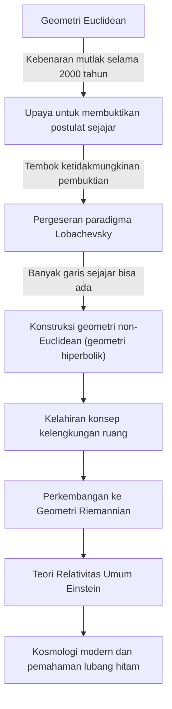
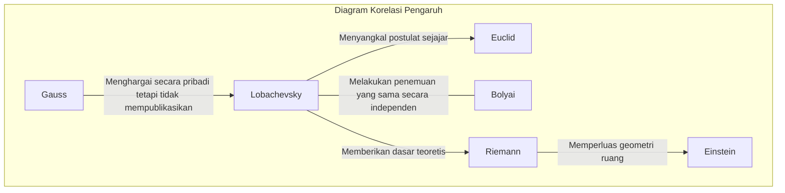

# Nikolai Lobachevsky: 'Copernicus dari Geometri' yang Membuka Pintu Geometri Non-Euclidean

Dalam sejarah matematika, sedikit yang telah membalikkan akal sehat yang ada dari akarnya dan menyajikan pandangan dunia baru. Di antara mereka, Nikolai Ivanovich Lobachevsky (1792–1856) adalah seorang ahli matematika hebat yang menembus batas "Geometri Euclidean", yang telah dianggap sebagai kebenaran mutlak selama lebih dari 2.000 tahun, dan membuka jalan ke matematika dan fisika modern.

Sebagaimana ahli matematika Inggris William Clifford menyebutnya "Copernicus dari Geometri", penemuannya tidak terbatas pada hanya satu cabang matematika, tetapi pada dasarnya merevolusi pemahaman manusia tentang alam semesta. Dalam artikel ini, kita akan menggali lebih dalam kehidupan Lobachevsky yang penuh gejolak, pemikiran dan filosofinya, serta dampaknya yang tak terukur pada generasi mendatang.

## Kemiskinan dan Hasrat: Kebangkitan di Universitas Kazan

Nikolai Lobachevsky lahir di Nizhny Novgorod, Kekaisaran Rusia, pada tahun 1792. Ketika dia masih muda, ayahnya meninggal dunia, dan keluarga itu jatuh ke dalam kemiskinan yang ekstrem. Di tengah kehidupan yang sulit, ibunya pindah ke Kazan untuk pendidikan anak-anaknya. Keputusan ini akan menjadi kesempatan pertama untuk melahirkan ahli matematika jenius masa depan.

Pada tahun 1807, ia memasuki Universitas Kazan yang baru didirikan sebagai siswa beasiswa. Awalnya, ia bercita-cita untuk belajar kedokteran, tetapi ia bertemu Martin Bartels (juga guru dari Carl Friedrich Gauss), seorang ahli matematika yang luar biasa, dan terpesona oleh pesona matematika yang mendalam. Di bawah bimbingan Bartels, Lobachevsky mengembangkan bakatnya yang luar biasa, memperoleh gelar master pada usia 21 tahun. Setelah itu, ia menaiki tangga akademik dengan kecepatan yang tidak biasa, menjadi profesor luar biasa pada usia 24 tahun.

Kehidupannya menyatu dengan Universitas Kazan. Ia tidak hanya menjabat sebagai profesor, tetapi juga direktur perpustakaan, direktur observatorium, dan pada usia muda 35 tahun, rektor, mendedikasikan dirinya untuk modernisasi universitas dan pengembangan pendidikan. Anekdot bahwa selama wabah kolera, ia sendiri mengarahkan karantina dan manajemen sanitasi kampus, menyelamatkan nyawa banyak mahasiswa, menceritakan kisah bahwa ia bukan sekadar penghuni menara gading, tetapi seseorang dengan rasa tanggung jawab dan tindakan yang mendalam.

## Tantangan terhadap "Postulat Sejajar": Lahirnya Geometri Non-Euclidean

Apa yang membuat nama Lobachevsky abadi dalam sejarah adalah tantangannya terhadap "Postulat Sejajar (Postulat Kelima)" dalam "Elements" Euclid.

Sejak abad ke-3 SM, postulat bahwa "melalui titik di luar garis, hanya ada satu garis sejajar" dianggap terbukti dengan sendirinya. Selama berabad-abad, ahli matematika yang tak terhitung jumlahnya mencoba membuktikan postulat ini dari empat aksioma lainnya, tetapi semuanya gagal.

Inovasi Lobachevsky terletak pada pengabaian pendekatan "mencoba membuktikan" dan mencapai gagasan terbalik: "mungkinkah ada geometri di mana postulat sejajar tidak berlaku?". Pada tahun 1826, ia menetapkan aksioma baru bahwa "melalui titik di luar garis, ada garis sejajar yang tak terhingga jumlahnya", dan dari sana ia membangun sistem geometri yang sama sekali baru dan konsisten. Inilah yang kemudian disebut "Geometri Hiperbolik (Geometri Lobachevskian)".

Diagram di bawah ini menunjukkan bagaimana penemuan Lobachevsky menembus kerangka kerja lama dan terhubung ke sains selanjutnya.

## Pertarungan Sepi dan Filosofi yang Gigih

Pada tahun 1829, ia menerbitkan penemuannya dalam makalah "Tentang Prinsip-Prinsip Geometri" dalam buletin Universitas Kazan. Namun, teori revolusionernya sama sekali tidak dipahami oleh komunitas akademik pada masanya.

Dia dikritik habis-habisan oleh ahli matematika yang berwenang di Rusia sebagai "tidak masuk akal" dan "khayalan yang tidak berarti", dan publikasinya di jurnal akademik bahkan ditolak. Raksasa matematika Gauss, yang membuat penemuan serupa pada waktu yang bersamaan, sangat memuji Lobachevsky dalam surat pribadi, tetapi takut reputasinya sendiri akan rusak, ia tidak mendukungnya secara publik. (Selain itu, matematikawan Hungaria János Bolyai juga secara independen menemukan geometri non-Euclidean pada waktu yang bersamaan.)

Terlepas dari ketidakpahaman dan cemoohan di sekitarnya, Lobachevsky tidak mengompromikan keyakinannya. Filosofinya bahwa "kebenaran matematis hanya diuji secara final oleh realitas fisik" memandang matematika bukan hanya sebagai permainan logika abstrak, tetapi sebagai bahasa untuk menggambarkan sifat alam semesta yang sebenarnya. Dia benar-benar mencoba menggunakan paralaks bintang untuk mengukur apakah ruang Euclidean atau non-Euclidean. Meskipun tidak mungkin dengan akurasi pengamatan waktu itu, itu adalah pandangan jauh ke depan yang luar biasa yang ditujukan pada integrasi matematika dan fisika.

## Tragedi di Tahun-Tahun Terakhir dan Warisan Abadi

Tahun-tahun terakhir Lobachevsky sama sekali tidak bahagia. Dia diberhentikan secara tidak adil dari jabatannya sebagai rektor universitas, kehilangan putra kesayangannya, dan bahkan kehilangan penglihatannya. Buta, ia mendiktekan "Pangeometri" kepada murid-muridnya sampai sesaat sebelum kematiannya, meninggalkan puncak teorinya. Pada tahun 1856, tanpa melihat hari ketika pencapaian besarnya dihargai sebagaimana mestinya, ia meninggal dunia pada usia 63 tahun.

Butuh waktu puluhan tahun setelah kematiannya sebelum dia benar-benar diakui sebagai "Copernicus dari Geometri". Teorinya digeneralisasi oleh Bernhard Riemann, berkembang menjadi "Geometri Riemannian" untuk menggambarkan ruang melengkung multidimensi. Dan pada awal abad ke-20, ketika Albert Einstein membangun "Teori Relativitas Umum", apa yang sangat diperlukan untuk menggambarkan kebenaran alam semesta bahwa ruang-waktu terdistorsi oleh gravitasi adalah kerangka geometri non-Euclidean ini.

Seandainya Lobachevsky tidak meruntuhkan tembok tak kasat mata yang disebut "akal sehat", fisika modern dan kosmologi akan sama sekali berbeda.

## Kesimpulan: Kemenangan Jiwa yang Bebas

Kehidupan Nikolai Lobachevsky mengajarkan kita betapa kuatnya jiwa manusia dalam mencari kebenaran. Dia menghadapi banyak kesulitan seperti kemiskinan, penganiayaan dari otoritas, dan kemerosotan fisik, tetapi terus percaya pada cahaya kecerdasan batinnya.

Warisan terbesarnya bukan hanya teori matematika dari geometri non-Euclidean itu sendiri. Ini adalah keberanian tertinggi dalam eksplorasi ilmiah untuk "mempertanyakan akal sehat dan membangun dunia yang tidak diketahui dengan pemikiran bebas". Fakta bahwa hari ini kita dapat menggunakan GPS pada ponsel cerdas kita dan merenungkan ujung alam semesta adalah hadiah dari "jiwa yang bebas" dari seorang jenius yang membayangkan bentuk alam semesta dalam kesunyian di pedesaan Rusia pada abad ke-19.
