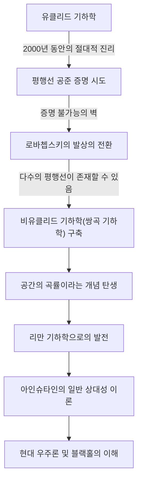
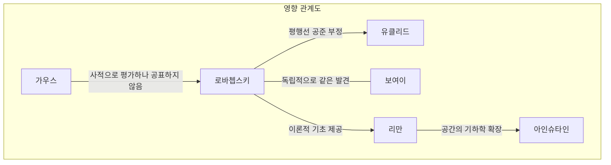

# 니콜라이 로바쳅스키: 비유클리드 기하학의 문을 연 '기하학의 코페르니쿠스'

수학의 역사에서 기존의 상식을 뿌리째 뒤집고 새로운 세계관을 제시한 인물은 손에 꼽을 정도다. 그 중에서도 니콜라이 이바노비치 로바쳅스키(Nikolai Ivanovich Lobachevsky, 1792–1856)는 2,000년 이상 절대적인 진리로 여겨져 온 '유클리드 기하학'의 한계를 돌파하고 현대 수학 및 물리학으로 가는 길을 개척한 위대한 수학자이다.

영국의 수학자 윌리엄 클리포드가 그를 "기하학의 코페르니쿠스"라고 불렀듯이, 그의 발견은 단순히 수학의 한 분야에 국한되지 않고 우주에 대한 인류의 이해를 근본적으로 혁신했다. 이 글에서는 로바쳅스키의 파란만장한 삶, 그의 사상과 철학, 그리고 미래 세대에 미친 헤아릴 수 없는 영향에 대해 깊이 파헤쳐 볼 것이다.

## 빈곤과 열정: 카잔 대학에서의 각성

니콜라이 로바쳅스키는 1792년 러시아 제국의 니즈니노브고로드에서 태어났다. 그가 어렸을 때 아버지가 세상을 떠났고, 가족은 극심한 빈곤에 빠졌다. 어려운 삶 속에서 어머니는 자녀 교육을 위해 카잔으로 이주했다. 이 결정은 미래의 수학 천재를 탄생시키는 첫 번째 계기가 되었다.

1807년, 그는 장학생으로 갓 설립된 카잔 대학에 입학했다. 처음에는 의학을 공부하고자 했으나, 뛰어난 수학자인 마르틴 바르텔스(카를 프리드리히 가우스의 스승이기도 함)를 만나 수학의 심오한 매력에 빠지게 되었다. 바르텔스의 지도 아래 로바쳅스키는 눈부신 재능을 발휘하여 21세의 나이에 석사 학위를 취득했다. 그 후, 그는 유례없이 빠른 속도로 학문의 계단을 올라 24세에 특별 교수가 되었다.

그의 삶은 카잔 대학과 함께했다. 그는 교수뿐만 아니라 도서관장, 천문대장, 그리고 35세의 젊은 나이에 총장으로 재직하며 대학의 현대화와 교육 발전에 헌신했다. 콜레라가 유행했을 때 그가 직접 캠퍼스의 격리와 위생 관리를 지휘하여 많은 학생들의 생명을 구했다는 일화는 그가 단순한 상아탑의 거주자가 아니라 깊은 책임감과 행동력을 갖춘 인물이었음을 말해준다.

## "평행선 공준"에 대한 도전: 비유클리드 기하학의 탄생

역사상 로바쳅스키의 이름을 불멸하게 만든 것은 유클리드의 '원론'에 나오는 "평행선 공준(제5공준)"에 대한 그의 도전이었다.

기원전 3세기 이래로 "직선 밖의 한 점을 지나는 평행선은 오직 하나뿐이다"라는 이 공준은 자명한 이치로 여겨졌다. 수세기에 걸쳐 수많은 수학자들이 다른 4개의 공리로부터 이 공준을 증명하려고 시도했지만 모두 실패로 돌아갔다.

로바쳅스키의 혁신성은 "증명하려는" 접근 방식을 버리고 "평행선 공준이 성립하지 않는 기하학도 존재할 수 있지 않을까"라는 역발상에 도달한 데 있다. 1826년, 그는 "직선 밖의 한 점을 지나는 평행선은 무수히 많다"는 새로운 공리를 세우고, 이를 바탕으로 모순이 없는 완전히 새로운 기하학 체계를 구축했다. 이것이 나중에 "쌍곡 기하학(로바쳅스키 기하학)"이라고 불리게 된 것이다.

아래 다이어그램은 로바쳅스키의 발견이 어떻게 기존의 틀을 깨고 후세의 과학과 연결되었는지를 보여준다.

## 고독한 투쟁과 불굴의 철학

1829년, 그는 카잔 대학의 회보에 '기하학의 기초에 대하여'라는 논문으로 자신의 발견을 발표했다. 그러나 그의 혁명적인 이론은 당시 학계에서 전혀 이해받지 못했다.

그는 러시아의 권위 있는 수학자들로부터 "상식을 벗어난", "무의미한 망상"이라는 혹평을 받았고, 학술지 게재마저 거부당했다. 동시대에 비슷한 발견을 했던 수학계의 거장 가우스는 개인적인 편지에서 로바쳅스키를 높이 평가했지만, 자신의 명성이 훼손될 것을 두려워하여 공개적으로 그를 지지하지는 않았다. (또한 헝가리의 보여이 야노시도 같은 시기에 독립적으로 비유클리드 기하학을 발견했다.)

주변의 몰이해와 조소 속에서도 로바쳅스키는 자신의 신념을 굽히지 않았다. "수학적 진리는 오직 물리적 현실에 의해서만 궁극적으로 검증된다"는 그의 철학은 수학을 단순한 추상적인 논리 놀이가 아니라 우주의 진정한 본질을 기술하는 언어로 보았다. 그는 실제로 별의 시차를 이용하여 우주 공간이 유클리드적인지 비유클리드적인지 측정하려고 시도했다. 당시의 관측 정확도로는 불가능했지만, 수학과 물리학의 융합을 겨냥한 놀라운 선견지명이었다.

## 말년의 비극과 영원한 유산

로바쳅스키의 말년은 결코 행복하지 않았다. 대학 총장직에서 부당하게 해임되었고, 사랑하는 아들을 잃었으며, 심지어 시력마저 잃었다. 시력을 잃은 그는 죽기 직전까지 제자들에게 구술하여 '범기하학(Pangeometry)'을 저술하며 자신의 이론의 정수를 남겼다. 1856년, 자신의 위대한 업적이 제대로 평가받는 날을 보지 못한 채 63세의 나이로 세상을 떠났다.

그가 "기하학의 코페르니쿠스"로 진정으로 인정받기까지는 사후 수십 년이 걸렸다. 그의 이론은 베른하르트 리만에 의해 일반화되어 다차원의 굽은 공간을 기술하는 "리만 기하학"으로 발전했다. 그리고 20세기 초, 알베르트 아인슈타인이 "일반 상대성 이론"을 구축할 때, 시공간이 중력에 의해 왜곡된다는 우주의 진리를 기술하는 데 없어서는 안 될 요소가 바로 이 비유클리드 기하학의 틀이었다.

만약 로바쳅스키가 "상식"이라는 보이지 않는 벽을 허물지 않았다면 현대 물리학과 우주론은 완전히 달랐을 것이다.

## 결론: 자유로운 정신의 승리

니콜라이 로바쳅스키의 삶은 진리를 추구하는 인간의 정신이 얼마나 강인할 수 있는지를 가르쳐 준다. 그는 빈곤, 권위로부터의 핍박, 육체적 쇠약이라는 수많은 어려움에 직면했지만, 내면의 지성의 빛을 계속해서 믿었다.

그가 남긴 가장 큰 유산은 비유클리드 기하학이라는 수학적 이론 그 자체만이 아니다. 그것은 과학적 탐구에서 "상식에 의문을 제기하고 자유로운 발상으로 미지의 세계를 구축하는" 궁극적인 용기이다. 오늘날 우리가 스마트폰에서 GPS를 사용하고 우주의 끝자락에 대해 숙고할 수 있는 것은, 19세기 러시아 시골의 고독 속에서 우주의 형태를 상상했던 한 천재의 "자유로운 정신"이 준 선물이다.
