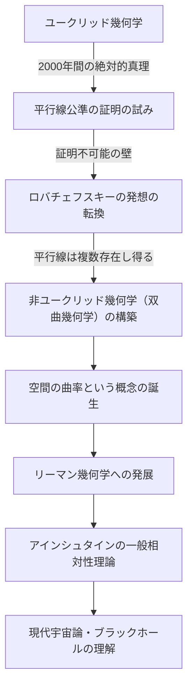
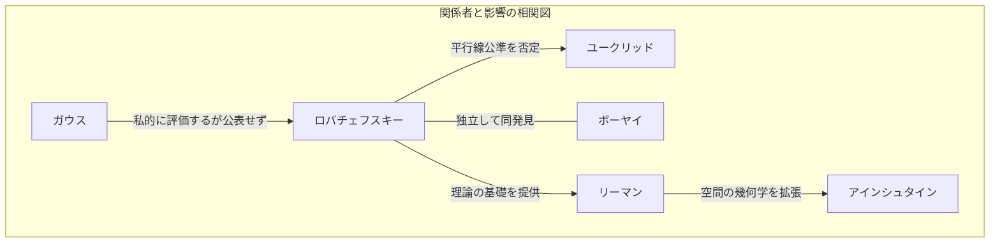

# ニコライ・ロバチェフスキー：非ユークリッド幾何学の扉を開いた「幾何学のコペルニクス」

数学の歴史において、既存の常識を根本から覆し、新たな世界観を提示した人物は数少ない。その中でも、ニコライ・イヴァノヴィチ・ロバチェフスキー（Nikolai Ivanovich Lobachevsky, 1792–1856）は、2000年以上にわたって絶対的な真理とされてきた「ユークリッド幾何学」の限界を打ち破り、現代数学および物理学への道を切り開いた偉大な数学者である。

イギリスの数学者ウィリアム・クリフォードが彼を「幾何学のコペルニクス」と称したように、彼の発見は単なる数学の一分野にとどまらず、人類の宇宙に対する認識を根底から変革するものであった。本稿では、ロバチェフスキーの波乱に満ちた生涯、彼の思想と哲学、そして後世に与えた計り知れない影響について深く掘り下げていく。

## 貧困と情熱：カザン大学での目覚め

ニコライ・ロバチェフスキーは1792年、ロシア帝国のニジニ・ノヴゴロドに生まれた。彼がまだ幼い頃に父親が亡くなり、一家は極度の貧困に陥る。母親は苦しい生活の中、子供たちの教育のためにカザンへと移住した。この決断が、後の天才数学者を生み出す最初の契機となる。

1807年、彼は創設されたばかりのカザン大学に奨学生として入学する。当初は医学を志していたが、優れた数学者であったマルティン・バルテルス（カール・フリードリヒ・ガウスの師でもある）と出会い、数学の深淵なる魅力に取り憑かれることとなる。バルテルスの指導の下、ロバチェフスキーは目覚ましい才能を開花させ、わずか21歳で修士号を取得。その後、24歳で特任教授に就任するという異例の早さで学問の階段を駆け上がった。

彼の人生はカザン大学と共にあった。教授としてだけでなく、図書館長、天文台長、そして35歳という若さで学長に就任し、大学の近代化と教育の発展に尽力した。コレラが流行した際には、自らキャンパスの隔離と衛生管理を指揮し、多くの学生の命を救ったという逸話は、彼が単なる象牙の塔の住人ではなく、深い責任感と行動力を備えた人物であったことを物語っている。

## 「平行線公準」への挑戦：非ユークリッド幾何学の誕生

ロバチェフスキーの名を歴史に不朽のものとしたのは、ユークリッドの『原論』における「平行線公準（第5公準）」への挑戦である。

紀元前3世紀以来、「直線外の1点を通る平行線は1本しか存在しない」というこの公準は、自明の理とされてきた。何世紀にもわたり、無数の数学者たちがこの公準を他の4つの公理から証明しようと試みたが、すべて失敗に終わっていた。

ロバチェフスキーの革新性は、「証明しようとする」アプローチを捨て、「平行線公準が成り立たない幾何学も存在するのではないか」という逆転の発想に至った点にある。1826年、彼は「直線外の1点を通る平行線は無数に存在する」という新たな公理を置き、そこから矛盾のない全く新しい幾何学体系を構築した。これが後に「双曲幾何学（ロバチェフスキー幾何学）」と呼ばれるものである。

以下の図は、ロバチェフスキーの発見がどのように従来の枠組みを打ち破り、後世の科学に繋がっていったかを示すフローである。

## 孤独な闘いと不屈の哲学

1829年、彼は自らの発見を論文『幾何学の基礎について』としてカザン大学の紀要に発表した。しかし、彼の画期的な理論は、当時の学界からは全く理解されなかった。

ロシア国内の権威ある数学者たちからは「常識外れ」「無意味な妄想」と酷評され、学術雑誌への掲載を拒否されることもあった。同時代に同様の発見をしていた数学界の巨人ガウスは、個人的な手紙でロバチェフスキーを高く評価したものの、自身の名声が傷つくことを恐れて公には彼を支持しなかった。（なお、ハンガリーのボーヤイ・ヤーノシュも同時期に独立して非ユークリッド幾何学を発見している。）

周囲の無理解と冷笑の中にあっても、ロバチェフスキーは自らの信念を曲げなかった。「数学的真理は、物理的現実によってのみ最終的に検証される」という彼の哲学は、数学を単なる抽象的な論理遊びではなく、宇宙の真の姿を記述するための言語であると捉えていた。彼は実際に、星の視差を利用して宇宙空間がユークリッド的か非ユークリッド的かを測量しようと試みている。これは当時の観測精度では不可能であったが、数学と物理学の融合を見据えた驚くべき先見の明であった。

## 晩年の悲劇と永遠の遺産

ロバチェフスキーの晩年は、決して幸福なものではなかった。大学の学長職を不当に解任され、最愛の息子を亡くし、さらには視力をも失っていく。盲目となった彼は、死の直前まで弟子の口述筆記によって『汎幾何学』を書き上げ、自らの理論の集大成を残した。1856年、自身の偉業が正当に評価される日を見ることなく、63歳でこの世を去った。

彼が「幾何学のコペルニクス」として真の評価を得るのは、死後数十年が経過してからである。彼の理論はベルンハルト・リーマンによって一般化され、多次元の曲がった空間を記述する「リーマン幾何学」へと発展した。そして20世紀初頭、アルベルト・アインシュタインが「一般相対性理論」を構築する際、重力によって時空が歪むという宇宙の真理を記述するために不可欠だったのが、まさにこの非ユークリッド幾何学の枠組みであった。

もしロバチェフスキーが「常識」という名の見えない壁を壊していなければ、現代の物理学や宇宙論は全く違ったものになっていただろう。

## 結び：自由なる精神の勝利

ニコライ・ロバチェフスキーの生涯は、真理を探求する人間の精神がいかに強靭であるかを私たちに教えてくれる。彼は貧困、権威からの迫害、そして肉体的な衰えという幾多の困難に直面しながらも、自らの内なる知性の光を信じ続けた。

彼の残した最大の遺産は、非ユークリッド幾何学という数学的理論そのものだけではない。「常識を疑い、自由な発想で未知の世界を構築する」という、科学的探求における究極の勇気である。今日、私たちがスマートフォンでGPSを利用し、宇宙の果てに思いを馳せることができるのは、19世紀のロシアの片田舎で、孤独に宇宙の形を思い描いた一人の天才の「自由なる精神」の賜物なのである。
