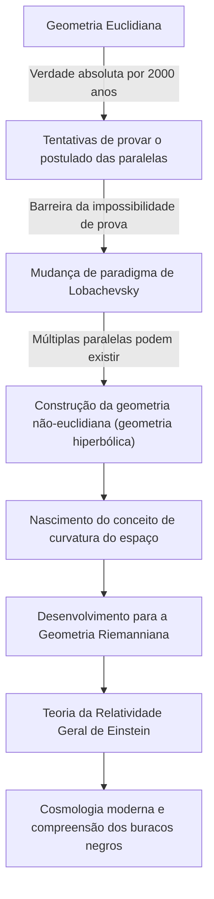
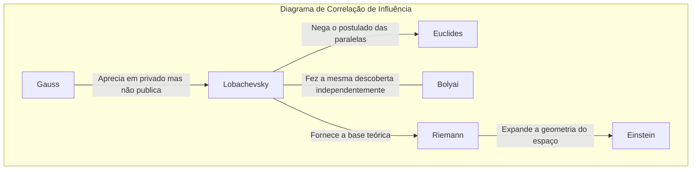

# Nikolai Lobachevsky: O 'Copérnico da Geometria' que Abriu as Portas da Geometria Não-Euclidiana

Na história da matemática, poucas pessoas derrubaram o senso comum existente desde as raízes e apresentaram uma nova visão de mundo. Entre elas, Nikolai Ivanovich Lobachevsky (1792–1856) foi um grande matemático que quebrou os limites da "geometria euclidiana", considerada a verdade absoluta por mais de 2.000 anos, e abriu o caminho para a matemática e a física modernas.

Como o matemático britânico William Clifford o chamou de "o Copérnico da Geometria", suas descobertas não se limitaram apenas a um ramo da matemática, mas revolucionaram fundamentalmente a percepção humana do universo. Neste artigo, aprofundaremos a vida turbulenta de Lobachevsky, seu pensamento e filosofia, e seu impacto imensurável nas gerações futuras.

## Pobreza e Paixão: Despertar na Universidade de Kazan

Nikolai Lobachevsky nasceu em Nizhni Novgorod, no Império Russo, em 1792. Quando ainda era jovem, seu pai faleceu, e a família caiu em extrema pobreza. No meio de uma vida difícil, sua mãe mudou-se para Kazan para a educação dos filhos. Essa decisão se tornaria a primeira oportunidade para dar origem a um futuro gênio matemático.

Em 1807, ele ingressou na recém-fundada Universidade de Kazan como bolsista. Inicialmente, aspirava estudar medicina, mas conheceu Martin Bartels (também professor de [Carl Friedrich Gauss](/pt/p/gauss/)), um notável matemático, e ficou fascinado pelo profundo encanto da matemática. Sob a orientação de Bartels, Lobachevsky desenvolveu seu talento notável, obtendo um mestrado com apenas 21 anos. Depois disso, subiu os degraus acadêmicos em uma velocidade incomum, tornando-se professor extraordinário aos 24 anos.

Sua vida esteve atrelada à Universidade de Kazan. Ele não apenas atuou como professor, mas também como diretor da biblioteca, diretor do observatório e, com a tenra idade de 35 anos, reitor, dedicando-se à modernização da universidade e ao desenvolvimento da educação. A anedota de que, durante uma epidemia de cólera, ele próprio dirigiu a quarentena e a gestão sanitária do campus, salvando a vida de muitos estudantes, mostra que ele não era apenas um habitante da torre de marfim, mas uma pessoa com um profundo senso de responsabilidade e ação.

## O Desafio ao "Postulado das Paralelas": O Nascimento da Geometria Não-Euclidiana

O que tornou o nome de Lobachevsky imortal na história foi o seu desafio ao "postulado das paralelas (o quinto postulado)" nos "Elementos" de [Euclides](/pt/p/euclid/).

Desde o século III a.C., o postulado de que "através de um ponto fora de uma reta, existe apenas uma reta paralela" era considerado uma verdade autoevidente. Durante séculos, incontáveis matemáticos tentaram provar este postulado a partir dos outros quatro axiomas, mas todos falharam.

A inovação de Lobachevsky residiu em abandonar a abordagem de "tentar provar" e chegar à ideia inversa: "não haveria também uma geometria na qual o postulado das paralelas não se sustentasse?". Em 1826, ele estabeleceu um novo axioma de que "através de um ponto fora de uma reta, existe um número infinito de retas paralelas", e a partir disso construiu um sistema geométrico inteiramente novo e consistente. Isso foi o que mais tarde se chamou "Geometria Hiperbólica (Geometria de Lobachevsky)".

O diagrama abaixo mostra como a descoberta de Lobachevsky quebrou as antigas estruturas e se conectou à ciência posterior.

## Batalha Solitária e Filosofia Indomável

Em 1829, ele publicou suas descobertas no artigo "Sobre os Fundamentos da Geometria" no boletim da Universidade de Kazan. No entanto, sua teoria revolucionária não foi compreendida pela comunidade acadêmica de sua época.

Ele foi severamente criticado por matemáticos de autoridade na Rússia como "absurdo" e "ilusão sem sentido", e sua publicação em revistas acadêmicas foi até rejeitada. O gigante da matemática, Gauss, que fizera descobertas semelhantes na mesma época, elogiou muito Lobachevsky em cartas pessoais, mas temendo que sua própria reputação fosse prejudicada, não o apoiou publicamente. (Além disso, o húngaro János Bolyai também descobriu independentemente a geometria não-euclidiana na mesma época.)

Apesar da incompreensão e escárnio ao seu redor, Lobachevsky não comprometeu suas crenças. Sua filosofia de que "a verdade matemática só é testada finalmente pela realidade física" via a matemática não apenas como um jogo lógico abstrato, mas como uma linguagem para descrever a verdadeira natureza do universo. Ele de fato tentou usar a paralaxe das estrelas para medir se o espaço era euclidiano ou não-euclidiano. Embora fosse impossível com a precisão de observação da época, foi uma incrível presciência voltada para a integração da matemática e da física.

## Tragédia nos Últimos Anos e Legado Eterno

Os últimos anos de Lobachevsky não foram felizes. Ele foi injustamente destituído do cargo de reitor da universidade, perdeu seu filho amado e até mesmo perdeu a visão. Cego, ditou a sua "Pangeometria" aos seus discípulos até pouco antes de sua morte, deixando a culminação de sua teoria. Em 1856, sem ver o dia em que suas grandes realizações seriam devidamente apreciadas, faleceu aos 63 anos.

Levaria décadas após sua morte para que ele fosse verdadeiramente reconhecido como o "Copérnico da Geometria". Sua teoria foi generalizada por [Bernhard Riemann](/pt/p/riemann/), desenvolvendo-se na "Geometria Riemanniana" para descrever espaços curvos multidimensionais. E no início do século XX, quando Albert Einstein construiu a "Teoria da Relatividade Geral", o que foi indispensável para descrever a verdade universal de que o espaço-tempo é distorcido pela gravidade foi exatamente essa estrutura da geometria não-euclidiana.

Se Lobachevsky não tivesse quebrado o muro invisível chamado "senso comum", a física moderna e a cosmologia teriam sido completamente diferentes.

## Conclusão: O Triunfo de um Espírito Livre

A vida de Nikolai Lobachevsky nos ensina o quão forte pode ser o espírito humano em busca da verdade. Ele enfrentou inúmeras dificuldades como a pobreza, a perseguição por autoridades e o declínio físico, mas continuou a acreditar na luz de seu intelecto interior.

Seu maior legado não é apenas a teoria matemática da geometria não-euclidiana em si. É a coragem suprema na exploração científica de "questionar o senso comum e construir um mundo desconhecido com pensamento livre". O fato de que hoje podemos usar o GPS em nossos smartphones e ponderar sobre os confins do universo é um presente do "espírito livre" de um gênio que imaginou a forma do universo em solidão no interior da Rússia do século XIX.
