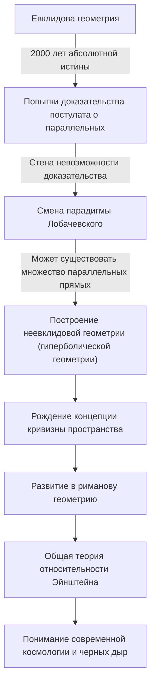
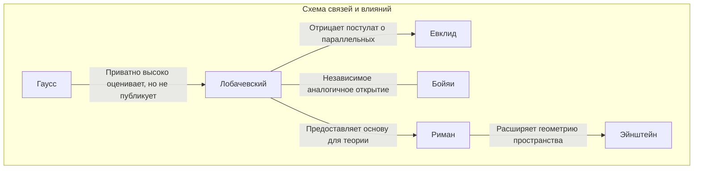

# Николай Лобачевский: «Коперник геометрии», открывший двери неевклидовой геометрии

В истории математики есть лишь несколько людей, которые в корне перевернули существующие общепринятые представления и предложили новое мировоззрение. Среди них Николай Иванович Лобачевский (1792–1856) — великий математик, разрушивший ограничения «евклидовой геометрии», считавшейся абсолютной истиной более 2000 лет, и проложивший путь к современной математике и физике.

Как назвал его британский математик Уильям Клиффорд «Коперником геометрии», его открытие не ограничилось лишь одной областью математики, а в корне изменило понимание человечеством Вселенной. В этой статье мы подробно рассмотрим бурную жизнь Лобачевского, его мысли и философию, а также то неизмеримое влияние, которое он оказал на будущие поколения.

## Бедность и страсть: Пробуждение в Казанском университете

Николай Лобачевский родился в 1792 году в Нижнем Новгороде, в Российской империи. Его отец умер, когда он был еще маленьким, и семья впала в крайнюю нужду. Несмотря на тяжелую жизнь, его мать решила переехать в Казань ради образования детей. Это решение стало первым шагом к появлению в будущем гениального математика.

В 1807 году он поступил в недавно основанный Казанский университет в качестве казеннокоштного студента. Первоначально он намеревался изучать медицину, но после встречи с выдающимся математиком Мартином Бартельсом (который также был учителем Карла Фридриха Гаусса) он был очарован глубокой привлекательностью математики. Под руководством Бартельса Лобачевский продемонстрировал выдающийся талант и получил степень магистра всего в 21 год. Впоследствии он беспрецедентно быстро поднимался по академической лестнице, став экстраординарным профессором в возрасте 24 лет.

Его жизнь была неразрывно связана с Казанским университетом. Он посвятил себя модернизации университета и развитию образования не только как профессор, но и как директор библиотеки, директор обсерватории, а в молодом возрасте 35 лет — как ректор университета. Во время эпидемии холеры он лично руководил изоляцией кампуса и санитарным контролем, спасши жизни многих студентов. Этот эпизод показывает, что он был не просто обитателем башни из слоновой кости, а человеком с глубоким чувством ответственности и способностью к действию.

## Вызов «Постулату о параллельных»: Рождение неевклидовой геометрии

То, что сделало имя Лобачевского бессмертным в истории, — это его вызов «Постулату о параллельных (пятому постулату)» в «Началах» Евклида.

С III века до нашей эры этот постулат, гласящий, что «через точку, не лежащую на данной прямой, можно провести только одну прямую, параллельную данной», считался самоочевидной истиной. На протяжении веков бесчисленные математики пытались доказать этот постулат, исходя из других четырех аксиом, но все их попытки заканчивались неудачей.

Новаторство Лобачевского заключается в том, что он отказался от подхода «попытки доказать» и пришел к обратной идее: «А не существует ли геометрии, в которой постулат о параллельных не выполняется?». В 1826 году он выдвинул новую аксиому о том, что «через точку, не лежащую на данной прямой, проходит бесконечно много прямых, параллельных данной», и на ее основе построил совершенно новую и непротиворечивую геометрическую систему. Позже это стало известно как «гиперболическая геометрия (геометрия Лобачевского)».

Приведенная ниже схема иллюстрирует, как открытие Лобачевского сломало традиционные рамки и стало связующим звеном с наукой будущих поколений.

## Одинокая борьба и несокрушимая философия

В 1829 году он опубликовал свои открытия в статье «О началах геометрии» в журнале «Казанский вестник». Однако его революционная теория совершенно не была понята академическими кругами того времени.

Авторитетные математики в России резко критиковали её как «абсурд» и «бессмысленную фантазию», а в публикации его работ в научных журналах отказывали. Математический гигант того времени Гаусс, сделавший аналогичное открытие в то же самое время, высоко оценил Лобачевского в частном письме, но публично не поддержал его, опасаясь за свою репутацию. (Венгр Янош Бойяи также независимо открыл неевклидову геометрию примерно в то же время).

Среди непонимания и насмешек окружающих Лобачевский не поступился своими убеждениями. Его философия, гласящая, что «математическая истина может быть окончательно проверена только физической реальностью», рассматривала математику не просто как абстрактную логическую игру, а как язык для описания истинной природы Вселенной. Он действительно пытался измерить, является ли пространство евклидовым или неевклидовым, используя параллакс звезд. Хотя при точности наблюдений того времени это было невозможно, это было поразительным предвидением, предвосхитившим слияние математики и физики.

## Трагедия последних лет и вечное наследие

Последние годы жизни Лобачевского отнюдь не были счастливыми. Он был несправедливо уволен с должности ректора университета, потерял любимого сына и, в конце концов, ослеп. Будучи слепым, незадолго до смерти он продиктовал своим ученикам свой труд «Пангеометрия», оставив после себя кульминацию своих теорий. В 1856 году он скончался в возрасте 63 лет, так и не дожив до того дня, когда его великие достижения будут по достоинству оценены.

Свое истинное признание как «Коперник геометрии» он получил лишь спустя несколько десятилетий после смерти. Его теория была обобщена Бернхардом Риманом и переросла в «риманову геометрию», описывающую многомерные искривленные пространства. А в начале 20 века, когда Альберт Эйнштейн создавал «Общую теорию относительности», именно этот аппарат неевклидовой геометрии оказался абсолютно необходимым для описания истины Вселенной о том, что пространство-время искривляется под действием гравитации.

Если бы Лобачевский не разрушил невидимую стену под названием «здравый смысл», современная физика и космология были бы совершенно иными.

## Заключение: Триумф свободного духа

Жизнь Николая Лобачевского учит нас тому, насколько стойким является человеческий дух в поисках истины. Несмотря на множество трудностей — от нищеты до преследований со стороны властей и физического угасания — он продолжал верить в свет своего внутреннего интеллекта.

Его величайшее наследие — это не только сама математическая теория неевклидовой геометрии. Это высшее мужество в научном поиске — «сомневаться в здравом смысле и свободно конструировать неизведанный мир». Сегодня, когда мы используем GPS на наших смартфонах и размышляем о краях Вселенной, это дар «свободного духа» одного гения, который в одиночестве вообразил форму Вселенной в российской глубинке 19 века.
