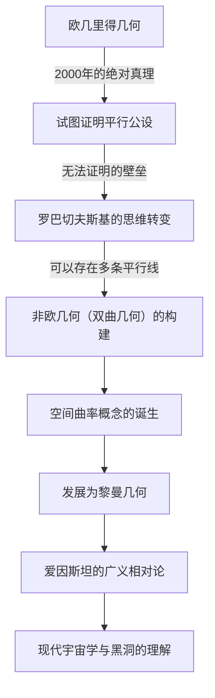
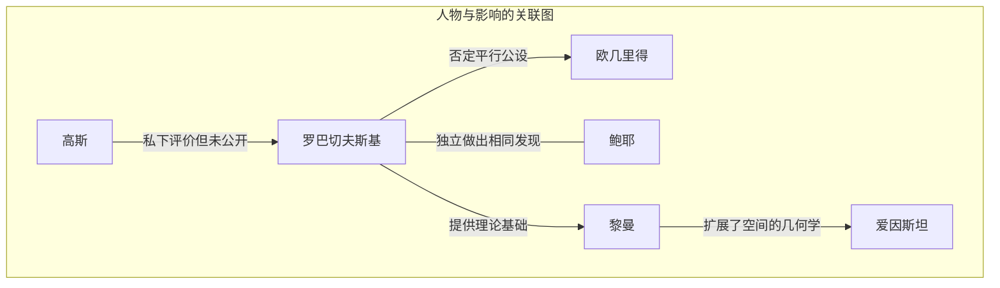

# 尼古拉·罗巴切夫斯基：推开非欧几何大门的“几何学哥白尼”

在数学史上，能够从根本上颠覆现有常识并提出新世界观的人物寥寥无几。其中，尼古拉·伊万诺维奇·罗巴切夫斯基（Nikolai Ivanovich Lobachevsky, 1792–1856）是一位打破了2000多年来被视为绝对真理的“欧几里得几何”的局限，并为现代数学和物理学开辟了道路的伟大数学家。

正如英国数学家威廉·克利福德称他为“几何学哥白尼”一样，他的发现不仅仅局限于数学的一个分支，而是从根本上改变了人类对宇宙的认识。本文将深入探讨罗巴切夫斯基充满波折的一生、他的思想与哲学，以及对后世产生的不可估量的影响。

## 贫困与热情：在喀山大学的觉醒

尼古拉·罗巴切夫斯基1792年出生于俄罗斯帝国的下诺夫哥罗德。他年幼时父亲便去世了，一家人陷入了极度的贫困。在艰苦的生活中，母亲为了孩子们的教育举家迁往喀山。这个决定成为了日后诞生这位天才数学家的第一个契机。

1807年，他作为奖学金生进入了刚刚创办的喀山大学。最初他立志学医，但遇到了杰出的数学家马丁·巴特尔斯（他也是卡尔·弗里德里希·高斯的老师），从而被数学深邃的魅力所吸引。在巴特尔斯的指导下，罗巴切夫斯基展现出了惊人的才华，年仅21岁就获得了硕士学位。此后，他以破例的速度攀登学术阶梯，在24岁时就任特聘教授。

他的一生与喀山大学紧密相连。不仅作为教授，他还担任过图书馆馆长、天文台台长，并在35岁时就任校长，为大学的现代化和教育的发展倾注了心血。在霍乱流行期间，他亲自指挥校园的隔离和卫生管理，拯救了许多学生的生命，这段轶事说明他不仅仅是象牙塔里的居民，更是一个具备强烈责任感和行动力的人。

## 挑战“平行公设”：非欧几何的诞生

让罗巴切夫斯基的名字在历史上不朽的，是他对欧几里得《几何原本》中“平行公设（第五公设）”的挑战。

自公元前3世纪以来，“通过直线外一点，有且只有一条直线与已知直线平行”这一公设一直被认为是不言自明的真理。几个世纪以来，无数数学家试图用其他四条公理来证明这一公设，但都以失败告终。

罗巴切夫斯基的创新之处在于，他放弃了“试图证明”的方法，转而产生了“也许存在平行公设不成立的几何学”这种逆向思维。1826年，他提出了“通过直线外一点，有无数条直线与已知直线平行”的新公理，并以此为基础构建了一个毫无矛盾的全新几何体系。这也就是后来被称为“双曲几何（罗氏几何）”的理论。

下图展示了罗巴切夫斯基的发现是如何打破传统框架，并与后世科学相联系的。

## 孤独的斗争与不屈的哲学

1829年，他将自己的发现作为论文《关于几何学基础》发表在喀山大学的校刊上。然而，他这一划时代的理论在当时的学术界完全没有得到理解。

他被俄罗斯国内权威数学家严厉批评为“违背常理”、“毫无意义的妄想”，有时甚至被学术期刊拒绝刊登。同一时期做出类似发现的数学界泰斗高斯，在私人信件中对罗巴切夫斯基给予了高度评价，但由于害怕损害自己的名誉，并未公开支持他。（注：匈牙利的亚诺什·鲍耶也在同一时期独立发现了非欧几何。）

即使在周围的不解与冷嘲热讽中，罗巴切夫斯基也没有改变自己的信念。他坚持“数学真理最终只能由物理现实来验证”的哲学，将数学视为描述宇宙真实面貌的语言，而不仅仅是抽象的逻辑游戏。他实际上曾尝试利用恒星视差来测量宇宙空间是欧几里得的还是非欧几里得的。虽然在当时的观测精度下这是不可能的，但这展现了他着眼于数学与物理学融合的惊人先见之明。

## 晚年的悲剧与永恒的遗产

罗巴切夫斯基的晚年绝非幸福。他被无理免去了大学校长职务，失去了最心爱的儿子，后来甚至双目失明。在失明的情况下，他在临终前通过向弟子口述完成了《泛几何学》，留下了自己理论的集大成之作。1856年，他未能看到自己的伟业得到公正评价的那一天，享年63岁便离开了人世。

直到他死后几十年，他才作为“几何学哥白尼”获得了真正的评价。他的理论被波恩哈德·黎曼推广，发展成为描述多维弯曲空间的“黎曼几何”。而在20世纪初，当阿尔伯特·爱因斯坦构建“广义相对论”时，正是这种非欧几何的框架，成为了描述引力扭曲时空这一宇宙真理所不可或缺的工具。

如果罗巴切夫斯基没有打破名为“常识”的无形之墙，现代物理学和宇宙学将会是完全不同的景象。

## 结语：自由精神的胜利

尼古拉·罗巴切夫斯基的一生告诉我们，人类探索真理的精神是多么坚韧。在面临贫困、权威的迫害以及身体衰弱等重重困难时，他依然坚信自己内在的智慧之光。

他留下的最大遗产，不仅仅是非欧几何这一数学理论本身，更是在科学探索中“怀疑常识，用自由的思维构建未知世界”的终极勇气。今天，我们在智能手机上使用GPS，并能够将思绪驰骋于宇宙的尽头，正是19世纪俄罗斯偏乡僻壤中一位独自构想宇宙形状的天才的“自由精神”的恩赐。
