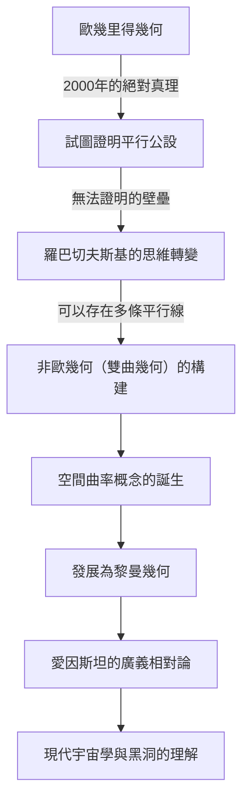
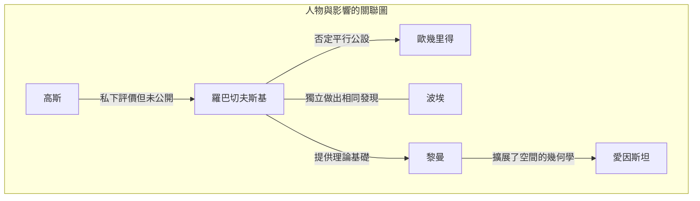

# 尼古拉·羅巴切夫斯基：推開非歐幾何大門的「幾何學哥白尼」

在數學史上，能夠從根本上顛覆現有常識並提出新世界觀的人物寥寥無幾。其中，尼古拉·伊萬諾維奇·羅巴切夫斯基（Nikolai Ivanovich Lobachevsky, 1792–1856）是一位打破了2000多年來被視為絕對真理的「歐幾里得幾何」的侷限，並為現代數學和物理學開闢了道路的偉大數學家。

正如英國數學家威廉·克利福德稱他為「幾何學哥白尼」一樣，他的發現不僅僅侷限於數學的一個分支，而是從根本上改變了人類對宇宙的認識。本文將深入探討羅巴切夫斯基充滿波折的一生、他的思想與哲學，以及對後世產生的不可估量的影響。

## 貧困與熱情：在喀山大學的覺醒

尼古拉·羅巴切夫斯基1792年出生於俄羅斯帝國的下諾夫哥羅德。他年幼時父親便去世了，一家人陷入了極度的貧困。在艱苦的生活中，母親為了孩子們的教育舉家遷往喀山。這個決定成為了日後誕生這位天才數學家的第一個契機。

1807年，他作為獎學金生進入了剛剛創辦的喀山大學。最初他立志學醫，但遇到了傑出的數學家馬丁·巴特爾斯（他也是卡爾·弗里德里希·高斯的老師），從而被數學深邃的魅力所吸引。在巴特爾斯的指導下，羅巴切夫斯基展現出了驚人的才華，年僅21歲就獲得了碩士學位。此後，他以破例的速度攀登學術階梯，在24歲時就任特聘教授。

他的一生與喀山大學緊密相連。不僅作為教授，他還擔任過圖書館館長、天文台台長，並在35歲時就任校長，為大學的現代化和教育的發展傾注了心血。在霍亂流行期間，他親自指揮校園的隔離和衛生管理，拯救了許多學生的生命，這段軼事說明他不僅僅是象牙塔裡的居民，更是一個具備強烈責任感和行動力的人。

## 挑戰「平行公設」：非歐幾何的誕生

讓羅巴切夫斯基的名字在歷史上不朽的，是他對歐幾里得《幾何原本》中「平行公設（第五公設）」的挑戰。

自公元前3世紀以來，「通過直線外一點，有且只有一條直線與已知直線平行」這一公設一直被認為是不言自明的真理。幾個世紀以來，無數數學家試圖用其他四條公理來證明這一公設，但都以失敗告終。

羅巴切夫斯基的創新之處在於，他放棄了「試圖證明」的方法，轉而產生了「也許存在平行公設不成立的幾何學」這種逆向思維。1826年，他提出了「通過直線外一點，有無數條直線與已知直線平行」的新公理，並以此為基礎構建了一個毫無矛盾的全新幾何體系。這也就是後來被稱為「雙曲幾何（羅氏幾何）」的理論。

下圖展示了羅巴切夫斯基的發現是如何打破傳統框架，並與後世科學相聯繫的。

## 孤獨的鬥爭與不屈的哲學

1829年，他將自己的發現作為論文《關於幾何學基礎》發表在喀山大學的校刊上。然而，他這一劃時代的理論在當時的學術界完全沒有得到理解。

他被俄羅斯國內權威數學家嚴厲批評為「違背常理」、「毫無意義的妄想」，有時甚至被學術期刊拒絕刊登。同一時期做出類似發現的數學界泰斗高斯，在私人信件中對羅巴切夫斯基給予了高度評價，但由於害怕損害自己的名譽，並未公開支持他。（注：匈牙利的亞諾什·波埃也同時期獨立發現了非歐幾何。）

即使在周圍的不解與冷嘲熱諷中，羅巴切夫斯基也沒有改變自己的信念。他堅持「數學真理最終只能由物理現實來驗證」的哲學，將數學視為描述宇宙真實面貌的語言，而不僅僅是抽象的邏輯遊戲。他實際上曾嘗試利用恆星視差來測量宇宙空間是歐幾里得的還是非歐幾里得的。雖然在當時的觀測精度下這是不可能的，但這展現了他著眼於數學與物理學融合的驚人先見之明。

## 晚年的悲劇與永恆的遺產

羅巴切夫斯基的晚年絕非幸福。他被無理免去了大學校長職務，失去了最心愛的兒子，後來甚至雙目失明。在失明的情況下，他在臨終前通過向弟子口述完成了《泛幾何學》，留下了自己理論的集大成之作。1856年，他未能看到自己的偉業得到公正評價的那一天，享年63歲便離開了人世。

直到他死後幾十年，他才作為「幾何學哥白尼」獲得了真正的評價。他的理論被波恩哈德·黎曼推廣，發展成為描述多維彎曲空間的「黎曼幾何」。而在20世紀初，當阿爾伯特·愛因斯坦構建「廣義相對論」時，正是這種非歐幾何的框架，成為了描述引力扭曲時空這一宇宙真理所不可或缺的工具。

如果羅巴切夫斯基沒有打破名為「常識」的無形之牆，現代物理學和宇宙學將會是完全不同的景象。

## 結語：自由精神的勝利

尼古拉·羅巴切夫斯基的一生告訴我們，人類探索真理的精神是多麼堅韌。在面臨貧困、權威的迫害以及身體衰弱等重重困難時，他依然堅信自己內在的智慧之光。

他留下的最大遺產，不僅僅是非歐幾何這一數學理論本身，更是在科學探索中「懷疑常識，用自由的思維構建未知世界」的終極勇氣。今天，我們在智慧型手機上使用GPS，並能夠將思緒馳騁於宇宙的盡頭，正是19世紀俄羅斯偏鄉僻壤中一位獨自構想宇宙形狀的天才的「自由精神」的恩賜。
