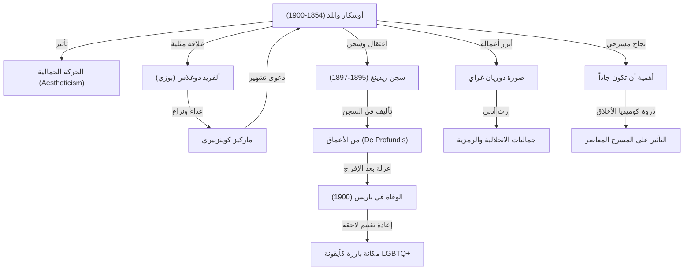

في المشهد الأدبي البريطاني في أواخر القرن التاسع عشر، برز الكاتب أوسكار وايلد كأحد ألمع النجوم سطوعاً وبهاءً، قبل أن يشهد سقوطاً مدوياً لم يعرف له مثيل. لقد تركت فلسفته القائمة على المذهب الجمالي وشعار «الفن لأجل الفن» بصمة عميقة ألهمت ولا تزال تلهم أجيالاً من المبدعين والفنانين حتى يومنا هذا. في هذا المقال، نغوص في تفاصيل حياته الدرامية، وأبرز أعماله الأدبية، وتأثيره الممتد على الأجيال اللاحقة.

## تفتّق الموهبة ورائد الحركة الجمالية

وُلد أوسكار فينغال أوفلاهرتي ويلز وايلد في 16 أكتوبر 1854 في العاصمة الأيرلندية دبلن. نشأ في كنف أسرة مثقفة، حيث كان والده جراح عيون مرموقاً ووالدته شاعرة ذات ميول قومية، مما ساهم في نبوغه المبكر وظهور مواهبه الفذة في اللغات والآداب منذ نعومة أظفاره. وبعد دراسته في كلية ترينيتي في دبلن، التحق بجامعة أكسفورد، حيث تأثر بشدة بمفكّرين بارزين مثل جون روسكين ووالتر بيتر، ليتشرب مبادئ «الحركة الجمالية (Aestheticism)».

وتقوم الحركة الجمالية على مبدأ أن «الجمال» هو القيمة العليا المطلقة، مقدّمةً الكمال الفني على القيود الأخلاقية أو المنفعة النفعية. سرعان ما تحول وايلد إلى نجم الأوساط الراقية والمحافل الاجتماعية بأناقته اللافتة وحواراته البارعة المليئة بالفطنة والذكاء، مجسداً فلسفته الفريدة القائلة بأن «الحياة تحاكي الفن».

## ذروة المجد: النجاح في المسرح والرواية

من أواخر ثمانينيات القرن التاسع عشر وحتى تسعينياته، بلغ وايلد قمة مسيرته ككاتب مسرحي وروائي. وفي عام 1890، نشر روايته الطويلة الوحيدة «صورة دوريان غراي» (The Picture of Dorian Gray)، التي تناولت انحدار شاب نال نعمة الشباب الأبدي والجمال الفاتن إلى هاوية الفساد، ما هزّ بعنف أركان القيم الأخلاقية الصارمة للعصر الفيكتوري. ورغم توجيه سهام النقد إليها بدعوى «الانحلال الأخلاقي»، إلا أن أسلوبها البديع والجمالي الآسر سحر عقول جمهور عريض من القراء.

وعلاوة على ذلك، حققت مسرحياته الكوميدية (كوميديا الأخلاق)، مثل «مروحة الليدي وندرمير» و«أهمية أن تكون جاداً» (The Importance of Being Earnest)، نجاحاً مدوياً على مسارح لندن. وقد تميزت مسرحياته بتهكم لاذع على نفاق الطبقة الراقية وتفاهاتها، ممزوجاً بروح دعابة رفيعة وأقوال مأثورة وحِكَم بالغة الإيجاز، مما أثار إعجاب الجماهير وضجت الصالات بضحكاتهم.

## طريق السقوط: لقاء ألفريد دوغلاس

غير أن أقدار وايلد، وهو في قمة مجده، سرعان ما تحولت نحو المأساة إثر لقائه بالأرستقراطي الشاب اللورد ألفريد دوغلاس (الملقب بـ "بوزي"). جمعت بينهما علاقة عاطفية مثلية ملتهبة، مما أثار غضب والد بوزي، ماركيز كوينزبيري.

وبعد أن تعرض وايلد لإهانة علنية من الماركيز، قرر مقاضاته بتهمة التشهير والقذف. بيد أن مجريات المحاكمة انقلبت ضده، حيث كُشفت تفاصيل علاقاته المثلية (التي كانت تُعد جريمة يُعاقب عليها القانون البريطاني آنذاك)، ليُقبض عليه ويُحاكم بتهمة «الفحش الجسيم». وفي عام 1895، أُدين وايلد وحُكم عليه بالسجن لمدة عامين مع الأشغال الشاقة القاسية في سجن ريدينغ.

## معاناة السجن ونهاية وحيدة

استنزفت حياة السجن قوى وايلد الجسدية والنفسية حتى حافة الانهيار. وخلال هذه الفترة القاتمة، خطّ رسالته الشهيرة «من الأعماق (De Profundis)»، التي صبّ فيها مشاعر الحب والكراهية المعقدة تجاه بوزي، وتأملاته النقدية في فنه، وإحساسه العميق بالتكفير والخلاص الروحي.

عقب إطلاق سراحه عام 1897، غادر وايلد بريطانيا كمنفيّ متجهاً إلى فرنسا. وهناك انتحل اسماً مستعاراً هو «سيباستيان ميلموث»، وعاش حياة التشرد في فقر مدقع ووحدة قاسية بعد أن تنكر له جلّ أصدقائه ومحبيه السابقين. وفي 30 نوفمبر 1900، وافته المنية في فندق متواضع بباريس إثر إصابته بالتهاب السحايا، عن عمر يناهز 46 عاماً. وقبيل وفاته، اعتنق الكاثوليكية، ويُروى عنه أنه أطلق مقولته الساخرة الأخيرة: «ورق الجدران هذا وأنا نخوض نزالاً حتى الموت؛ لا بد لأحدنا أن يرحل».

## التأثير على الأجيال اللاحقة: أيقونة مجتمع الميم وكلمات خالدة

شهدت مكانة وايلد وإرثه تحولاً جذرياً بمرور السنين. فمع منتصف القرن العشرين وتغير النظرة المجتمعية للمثلية الجنسية، أُعيد تقييم سيرته ليُنظر إليه باعتباره «عبقرياً اضطهده مجتمع محافظ» و«أيقونة رائدة لمجتمع الميم (LGBTQ+)».

بالإضافة إلى ذلك، فإن المقولات المأثورة والحِكَم اللاذعة التي تركها (مثل: «السبيل الوحيد للتخلص من الإغراء هو الاستسلام له»، و«يريد الرجل دائماً أن يكون الحب الأول للمرأة، بينما ترغب المرأة في أن تكون الحب الأخير للرجل») لا تزال تُقتبس على نطاق واسع في الثقافة الشعبية المعاصرة، والسينما، والأدب.

كانت حياة أوسكار وايلد، على حد تعبيره، تجربة كبرى هدفت إلى تحويل «حياته الشخصية إلى أعظم عمل فني». وفي تلك المسيرة التي تقاطعت فيها خيوط النور والظلام، والمجد والدمار، تظل قصته شاهداً حياً يطرح على عالمنا المعاصر تساؤلات عميقة حول سطوة الفن التي قد تبلغ حد الخطورة، وقسوة التعصب وعدم التسامح المجتمعي.
