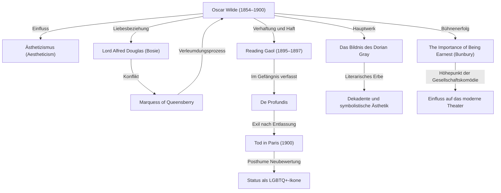

In der britischen Literaturszene des ausgehenden 19. Jahrhunderts strahlte kaum eine Persönlichkeit brillanter – und stürzte keine tiefer ins Verderben – als Oscar Wilde. Seine Philosophie des Ästhetizismus, getragen von dem Leitsatz „L’art pour l’art“ („Kunst für die Kunst“), inspiriert bis heute unzählige Kunstschaffende und Autoren. In diesem Beitrag beleuchten wir sein dramatisches Leben, sein literarisches Schaffen und sein unvergängliches Vermächtnis.

## Aufblühendes Talent und Vorkämpfer des Ästhetizismus

Oscar Fingal O'Flahertie Wills Wilde wurde am 16. Oktober 1854 in Dublin, Irland, geboren. Aufgewachsen in einem intellektuellen und weltoffenen Elternhaus – sein Vater war ein angesehener Augenarzt, seine Mutter eine nationalistische Dichterin –, zeigte er bereits früh eine außergewöhnliche Begabung für Sprachen und klassische Literatur. Nach seiner Studienzeit am Trinity College Dublin wechselte er an die University of Oxford, wo er maßgeblich von Denkern wie John Ruskin und Walter Pater geprägt wurde und sich den Grundsätzen des Ästhetizismus („Aestheticism“) verschrieb.

Der Ästhetizismus erhob die „Schönheit“ zum obersten Wert und stellte die künstlerische Vollkommenheit über moralische Belehrung oder praktischen Nutzen. Mit exzentrischer Eleganz, auffälliger Kleidung und funkelnder Schlagfertigkeit avancierte Wilde rasch zum Liebling der High Society und lebte seine provokante Philosophie vor, dass „das Leben die Kunst weitaus mehr nachahmt als die Kunst das Leben“.

## Auf dem Gipfel des Ruhms: Triumphe in Prosa und Theater

Zwischen den späten 1880er und den 1890er Jahren erreichte Wilde den Zenit seines Schaffens als Romanautor und Dramatiker. Sein 1890 veröffentlichter einziger Roman, *Das Bildnis des Dorian Gray* (*The Picture of Dorian Gray*), schildert den moralischen Verfall eines jungen Mannes, der im Besitz ewiger Jugend und Schönheit bleibt. Das Werk erschütterte die viktorianischen Moralvorstellungen seiner Epoche bis ins Mark. Obwohl zeitgenössische Kritiker das Buch vielfach als „unmoralisch“ anprangerten, zog seine dekadente und kunstvoll geschliffene Prosa zahllose Leserinnen und Leser in ihren Bann.

Darüber hinaus feierten seine Gesellschaftskomödien – darunter *Lady Windermeres Fächer* (*Lady Windermere's Fan*) und *Bunbury oder Ernst sein ist alles* (*The Importance of Being Earnest*) – triumphale Erfolge auf den Londoner Theaterbühnen. Mit scharfsinniger Ironie karikierten seine Dramen die Heuchelei und Eitelkeit der Oberschicht, während sie zugleich vor geschliffenem Witz und brillanten Epigrammen sprühten und das Publikum zu Begeisterungsstürmen hinrissen.

## Der Weg in den Abgrund: Die fatale Begegnung mit Lord Alfred Douglas

Auf dem Höhepunkt seines Ruhms nahm Wildes Schicksal jedoch eine verhängnisvolle Wendung, als er den jungen Aristokraten Lord Alfred Douglas (bekannt unter dem Kosenamen „Bosie“) kennenlernte. Wilde begann eine leidenschaftliche Beziehung mit ihm, was die maßlose Wut von Bosies Vater, dem Marquess of Queensberry, heraufbeschwor.

Vom Marquess öffentlich verleumdet, strengte Wilde unklugerweise einen Prozess wegen Verleumdung gegen ihn an. Im Verlauf des Verfahrens kamen jedoch handfeste Beweise über Wildes eigene homosexuelle Beziehungen ans Licht – zur damaligen Zeit in Großbritannien ein strafbarer Tatbestand. Die Klage scheiterte, und Wilde wurde daraufhin selbst wegen „grober Unzucht“ verhaftet und vor Gericht gestellt. Im Jahr 1895 wurde er schuldig gesprochen und zu zwei Jahren schwerer Zwangsarbeit verurteilt, die er größtenteils im Zuchthaus von Reading (Reading Gaol) verbüßte.

## Qualen im Kerker und ein einsames Ende

Die Jahre im Gefängnis zerstörten Wilde körperlich wie seelisch. Während dieser qualvollen Haftzeit verfasste er *De Profundis*, einen tief bewegenden und schonungslosen Brief, in dem er seine zerrissene Beziehung zu Bosie offenlegte, über seine Kunst reflektierte und zu einer tiefen Auseinandersetzung mit christlicher Reue, Vergebung und spirituellem Leiden gelangte.

Nach seiner Entlassung im Jahr 1897 verließ Wilde England fluchtartig in Richtung Frankreich. Unter dem Exil-Pseudonym „Sebastian Melmoth“ fristete er ein von bitterer Armut, Krankheit und Einsamkeit gezeichnetes Wanderleben, von den meisten einstigen Freunden und Förderern im Stich gelassen. Am 30. November 1900 verstarb er im Alter von 46 Jahren in einem einfachen Pariser Hotel an Meningitis. Auf dem Sterbebett in die katholische Kirche aufgenommen, ist von ihm der berühmte letzte Aphorismus überliefert: „Meine Tapete und ich kämpfen ein Duell auf Leben und Tod. Eine von uns beiden muss gehen.“

## Das bleibende Erbe: LGBTQ+-Ikone und zeitlose Worte

Nach seinem Tod wandelte sich Wildes Ansehen im Lauf der Zeit grundlegend. Ab Mitte des 20. Jahrhunderts, als sich das gesellschaftliche Bewusstsein gegenüber Homosexualität öffnete, begann man ihn als verkanntes, von einer prüden und scheinheiligen Gesellschaft verfolgtes Genie und als wegweisende Ikone der LGBTQ+-Bewegung neu zu würdigen.

Zudem gehören seine zahllosen Aphorismen – etwa „Der einzige Weg, eine Versuchung loszuwerden, ist, ihr nachzugeben“ oder „Männer möchten immer die erste Liebe einer Frau sein, Frauen hingegen das letzte Abenteuer eines Mannes“ – bis heute zu den meistzitierten Zitaten der Weltliteratur, des Films und der zeitgenössischen Populärkultur.

Oscar Wildes Leben war, wie er es selbst formulierte, ein gewagtes Experiment, sein eigenes Dasein zum „größten aller Kunstwerke“ zu machen. Geprägt von funkelndem Glanz und tragischem Scheitern bleibt sein Weg ein ergreifendes Zeugnis für die faszinierende, bisweilen unheilvolle Macht der Kunst und eine zeitlose Mahnung gegen gesellschaftliche Intoleranz.
