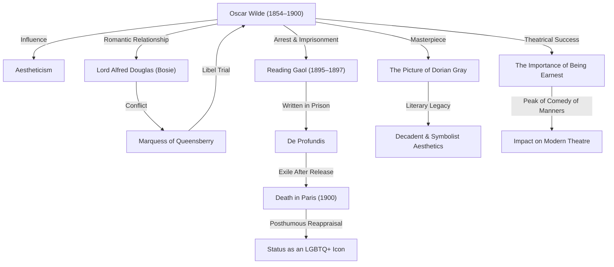

In late 19th-century British literary circles, few figures shone more brilliantly—or fell from grace more tragically—than Oscar Wilde. His philosophy of Aestheticism, encapsulated by the doctrine of "art for art's sake," continues to inspire creators and artists to this day. In this article, we delve deeply into his dramatic life, his celebrated body of work, and his enduring legacy.

## Blossoming Talent and the Flag-Bearer of Aestheticism

Oscar Fingal O'Flahertie Wills Wilde was born on October 16, 1854, in Dublin, Ireland. Raised in an intellectually vibrant household—his father a prominent eye surgeon and his mother a nationalist poet—he demonstrated an extraordinary gift for languages and classical literature from an early age. After attending Trinity College Dublin, he matriculated at Oxford University, where he came under the profound influence of thinkers like John Ruskin and Walter Pater, embracing the principles of Aestheticism.

Aestheticism held that "beauty" was the supreme value, prioritizing artistic perfection over moral didacticism or utilitarian utility. With his flamboyant dress and sparkling wit, Wilde became the darling of high society, putting into practice his provocative philosophy that "Life imitates Art far more than Art imitates Life."

## The Pinnacle of Glory: Triumph in Prose and Theatre

Between the late 1880s and the 1890s, Wilde reached the zenith of his career as both a novelist and a playwright. Published in 1890, his only novel, *The Picture of Dorian Gray*, chronicled the moral descent of a young man blessed with eternal youth and beauty, sending shockwaves through Victorian moral sensibilities. Although condemned by some contemporary critics as "immoral," its decadent, exquisite prose captivated legions of readers.

Furthermore, his comedies of manners—including *Lady Windermere's Fan* and *The Importance of Being Earnest*—achieved phenomenal success on the London stage. Sharply satirizing the hypocrisy and vanity of Victorian high society while glittering with polished wit and unforgettable epigrams, his plays delighted audiences and drew rapturous laughter.

## The Road to Ruin: Meeting Lord Alfred Douglas

Yet at the very summit of his fame, Wilde's fortune took a disastrous turn with his introduction to a young aristocrat, Lord Alfred Douglas (affectionately known as "Bosie"). Wilde embarked on an intense, passionate romance with him, sparking the fury of Bosie's father, the Marquess of Queensberry.

Publicly insulted by the Marquess, Wilde unwisely sued him for criminal libel. During the proceedings, however, evidence of Wilde's own homosexual relationships—a criminal offense in Britain at the time—came to light. The libel case collapsed, and Wilde himself was arrested and prosecuted for "gross indecency." In 1895, he was convicted and sentenced to two years of harsh hard labor, primarily served at Reading Gaol.

## Agony Behind Bars and a Solitary End

Prison life devastated Wilde both physically and emotionally. During this harrowing ordeal, he penned *De Profundis*, a profound and poignant letter laying bare his tumultuous love-hate relationship with Bosie, reflections on his own art, and a deepened sense of Christian redemption and spiritual suffering.

Released in 1897, Wilde immediately left England for France in virtual exile. Adopting the pseudonym "Sebastian Melmoth," he lived an itinerant existence marked by poverty, declining health, and isolation, largely abandoned by former friends and patrons. On November 30, 1900, he died of cerebral meningitis in a modest Paris hotel at the age of forty-six. Having been received into the Catholic Church on his deathbed, he is famously remembered for his dying quip: "My wallpaper and I are fighting a duel to the death. One or other of us has got to go."

## Enduring Legacy: An LGBTQ+ Icon and Timeless Words

Following his death, Wilde's reputation underwent a dramatic transformation. From the mid-20th century onward, as societal views on sexuality evolved, he came to be revered as a tragic genius persecuted by a prudish, hypocritical establishment, and as a pioneering icon of LGBTQ+ history.

Moreover, his countless epigrams—such as "The only way to get rid of a temptation is to yield to it" and "Men always want to be a woman's first love; women like to be a man's last romance"—continue to be quoted widely across contemporary literature, cinema, and popular culture.

Oscar Wilde's life was a grand experiment in crafting, in his own words, life itself as "the greatest of all arts." Marked by dazzling brilliance and tragic ruin, his journey remains a compelling testament to the intoxicating power of art and a timeless indictment of societal intolerance.
