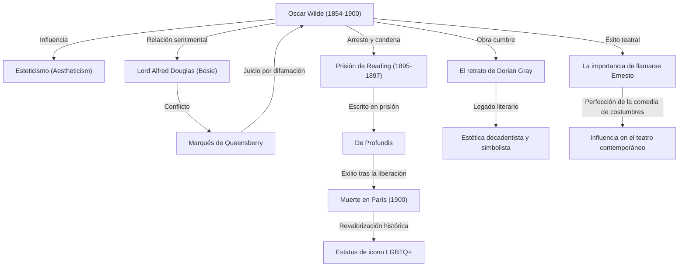

En los círculos literarios británicos de finales del siglo XIX, ningún autor brilló con mayor esplendor ni conoció una caída más trágica que Oscar Wilde. Su filosofía del esteticismo, compendiada bajo la premisa del «arte por el arte», sigue cautivando e influyendo a multitud de creadores y artistas contemporáneos. En este artículo profundizamos en su apasionante vida, su legado literario y la impronta imperecedera que dejó para la posteridad.

## Florecimiento del talento y estandarte del esteticismo

Oscar Fingal O'Flahertie Wills Wilde nació el 16 de octubre de 1854 en Dublín, Irlanda. Criado en un ambiente refinado e intelectual —hijo de un afamado cirujano oftalmólogo y de una poetisa de hondas convicciones nacionalistas—, dio muestras desde muy temprana edad de un talento extraordinario para las lenguas y la literatura clásica. Tras formarse en el Trinity College de Dublín, continuó sus estudios superiores en la Universidad de Oxford, donde recibió la impronta de pensadores de la talla de John Ruskin y Walter Pater, abrazando con fervor las ideas del «esteticismo» (*aestheticism*).

El esteticismo proclamaba que la «belleza» constituye el valor supremo, supeditando la moral y el utilitarismo a la búsqueda de la perfección artística. Con su llamativa indumentaria y su ingenio deslumbrante, Wilde se transformó rápidamente en la figura predilecta de los salones victorianos, encarnando a través de sus actos su célebre paradoja: «la vida imita al arte con mucha mayor fidelidad que el arte a la vida».

## La cumbre de la gloria: el triunfo de la novela y el teatro

Entre finales de la década de 1880 y la primera mitad de la de 1890, Wilde alcanzó el apogeo de su carrera como novelista y dramaturgo. En 1890 publicó su única novela, *El retrato de Dorian Gray*, una obra cumbre que narra la paulatina degradación moral de un joven que conserva una belleza y juventud eternas, sacudiendo los cimientos de la rígida moral victoriana. A pesar de los ataques de quienes la calificaron de «obra inmoral», su atmósfera decadente y su prosa fascinante conquistaron a generaciones de lectores.

Asimismo, sus comedias de costumbres alcanzaron un éxito arrollador en los teatros londinenses, en particular piezas maestras como *El abanico de Lady Windermere* y *La importancia de llamarse Ernesto*. Mediante un humor incisivo, diálogos brillantes y memorables epigramas, satirizó con agudeza la hipocresía, los prejuicios y la vacuidad de la alta sociedad británica, desatando la risa y el entusiasmo del público.

## El camino a la perdición: el encuentro con Lord Alfred Douglas

No obstante, en el momento culminante de su fama, el destino de Wilde dio un vuelco irreversible al entablar relación con un joven aristócrata, Lord Alfred Douglas (conocido familiarmente como «Bosie»). Ambos iniciaron un apasionado romance homosexual que despertó la cólera del padre de este, el marqués de Queensberry.

Ante las afrentas e insultos públicos proferidos por el marqués, Wilde decidió demandarlo por difamación. Sin embargo, durante el litigio, las pruebas de la conducta homosexual del escritor —considerada delito según las leyes británicas de la época— salieron a la luz. El proceso dio un giro fatal: la demanda fue desestimada y el propio Wilde resultó arrestado y juzgado por el cargo de «grave indecencia». En 1895 fue declarado culpable y condenado a cumplir dos años de trabajos forzados en la prisión de Reading.

## El suplicio entre rejas y un ocaso solitario

El confinamiento penitenciario quebrantó irremediablemente la salud física y el equilibrio anímico de Wilde. Durante esta dolorosa reclusión escribió *De Profundis*, una conmovedora y lúcida epístola en la que exteriorizó sus complejas emociones hacia Bosie, analizó críticamente su propia trayectoria artística y reflexionó sobre la redención espiritual y el sufrimiento humano.

Tras quedar en libertad en 1897, Wilde se marchó a Francia sumido en un doloroso destierro. Bajo el pseudónimo de «Sebastian Melmoth», afrontó una precaria vida itinerante, marcada por la indigencia y el aislamiento, repudiado por la gran mayoría de sus antiguos allegados. El 30 de noviembre de 1900 falleció a causa de una meningitis cerebral en un modesto hotel de París, a los 46 años de edad. Poco antes de su último suspiro fue recibido en el seno de la Iglesia católica y legó a la posteridad su célebre sentencia de despedida: «Este papel pintado y yo estamos librando un duelo a muerte; uno de los dos tiene que desaparecer».

## Legado para la posteridad: icono LGBTQ+ y palabras inmortales

Con el transcurso de las décadas, la valoración histórica de Oscar Wilde experimentó una transformación trascendental. Hacia mediados del siglo XX, a medida que la sociedad avanzaba en una comprensión más tolerante y abierta de la sexualidad, su figura fue reivindicada como la de un genio incomprendido y perseguido por los dogmas de una sociedad intolerante, consolidándose como un icono señero de la comunidad LGBTQ+.

Por otra parte, su extenso repertorio de aforismos y citas agudas (tales como «La única manera de librarse de la tentación es caer en ella» o «Los hombres siempre quieren ser el primer amor de una mujer; a las mujeres les gusta ser el último romance de un hombre») continúa gozando de una vigencia indiscutible, siendo citado con frecuencia en la literatura, el cine y la cultura popular contemporánea.

La existencia de Oscar Wilde fue, en sus propios términos, un audaz experimento para concebir la propia vida como «la más excelsa de las obras de arte». Marcada por el constante claroscuro entre el esplendor y la desdicha, su trayectoria continúa recordando al mundo contemporáneo el extraordinario poder de la creación estética y los peligros de la intransigencia social.
