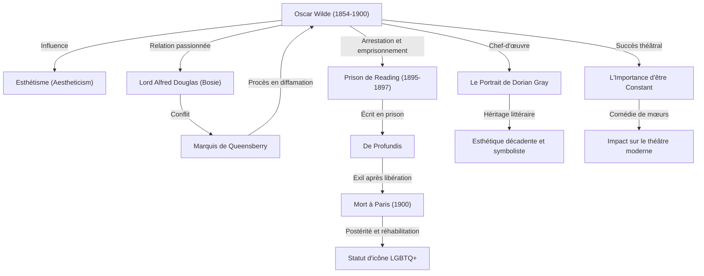

Dans le monde littéraire britannique de la fin du XIXe siècle, aucun auteur n'a brillé avec autant d'éclat ni connu de chute aussi vertigineuse qu'Oscar Wilde. Sa philosophie de l'esthétisme, résumée par le principe de « l'art pour l'art », continue d'influencer d'innombrables créateurs et artistes jusqu'à nos jours. Cet article se propose d'explorer en profondeur sa vie dramatique, l'ensemble de son œuvre, ainsi que son héritage pour la postérité.

## Éclosion du talent et chef de file de l'esthétisme

Oscar Fingal O'Flahertie Wills Wilde est né le 16 octobre 1854 à Dublin, en Irlande. Grandissant dans un milieu familial cultivé — son père était un ophtalmologiste réputé et sa mère une poétesse nationaliste —, il fait preuve dès son plus jeune âge d'un talent exceptionnel pour les langues et la littérature. Après des études au Trinity College de Dublin, il intègre l'université d'Oxford, où il subit la profonde influence de penseurs tels que John Ruskin et Walter Pater, embrassant pleinement le mouvement de « l'esthétisme » (Aestheticism).

L'esthétisme prône que la « beauté » est la valeur suprême, privilégiant la perfection artistique au détriment de la morale ou de l'utilité pratique. Par ses tenues excentriques et ses réparties étincelantes, Wilde devient la coqueluche des salons mondains et met en pratique sa propre philosophie : « la vie imite l'art ».

## L'apogée de la gloire : le succès du théâtre et du roman

De la fin des années 1880 aux années 1890, Wilde connaît son âge d'or en tant que dramaturge et romancier. Publié en 1890, son unique roman, *Le Portrait de Dorian Gray*, dépeint la déchéance d'un jeune homme ayant obtenu l'éternelle jeunesse et une beauté inaltérable, ébranlant profondément les conventions morales de l'époque victorienne. Bien que qualifiée d'« immorale » par certains critiques, son écriture décadente et envoûtante a fasciné de nombreux lecteurs.

Par ailleurs, ses comédies de mœurs, telles que *L'Éventail de Lady Windermere* et *L'Importance d'être Constant*, remportent un triomphe retentissant sur les scènes londoniennes. Maniant une satire féroce de l'hypocrisie et de la vanité de la haute société, tout en regorgeant d'un humour raffiné et d'épigrammes mordants, ses pièces ravissaient et faisaient éclater de rire le public.

## La route de la ruine : la rencontre avec Alfred Douglas

Cependant, au faîte de sa gloire, le destin de Wilde bascule lors de sa rencontre avec un jeune aristocrate, Lord Alfred Douglas (surnommé « Bosie »). Wilde noue avec lui une relation homosexuelle passionnée, qui s'attire les foudres du père de Bosie, le marquis de Queensberry.

Publiquement outragé par le marquis, Wilde décide de le poursuivre en diffamation. Toutefois, au cours du procès, ses propres pratiques homosexuelles — alors considérées comme un crime au Royaume-Uni — sont dévoilées. Wilde se retrouve ainsi arrêté et inculpé pour « outrage aux bonnes mœurs » (gross indecency). Condamné en 1895, il purge une peine de deux ans de travaux forcés particulièrement éprouvants à la prison de Reading.

## Les tourments de la prison et une fin solitaire

L'incarcération mine la santé physique et mentale de Wilde jusqu'à ses limites extrêmes. Rédigé durant cette période, *De Profundis* témoigne avec une profonde intensité de son amour mêlé de rancœur envers Bosie, d'une remise en question de son art et d'une aspiration à la rédemption chrétienne.

Libéré en 1897, Wilde quitte le Royaume-Uni comme un proscrit pour s'exiler en France. Prenant le pseudonyme de « Sebastian Melmoth », il mène une existence errante, marquée par la misère et la solitude, alors que la plupart de ses anciens amis et admirateurs lui ont tourné le dos. Le 30 novembre 1900, il s'éteint d'une méningite dans un modeste hôtel parisien, à l'âge de 46 ans. S'étant converti au catholicisme peu avant son trépas, la tradition rapporte qu'il aurait prononcé cet ultime bon mot : « Mon papier peint et moi livrons un combat à mort. L'un de nous deux doit disparaître. »

## Postérité et héritage : icône LGBTQ+ et formules immortelles

Après la mort de Wilde, le regard porté sur lui a profondément évolué au fil des décennies. À partir de la seconde moitié du XXe siècle, avec l'évolution des mœurs et de la perception de l'homosexualité, il est réhabilité comme un « génie persécuté par une société conservatrice » et devient une icône pionnière du mouvement LGBTQ+.

En outre, ses multiples épigrammes et citations percutantes (telles que « Le seul moyen de se délivrer d'une tentation, c'est d'y céder » ou « Les hommes veulent toujours être le premier amour d'une femme, tandis que les femmes aiment être le dernier amour d'un homme ») demeurent abondamment citées dans la culture populaire, le cinéma et la littérature d'aujourd'hui.

La vie d'Oscar Wilde fut, pour reprendre ses propres termes, une formidable tentative de faire de sa propre existence « la plus grande des œuvres d'art ». Cette destinée où s'entremêlent l'ombre et la lumière, la gloire et la déchéance, continue d'interroger notre époque sur le pouvoir presque dangereux de l'art et l'intolérance de la société.
