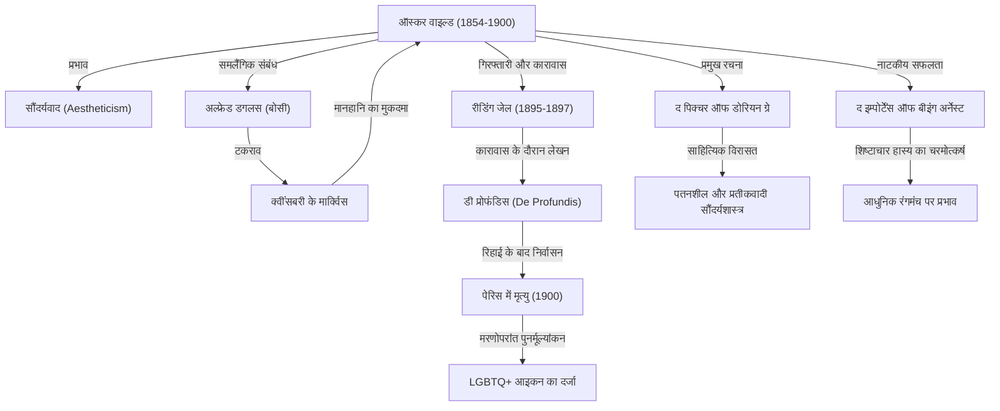

19वीं सदी के अंत के ब्रिटिश साहित्यिक जगत में, जो लेखक सबसे अधिक भव्यता से चमके और फिर उतनी ही गहराई से पतन के गर्त में गिरे, वे थे ऑस्कर वाइल्ड। उनका छोड़ा हुआ "कला कला के लिए" (Art for Art's sake) का सौंदर्यवादी दर्शन आज तक अनगिनत रचनाकारों और कलाकारों को प्रभावित करता आ रहा है। इस लेख में, हम उनके नाटकीय जीवन, उनके प्रमुख कार्यों और आने वाली पीढ़ियों पर उनके प्रभाव की गहराई से पड़ताल करेंगे।

## प्रतिभा का प्रस्फुटन और सौंदर्यवाद का ध्वजवाहक

ऑस्कर फिंगल ओ'फ्लैहर्टी विल्स वाइल्ड का जन्म 16 अक्टूबर 1854 को आयरलैंड के डबलिन में हुआ था। एक प्रतिष्ठित नेत्र रोग विशेषज्ञ पिता और एक राष्ट्रवादी कवयित्री माँ के सांस्कृतिक पारिवारिक परिवेश में पले-बढ़े वाइल्ड ने बचपन से ही भाषाओं और साहित्य में असाधारण प्रतिभा का प्रदर्शन किया। डबलिन के ट्रिनिटी कॉलेज के बाद जब वे ऑक्सफोर्ड विश्वविद्यालय पहुंचे, तो जॉन रस्किन और वाल्टर पेटर जैसे विचारकों के गहरे प्रभाव में आए और "सौंदर्यवाद (Aestheticism)" के सिद्धांतों को आत्मसात किया।

सौंदर्यवाद वह विचारधारा है जो मानती है कि "सौंदर्य" ही सर्वोच्च मूल्य है, और यह नैतिकता या व्यावहारिकता की तुलना में कलात्मक पूर्णता को अधिक महत्व देती है। वाइल्ड अपनी आकर्षक वेशभूषा और हाजिरजवाबी के कारण उच्च समाज के चहेते बन गए और उन्होंने "जीवन कला की नकल करता है" के अपने अनूठे दर्शन को स्वयं जीकर दिखाया।

## वैभव का शिखर: नाटकों और उपन्यासों की सफलता

1880 के दशक के उत्तरार्ध से 1890 के दशक के दौरान, वाइल्ड एक नाटककार और उपन्यासकार के रूप में अपने करियर के चरम पर पहुँचे। 1890 में प्रकाशित उनके एकमात्र उपन्यास 'द पिक्चर ऑफ डोरियन ग्रे' (The Picture of Dorian Gray) ने, जिसमें शाश्वत यौवन और सुंदरता पाने वाले एक युवक के नैतिक पतन का चित्रण किया गया था, तत्कालीन विक्टोरियन युगीन नैतिकता की नींव हिला दी। यद्यपि कुछ आलोचकों द्वारा इसे "अनैतिक" कहकर खारिज किया गया, लेकिन इसकी पतनशील और सम्मोहक लेखन शैली ने अनगिनत पाठकों को मंत्रमुग्ध कर दिया।

इसके अतिरिक्त, 'लेडी विंडरमेयर्स फैन' (Lady Windermere's Fan) और 'द इम्पोर्टेंस ऑफ बीइंग अर्नेस्ट' (The Importance of Being Earnest) जैसी उनकी शिष्टाचार प्रधान हास्य नाटिकाओं (comedy of manners) ने लंदन के मंच पर अपार सफलता हासिल की। उनके नाटक अभिजात्य वर्ग के पाखंड और खोखलेपन पर तीखा व्यंग्य करते हुए भी परिष्कृत हास्य और सूक्तियों (epigrams) से भरे होते थे, जिसने दर्शकों को हँसी और तालियों से सराबोर कर दिया।

## पतन की राह: अल्फ्रेड डगलस से मुलाक़ात

लेकिन सफलता के चरम पर पहुँच चुके वाइल्ड के भाग्य ने तब एक अंधकारमय मोड़ लिया, जब उनकी मुलाक़ात एक युवा कुलीन लॉर्ड अल्फ्रेड डगलस (उपनाम 'बोसी') से हुई। वाइल्ड उनके साथ एक गहरे समलैंगिक प्रेम संबंध में बँध गए, जिससे बोसी के पिता, क्वींसबरी के मार्क्विस, बेहद क्रोधित हो उठे।

मार्क्विस द्वारा सार्वजनिक रूप से अपमानित किए जाने के बाद, वाइल्ड ने उनके खिलाफ मानहानि का मुकदमा दायर कर दिया। परंतु सुनवाई के दौरान उल्टा वाइल्ड के अपने समलैंगिक संबंधों (जो उस समय के ब्रिटेन में अपराध था) के सबूत सामने आ गए, और वाइल्ड पर "घोर अश्लीलता" (Gross Indecency) के आरोप में मुकदमा चलाकर उन्हें गिरफ्तार कर लिया गया। 1895 में उन्हें दोषी ठहराया गया और रीडिंग जेल (Reading Gaol) में दो साल के कठोर सश्रम कारावास की सजा सुनाई गई।

## जेल की यातनाएँ और एकाकी अंत

जेल के कठोर जीवन ने वाइल्ड के शरीर और मन को जर्जर कर दिया। इसी दौर में लिखे गए उनके लंबे पत्र 'डी प्रोफंडिस' (De Profundis) में, बोसी के प्रति उनके प्रेम और आक्रोश, अपनी कला पर आत्ममंथन, और ईसाई प्रायश्चित की गहरी भावना स्पष्ट रूप से झलकती है।

1897 में रिहा होने के बाद, वाइल्ड ब्रिटेन छोड़कर एक तरह से निर्वासित होकर फ्रांस चले गए। उन्होंने अपना नाम बदलकर "सेबेस्टियन मेलमोथ" रख लिया और गरीबी व अकेलेपन में दर-ब-दर भटकते रहे। उनके अधिकांश पुराने मित्रों और प्रशंसकों ने उनसे मुँह मोड़ लिया था। 30 नवंबर 1900 को, पेरिस के एक साधारण से होटल में मेनिन्जाइटिस (मस्तिष्क ज्वर) के कारण उनका निधन हो गया। उस समय उनकी आयु मात्र 46 वर्ष थी। कहा जाता है कि मृत्यु से ठीक पहले उन्होंने कैथोलिक धर्म अपना लिया था और अपनी अंतिम प्रसिद्ध व्यंग्योक्ति कही थी: "मेरा इस वॉलपेपर के साथ आमरण द्वंद्व चल रहा है। हम दोनों में से किसी एक को तो जाना ही होगा।"

## भावी पीढ़ियों पर प्रभाव: LGBTQ+ आइकन और अमर वचन

वाइल्ड की मृत्यु के बाद, समय के साथ उनके मूल्यांकन में क्रांतिकारी बदलाव आया। 20वीं सदी के मध्य के बाद जैसे-जैसे समलैंगिकता के प्रति सामाजिक दृष्टिकोण में बदलाव आया, उन्हें एक "रूढ़िवादी समाज द्वारा प्रताड़ित प्रतिभाशाली व्यक्ति" और "LGBTQ+ समुदाय के एक अग्रणी प्रतीक (आइकन)" के रूप में पुनः सम्मान और पहचान मिली।

इसके अलावा, उनके द्वारा छोड़ी गई अनगिनत सूक्तियाँ (जैसे—"प्रलोभन से छुटकारा पाने का एकमात्र तरीका उसके आगे घुटने टेक देना है", "एक पुरुष हमेशा एक महिला का पहला प्यार बनना चाहता है, जबकि एक महिला चाहती है कि वह पुरुष का आखिरी प्यार बने") आज भी आधुनिक पॉप संस्कृति, सिनेमा और साहित्य में अक्सर उद्धृत की जाती हैं।

ऑस्कर वाइल्ड का जीवन, यदि उन्हीं के शब्दों में कहें, तो "अपने जीवन को ही सबसे महान कलाकृति" बनाने का एक भव्य प्रयोग था। प्रकाश और अंधकार, वैभव और विनाश के संगम से भरा उनका यह जीवन आज भी कला की असीम व सम्मोहक शक्ति और समाज की असहिष्णुता पर गहरे सवाल खड़े करता है।
